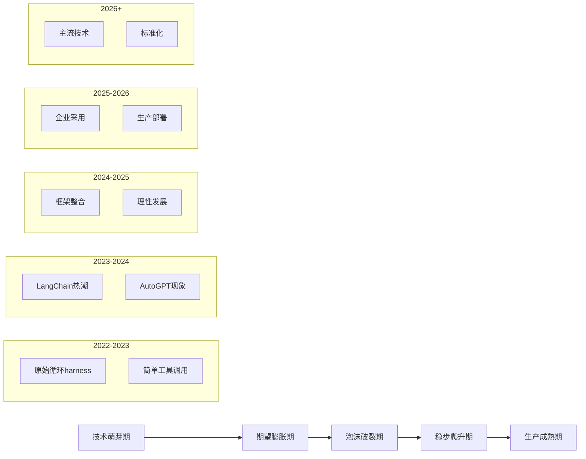
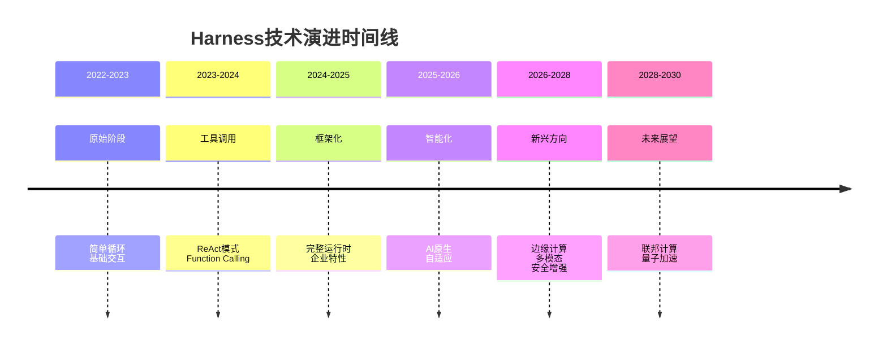

# Harness演进历史与未来趋势

> 📚 **知识定位**：本文档回顾harness的演进历程，展望未来发展趋势，是对[[llm-agent-harness]]的时间维度补充。

## 🕰️ Harness演进历史

### 第一阶段：原始循环（2022-2023）
```python
# 第一阶段：简单的while循环
def primitive_harness():
    """原始harness：最简单的控制循环"""
    
    # 1. 简单的while循环
    while True:
        user_input = input("用户: ")
        
        # 2. 直接调用LLM
        response = llm_call(user_input)
        
        # 3. 简单输出
        print(f"AI: {response}")
        
        # 4. 退出条件
        if "退出" in user_input:
            break

# 特点：
# - 没有状态管理
# - 没有工具调用
# - 没有错误处理
# - 没有安全控制
# - 没有可观测性
```

#### 早期实现特点
```yaml
时间: 2022-2023年
代表项目: 
  - 早期ChatGPT插件
  - 简单的API包装器
  - 基础的聊天机器人

技术特点:
  - 纯文本交互
  - 无状态设计
  - 单轮对话
  - 基础错误处理

局限性:
  - 无法处理复杂任务
  - 无法调用外部工具
  - 无法保持对话状态
  - 无法保证安全性

用户群体:
  - 开发者
  - 研究人员
  - 技术爱好者
```

### 第二阶段：工具调用（2023-2024）
```python
# 第二阶段：添加工具调用能力
def tool_calling_harness():
    """工具调用harness：实现ReAct模式"""
    
    # 1. 工具注册
    tools = {
        "search": search_tool,
        "calculator": calculator_tool,
        "weather": weather_tool
    }
    
    # 2. ReAct循环
    while True:
        user_input = input("用户: ")
        
        # 3. 思考（Thought）
        thought = llm_call(f"思考: {user_input}")
        
        # 4. 行动（Action）
        if "调用工具" in thought:
            tool_name = extract_tool_name(thought)
            tool_result = tools[tool_name].execute()
            
            # 5. 观察（Observation）
            observation = f"工具结果: {tool_result}"
            
            # 6. 继续循环
            continue
        
        # 7. 最终回答
        print(f"AI: {thought}")
```

#### 工具调用阶段特点
```yaml
时间: 2023-2024年
代表项目:
  - LangChain早期版本
  - AutoGPT
  - BabyAGI

技术突破:
  - ReAct模式
  - Function Calling
  - 工具注册和发现
  - 基础状态管理

关键特性:
  - 工具调用能力
  - 多步推理
  - 简单的状态管理
  - 基础的错误处理

局限性:
  - 工具集成复杂
  - 状态管理有限
  - 错误处理简单
  - 安全控制缺失

用户群体:
  - AI开发者
  - 创业公司
  - 技术团队
```

### 第三阶段：框架化（2024-2025）
```python
# 第三阶段：框架化harness
def framework_harness():
    """框架化harness：完整的运行时"""
    
    # 1. 框架初始化
    harness = AgentHarness(
        model="gpt-4",
        tools=[...],
        memory=MemoryManager(),
        security=SecurityLayer(),
        observability=ObservabilityLayer()
    )
    
    # 2. 声明式配置
    config = {
        "max_iterations": 10,
        "timeout": 30,
        "retry_strategy": "exponential_backoff",
        "fallback_model": "gpt-3.5-turbo"
    }
    
    # 3. 运行Agent
    response = harness.run(
        user_input="帮我分析这个数据集",
        config=config
    )
    
    # 4. 自动处理
    # - 状态管理
    # - 工具调用
    # - 错误处理
    # - 安全控制
    # - 可观测性
```

#### 框架化阶段特点
```yaml
时间: 2024-2025年
代表项目:
  - LangChain/LangGraph
  - CrewAI
  - AutoGen
  - 官方Agent SDK

技术成熟:
  - 完整的状态管理
  - 丰富的工具生态
  - 企业级特性
  - 生产就绪

关键突破:
  - 图化工作流
  - 多Agent协作
  - 企业级安全
  - 完整可观测性

用户群体:
  - 企业开发团队
  - AI产品经理
  - 技术架构师

市场规模:
  - 从实验到生产
  - 从技术到产品
  - 从单点到生态
```

### 第四阶段：智能化（2025-2026）
```python
# 第四阶段：智能化harness
def intelligent_harness():
    """智能化harness：AI原生运行时"""
    
    # 1. 自适应配置
    harness = AdaptiveHarness(
        model="claude-3-opus",
        auto_optimize=True,
        learning_enabled=True
    )
    
    # 2. 智能决策
    response = harness.run(
        user_input="分析市场趋势并生成报告",
        intelligence_level="high",
        autonomy_level="medium"
    )
    
    # 3. 持续学习
    # - 从交互中学习
    # - 优化决策策略
    # - 自动调整参数
    # - 预测用户需求
```

#### 智能化阶段特点
```yaml
时间: 2025-2026年（当前阶段）
代表趋势:
  - AI原生harness
  - 自适应系统
  - 边缘计算harness
  - 安全增强harness

技术前沿:
  - 自动化配置优化
  - 智能错误处理
  - 预测性资源管理
  - 自主学习能力

新兴方向:
  - 边缘harness
  - 多模态harness
  - 隐私保护harness
  - 联邦学习harness

用户群体:
  - 企业AI平台
  - AI原生应用
  - 边缘设备
```

## 🔮 未来趋势预测

### 1. AI原生Harness（2026-2028）
```python
# AI原生harness：完全由AI驱动的运行时
def ai_native_harness():
    """AI原生harness：下一代运行时"""
    
    # 1. 自主配置
    harness = AINativeHarness(
        auto_discover_tools=True,
        auto_optimize_performance=True,
        auto_security_hardening=True
    )
    
    # 2. 智能决策
    response = harness.run(
        user_input="优化这个机器学习模型",
        decision_making="autonomous",
        learning_mode="continuous"
    )
    
    # 3. 自我进化
    # - 自动发现新工具
    # - 自动优化性能
    # - 自动修复问题
    # - 自动适应环境
```

#### AI原生harness预测
```yaml
时间: 2026-2028年
核心特征:
  - 自主配置和优化
  - 智能错误处理
  - 预测性资源管理
  - 自主学习能力

关键技术:
  - 元学习（Meta-Learning）
  - 自适应架构
  - 神经架构搜索（NAS）
  - 自动化机器学习（AutoML）

应用场景:
  - 自主AI系统
  - 自适应应用
  - 智能运维
  - 自动化开发

挑战:
  - 可控性问题
  - 安全性问题
  - 可解释性问题
  - 伦理问题
```

### 2. 边缘Harness（2027-2029）
```python
# 边缘harness：运行在边缘设备上的轻量级运行时
def edge_harness():
    """边缘harness：边缘计算场景"""
    
    # 1. 轻量级设计
    harness = EdgeHarness(
        model="tiny-llm",
        memory_limit="512MB",
        power_efficient=True
    )
    
    # 2. 边缘推理
    response = harness.run(
        user_input="识别这个图像",
        location="edge_device",
        latency_requirement="10ms"
    )
    
    # 3. 云端协同
    # - 边缘预处理
    # - 云端深度分析
    # - 结果同步
    # - 模型更新
```

#### 边缘harness预测
```yaml
时间: 2027-2029年
核心特征:
  - 超低延迟
  - 低功耗
  - 离线运行
  - 隐私保护

关键技术:
  - 模型压缩和量化
  - 边缘推理优化
  - 联邦学习
  - 差分隐私

应用场景:
  - IoT设备
  - 移动应用
  - 车载系统
  - 工业控制

挑战:
  - 资源限制
  - 模型大小
  - 能耗优化
  - 安全更新
```

### 3. 多模态Harness（2026-2028）
```python
# 多模态harness：处理多种数据类型的运行时
def multimodal_harness():
    """多模态harness：支持多种数据类型"""
    
    # 1. 多模态输入
    harness = MultimodalHarness(
        supported_modalities=["text", "image", "audio", "video"],
        fusion_strategy="attention"
    )
    
    # 2. 跨模态理解
    response = harness.run(
        user_input="分析这个视频并生成文字描述",
        input_modalities=["video", "text"],
        output_modality="text"
    )
    
    # 3. 模态转换
    # - 文本到图像
    # - 图像到文本
    # - 音频到文本
    # - 视频到文本
```

#### 多模态harness预测
```yaml
时间: 2026-2028年
核心特征:
  - 多模态输入输出
  - 跨模态理解
  - 模态融合
  - 实时处理

关键技术:
  - 多模态Transformer
  - 跨模态注意力
  - 模态对齐
  - 生成式多模态模型

应用场景:
  - 多媒体内容创作
  - 跨模态搜索
  - 交互式AI
  - 无障碍技术

挑战:
  - 计算复杂度
  - 数据需求
  - 模态对齐
  - 实时性要求
```

### 4. 安全增强Harness（2026-2028）
```python
# 安全增强harness：注重安全和隐私的运行时
def secure_harness():
    """安全增强harness：注重安全和隐私"""
    
    # 1. 安全架构
    harness = SecureHarness(
        sandbox_enabled=True,
        encryption_required=True,
        audit_logging=True,
        privacy_preserving=True
    )
    
    # 2. 安全执行
    response = harness.run(
        user_input="处理敏感数据",
        security_level="high",
        compliance_requirements=["GDPR", "HIPAA"]
    )
    
    # 3. 安全特性
    # - 数据加密
    # - 访问控制
    # - 审计日志
    # - 隐私保护
```

#### 安全增强harness预测
```yaml
时间: 2026-2028年
核心特征:
  - 端到端加密
  - 零信任架构
  - 隐私保护计算
  - 合规性保障

关键技术:
  - 同态加密
  - 联邦学习
  - 差分隐私
  - 可信执行环境（TEE）

应用场景:
  - 金融行业
  - 医疗健康
  - 政府机构
  - 企业核心系统

挑战:
  - 性能开销
  - 实现复杂度
  - 合规要求
  - 用户体验
```

### 5. 联邦Harness（2028-2030）
```python
# 联邦harness：分布式协同的运行时
def federated_harness():
    """联邦harness：分布式协同"""
    
    # 1. 联邦架构
    harness = FederatedHarness(
        nodes=["node1", "node2", "node3"],
        consensus_algorithm="raft",
        privacy_preserving=True
    )
    
    # 2. 分布式执行
    response = harness.run(
        user_input="协同分析这个数据集",
        execution_mode="distributed",
        privacy_level="high"
    )
    
    # 3. 联邦特性
    # - 数据不出域
    # - 模型协同训练
    # - 分布式推理
    # - 隐私保护
```

#### 联邦harness预测
```yaml
时间: 2028-2030年
核心特征:
  - 数据不出域
  - 模型协同训练
  - 分布式推理
  - 隐私保护

关键技术:
  - 联邦学习
  - 安全多方计算
  - 差分隐私
  - 分布式系统

应用场景:
  - 跨组织协作
  - 隐私敏感场景
  - 大规模数据处理
  - 全球化应用

挑战:
  - 通信开销
  - 一致性保证
  - 故障恢复
  - 管理复杂度
```

## 🚀 新兴技术方向

### 1. 神经符号Harness
```python
# 神经符号harness：结合神经网络和符号推理
def neuro_symbolic_harness():
    """神经符号harness：结合深度学习和符号AI"""
    
    # 1. 混合架构
    harness = NeuroSymbolicHarness(
        neural_component="transformer",
        symbolic_component="prolog",
        fusion_strategy="neural_guided_symbolic"
    )
    
    # 2. 混合推理
    response = harness.run(
        user_input="证明这个数学定理",
        reasoning_mode="hybrid",
        explainability="high"
    )
    
    # 3. 优势
    # - 可解释性强
    # - 推理能力强
    # - 数据效率高
    # - 泛化能力好
```

### 2. 因果Harness
```python
# 因果harness：基于因果推理的运行时
def causal_harness():
    """因果harness：基于因果推理"""
    
    # 1. 因果模型
    harness = CausalHarness(
        causal_model="structural_causal_model",
        intervention_enabled=True,
        counterfactual_reasoning=True
    )
    
    # 2. 因果推理
    response = harness.run(
        user_input="分析这个政策的影响",
        reasoning_mode="causal",
        confidence_level="high"
    )
    
    # 3. 因果特性
    # - 因果发现
    # - 因果推断
    # - 干预分析
    # - 反事实推理
```

### 3. 量子Harness（2030+）
```python
# 量子harness：基于量子计算的运行时
def quantum_harness():
    """量子harness：量子计算增强"""
    
    # 1. 量子架构
    harness = QuantumHarness(
        quantum_backend="ibmq",
        hybrid_mode=True,
        error_mitigation=True
    )
    
    # 2. 量子加速
    response = harness.run(
        user_input="优化这个组合问题",
        acceleration="quantum",
        problem_size="large"
    )
    
    # 3. 量子优势
    # - 指数级加速
    # - 量子纠缠
    # - 量子并行
    # - 量子纠错
```

## 📊 技术成熟度曲线

### Gartner技术成熟度曲线


### 技术成熟度评估
| 技术 | 当前阶段 | 预计成熟时间 | 关键挑战 |
|------|----------|--------------|----------|
| **基础harness** | 生产成熟期 | 已成熟 | 标准化 |
| **多Agent harness** | 稳步爬升期 | 2027年 | 协调复杂度 |
| **边缘harness** | 期望膨胀期 | 2028年 | 资源限制 |
| **安全harness** | 稳步爬升期 | 2027年 | 性能开销 |
| **联邦harness** | 技术萌芽期 | 2030年 | 通信开销 |
| **量子harness** | 技术萌芽期 | 2035年 | 技术不成熟 |

## 🎯 行业影响分析

### 对开发模式的影响
```yaml
传统开发:
  - 手动编码
  - 瀑布式开发
  - 人工测试
  - 手动部署

AI原生开发:
  - AI辅助编码
  - 敏捷开发
  - 自动测试
  - 智能部署

影响:
  - 开发效率提升5-10倍
  - 产品质量提升
  - 上市时间缩短
  - 开发成本降低
```

### 对商业模式的影响
```yaml
传统模式:
  - 软件产品销售
  - 项目定制开发
  - 技术咨询服务

AI原生模式:
  - AI服务订阅
  - 平台化运营
  - 数据驱动服务

影响:
  - 新商业模式涌现
  - 价值链重构
  - 竞争格局变化
  - 市场机会增加
```

### 对组织结构的影响
```yaml
传统组织:
  - 技术部门
  - 产品部门
  - 运营部门

AI原生组织:
  - AI平台团队
  - 数据团队
  - AI产品经理
  - AI伦理委员会

影响:
  - 组织架构变化
  - 新岗位出现
  - 技能要求变化
  - 文化转型需求
```

## 🔗 知识关联

### 相关文档
- [[llm-agent-harness]] - harness基础概念
- [[harness-deep-dive]] - 为什么需要harness
- [[harness-framework-comparison]] - 框架对比指南
- [[agent-frameworks]] - 框架生态
- [[agent-orchestration-patterns]] - 多Agent编排
- [[ai-safety-alignment]] - AI安全与对齐

### 技术演进时间线


### 未来研究方向
1. **可解释性AI harness**：提高决策透明度
2. **伦理AI harness**：确保AI行为符合伦理
3. **自适应安全harness**：动态安全防护
4. **量子增强harness**：量子计算加速
5. **神经形态harness**：类脑计算架构

---

> 💡 **未来展望**：harness正在从"简单的控制循环"演进为"智能的AI运行时"。未来，我们将看到更多AI原生、边缘化、安全增强的harness出现。这些技术将推动AI从实验室走向生产，从技术工具变为基础设施，从辅助工具变为核心竞争力。

**参考文献**：
1. The Evolution of AI Agent Frameworks
2. Future of AI Runtime: Trends and Predictions
3. Edge Computing for AI Agents: Challenges and Opportunities
4. Security and Privacy in AI Agent Systems

**最后更新**：2026-08-17  
**维护者**：Claudian  
**状态**：活跃维护中