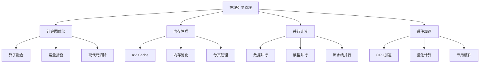
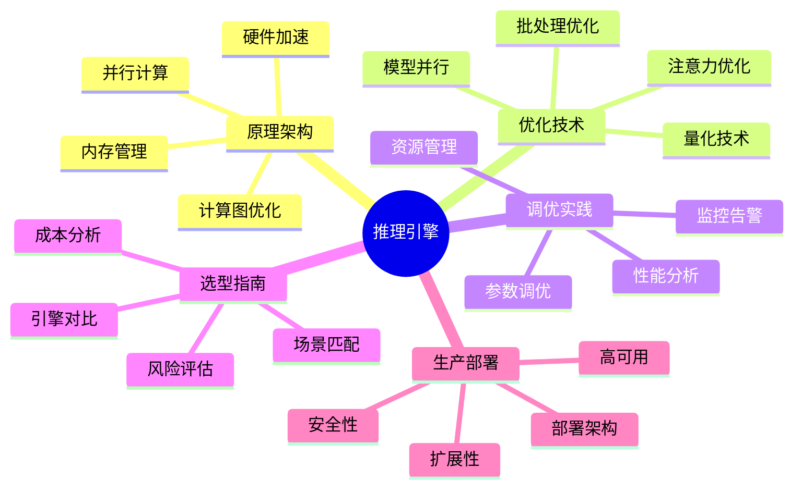
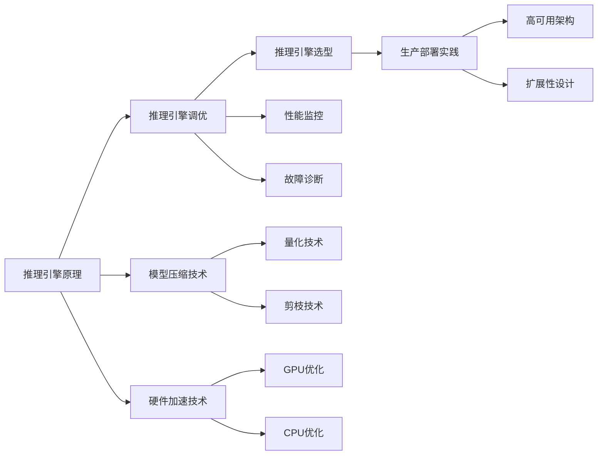
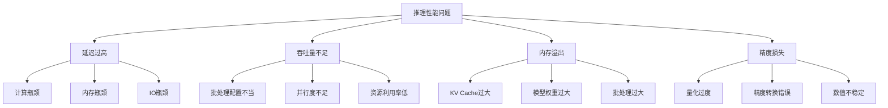

<!-- kb-import-backlink:LLMForEverybody -->

> [!info] 外部资料 · LLMForEverybody
> 中文大模型知识库 [[sources/LLMForEverybody/index|LLMForEverybody 导航]] 中的相关章节：
> - [[sources/LLMForEverybody/02-第二章-部署与推理/10分钟私有化部署大模型到本地|本地私有化部署]]


# 推理引擎知识体系：从原理到实践

> 📚 **知识定位**：本文档是推理引擎知识的主索引，涵盖从理论基础到生产部署的完整知识图谱。

## 🎯 学习目标

通过本知识体系的学习，你将掌握：
1. **原理层面**：理解推理引擎的核心架构和工作机制
2. **技术层面**：掌握各类优化技术的原理和实现
3. **实践层面**：能够独立部署、调优和监控推理服务
4. **决策层面**：能够为不同场景选择合适的推理引擎和优化策略

## 📋 知识结构

### 🧠 理论基础


### 🔧 核心技术
| 技术类别     | 关键技术                     | 优化目标   | 相关文档                                 |
| -------- | ------------------------ | ------ | ------------------------------------ |
| **计算优化** | FlashAttention, 算子融合 | 延迟 ↓ | [[inference-engine-principles#计算图优化]] |
| **内存优化** | PagedAttention, KV Cache | 吞吐量 ↑  | [[inference-engine-principles#内存管理]] |
| **模型压缩** | 量化, 剪枝, 蒸馏               | 资源消耗 ↓ | [[model-compression-distillation]]   |
| **系统优化** | 批处理, 并行, 调度              | 并发能力 ↑ | [[inference-engine-tuning#系统级优化]]    |

### 🛠️ 实践应用
| 应用场景       | 推荐引擎                | 关键考虑      | 相关文档                                 |
| ---------- | ------------------- | --------- | ------------------------------------ |
| **高并发API** | vLLM, TGI | 吞吐量, 延迟 | [[inference-engine-selection#场景匹配指南]] |
| **边缘部署** | llama.cpp, ONNX | 资源限制, 移植性 | [[inference-engine-selection#场景匹配指南]] |
| **实时交互** | TensorRT, Triton | 延迟, 准确性 | [[inference-engine-selection#场景匹配指南]] |
| **批量处理** | DeepSpeed, Megatron | 吞吐量, 成本 | [[inference-engine-selection#场景匹配指南]] |

## 📚 知识图谱

### 核心文档


### 知识关联图


## 🚀 学习路径

### 阶段一：基础入门（1-2周）
**目标**：理解推理引擎基本概念，能跑通第一个优化模型

**学习内容**：
- [[inference-engine-principles#学习目标]] - 核心术语和原理
- [[inference-engine-selection#选型目标与原则]] - 从llama.cpp开始
- [[inference-engine-tuning#调优目标与策略]] - 量化和批处理基础

**实践项目**：
```bash
# 1. 安装llama.cpp并运行第一个量化模型
git clone https://github.com/ggerganov/llama.cpp
cd llama.cpp && make
./quantize ./models/7B/ggml-model-f16.bin ./models/7B/ggml-model-q4_0.bin q4_0

# 2. 测试不同量化精度
./main -m ./models/7B/ggml-model-q4_0.bin -p "Hello, world" -n 50
```

### 阶段二：技术深入（3-4周）
**目标**：掌握核心优化技术，能独立分析性能瓶颈

**学习内容**：
- [[inference-engine-principles#内存管理]] - KV Cache, PagedAttention
- [[inference-engine-principles#计算图优化]] - FlashAttention, 算子融合
- [[inference-engine-tuning#性能分析方法论]] - 性能分析工具使用

**实践项目**：
```python
# 1. 使用PyTorch Profiler分析推理性能
import torch
from torch.profiler import profile, ProfilerActivity

with profile(activities=[ProfilerActivity.CPU, ProfilerActivity.CUDA]) as prof:
    # 运行模型推理
    output = model(input_data)

print(prof.key_averages().table(sort_by="cuda_time_total"))
```

### 阶段三：生产实践（5-8周）
**目标**：掌握生产级部署和调优，能设计优化方案

**学习内容**：
- [[inference-engine-tuning#系统级优化]] - 并行、批处理、调度
- [[inference-engine-selection#选型决策流程]] - 引擎选型和架构设计
- [[inference-engine-monitoring#监控最佳实践]] - 性能监控和告警

**实践项目**：
```bash
# 1. 部署vLLM生产服务
python -m vllm.entrypoints.openai.api_server \
  --model meta-llama/Llama-2-7b-hf \
  --tensor-parallel-size 4 \
  --max-num-seqs 256 \
  --enable-prefix-caching

# 2. 性能压测和优化
python -m benchmark.http_server \
  --backend vllm \
  --model meta-llama/Llama-2-7b-hf \
  --num-prompts 1000
```

## 🎯 核心概念速查

### 关键术语表
| 术语 | 定义 | 相关文档 |
|------|------|----------|
| **吞吐量 (Throughput)** | 单位时间内处理的请求数或token数 | [[inference-engine-principles#性能分析与监控]] |
| **延迟 (Latency)** | 单个请求从输入到输出的时间 | [[inference-engine-principles#性能分析与监控]] |
| **KV Cache** | 键值缓存，存储历史token的K/V向量 | [[inference-engine-principles#内存管理]] |
| **PagedAttention** | 分页注意力机制，类似OS虚拟内存 | [[inference-engine-principles#内存管理]] |
| **连续批处理** | 动态管理请求进出的批处理技术 | [[inference-engine-tuning#连续批处理优化]] |
| **量化 (Quantization)** | 降低模型权重精度以减少资源消耗 | [[model-compression-distillation#量化方法]] |

### 性能指标参考
| 指标 | 计算公式 | 优化目标 | 测量工具 |
|------|----------|----------|----------|
| **QPS** | 请求数/秒 | ↑ 越高越好 | wrk, locust |
| **TPS** | tokens/秒 | ↑ 越高越好 | vllm benchmark |
| **TTFT** | 首token延迟 | ↓ 越低越好 | 自定义计时 |
| **内存效率** | tokens/GB | ↑ 越高越好 | nvidia-smi |

## 🔍 问题诊断指南

### 常见问题分类


### 诊断流程
1. **性能基线建立**
   - 测量当前QPS、延迟、内存使用
   - 建立性能基准

2. **瓶颈定位**
   - 使用性能分析工具
   - 识别计算、内存、IO瓶颈

3. **优化方案设计**
   - 针对瓶颈选择优化技术
   - 评估优化效果和风险

4. **实施和验证**
   - 逐步实施优化
   - 验证性能提升和准确性

## 📊 学习进度跟踪

### 知识掌握度评估
| 知识领域 | 入门 | 进阶 | 精通 | 当前状态 |
|----------|------|------|------|----------|
| 推理原理 | ✅ | ⬜ | ⬜ | 入门 |
| 优化技术 | ✅ | ⬜ | ⬜ | 入门 |
| 调优实践 | ✅ | ⬜ | ⬜ | 入门 |
| 生产部署 | ✅ | ⬜ | ⬜ | 入门 |

### 实践项目清单
- [ ] 完成llama.cpp基础使用
- [ ] 实现模型量化对比实验
- [ ] 使用PyTorch Profiler分析性能
- [ ] 部署vLLM生产服务
- [ ] 设计完整优化方案

## 🔗 扩展学习

### 相关知识领域
- [[llm-training-pipeline]] - 训练流程与推理优化的关系
- [[transformer-architecture]] - Transformer架构对推理的影响
- [[Kubernetes高可用与自愈]] - 生产环境部署
- [GPU架构与CUDA编程](references/gpu-architecture.md) - 硬件加速原理

### 推荐资源
**官方文档**：
- [vLLM Documentation](https://docs.vllm.ai/)
- [TensorRT-LLM](https://nvidia.github.io/TensorRT-LLM/)
- [llama.cpp](https://github.com/ggerganov/llama.cpp)

**社区项目**：
- [Hugging Face](https://huggingface.co/) - 模型库和工具链
- [Ollama](https://ollama.ai/) - 本地模型运行
- [LocalAI](https://github.com/mudler/LocalAI) - 本地API服务

## 📝 学习笔记模板

### 每日学习记录
```markdown
## 日期: YYYY-MM-DD

### 今日学习内容
- [ ] 完成xxx章节阅读
- [ ] 实践xxx技术
- [ ] 解决xxx问题

### 关键收获
1. xxx
2. xxx
3. xxx

### 待解决问题
- [ ] xxx
- [ ] xxx

### 明日计划
- [ ] xxx
```

### 实验记录模板
```markdown
## 实验: xxx优化技术

### 实验目标
验证xxx技术对xxx指标的影响

### 实验环境
- 硬件: xxx
- 软件: xxx
- 模型: xxx

### 实验步骤
1. xxx
2. xxx
3. xxx

### 实验结果
- 指标A: xxx → xxx (提升xx%)
- 指标B: xxx → xxx (提升xx%)

### 结论分析
xxx

### 后续改进
xxx
```

---

> 💡 **学习建议**：推理引擎学习是一个理论与实践并重的过程。建议边学边做，通过实际项目加深理解。遇到问题时，先查阅官方文档，再参考社区最佳实践。

**最后更新**：2026-08-17  
**维护者**：Claudian  
**状态**：活跃维护中