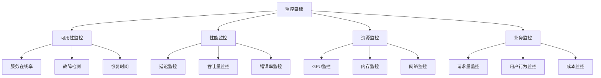
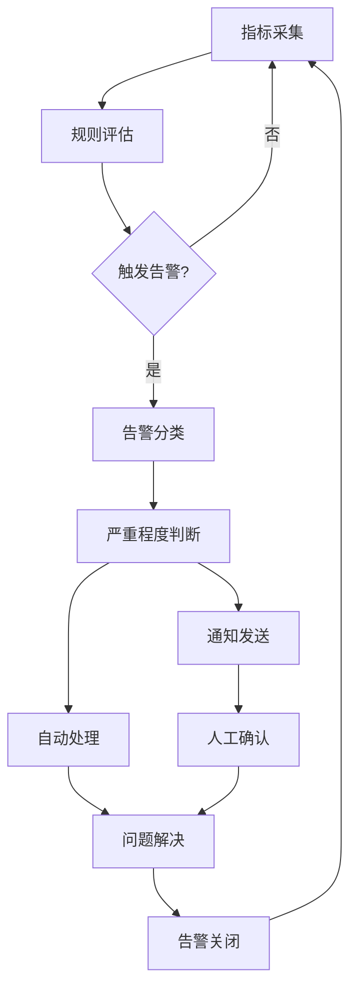
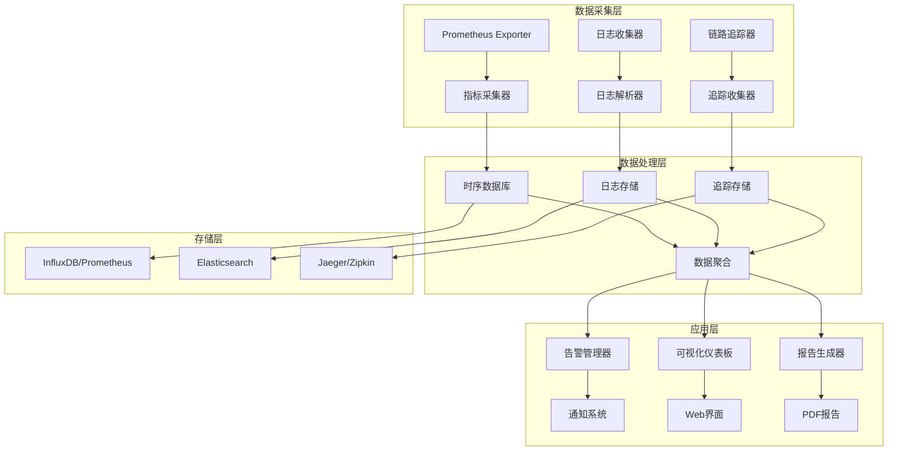

<!-- kb-import-backlink:LLMForEverybody -->

> [!info] 外部资料 · LLMForEverybody
> 中文大模型知识库 [[sources/LLMForEverybody/index|LLMForEverybody 导航]] 中的相关章节：
> - [[sources/LLMForEverybody/02-第二章-部署与推理/如何评判大模型的输出速度？首Token延迟和其余Token延迟有什么不同？|首 Token 延迟]]


# 推理引擎监控体系：从指标到告警

> 📚 **知识定位**：本文档提供推理引擎监控的完整体系，是[[inference-engine-mastery]]知识体系的运维保障部分。

## 🎯 监控目标与原则

### 监控目标矩阵


### 监控原则
| 原则 | 描述 | 实施方法 |
|------|------|----------|
| **全面性** | 覆盖所有关键组件 | 多维度指标采集 |
| **实时性** | 及时发现和响应 | 实时流处理 |
| **准确性** | 数据准确可靠 | 多源验证 |
| **可操作性** | 便于分析和行动 | 可视化仪表板 |
| **成本效益** | 监控成本合理 | 分层监控策略 |

## 📊 指标体系设计

### 指标分类框架
```python
class MetricsFramework:
    """指标体系框架"""
    
    def __init__(self):
        self.metric_categories = {
            'infrastructure': {
                'cpu': ['utilization', 'load_average', 'temperature'],
                'memory': ['usage', 'available', 'swap_usage'],
                'gpu': ['utilization', 'memory_usage', 'temperature', 'power'],
                'disk': ['usage', 'iops', 'latency'],
                'network': ['throughput', 'latency', 'packet_loss']
            },
            'application': {
                'inference': ['latency', 'throughput', 'error_rate'],
                'model': ['accuracy', 'confidence', 'drift'],
                'queue': ['length', 'wait_time', 'processing_time'],
                'cache': ['hit_rate', 'size', 'evictions']
            },
            'business': {
                'requests': ['total', 'successful', 'failed'],
                'users': ['concurrent', 'active', 'new'],
                'cost': ['per_request', 'per_token', 'total'],
                'quality': ['satisfaction', 'feedback', 'issues']
            }
        }
        
        self.metric_definitions = {}
    
    def define_metric(self, metric_name, category, subcategory, unit, description):
        """定义指标"""
        self.metric_definitions[metric_name] = {
            'category': category,
            'subcategory': subcategory,
            'unit': unit,
            'description': description,
            'aggregation': 'avg',  # 默认聚合方式
            'retention': '30d'     # 默认保留时间
        }
    
    def get_metrics_by_category(self, category):
        """按类别获取指标"""
        if category in self.metric_categories:
            metrics = []
            for subcategory, metric_list in self.metric_categories[category].items():
                for metric in metric_list:
                    metric_name = f"{category}_{subcategory}_{metric}"
                    metrics.append(metric_name)
            return metrics
        return []
    
    def get_metric_definition(self, metric_name):
        """获取指标定义"""
        return self.metric_definitions.get(metric_name, None)
    
    def calculate_metric_score(self, metric_name, value, thresholds):
        """计算指标分数"""
        if metric_name in thresholds:
            threshold = thresholds[metric_name]
            
            if value <= threshold['good']:
                return 1.0
            elif value <= threshold['warning']:
                return 0.7
            elif value <= threshold['critical']:
                return 0.3
            else:
                return 0.0
        
        return 0.5  # 默认分数
```

### 核心指标定义
| 指标类别 | 指标名称 | 计算公式 | 单位 | 优化目标 |
|----------|----------|----------|------|----------|
| **延迟** | 首token延迟 | 请求到首个token时间 | ms | < 200ms |
| | 生成延迟 | 每token生成时间 | ms | < 50ms |
| | 端到端延迟 | 完整请求处理时间 | ms | < 2s |
| **吞吐量** | QPS | 每秒请求数 | req/s | 满足业务需求 |
| | TPS | 每秒token数 | tokens/s | 满足业务需求 |
| | 并发数 | 同时处理请求数 | req | 满足峰值需求 |
| **资源** | GPU利用率 | GPU计算时间占比 | % | 70-95% |
| | GPU内存使用 | 显存使用量 | GB | < 90%容量 |
| | CPU利用率 | CPU计算时间占比 | % | 70-90% |
| | 内存使用 | 系统内存使用量 | GB | < 85%容量 |
| **质量** | 错误率 | 失败请求占比 | % | < 0.1% |
| | 超时率 | 超时请求占比 | % | < 0.01% |
| | 准确性 | 模型预测准确率 | % | 满足业务要求 |

### 指标采集器
```python
class MetricsCollector:
    """指标采集器"""
    
    def __init__(self, collection_interval=10):
        self.collection_interval = collection_interval
        self.metrics_buffer = {}
        self.collection_threads = {}
        
        # 启动采集线程
        self.start_collection()
    
    def start_collection(self):
        """启动指标采集"""
        # CPU指标采集线程
        self.collection_threads['cpu'] = threading.Thread(
            target=self.collect_cpu_metrics,
            daemon=True
        )
        self.collection_threads['cpu'].start()
        
        # GPU指标采集线程
        self.collection_threads['gpu'] = threading.Thread(
            target=self.collect_gpu_metrics,
            daemon=True
        )
        self.collection_threads['gpu'].start()
        
        # 内存指标采集线程
        self.collection_threads['memory'] = threading.Thread(
            target=self.collect_memory_metrics,
            daemon=True
        )
        self.collection_threads['memory'].start()
        
        # 应用指标采集线程
        self.collection_threads['application'] = threading.Thread(
            target=self.collect_application_metrics,
            daemon=True
        )
        self.collection_threads['application'].start()
    
    def collect_cpu_metrics(self):
        """采集CPU指标"""
        while True:
            try:
                # 获取CPU使用率
                cpu_percent = psutil.cpu_percent(interval=1)
                
                # 获取CPU负载
                cpu_load = os.getloadavg()
                
                # 获取CPU温度（如果可用）
                cpu_temp = self.get_cpu_temperature()
                
                # 存储指标
                self.store_metric('cpu_utilization', cpu_percent, timestamp=time.time())
                self.store_metric('cpu_load_1m', cpu_load[0], timestamp=time.time())
                self.store_metric('cpu_load_5m', cpu_load[1], timestamp=time.time())
                self.store_metric('cpu_load_15m', cpu_load[2], timestamp=time.time())
                
                if cpu_temp is not None:
                    self.store_metric('cpu_temperature', cpu_temp, timestamp=time.time())
                
            except Exception as e:
                print(f"CPU指标采集错误: {e}")
            
            time.sleep(self.collection_interval)
    
    def collect_gpu_metrics(self):
        """采集GPU指标"""
        while True:
            try:
                # 使用nvidia-smi获取GPU信息
                import subprocess
                
                result = subprocess.run([
                    'nvidia-smi',
                    '--query-gpu=utilization.gpu,memory.used,memory.total,temperature.gpu,power.draw',
                    '--format=csv,nounits,noheader'
                ], capture_output=True, text=True)
                
                if result.returncode == 0:
                    gpu_info = result.stdout.strip().split('\n')
                    
                    for i, gpu_line in enumerate(gpu_info):
                        values = gpu_line.split(', ')
                        
                        if len(values) >= 5:
                            gpu_util = float(values[0])
                            memory_used = float(values[1])
                            memory_total = float(values[2])
                            temperature = float(values[3])
                            power_draw = float(values[4])
                            
                            # 存储指标
                            self.store_metric(f'gpu_{i}_utilization', gpu_util, timestamp=time.time())
                            self.store_metric(f'gpu_{i}_memory_used', memory_used, timestamp=time.time())
                            self.store_metric(f'gpu_{i}_memory_total', memory_total, timestamp=time.time())
                            self.store_metric(f'gpu_{i}_temperature', temperature, timestamp=time.time())
                            self.store_metric(f'gpu_{i}_power_draw', power_draw, timestamp=time.time())
                
            except Exception as e:
                print(f"GPU指标采集错误: {e}")
            
            time.sleep(self.collection_interval)
    
    def collect_memory_metrics(self):
        """采集内存指标"""
        while True:
            try:
                # 获取内存信息
                memory = psutil.virtual_memory()
                swap = psutil.swap_memory()
                
                # 存储指标
                self.store_metric('memory_total', memory.total / 1024**3, timestamp=time.time())
                self.store_metric('memory_used', memory.used / 1024**3, timestamp=time.time())
                self.store_metric('memory_available', memory.available / 1024**3, timestamp=time.time())
                self.store_metric('memory_percent', memory.percent, timestamp=time.time())
                
                self.store_metric('swap_total', swap.total / 1024**3, timestamp=time.time())
                self.store_metric('swap_used', swap.used / 1024**3, timestamp=time.time())
                self.store_metric('swap_percent', swap.percent, timestamp=time.time())
                
            except Exception as e:
                print(f"内存指标采集错误: {e}")
            
            time.sleep(self.collection_interval)
    
    def collect_application_metrics(self):
        """采集应用指标"""
        while True:
            try:
                # 这里需要实际的应用指标采集逻辑
                # 示例：从Prometheus或自定义端点采集
                
                # 模拟采集
                app_metrics = {
                    'request_count': random.randint(100, 1000),
                    'error_count': random.randint(0, 10),
                    'latency_p95': random.uniform(50, 200),
                    'throughput': random.uniform(1000, 5000)
                }
                
                for metric_name, value in app_metrics.items():
                    self.store_metric(metric_name, value, timestamp=time.time())
                
            except Exception as e:
                print(f"应用指标采集错误: {e}")
            
            time.sleep(self.collection_interval)
    
    def get_cpu_temperature(self):
        """获取CPU温度"""
        try:
            # Linux系统
            if os.path.exists('/sys/class/thermal/thermal_zone0/temp'):
                with open('/sys/class/thermal/thermal_zone0/temp', 'r') as f:
                    temp = float(f.read().strip()) / 1000
                    return temp
        except:
            pass
        
        return None
    
    def store_metric(self, metric_name, value, timestamp):
        """存储指标"""
        if metric_name not in self.metrics_buffer:
            self.metrics_buffer[metric_name] = []
        
        self.metrics_buffer[metric_name].append({
            'value': value,
            'timestamp': timestamp
        })
        
        # 保持缓冲区大小
        if len(self.metrics_buffer[metric_name]) > 1000:
            self.metrics_buffer[metric_name] = self.metrics_buffer[metric_name][-1000:]
    
    def get_metric_history(self, metric_name, duration=3600):
        """获取指标历史"""
        if metric_name not in self.metrics_buffer:
            return []
        
        current_time = time.time()
        start_time = current_time - duration
        
        history = [
            point for point in self.metrics_buffer[metric_name]
            if point['timestamp'] >= start_time
        ]
        
        return history
    
    def calculate_metric_statistics(self, metric_name, duration=3600):
        """计算指标统计"""
        history = self.get_metric_history(metric_name, duration)
        
        if not history:
            return None
        
        values = [point['value'] for point in history]
        
        return {
            'count': len(values),
            'min': min(values),
            'max': max(values),
            'avg': sum(values) / len(values),
            'p50': np.percentile(values, 50),
            'p95': np.percentile(values, 95),
            'p99': np.percentile(values, 99)
        }
```

## 📈 可视化仪表板

### 仪表板设计
```python
class MonitoringDashboard:
    """监控仪表板"""
    
    def __init__(self, metrics_collector):
        self.metrics_collector = metrics_collector
        self.dashboard_config = self.load_dashboard_config()
    
    def load_dashboard_config(self):
        """加载仪表板配置"""
        return {
            'title': 'LLM推理服务监控仪表板',
            'refresh_interval': 10,  # 秒
            'panels': [
                {
                    'id': 'overview',
                    'title': '概览',
                    'type': 'stat',
                    'metrics': ['total_requests', 'error_rate', 'avg_latency']
                },
                {
                    'id': 'gpu_monitoring',
                    'title': 'GPU监控',
                    'type': 'graph',
                    'metrics': ['gpu_0_utilization', 'gpu_0_memory_used', 'gpu_0_temperature']
                },
                {
                    'id': 'performance',
                    'title': '性能监控',
                    'type': 'graph',
                    'metrics': ['throughput', 'latency_p95', 'concurrent_requests']
                },
                {
                    'id': 'resources',
                    'title': '资源监控',
                    'type': 'graph',
                    'metrics': ['cpu_utilization', 'memory_percent', 'disk_usage']
                }
            ]
        }
    
    def generate_dashboard_html(self):
        """生成仪表板HTML"""
        html_template = """
<!DOCTYPE html>
<html>
<head>
    <title>{title}</title>
    <script src="https://cdn.jsdelivr.net/npm/chart.js"></script>
    <style>
        body {{ font-family: Arial, sans-serif; margin: 20px; }}
        .dashboard {{ display: grid; grid-template-columns: repeat(auto-fit, minmax(400px, 1fr)); gap: 20px; }}
        .panel {{ border: 1px solid #ddd; border-radius: 8px; padding: 20px; background: white; }}
        .panel-title {{ font-size: 18px; font-weight: bold; margin-bottom: 10px; }}
        .stat-value {{ font-size: 24px; font-weight: bold; color: #2c3e50; }}
        .stat-label {{ font-size: 12px; color: #7f8c8d; }}
        .graph-container {{ height: 300px; }}
    </style>
</head>
<body>
    <h1>{title}</h1>
    <div class="dashboard">
        {panels_html}
    </div>
    
    <script>
        // 刷新数据
        setInterval(function() {{
            refreshData();
        }}, {refresh_interval} * 1000);
        
        function refreshData() {{
            // 这里添加AJAX请求获取最新数据
            console.log('刷新数据...');
        }}
    </script>
</body>
</html>
"""
        
        panels_html = self.generate_panels_html()
        
        html = html_template.format(
            title=self.dashboard_config['title'],
            refresh_interval=self.dashboard_config['refresh_interval'],
            panels_html=panels_html
        )
        
        return html
    
    def generate_panels_html(self):
        """生成面板HTML"""
        panels_html = ""
        
        for panel in self.dashboard_config['panels']:
            if panel['type'] == 'stat':
                panels_html += self.generate_stat_panel(panel)
            elif panel['type'] == 'graph':
                panels_html += self.generate_graph_panel(panel)
        
        return panels_html
    
    def generate_stat_panel(self, panel):
        """生成统计面板"""
        panel_html = f"""
        <div class="panel">
            <div class="panel-title">{panel['title']}</div>
            <div class="stat-value" id="{panel['id']}_value">--</div>
            <div class="stat-label">{panel['metrics'][0]}</div>
        </div>
        """
        return panel_html
    
    def generate_graph_panel(self, panel):
        """生成图表面板"""
        panel_html = f"""
        <div class="panel">
            <div class="panel-title">{panel['title']}</div>
            <div class="graph-container">
                <canvas id="{panel['id']}_chart"></canvas>
            </div>
        </div>
        
        <script>
            // 初始化图表
            var ctx = document.getElementById('{panel['id']}_chart').getContext('2d');
            var chart = new Chart(ctx, {{
                type: 'line',
                data: {{
                    labels: [],
                    datasets: [
                        {{
                            label: '{panel['metrics'][0]}',
                            data: [],
                            borderColor: 'rgb(75, 192, 192)',
                            tension: 0.1
                        }}
                    ]
                }},
                options: {{
                    responsive: true,
                    maintainAspectRatio: false,
                    scales: {{
                        x: {{
                            display: true
                        }},
                        y: {{
                            display: true,
                            beginAtZero: true
                        }}
                    }}
                }}
            }});
        </script>
        """
        return panel_html
    
    def update_dashboard_data(self):
        """更新仪表板数据"""
        # 这里添加实际的数据更新逻辑
        # 从metrics_collector获取最新数据并更新图表
        pass
```

### 仪表板配置模板
```json
{
  "dashboard": {
    "title": "LLM推理服务监控",
    "refresh_interval": 10,
    "panels": [
      {
        "id": "overview",
        "title": "服务概览",
        "type": "stat",
        "position": {"x": 0, "y": 0, "w": 6, "h": 3},
        "metrics": [
          {
            "name": "total_requests",
            "label": "总请求数",
            "format": "number"
          },
          {
            "name": "error_rate",
            "label": "错误率",
            "format": "percent"
          },
          {
            "name": "avg_latency",
            "label": "平均延迟",
            "format": "ms"
          }
        ]
      },
      {
        "id": "gpu_monitoring",
        "title": "GPU监控",
        "type": "graph",
        "position": {"x": 6, "y": 0, "w": 6, "h": 6},
        "metrics": [
          {
            "name": "gpu_0_utilization",
            "label": "GPU利用率",
            "color": "#FF6384"
          },
          {
            "name": "gpu_0_memory_used",
            "label": "GPU内存使用",
            "color": "#36A2EB"
          },
          {
            "name": "gpu_0_temperature",
            "label": "GPU温度",
            "color": "#FFCE56"
          }
        ]
      },
      {
        "id": "performance",
        "title": "性能监控",
        "type": "graph",
        "position": {"x": 0, "y": 6, "w": 6, "h": 6},
        "metrics": [
          {
            "name": "throughput",
            "label": "吞吐量",
            "color": "#4BC0C0"
          },
          {
            "name": "latency_p95",
            "label": "P95延迟",
            "color": "#9966FF"
          }
        ]
      },
      {
        "id": "resources",
        "title": "资源监控",
        "type": "graph",
        "position": {"x": 6, "y": 6, "w": 6, "h": 6},
        "metrics": [
          {
            "name": "cpu_utilization",
            "label": "CPU利用率",
            "color": "#FF9F40"
          },
          {
            "name": "memory_percent",
            "label": "内存使用率",
            "color": "#C9CBCF"
          }
        ]
      }
    ],
    "alert_rules": [
      {
        "metric": "gpu_0_temperature",
        "condition": ">",
        "threshold": 85,
        "severity": "warning",
        "message": "GPU温度过高"
      },
      {
        "metric": "error_rate",
        "condition": ">",
        "threshold": 0.01,
        "severity": "critical",
        "message": "错误率超过阈值"
      }
    ]
  }
}
```

## 🚨 告警策略

### 告警规则定义
```python
class AlertManager:
    """告警管理器"""
    
    def __init__(self):
        self.alert_rules = []
        self.alert_history = []
        self.notification_channels = []
    
    def add_alert_rule(self, rule):
        """添加告警规则"""
        self.alert_rules.append(rule)
    
    def evaluate_alerts(self, metrics):
        """评估告警规则"""
        triggered_alerts = []
        
        for rule in self.alert_rules:
            metric_name = rule['metric']
            condition = rule['condition']
            threshold = rule['threshold']
            
            if metric_name in metrics:
                current_value = metrics[metric_name]
                
                if self.check_condition(current_value, condition, threshold):
                    alert = {
                        'rule': rule,
                        'current_value': current_value,
                        'timestamp': time.time(),
                        'severity': rule.get('severity', 'warning'),
                        'message': rule.get('message', f'{metric_name} 超过阈值')
                    }
                    
                    triggered_alerts.append(alert)
                    
                    # 发送通知
                    self.send_notification(alert)
                    
                    # 记录历史
                    self.alert_history.append(alert)
        
        return triggered_alerts
    
    def check_condition(self, value, condition, threshold):
        """检查条件"""
        if condition == '>':
            return value > threshold
        elif condition == '<':
            return value < threshold
        elif condition == '>=':
            return value >= threshold
        elif condition == '<=':
            return value <= threshold
        elif condition == '==':
            return value == threshold
        elif condition == '!=':
            return value != threshold
        
        return False
    
    def send_notification(self, alert):
        """发送通知"""
        for channel in self.notification_channels:
            try:
                if channel['type'] == 'email':
                    self.send_email_notification(alert, channel)
                elif channel['type'] == 'slack':
                    self.send_slack_notification(alert, channel)
                elif channel['type'] == 'webhook':
                    self.send_webhook_notification(alert, channel)
            except Exception as e:
                print(f"发送通知失败: {e}")
    
    def send_email_notification(self, alert, channel):
        """发送邮件通知"""
        # 实现邮件发送逻辑
        print(f"发送邮件通知: {alert['message']}")
    
    def send_slack_notification(self, alert, channel):
        """发送Slack通知"""
        # 实现Slack通知逻辑
        print(f"发送Slack通知: {alert['message']}")
    
    def send_webhook_notification(self, alert, channel):
        """发送Webhook通知"""
        # 实现Webhook通知逻辑
        print(f"发送Webhook通知: {alert['message']}")
    
    def get_alert_statistics(self, duration=3600):
        """获取告警统计"""
        current_time = time.time()
        start_time = current_time - duration
        
        recent_alerts = [
            alert for alert in self.alert_history
            if alert['timestamp'] >= start_time
        ]
        
        # 按严重程度分组
        severity_counts = {}
        for alert in recent_alerts:
            severity = alert['severity']
            severity_counts[severity] = severity_counts.get(severity, 0) + 1
        
        # 按指标分组
        metric_counts = {}
        for alert in recent_alerts:
            metric = alert['rule']['metric']
            metric_counts[metric] = metric_counts.get(metric, 0) + 1
        
        return {
            'total_alerts': len(recent_alerts),
            'severity_counts': severity_counts,
            'metric_counts': metric_counts,
            'avg_alerts_per_hour': len(recent_alerts) / (duration / 3600)
        }
```

### 告警规则模板
```yaml
alert_rules:
  - name: "GPU温度过高"
    metric: "gpu_0_temperature"
    condition: ">"
    threshold: 85
    severity: "warning"
    duration: "5m"
    message: "GPU温度超过85°C，当前温度: {{ value }}°C"
    actions:
      - "send_slack_notification"
      - "log_alert"
      
  - name: "GPU内存不足"
    metric: "gpu_0_memory_used"
    condition: ">"
    threshold: 90
    severity: "critical"
    duration: "2m"
    message: "GPU内存使用率超过90%，当前使用率: {{ value }}%"
    actions:
      - "send_email_notification"
      - "scale_up_gpu"
      
  - name: "错误率过高"
    metric: "error_rate"
    condition: ">"
    threshold: 0.01
    severity: "critical"
    duration: "1m"
    message: "错误率超过1%，当前错误率: {{ value }}%"
    actions:
      - "send_webhook_notification"
      - "restart_service"
      
  - name: "延迟过高"
    metric: "latency_p95"
    condition: ">"
    threshold: 500
    severity: "warning"
    duration: "3m"
    message: "P95延迟超过500ms，当前延迟: {{ value }}ms"
    actions:
      - "send_slack_notification"
      - "optimize_batch_size"
      
  - name: "吞吐量过低"
    metric: "throughput"
    condition: "<"
    threshold: 100
    severity: "warning"
    duration: "5m"
    message: "吞吐量低于100 req/s，当前吞吐量: {{ value }} req/s"
    actions:
      - "send_slack_notification"
      - "check_model_loading"
```

### 告警处理流程


## 📝 日志分析

### 日志收集与解析
```python
class LogAnalyzer:
    """日志分析器"""
    
    def __init__(self, log_paths):
        self.log_paths = log_paths
        self.log_patterns = self.define_log_patterns()
        self.parsed_logs = []
    
    def define_log_patterns(self):
        """定义日志模式"""
        return {
            'request_log': {
                'pattern': r'(\d{4}-\d{2}-\d{2} \d{2}:\d{2}:\d{2}) - (\w+) - (.*)',
                'fields': ['timestamp', 'level', 'message']
            },
            'error_log': {
                'pattern': r'ERROR: (.*) at (.*) line (\d+)',
                'fields': ['error_message', 'file', 'line']
            },
            'performance_log': {
                'pattern': r'Performance: (\w+)=(\d+\.?\d*) (\w+)',
                'fields': ['metric_name', 'value', 'unit']
            }
        }
    
    def collect_logs(self):
        """收集日志"""
        for log_path in self.log_paths:
            try:
                with open(log_path, 'r', encoding='utf-8') as f:
                    for line in f:
                        parsed_log = self.parse_log_line(line.strip())
                        if parsed_log:
                            self.parsed_logs.append(parsed_log)
            except Exception as e:
                print(f"收集日志失败 {log_path}: {e}")
    
    def parse_log_line(self, line):
        """解析日志行"""
        for log_type, pattern_info in self.log_patterns.items():
            match = re.match(pattern_info['pattern'], line)
            if match:
                log_entry = {
                    'log_type': log_type,
                    'raw_line': line
                }
                
                # 提取字段
                for i, field in enumerate(pattern_info['fields']):
                    log_entry[field] = match.group(i + 1)
                
                # 添加时间戳
                if 'timestamp' in log_entry:
                    try:
                        log_entry['parsed_timestamp'] = datetime.strptime(
                            log_entry['timestamp'],
                            '%Y-%m-%d %H:%M:%S'
                        )
                    except:
                        pass
                
                return log_entry
        
        return None
    
    def analyze_error_patterns(self):
        """分析错误模式"""
        error_logs = [log for log in self.parsed_logs if log.get('level') == 'ERROR']
        
        error_patterns = {}
        for log in error_logs:
            error_message = log.get('error_message', 'unknown')
            
            # 简化错误消息
            simplified = self.simplify_error_message(error_message)
            
            if simplified not in error_patterns:
                error_patterns[simplified] = {
                    'count': 0,
                    'first_seen': log.get('parsed_timestamp'),
                    'last_seen': log.get('parsed_timestamp'),
                    'examples': []
                }
            
            error_patterns[simplified]['count'] += 1
            error_patterns[simplified]['last_seen'] = log.get('parsed_timestamp')
            
            if len(error_patterns[simplified]['examples']) < 3:
                error_patterns[simplified]['examples'].append(log.get('raw_line'))
        
        # 按频率排序
        sorted_patterns = sorted(
            error_patterns.items(),
            key=lambda x: x[1]['count'],
            reverse=True
        )
        
        return sorted_patterns
    
    def simplify_error_message(self, message):
        """简化错误消息"""
        # 移除时间戳、ID等动态部分
        simplified = re.sub(r'\d{4}-\d{2}-\d{2} \d{2}:\d{2}:\d{2}', '<TIMESTAMP>', message)
        simplified = re.sub(r'\b[0-9a-f]{8}-[0-9a-f]{4}-[0-9a-f]{4}-[0-9a-f]{4}-[0-9a-f]{12}\b', '<UUID>', simplified)
        simplified = re.sub(r'\b\d+\b', '<NUMBER>', simplified)
        
        return simplified
    
    def extract_performance_metrics(self):
        """提取性能指标"""
        performance_logs = [log for log in self.parsed_logs if log.get('log_type') == 'performance_log']
        
        metrics = {}
        for log in performance_logs:
            metric_name = log.get('metric_name')
            value = float(log.get('value', 0))
            timestamp = log.get('parsed_timestamp')
            
            if metric_name not in metrics:
                metrics[metric_name] = []
            
            metrics[metric_name].append({
                'value': value,
                'timestamp': timestamp
            })
        
        return metrics
    
    def generate_log_report(self):
        """生成日志报告"""
        report = {
            'summary': {
                'total_logs': len(self.parsed_logs),
                'error_count': len([log for log in self.parsed_logs if log.get('level') == 'ERROR']),
                'warning_count': len([log for log in self.parsed_logs if log.get('level') == 'WARNING']),
                'info_count': len([log for log in self.parsed_logs if log.get('level') == 'INFO'])
            },
            'error_analysis': self.analyze_error_patterns(),
            'performance_metrics': self.extract_performance_metrics(),
            'recommendations': self.generate_recommendations()
        }
        
        return report
    
    def generate_recommendations(self):
        """生成建议"""
        recommendations = []
        
        # 分析错误模式
        error_patterns = self.analyze_error_patterns()
        for pattern, info in error_patterns[:3]:  # 前3个最常见错误
            recommendations.append({
                'type': 'error_resolution',
                'priority': 'high',
                'description': f"解决常见错误: {pattern}",
                'suggestions': [
                    f"错误出现次数: {info['count']}",
                    f"首次出现: {info['first_seen']}",
                    f"最后出现: {info['last_seen']}"
                ]
            })
        
        return recommendations
```

### 日志分析报告模板
```json
{
  "log_analysis_report": {
    "generated_at": "2026-08-17T10:00:00Z",
    "time_range": {
      "start": "2026-08-16T10:00:00Z",
      "end": "2026-08-17T10:00:00Z"
    },
    "summary": {
      "total_logs": 10000,
      "error_count": 50,
      "warning_count": 200,
      "info_count": 9750,
      "error_rate": 0.005
    },
    "top_errors": [
      {
        "error_pattern": "CUDA out of memory",
        "count": 25,
        "first_seen": "2026-08-16T10:15:00Z",
        "last_seen": "2026-08-17T09:45:00Z",
        "suggestion": "增加GPU内存或减少批处理大小"
      },
      {
        "error_pattern": "Connection timeout",
        "count": 15,
        "first_seen": "2026-08-16T14:30:00Z",
        "last_seen": "2026-08-17T08:20:00Z",
        "suggestion": "检查网络连接或增加超时时间"
      }
    ],
    "performance_trends": {
      "throughput": {
        "avg": 1500,
        "min": 800,
        "max": 2200,
        "trend": "stable"
      },
      "latency_p95": {
        "avg": 150,
        "min": 80,
        "max": 300,
        "trend": "increasing"
      }
    },
    "recommendations": [
      {
        "priority": "high",
        "category": "memory_optimization",
        "description": "优化GPU内存使用，减少OOM错误",
        "action_items": [
          "启用模型量化",
          "调整批处理大小",
          "监控内存使用情况"
        ]
      },
      {
        "priority": "medium",
        "category": "network_optimization",
        "description": "优化网络连接，减少超时错误",
        "action_items": [
          "检查网络配置",
          "增加连接池大小",
          "优化超时设置"
        ]
      }
    ]
  }
}
```

## 🔧 监控系统架构

### 监控架构图


### 监控组件配置
```yaml
monitoring_stack:
  # 指标收集
  metrics:
    collector: "prometheus"
    endpoint: "/metrics"
    scrape_interval: "15s"
    
  # 时序数据库
  time_series_db:
    type: "influxdb"
    retention: "30d"
    shard_duration: "7d"
    
  # 日志收集
  logging:
    collector: "fluentd"
    parser: "regex"
    output: "elasticsearch"
    
  # 链路追踪
  tracing:
    system: "jaeger"
    sampling_rate: "0.1"
    propagation: "w3c"
    
  # 告警
  alerting:
    manager: "alertmanager"
    channels: ["slack", "email", "webhook"]
    resolution_timeout: "1h"
    
  # 可视化
  visualization:
    dashboard: "grafana"
    refresh_interval: "10s"
    time_range: "24h"
```

## 📊 监控最佳实践

### 监控检查清单
```python
class MonitoringChecklist:
    """监控检查清单"""
    
    def __init__(self):
        self.checklist = {
            'infrastructure': [
                '✓ CPU监控配置',
                '✓ 内存监控配置',
                '✓ 磁盘监控配置',
                '✓ 网络监控配置',
                '✓ GPU监控配置'
            ],
            'application': [
                '✓ 请求监控配置',
                '✓ 错误监控配置',
                '✓ 性能监控配置',
                '✓ 业务指标监控',
                '✓ 资源使用监控'
            ],
            'alerting': [
                '✓ 告警规则定义',
                '✓ 通知渠道配置',
                '✓ 告警升级策略',
                '✓ 告警抑制规则',
                '✓ 告警恢复策略'
            ],
            'visualization': [
                '✓ 仪表板设计',
                '✓ 图表配置',
                '✓ 数据刷新设置',
                '✓ 权限配置',
                '✓ 导出功能'
            ],
            'security': [
                '✓ 访问控制',
                '✓ 数据加密',
                '✓ 审计日志',
                '✓ 备份策略',
                '✓ 恢复计划'
            ]
        }
    
    def check_completion(self, category):
        """检查类别完成情况"""
        if category in self.checklist:
            completed = sum(1 for item in self.checklist[category] if '✓' in item)
            total = len(self.checklist[category])
            return completed, total
        return 0, 0
    
    def complete_item(self, category, item_index):
        """完成检查项"""
        if category in self.checklist and item_index < len(self.checklist[category]):
            self.checklist[category][item_index] = self.checklist[category][item_index].replace('○', '✓')
    
    def get_overall_progress(self):
        """获取总体进度"""
        total_items = sum(len(items) for items in self.checklist.values())
        completed_items = sum(
            1 for items in self.checklist.values()
            for item in items if '✓' in item
        )
        
        return completed_items / total_items if total_items > 0 else 0
```

### 监控配置模板
```json
{
  "monitoring_config": {
    "general": {
      "project_name": "llm-inference-service",
      "environment": "production",
      "team": "ml-ops",
      "contact": "ml-ops@company.com"
    },
    "metrics": {
      "collection": {
        "enabled": true,
        "interval": "10s",
        "endpoints": [
          "/metrics",
          "/health",
          "/ready"
        ]
      },
      "storage": {
        "type": "prometheus",
        "retention": "30d",
        "scrape_interval": "15s"
      }
    },
    "logging": {
      "level": "info",
      "format": "json",
      "output": "stdout",
      "rotation": {
        "max_size": "100MB",
        "max_files": 10
      }
    },
    "tracing": {
      "enabled": false,
      "sampling_rate": 0.1,
      "propagation": "w3c"
    },
    "alerting": {
      "enabled": true,
      "channels": [
        {
          "type": "slack",
          "webhook": "https://hooks.slack.com/services/xxx",
          "channel": "#alerts"
        },
        {
          "type": "email",
          "recipients": ["team@company.com"]
        }
      ],
      "rules": [
        {
          "name": "high_error_rate",
          "metric": "error_rate",
          "condition": ">",
          "threshold": 0.01,
          "severity": "critical",
          "duration": "1m"
        }
      ]
    },
    "dashboard": {
      "enabled": true,
      "refresh_interval": "10s",
      "panels": [
        {
          "title": "Overview",
          "type": "stat",
          "metrics": ["qps", "error_rate", "latency_p95"]
        },
        {
          "title": "GPU Monitoring",
          "type": "graph",
          "metrics": ["gpu_utilization", "gpu_memory", "gpu_temperature"]
        }
      ]
    }
  }
}
```

## 🔗 知识关联

### 相关文档
- [[inference-engine-mastery]] - 推理引擎知识体系主索引
- [[inference-engine-principles]] - 推理引擎原理详解
- [[inference-engine-tuning]] - 推理引擎调优实践
- [[inference-engine-selection]] - 推理引擎选型指南
- [[llm-inference-optimization]] - LLM推理优化技术

### 监控工具对比
| 工具类别 | 工具名称 | 特点 | 适用场景 |
|----------|----------|------|----------|
| **指标收集** | Prometheus | 开源、强大查询 | 云原生环境 |
| | Datadog | 商业、全面集成 | 企业环境 |
| **日志分析** | ELK Stack | 开源、功能全面 | 大规模日志 |
| | Splunk | 商业、强大分析 | 企业安全 |
| **链路追踪** | Jaeger | 开源、CNCF项目 | 分布式系统 |
| | Zipkin | 开源、简单易用 | 中小规模 |
| **可视化** | Grafana | 开源、丰富图表 | 通用监控 |
| | Kibana | 开源、日志可视化 | 日志分析 |

---

> 💡 **监控建议**：监控系统是生产环境的重要保障。建议从简单开始，逐步完善。重点关注业务关键指标，避免监控过度导致的信息过载。

**参考文献**：
1. Monitoring Distributed Systems - Google SRE Book
2. Prometheus: Up & Running - O'Reilly Media
3. Observability Engineering - O'Reilly Media
4. Site Reliability Engineering - Google

**最后更新**：2026-08-17  
**维护者**：Claudian  
**状态**：活跃维护中