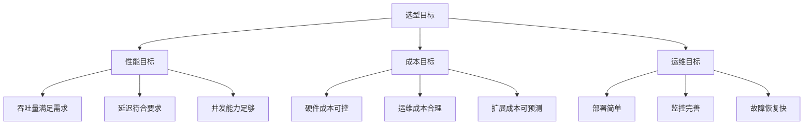
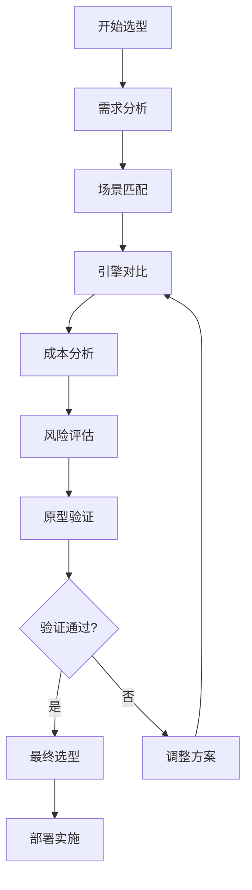

# 推理引擎选型指南：从需求到落地

> 📚 **知识定位**：本文档提供推理引擎选型的完整指南，是[[inference-engine-mastery]]知识体系的核心决策部分。

## 🎯 选型目标与原则

### 选型目标矩阵


### 选型原则
| 原则 | 描述 | 权重 | 评估方法 |
|------|------|------|----------|
| **需求匹配** | 引擎功能满足业务需求 | 30% | 需求分析 |
| **性能表现** | 满足性能指标要求 | 25% | 基准测试 |
| **成本效益** | 总体拥有成本合理 | 20% | 成本分析 |
| **易用性** | 部署、维护、使用简单 | 15% | 试用评估 |
| **生态支持** | 社区、文档、工具完善 | 10% | 生态调研 |

## 📊 需求分析框架

### 需求评估表
```python
class RequirementAnalyzer:
    """需求分析器"""
    
    def __init__(self):
        self.requirements = {
            'performance': {},
            'functional': {},
            'operational': {},
            'business': {}
        }
    
    def analyze_requirements(self, business_context):
        """分析业务需求"""
        # 性能需求
        self.requirements['performance'] = {
            'throughput': self.calculate_throughput需求(business_context),
            'latency': self.calculate_latency需求(business_context),
            'concurrency': self.calculate_concurrency需求(business_context)
        }
        
        # 功能需求
        self.requirements['functional'] = {
            'model_support': self.assess_model_support需求(business_context),
            'api_compatibility': self.assess_api_compatibility需求(business_context),
            'extension_capabilities': self.assess_extension_capabilities需求(business_context)
        }
        
        # 运营需求
        self.requirements['operational'] = {
            'deployment_complexity': self.assess_deployment_complexity需求(business_context),
            'monitoring_capabilities': self.assess_monitoring_capabilities需求(business_context),
            'maintenance_effort': self.assess_maintenance_effort需求(business_context)
        }
        
        # 业务需求
        self.requirements['business'] = {
            'budget': self.assess_budget需求(business_context),
            'timeline': self.assess_timeline需求(business_context),
            'risk_tolerance': self.assess_risk_tolerance需求(business_context)
        }
        
        return self.requirements
    
    def calculate_throughput需求(self, context):
        """计算吞吐量需求"""
        # 基于业务量估算
        daily_requests = context.get('daily_requests', 10000)
        peak_multiplier = context.get('peak_multiplier', 3)
        
        # 计算QPS
        qps = daily_requests / 86400 * peak_multiplier
        
        return {
            'qps': qps,
            'tokens_per_second': qps * context.get('avg_tokens_per_request', 100)
        }
    
    def calculate_latency需求(self, context):
        """计算延迟需求"""
        # 基于用户体验要求
        max_first_token_latency = context.get('max_first_token_latency', 200)  # ms
        max_generation_speed = context.get('max_generation_speed', 50)  # tokens/s
        
        return {
            'first_token_latency': max_first_token_latency,
            'generation_speed': max_generation_speed
        }
    
    def calculate_concurrency需求(self, context):
        """计算并发需求"""
        # 基于峰值并发估算
        peak_concurrent_users = context.get('peak_concurrent_users', 1000)
        requests_per_user = context.get('requests_per_user', 5)
        
        return {
            'concurrent_requests': peak_concurrent_users * requests_per_user,
            'concurrent_sessions': peak_concurrent_users
        }
    
    def assess_model_support需求(self, context):
        """评估模型支持需求"""
        model_types = context.get('model_types', ['transformer'])
        model_sizes = context.get('model_sizes', ['7B', '13B'])
        
        return {
            'supported_architectures': model_types,
            'max_model_size': max(model_sizes, key=lambda x: self.parse_size(x)),
            'quantization_support': context.get('quantization_required', True)
        }
    
    def parse_size(self, size_str):
        """解析模型大小"""
        if 'B' in size_str:
            return float(size_str.replace('B', '')) * 1e9
        elif 'M' in size_str:
            return float(size_str.replace('M', '')) * 1e6
        return float(size_str)
    
    def assess_api_compatibility需求(self, context):
        """评估API兼容性需求"""
        return {
            'openai_compatible': context.get('openai_compatible', True),
            'custom_api': context.get('custom_api_required', False),
            'grpc_support': context.get('grpc_required', False)
        }
    
    def assess_extension_capabilities需求(self, context):
        """评估扩展能力需求"""
        return {
            'plugin_system': context.get('plugin_required', False),
            'custom_operators': context.get('custom_operators_required', False),
            'dynamic_batching': context.get('dynamic_batching_required', True)
        }
    
    def assess_deployment_complexity需求(self, context):
        """评估部署复杂性需求"""
        return {
            'container_support': context.get('container_required', True),
            'kubernetes_integration': context.get('kubernetes_required', False),
            'cloud_native': context.get('cloud_native', False)
        }
    
    def assess_monitoring_capabilities需求(self, context):
        """评估监控能力需求"""
        return {
            'metrics_export': context.get('metrics_required', True),
            'logging': context.get('logging_required', True),
            'tracing': context.get('tracing_required', False)
        }
    
    def assess_maintenance_effort需求(self, context):
        """评估维护工作量需求"""
        return {
            'team_size': context.get('team_size', 3),
            'expertise_level': context.get('expertise_level', 'intermediate'),
            'update_frequency': context.get('update_frequency', 'monthly')
        }
    
    def assess_budget需求(self, context):
        """评估预算需求"""
        return {
            'hardware_budget': context.get('hardware_budget', 10000),  # USD
            'cloud_budget': context.get('cloud_budget', 5000),  # USD/month
            'license_budget': context.get('license_budget', 0)
        }
    
    def assess_timeline需求(self, context):
        """评估时间线需求"""
        return {
            'deployment_deadline': context.get('deployment_deadline', '3 months'),
            'development_time': context.get('development_time', '1 month'),
            'testing_time': context.get('testing_time', '2 weeks')
        }
    
    def assess_risk_tolerance需求(self, context):
        """评估风险容忍度"""
        return {
            'stability_requirements': context.get('stability_requirements', 'high'),
            'cutting_edge_tolerance': context.get('cutting_edge_tolerance', 'low'),
            'vendor_lock_in_tolerance': context.get('vendor_lock_in_tolerance', 'medium')
        }
```

### 需求权重分配
```python
class RequirementWeighting:
    """需求权重分配器"""
    
    def __init__(self):
        self.weight_schemes = {
            'performance_first': {
                'performance': 0.4,
                'cost': 0.2,
                'operational': 0.2,
                'business': 0.2
            },
            'cost_first': {
                'performance': 0.2,
                'cost': 0.4,
                'operational': 0.2,
                'business': 0.2
            },
            'balanced': {
                'performance': 0.25,
                'cost': 0.25,
                'operational': 0.25,
                'business': 0.25
            },
            'enterprise': {
                'performance': 0.2,
                'cost': 0.15,
                'operational': 0.35,
                'business': 0.3
            }
        }
    
    def apply_weighting(self, requirements, scheme='balanced'):
        """应用权重方案"""
        weights = self.weight_schemes.get(scheme, self.weight_schemes['balanced'])
        
        weighted_scores = {}
        for category, weight in weights.items():
            if category in requirements:
                category_score = self.calculate_category_score(requirements[category])
                weighted_scores[category] = category_score * weight
        
        total_score = sum(weighted_scores.values())
        
        return {
            'total_score': total_score,
            'category_scores': weighted_scores,
            'weights_used': weights
        }
    
    def calculate_category_score(self, category_requirements):
        """计算类别分数"""
        # 这里简化实现，实际需要更复杂的评分逻辑
        score = 0
        for key, value in category_requirements.items():
            if isinstance(value, (int, float)):
                score += value
            elif isinstance(value, dict):
                score += self.calculate_category_score(value)
        
        return score
```

## 🔧 引擎对比分析

### 主流引擎对比表
```python
class EngineComparator:
    """引擎对比器"""
    
    def __init__(self):
        self.engines = {
            'vllm': {
                'name': 'vLLM',
                'type': 'LLM专用',
                'open_source': True,
                'key_features': ['PagedAttention', '连续批处理', '张量并行'],
                'best_for': ['高并发API服务', '通用生产部署'],
                'hardware_support': ['NVIDIA GPU'],
                'quantization_support': ['AWQ', 'GPTQ', 'FP8'],
                'performance_profile': {
                    'throughput': 5,
                    'latency': 4,
                    'memory_efficiency': 5,
                    'ease_of_use': 4,
                    'community_support': 5
                }
            },
            'llama_cpp': {
                'name': 'llama.cpp',
                'type': '通用推理',
                'open_source': True,
                'key_features': ['GGUF格式', 'CPU优化', '跨平台'],
                'best_for': ['本地部署', '边缘设备', '个人使用'],
                'hardware_support': ['CPU', 'NVIDIA GPU', 'Apple Silicon'],
                'quantization_support': ['GGUF', 'Q4_0', 'Q4_K_M', 'Q5_K_M'],
                'performance_profile': {
                    'throughput': 3,
                    'latency': 3,
                    'memory_efficiency': 4,
                    'ease_of_use': 5,
                    'community_support': 5
                }
            },
            'tensorrt_llm': {
                'name': 'TensorRT-LLM',
                'type': 'NVIDIA优化',
                'open_source': True,
                'key_features': ['图融合', '内核优化', 'FP8支持'],
                'best_for': ['企业批量推理', '高性能计算'],
                'hardware_support': ['NVIDIA GPU'],
                'quantization_support': ['FP8', 'INT8', 'INT4'],
                'performance_profile': {
                    'throughput': 5,
                    'latency': 5,
                    'memory_efficiency': 4,
                    'ease_of_use': 3,
                    'community_support': 4
                }
            },
            'tgi': {
                'name': 'Text Generation Inference',
                'type': 'HuggingFace生态',
                'open_source': True,
                'key_features': ['HuggingFace集成', '易用性', '生产就绪'],
                'best_for': ['快速上线', 'HuggingFace用户'],
                'hardware_support': ['NVIDIA GPU', 'AMD GPU'],
                'quantization_support': ['GPTQ', 'AWQ', 'bitsandbytes'],
                'performance_profile': {
                    'throughput': 4,
                    'latency': 4,
                    'memory_efficiency': 4,
                    'ease_of_use': 5,
                    'community_support': 5
                }
            },
            'sglang': {
                'name': 'SGLang',
                'type': '结构化生成',
                'open_source': True,
                'key_features': ['结构化生成', 'RadixAttention', '前沿特性'],
                'best_for': ['复杂控制', '研究实验'],
                'hardware_support': ['NVIDIA GPU'],
                'quantization_support': ['AWQ', 'GPTQ'],
                'performance_profile': {
                    'throughput': 4,
                    'latency': 4,
                    'memory_efficiency': 4,
                    'ease_of_use': 3,
                    'community_support': 4
                }
            }
        }
    
    def compare_engines(self, engine_names, comparison_criteria):
        """对比引擎"""
        comparison_results = {}
        
        for engine_name in engine_names:
            if engine_name in self.engines:
                engine = self.engines[engine_name]
                
                # 评估每个标准
                scores = {}
                for criterion in comparison_criteria:
                    score = self.evaluate_criterion(engine, criterion)
                    scores[criterion] = score
                
                # 计算总分
                total_score = sum(scores.values()) / len(scores)
                
                comparison_results[engine_name] = {
                    'engine_info': engine,
                    'criterion_scores': scores,
                    'total_score': total_score
                }
        
        # 排序结果
        sorted_results = sorted(
            comparison_results.items(),
            key=lambda x: x[1]['total_score'],
            reverse=True
        )
        
        return sorted_results
    
    def evaluate_criterion(self, engine, criterion):
        """评估标准"""
        # 这里简化实现，实际需要更复杂的评估逻辑
        performance = engine['performance_profile']
        
        if criterion == 'throughput':
            return performance['throughput']
        elif criterion == 'latency':
            return performance['latency']
        elif criterion == 'memory_efficiency':
            return performance['memory_efficiency']
        elif criterion == 'ease_of_use':
            return performance['ease_of_use']
        elif criterion == 'community_support':
            return performance['community_support']
        else:
            return 3  # 默认分数
    
    def generate_comparison_report(self, comparison_results):
        """生成对比报告"""
        report = {
            'summary': self.generate_summary(comparison_results),
            'detailed_comparison': comparison_results,
            'recommendations': self.generate_recommendations(comparison_results)
        }
        
        return report
    
    def generate_summary(self, comparison_results):
        """生成摘要"""
        if not comparison_results:
            return "无对比结果"
        
        best_engine = comparison_results[0]
        summary = {
            'best_engine': best_engine[0],
            'best_score': best_engine[1]['total_score'],
            'engine_count': len(comparison_results),
            'score_range': {
                'min': comparison_results[-1][1]['total_score'],
                'max': comparison_results[0][1]['total_score']
            }
        }
        
        return summary
    
    def generate_recommendations(self, comparison_results):
        """生成建议"""
        recommendations = []
        
        if comparison_results:
            # 推荐最佳引擎
            best_engine = comparison_results[0]
            recommendations.append({
                'engine': best_engine[0],
                'reason': f"综合评分最高: {best_engine[1]['total_score']:.2f}",
                'confidence': 'high'
            })
            
            # 推荐备选引擎
            if len(comparison_results) > 1:
                alt_engine = comparison_results[1]
                recommendations.append({
                    'engine': alt_engine[0],
                    'reason': f"备选方案，评分: {alt_engine[1]['total_score']:.2f}",
                    'confidence': 'medium'
                })
        
        return recommendations
```

## 🎭 场景匹配指南

### 场景分类与匹配
```python
class ScenarioMatcher:
    """场景匹配器"""
    
    def __init__(self):
        self.scenarios = {
            'high_concurrency_api': {
                'description': '高并发API服务',
                'requirements': {
                    'throughput': 'high',
                    'latency': 'medium',
                    'concurrency': 'very_high',
                    'cost_sensitivity': 'medium'
                },
                'recommended_engines': ['vllm', 'tgi'],
                'optimization_focus': ['continuous_batching', 'paged_attention']
            },
            'edge_deployment': {
                'description': '边缘设备部署',
                'requirements': {
                    'throughput': 'low',
                    'latency': 'medium',
                    'concurrency': 'low',
                    'resource_constraint': 'high'
                },
                'recommended_engines': ['llama_cpp'],
                'optimization_focus': ['quantization', 'cpu_optimization']
            },
            'real_time_interaction': {
                'description': '实时交互系统',
                'requirements': {
                    'throughput': 'medium',
                    'latency': 'very_high',
                    'concurrency': 'medium',
                    'accuracy': 'high'
                },
                'recommended_engines': ['tensorrt_llm', 'vllm'],
                'optimization_focus': ['flash_attention', 'low_latency']
            },
            'batch_processing': {
                'description': '批量处理任务',
                'requirements': {
                    'throughput': 'very_high',
                    'latency': 'low',
                    'concurrency': 'high',
                    'cost_efficiency': 'high'
                },
                'recommended_engines': ['tensorrt_llm', 'vllm'],
                'optimization_focus': ['max_throughput', 'cost_optimization']
            },
            'research_experiment': {
                'description': '研究实验',
                'requirements': {
                    'throughput': 'medium',
                    'latency': 'medium',
                    'flexibility': 'very_high',
                    'cutting_edge': 'high'
                },
                'recommended_engines': ['sglang', 'vllm'],
                'optimization_focus': ['flexibility', 'experimentation']
            }
        }
    
    def match_scenario(self, requirements):
        """匹配场景"""
        matched_scenarios = []
        
        for scenario_name, scenario in self.scenarios.items():
            match_score = self.calculate_match_score(requirements, scenario['requirements'])
            
            if match_score > 0.7:  # 匹配度阈值
                matched_scenarios.append({
                    'scenario': scenario_name,
                    'description': scenario['description'],
                    'match_score': match_score,
                    'recommended_engines': scenario['recommended_engines'],
                    'optimization_focus': scenario['optimization_focus']
                })
        
        # 按匹配度排序
        matched_scenarios.sort(key=lambda x: x['match_score'], reverse=True)
        
        return matched_scenarios
    
    def calculate_match_score(self, user_requirements, scenario_requirements):
        """计算匹配分数"""
        score = 0
        total_weight = 0
        
        for key in scenario_requirements:
            if key in user_requirements:
                # 计算单个需求的匹配度
                requirement_match = self.compare_requirement(
                    user_requirements[key],
                    scenario_requirements[key]
                )
                
                # 权重（这里简化，实际可以更复杂）
                weight = 1
                score += requirement_match * weight
                total_weight += weight
        
        return score / total_weight if total_weight > 0 else 0
    
    def compare_requirement(self, user_value, scenario_value):
        """比较单个需求"""
        # 这里简化实现，实际需要更复杂的比较逻辑
        if user_value == scenario_value:
            return 1.0
        elif isinstance(user_value, str) and isinstance(scenario_value, str):
            # 字符串比较
            user_level = self.get_level_value(user_value)
            scenario_level = self.get_level_value(scenario_value)
            return 1.0 - abs(user_level - scenario_level) / 4.0
        else:
            return 0.5  # 默认匹配度
    
    def get_level_value(self, level_str):
        """获取级别值"""
        level_map = {
            'very_low': 0,
            'low': 1,
            'medium': 2,
            'high': 3,
            'very_high': 4
        }
        return level_map.get(level_str, 2)
    
    def generate_scenario_recommendations(self, matched_scenarios):
        """生成场景建议"""
        recommendations = []
        
        for scenario in matched_scenarios[:3]:  # 前3个最佳匹配
            recommendations.append({
                'scenario': scenario['description'],
                'engines': scenario['recommended_engines'],
                'optimization_tips': scenario['optimization_focus'],
                'match_confidence': scenario['match_score']
            })
        
        return recommendations
```

### 场景详细指南
| 场景 | 推荐引擎 | 硬件配置 | 优化重点 | 部署复杂度 |
|------|----------|----------|----------|------------|
| **高并发API** | vLLM | 2-8x A100 40GB | 连续批处理、PagedAttention | 中等 |
| **边缘部署** | llama.cpp | CPU/移动GPU | 量化、内存优化 | 简单 |
| **实时交互** | TensorRT-LLM | 1-4x A100 | FlashAttention、低延迟 | 较高 |
| **批量处理** | TensorRT-LLM | 4-16x A100 | 最大吞吐量、成本优化 | 高 |
| **研究实验** | SGLang | 1-2x A100 | 灵活性、实验特性 | 中等 |

## 💰 成本分析

### 成本模型
```python
class CostAnalyzer:
    """成本分析器"""
    
    def __init__(self):
        self.cost_components = {
            'hardware': self.calculate_hardware_cost,
            'cloud': self.calculate_cloud_cost,
            'software': self.calculate_software_cost,
            'operational': self.calculate_operational_cost,
            'development': self.calculate_development_cost
        }
    
    def analyze_total_cost(self, deployment_config, usage_scenario):
        """分析总成本"""
        total_cost = 0
        cost_breakdown = {}
        
        for component, calculator in self.cost_components.items():
            cost = calculator(deployment_config, usage_scenario)
            cost_breakdown[component] = cost
            total_cost += cost
        
        # 计算单位成本
        unit_costs = self.calculate_unit_costs(total_cost, usage_scenario)
        
        return {
            'total_cost': total_cost,
            'cost_breakdown': cost_breakdown,
            'unit_costs': unit_costs,
            'cost_efficiency': self.calculate_cost_efficiency(total_cost, usage_scenario)
        }
    
    def calculate_hardware_cost(self, config, scenario):
        """计算硬件成本"""
        if config.get('deployment_type') == 'on_premises':
            # 本地部署硬件成本
            gpu_cost = config.get('gpu_count', 1) * config.get('gpu_cost_per_unit', 10000)
            server_cost = config.get('server_cost', 5000)
            storage_cost = config.get('storage_cost', 2000)
            
            # 年折旧成本
            hardware_cost = (gpu_cost + server_cost + storage_cost) / 3  # 3年折旧
            
            return hardware_cost
        else:
            return 0  # 云部署不计算硬件成本
    
    def calculate_cloud_cost(self, config, scenario):
        """计算云成本"""
        if config.get('deployment_type') == 'cloud':
            # 云实例成本
            instance_cost = config.get('instance_hourly_cost', 5) * config.get('usage_hours_per_month', 720)
            
            # 存储成本
            storage_cost = config.get('storage_gb', 100) * config.get('storage_cost_per_gb', 0.1)
            
            # 网络成本
            network_cost = config.get('network_gb', 1000) * config.get('network_cost_per_gb', 0.05)
            
            total_cloud_cost = instance_cost + storage_cost + network_cost
            
            return total_cloud_cost * 12  # 年度成本
        else:
            return 0
    
    def calculate_software_cost(self, config, scenario):
        """计算软件成本"""
        # 许可证成本
        license_cost = config.get('license_cost', 0)
        
        # 开源工具成本（可能为0）
        open_source_cost = 0
        
        # 商业工具成本
        commercial_tools_cost = config.get('commercial_tools_cost', 0)
        
        return license_cost + open_source_cost + commercial_tools_cost
    
    def calculate_operational_cost(self, config, scenario):
        """计算运维成本"""
        # 人员成本
        team_size = config.get('operations_team_size', 1)
        average_salary = config.get('average_salary', 100000)  # USD/年
        personnel_cost = team_size * average_salary
        
        # 电力成本
        power_cost = config.get('power_consumption_kw', 1) * config.get('power_cost_per_kwh', 0.1) * 8760  # 小时/年
        
        # 维护成本
        maintenance_cost = config.get('annual_maintenance_cost', 1000)
        
        return personnel_cost + power_cost + maintenance_cost
    
    def calculate_development_cost(self, config, scenario):
        """计算开发成本"""
        # 开发时间成本
        development_months = config.get('development_months', 3)
        monthly_cost = config.get('monthly_development_cost', 10000)
        
        development_cost = development_months * monthly_cost
        
        # 测试成本
        testing_cost = config.get('testing_cost', 5000)
        
        # 培训成本
        training_cost = config.get('training_cost', 2000)
        
        return development_cost + testing_cost + training_cost
    
    def calculate_unit_costs(self, total_cost, scenario):
        """计算单位成本"""
        # 计算每百万token成本
        tokens_per_year = scenario.get('tokens_per_year', 1e9)
        cost_per_million_tokens = total_cost / (tokens_per_year / 1e6)
        
        # 计算每请求成本
        requests_per_year = scenario.get('requests_per_year', 1e6)
        cost_per_request = total_cost / requests_per_year
        
        return {
            'cost_per_million_tokens': cost_per_million_tokens,
            'cost_per_request': cost_per_request,
            'cost_per_hour': total_cost / 8760
        }
    
    def calculate_cost_efficiency(self, total_cost, scenario):
        """计算成本效率"""
        # 吞吐量效率
        throughput = scenario.get('throughput_tokens_per_second', 1000)
        cost_per_throughput = total_cost / throughput
        
        # 延迟效率
        latency = scenario.get('latency_ms', 100)
        cost_per_latency = total_cost / latency
        
        return {
            'cost_per_throughput': cost_per_throughput,
            'cost_per_latency': cost_per_latency,
            'overall_efficiency': throughput / total_cost
        }
```

### 成本优化策略
| 策略 | 适用场景 | 预期节省 | 实施难度 |
|------|----------|----------|----------|
| **模型量化** | 所有场景 | 30-70% | 低 |
| **批处理优化** | 高并发场景 | 20-50% | 中 |
| **硬件选型** | 所有场景 | 10-40% | 中 |
| **云资源优化** | 云部署 | 20-60% | 中 |
| **代码优化** | 所有场景 | 10-30% | 高 |

## 🚀 部署方案

### 部署架构选择
```python
class DeploymentArchitect:
    """部署架构师"""
    
    def __init__(self):
        self.architectures = {
            'single_instance': {
                'description': '单实例部署',
                'complexity': 'low',
                'scalability': 'low',
                'high_availability': 'low',
                'best_for': ['开发测试', '小规模应用']
            },
            'multi_instance': {
                'description': '多实例部署',
                'complexity': 'medium',
                'scalability': 'medium',
                'high_availability': 'medium',
                'best_for': ['中等规模应用', '需要冗余']
            },
            'kubernetes': {
                'description': 'Kubernetes集群部署',
                'complexity': 'high',
                'scalability': 'high',
                'high_availability': 'high',
                'best_for': ['大规模生产环境', '云原生应用']
            },
            'serverless': {
                'description': 'Serverless部署',
                'complexity': 'medium',
                'scalability': 'very_high',
                'high_availability': 'high',
                'best_for': ['波动负载', '成本敏感']
            }
        }
    
    def design_architecture(self, requirements, constraints):
        """设计部署架构"""
        # 评估候选架构
        candidates = []
        
        for arch_name, arch_info in self.architectures.items():
            score = self.evaluate_architecture(arch_info, requirements, constraints)
            
            if score > 0.6:  # 可接受阈值
                candidates.append({
                    'architecture': arch_name,
                    'info': arch_info,
                    'score': score
                })
        
        # 排序候选架构
        candidates.sort(key=lambda x: x['score'], reverse=True)
        
        if candidates:
            best_architecture = candidates[0]
            
            # 生成详细设计
            detailed_design = self.generate_detailed_design(
                best_architecture['architecture'],
                requirements,
                constraints
            )
            
            return {
                'selected_architecture': best_architecture,
                'detailed_design': detailed_design,
                'alternatives': candidates[1:3]  # 备选方案
            }
        else:
            return {'error': '未找到合适的部署架构'}
    
    def evaluate_architecture(self, arch_info, requirements, constraints):
        """评估架构"""
        score = 0
        total_weight = 0
        
        # 评估复杂度
        if 'complexity' in requirements:
            complexity_score = self.compare_complexity(
                arch_info['complexity'],
                requirements['complexity']
            )
            score += complexity_score * 0.3
            total_weight += 0.3
        
        # 评估可扩展性
        if 'scalability' in requirements:
            scalability_score = self.compare_scalability(
                arch_info['scalability'],
                requirements['scalability']
            )
            score += scalability_score * 0.3
            total_weight += 0.3
        
        # 评估高可用性
        if 'high_availability' in requirements:
            ha_score = self.compare_high_availability(
                arch_info['high_availability'],
                requirements['high_availability']
            )
            score += ha_score * 0.4
            total_weight += 0.4
        
        return score / total_weight if total_weight > 0 else 0
    
    def compare_complexity(self, arch_complexity, required_complexity):
        """比较复杂度"""
        complexity_levels = {'low': 1, 'medium': 2, 'high': 3}
        arch_level = complexity_levels.get(arch_complexity, 2)
        required_level = complexity_levels.get(required_complexity, 2)
        
        return 1.0 - abs(arch_level - required_level) / 2.0
    
    def compare_scalability(self, arch_scalability, required_scalability):
        """比较可扩展性"""
        scalability_levels = {'low': 1, 'medium': 2, 'high': 3, 'very_high': 4}
        arch_level = scalability_levels.get(arch_scalability, 2)
        required_level = scalability_levels.get(required_scalability, 2)
        
        return 1.0 - abs(arch_level - required_level) / 3.0
    
    def compare_high_availability(self, arch_ha, required_ha):
        """比较高可用性"""
        ha_levels = {'low': 1, 'medium': 2, 'high': 3}
        arch_level = ha_levels.get(arch_ha, 2)
        required_level = ha_levels.get(required_ha, 2)
        
        return 1.0 - abs(arch_level - required_level) / 2.0
    
    def generate_detailed_design(self, arch_name, requirements, constraints):
        """生成详细设计"""
        if arch_name == 'single_instance':
            return self.design_single_instance(requirements, constraints)
        elif arch_name == 'multi_instance':
            return self.design_multi_instance(requirements, constraints)
        elif arch_name == 'kubernetes':
            return self.design_kubernetes(requirements, constraints)
        elif arch_name == 'serverless':
            return self.design_serverless(requirements, constraints)
    
    def design_single_instance(self, requirements, constraints):
        """设计单实例架构"""
        return {
            'components': ['推理引擎', 'API网关', '负载均衡器'],
            'infrastructure': ['单台服务器', 'GPU加速卡'],
            'deployment_steps': [
                '安装依赖',
                '配置引擎',
                '启动服务',
                '配置监控'
            ],
            'monitoring': ['CPU使用率', 'GPU使用率', '内存使用', '请求延迟'],
            'scaling_strategy': '垂直扩展'
        }
    
    def design_multi_instance(self, requirements, constraints):
        """设计多实例架构"""
        return {
            'components': ['多个推理实例', '负载均衡器', '共享存储', '协调服务'],
            'infrastructure': ['多台服务器', 'GPU加速卡', '高速网络'],
            'deployment_steps': [
                '部署多个实例',
                '配置负载均衡',
                '设置会话保持',
                '配置健康检查'
            ],
            'monitoring': ['实例健康状态', '负载分布', '资源利用率'],
            'scaling_strategy': '水平扩展'
        }
    
    def design_kubernetes(self, requirements, constraints):
        """设计Kubernetes架构"""
        return {
            'components': ['Kubernetes集群', '推理Pod', '服务网格', '监控系统'],
            'infrastructure': ['Kubernetes集群', 'GPU节点池', '持久化存储'],
            'deployment_steps': [
                '创建Kubernetes集群',
                '部署推理服务',
                '配置自动扩缩容',
                '设置监控告警'
            ],
            'monitoring': ['Pod状态', '节点资源', '集群健康'],
            'scaling_strategy': '自动扩缩容'
        }
    
    def design_serverless(self, requirements, constraints):
        """设计Serverless架构"""
        return {
            'components': ['Serverless函数', 'API网关', '对象存储', '消息队列'],
            'infrastructure': ['云函数服务', '按需GPU', '自动扩展'],
            'deployment_steps': [
                '打包推理代码',
                '部署云函数',
                '配置触发器',
                '设置并发限制'
            ],
            'monitoring': ['调用次数', '执行时间', '错误率'],
            'scaling_strategy': '自动扩展（按需）'
        }
```

### 部署配置模板
```yaml
# 部署配置模板
deployment:
  name: "llm-inference-service"
  version: "1.0.0"
  
  # 引擎配置
  engine:
    name: "vllm"
    model: "meta-llama/Llama-2-7b-hf"
    quantization: "awq_4bit"
    tensor_parallel: 2
    
  # 资源配置
  resources:
    gpu:
      count: 2
      type: "NVIDIA A100 40GB"
      memory_fraction: 0.9
    cpu:
      cores: 8
      memory: "32GB"
    storage:
      type: "NVMe SSD"
      size: "100GB"
      
  # 网络配置
  networking:
    ports:
      - name: "http"
        port: 8000
        protocol: "TCP"
    load_balancer:
      type: "round_robin"
      health_check: "/health"
      
  # 监控配置
  monitoring:
    metrics:
      enabled: true
      port: 9090
      path: "/metrics"
    logging:
      level: "info"
      format: "json"
    tracing:
      enabled: false
      
  # 扩展配置
  scaling:
    min_replicas: 1
    max_replicas: 10
    target_cpu_utilization: 70
    target_gpu_utilization: 80
    
  # 部署策略
  deployment_strategy:
    type: "rolling_update"
    max_unavailable: 1
    max_surge: 1
```

## 📋 选型决策流程

### 决策流程图


### 决策检查清单
```python
class SelectionChecklist:
    """选型检查清单"""
    
    def __init__(self):
        self.checklist = {
            'requirements_analysis': [
                '✓ 明确业务目标',
                '✓ 量化性能需求',
                '✓ 评估资源约束',
                '✓ 确定时间要求'
            ],
            'engine_evaluation': [
                '✓ 功能匹配度评估',
                '✓ 性能基准测试',
                '✓ 兼容性验证',
                '✓ 社区支持评估'
            ],
            'cost_analysis': [
                '✓ 硬件成本估算',
                '✓ 云服务成本估算',
                '✓ 开发成本估算',
                '✓ 运维成本估算'
            ],
            'risk_assessment': [
                '✓ 技术风险评估',
                '✓ 供应商风险评估',
                '✓ 安全风险评估',
                '✓ 合规风险评估'
            ],
            'validation': [
                '✓ 原型环境搭建',
                '✓ 功能验证测试',
                '✓ 性能压力测试',
                '✓ 故障恢复测试'
            ],
            'decision': [
                '✓ 最终方案确认',
                '✓ 实施计划制定',
                '✓ 风险应对预案',
                '✓ 监控方案制定'
            ]
        }
    
    def check_completion(self, phase):
        """检查阶段完成情况"""
        if phase in self.checklist:
            completed = sum(1 for item in self.checklist[phase] if '✓' in item)
            total = len(self.checklist[phase])
            return completed, total
        return 0, 0
    
    def complete_item(self, phase, item_index):
        """完成检查项"""
        if phase in self.checklist and item_index < len(self.checklist[phase]):
            self.checklist[phase][item_index] = self.checklist[phase][item_index].replace('○', '✓')
    
    def get_overall_progress(self):
        """获取总体进度"""
        total_items = sum(len(items) for items in self.checklist.values())
        completed_items = sum(
            1 for items in self.checklist.values()
            for item in items if '✓' in item
        )
        
        return completed_items / total_items if total_items > 0 else 0
```

## 🔗 知识关联

### 相关文档
- [[inference-engine-mastery]] - 推理引擎知识体系主索引
- [[inference-engine-principles]] - 推理引擎原理详解
- [[inference-engine-tuning]] - 推理引擎调优实践
- [[inference-engine-monitoring]] - 推理引擎监控体系
- [[llm-inference-optimization]] - LLM推理优化技术

### 引擎官方文档
| 引擎 | 官方文档 | GitHub仓库 | 社区论坛 |
|------|----------|------------|----------|
| **vLLM** | [docs.vllm.ai](https://docs.vllm.ai/) | [vllm-project/vllm](https://github.com/vllm-project/vllm) | [Discord](https://discord.gg/vllm) |
| **llama.cpp** | [github.com/ggerganov/llama.cpp](https://github.com/ggerganov/llama.cpp) | [ggerganov/llama.cpp](https://github.com/ggerganov/llama.cpp) | [Reddit](https://reddit.com/r/LocalLLaMA) |
| **TensorRT-LLM** | [nvidia.github.io/TensorRT-LLM](https://nvidia.github.io/TensorRT-LLM/) | [NVIDIA/TensorRT-LLM](https://github.com/NVIDIA/TensorRT-LLM) | [NVIDIA Developer Forums](https://forums.developer.nvidia.com/) |
| **TGI** | [huggingface.co/docs/text-generation-inference](https://huggingface.co/docs/text-generation-inference) | [huggingface/text-generation-inference](https://github.com/huggingface/text-generation-inference) | [Hugging Face Forum](https://discuss.huggingface.co/) |
| **SGLang** | [sgl-project.github.io](https://sgl-project.github.io/) | [sgl-project/sglang](https://github.com/sgl-project/sglang) | [Discord](https://discord.gg/sglang) |

---

> 💡 **选型建议**：推理引擎选型是一个平衡多个因素的决策过程。建议先明确核心需求，然后通过原型验证来验证选型决策。记住，没有完美的引擎，只有最适合特定场景的引擎。

**参考文献**：
1. Choosing the Right Inference Engine for Your AI Workload
2. A Comprehensive Guide to LLM Inference Engines
3. Cost Analysis of LLM Deployment Options
4. Best Practices for Production LLM Deployment

**最后更新**：2026-08-17  
**维护者**：Claudian  
**状态**：活跃维护中