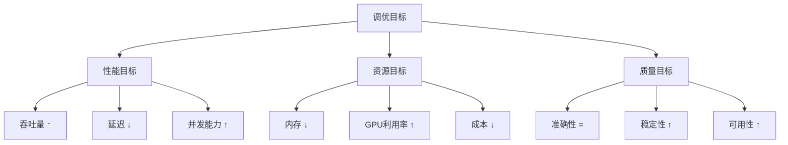
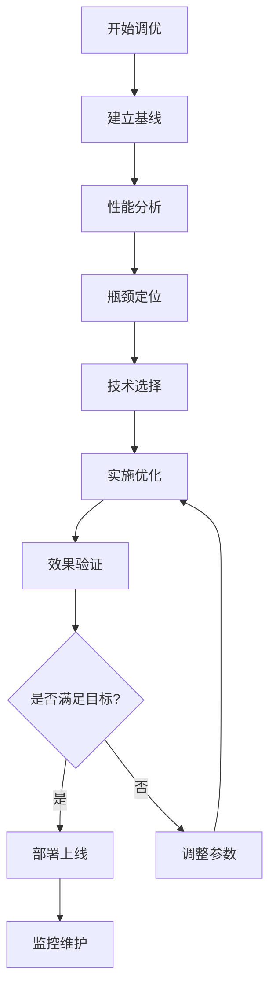

<!-- kb-import-backlink:LLMForEverybody -->

> [!info] 外部资料 · LLMForEverybody
> 中文大模型知识库 [[sources/LLMForEverybody/index|LLMForEverybody 导航]] 中的相关章节：
> - [[sources/LLMForEverybody/02-第二章-部署与推理/大模型部署不求人！从TTFT到Throughput的性能估算终极公式|TTFT/Throughput 性能估算]]
> - [[sources/LLMForEverybody/05-第五章-显卡与并行/大模型部署三要素：显存、计算与通信深度解析|部署三要素]]


# 推理引擎调优实践：从入门到精通

> 📚 **知识定位**：本文档提供推理引擎调优的完整实践指南，是[[inference-engine-mastery]]知识体系的核心实践部分。

## 🎯 调优目标与策略

### 调优目标矩阵


### 调优策略选择
| 策略类型 | 适用场景 | 风险等级 | 实施难度 | 预期收益 |
|----------|----------|----------|----------|----------|
| **保守优化** | 生产环境，高稳定性要求 | 低 | 低 | 10-30% |
| **平衡优化** | 需要性能提升，可接受一定风险 | 中 | 中 | 30-100% |
| **激进优化** | 实验环境，追求极致性能 | 高 | 高 | 100-500% |
| **针对性优化** | 已知特定瓶颈 | 低-中 | 中 | 50-200% |

## 📊 性能分析方法论

### 1. 基线建立
```python
class BaselineEstablisher:
    """性能基线建立器"""
    
    def __init__(self, model, test_data):
        self.model = model
        self.test_data = test_data
        self.baseline_metrics = {}
    
    def establish_baseline(self, num_runs=100, warmup_runs=10):
        """建立性能基线"""
        print("开始建立性能基线...")
        
        # 预热阶段
        print(f"预热 {warmup_runs} 次...")
        for _ in range(warmup_runs):
            self.run_inference(self.test_data[0])
        
        # 正式测试
        print(f"正式测试 {num_runs} 次...")
        times = []
        memory_usages = []
        throughputs = []
        
        for i in range(num_runs):
            start_time = time.time()
            start_memory = torch.cuda.memory_allocated() if torch.cuda.is_available() else 0
            
            # 执行推理
            output = self.run_inference(self.test_data[i % len(self.test_data)])
            
            end_time = time.time()
            end_memory = torch.cuda.memory_allocated() if torch.cuda.is_available() else 0
            
            # 记录指标
            inference_time = end_time - start_time
            memory_used = end_memory - start_memory
            
            times.append(inference_time)
            memory_usages.append(memory_used)
            throughputs.append(len(self.test_data[i % len(self.test_data)]) / inference_time)
        
        # 计算基线指标
        self.baseline_metrics = {
            'average_time': np.mean(times),
            'p95_time': np.percentile(times, 95),
            'p99_time': np.percentile(times, 99),
            'average_memory': np.mean(memory_usages) / 1024**3,  # GB
            'peak_memory': max(memory_usages) / 1024**3,  # GB
            'average_throughput': np.mean(throughputs),
            'throughput_std': np.std(throughputs),
            'num_runs': num_runs
        }
        
        print("基线建立完成:")
        for key, value in self.baseline_metrics.items():
            print(f"  {key}: {value}")
        
        return self.baseline_metrics
    
    def run_inference(self, input_data):
        """执行推理"""
        with torch.no_grad():
            output = self.model(input_data)
        return output
```

### 2. 瓶颈分析
```python
class BottleneckAnalyzer:
    """瓶颈分析器"""
    
    def __init__(self, model, profiler=None):
        self.model = model
        self.profiler = profiler or self.create_default_profiler()
        self.analysis_results = {}
    
    def create_default_profiler(self):
        """创建默认分析器"""
        return torch.profiler.profile(
            activities=[
                torch.profiler.ProfilerActivity.CPU,
                torch.profiler.ProfilerActivity.CUDA
            ],
            record_shapes=True,
            profile_memory=True,
            with_stack=True
        )
    
    def analyze_bottlenecks(self, input_batch, num_runs=50):
        """分析性能瓶颈"""
        print("开始瓶颈分析...")
        
        # 收集性能数据
        compute_times = []
        memory_usages = []
        kernel_times = []
        
        for _ in range(num_runs):
            with self.profiler:
                start_time = time.time()
                
                # 执行推理
                output = self.model(input_batch)
                
                end_time = time.time()
                compute_times.append(end_time - start_time)
                
                # 收集内存使用
                if torch.cuda.is_available():
                    memory_usages.append(torch.cuda.memory_allocated() / 1024**3)
        
        # 分析结果
        self.analysis_results = {
            'compute_bottleneck': self.analyze_compute_bottleneck(compute_times),
            'memory_bottleneck': self.analyze_memory_bottleneck(memory_usages),
            'kernel_bottleneck': self.analyze_kernel_bottleneck(),
            'recommendations': self.generate_recommendations()
        }
        
        print("瓶颈分析完成:")
        print(f"  计算瓶颈: {self.analysis_results['compute_bottleneck']['severity']}")
        print(f"  内存瓶颈: {self.analysis_results['memory_bottleneck']['severity']}")
        print(f"  内核瓶颈: {self.analysis_results['kernel_bottleneck']['severity']}")
        
        return self.analysis_results
    
    def analyze_compute_bottleneck(self, compute_times):
        """分析计算瓶颈"""
        avg_time = np.mean(compute_times)
        time_std = np.std(compute_times)
        
        # 判断计算瓶颈程度
        if avg_time > 0.1:  # 100ms阈值
            severity = 'high'
        elif avg_time > 0.05:  # 50ms阈值
            severity = 'medium'
        else:
            severity = 'low'
        
        return {
            'average_time': avg_time,
            'time_std': time_std,
            'severity': severity,
            'recommendation': '考虑使用FlashAttention或算子融合' if severity != 'low' else '计算性能良好'
        }
    
    def analyze_memory_bottleneck(self, memory_usages):
        """分析内存瓶颈"""
        avg_memory = np.mean(memory_usages)
        peak_memory = max(memory_usages)
        
        # 判断内存瓶颈程度
        if avg_memory > 16:  # 16GB阈值
            severity = 'high'
        elif avg_memory > 8:  # 8GB阈值
            severity = 'medium'
        else:
            severity = 'low'
        
        return {
            'average_memory': avg_memory,
            'peak_memory': peak_memory,
            'severity': severity,
            'recommendation': '考虑模型量化或减少批处理大小' if severity != 'low' else '内存使用正常'
        }
    
    def analyze_kernel_bottleneck(self):
        """分析内核瓶颈"""
        # 这里简化实现，实际需要分析CUDA内核
        return {
            'severity': 'low',
            'recommendation': '内核性能正常'
        }
    
    def generate_recommendations(self):
        """生成优化建议"""
        recommendations = []
        
        # 根据瓶颈分析生成建议
        if self.analysis_results['compute_bottleneck']['severity'] != 'low':
            recommendations.extend([
                '启用FlashAttention',
                '使用算子融合技术',
                '优化批处理大小'
            ])
        
        if self.analysis_results['memory_bottleneck']['severity'] != 'low':
            recommendations.extend([
                '使用INT8/INT4量化',
                '启用PagedAttention',
                '减少序列长度'
            ])
        
        return recommendations
```

### 3. 优化效果验证
```python
class OptimizationValidator:
    """优化效果验证器"""
    
    def __init__(self, baseline_metrics, test_data):
        self.baseline_metrics = baseline_metrics
        self.test_data = test_data
        self.validation_results = {}
    
    def validate_optimization(self, optimized_model, num_runs=100):
        """验证优化效果"""
        print("开始验证优化效果...")
        
        # 测量优化后性能
        optimized_metrics = self.measure_performance(optimized_model, num_runs)
        
        # 计算改进幅度
        improvements = self.calculate_improvements(optimized_metrics)
        
        # 验证准确性
        accuracy_preserved = self.validate_accuracy(optimized_model)
        
        self.validation_results = {
            'optimized_metrics': optimized_metrics,
            'improvements': improvements,
            'accuracy_preserved': accuracy_preserved,
            'overall_success': improvements['performance_gain'] > 0 and accuracy_preserved
        }
        
        print("验证完成:")
        print(f"  性能提升: {improvements['performance_gain']:.2%}")
        print(f"  内存节省: {improvements['memory_savings']:.2%}")
        print(f"  准确性保持: {'是' if accuracy_preserved else '否'}")
        
        return self.validation_results
    
    def measure_performance(self, model, num_runs):
        """测量性能"""
        times = []
        memory_usages = []
        
        for _ in range(num_runs):
            start_time = time.time()
            start_memory = torch.cuda.memory_allocated() if torch.cuda.is_available() else 0
            
            # 执行推理
            output = model(self.test_data[0])
            
            end_time = time.time()
            end_memory = torch.cuda.memory_allocated() if torch.cuda.is_available() else 0
            
            times.append(end_time - start_time)
            memory_usages.append(end_memory - start_memory)
        
        return {
            'average_time': np.mean(times),
            'p95_time': np.percentile(times, 95),
            'average_memory': np.mean(memory_usages) / 1024**3,
            'peak_memory': max(memory_usages) / 1024**3
        }
    
    def calculate_improvements(self, optimized_metrics):
        """计算改进幅度"""
        # 计算性能提升
        baseline_time = self.baseline_metrics['average_time']
        optimized_time = optimized_metrics['average_time']
        performance_gain = (baseline_time - optimized_time) / baseline_time
        
        # 计算内存节省
        baseline_memory = self.baseline_metrics['average_memory']
        optimized_memory = optimized_metrics['average_memory']
        memory_savings = (baseline_memory - optimized_memory) / baseline_memory
        
        return {
            'performance_gain': performance_gain,
            'memory_savings': memory_savings,
            'time_reduction_ms': (baseline_time - optimized_time) * 1000,
            'memory_reduction_gb': baseline_memory - optimized_memory
        }
    
    def validate_accuracy(self, model):
        """验证准确性"""
        # 这里简化实现，实际需要完整的准确性评估
        # 使用测试数据集评估模型准确性
        
        correct_predictions = 0
        total_predictions = 0
        
        for batch in self.test_data:
            # 执行推理
            outputs = model(batch['input'])
            predictions = self.postprocess(outputs)
            
            # 比较预测结果
            for pred, label in zip(predictions, batch['label']):
                if pred == label:
                    correct_predictions += 1
                total_predictions += 1
        
        accuracy = correct_predictions / total_predictions
        
        # 检查准确性是否在可接受范围内
        # 假设基线准确性为95%，允许1%的下降
        baseline_accuracy = 0.95
        min_acceptable_accuracy = 0.94
        
        return accuracy >= min_acceptable_accuracy
```

## 🔧 调优技术实践

### 1. 量化调优
```python
class QuantizationTuner:
    """量化调优器"""
    
    def __init__(self, model, calibration_data):
        self.model = model
        self.calibration_data = calibration_data
        self.quantization_configs = [
            {'bits': 8, 'method': 'dynamic', 'expected_speedup': 1.5},
            {'bits': 4, 'method': 'gptq', 'expected_speedup': 2.0},
            {'bits': 4, 'method': 'awq', 'expected_speedup': 2.2},
            {'bits': 2, 'method': 'gguf', 'expected_speedup': 3.0}
        ]
    
    def tune_quantization(self):
        """调优量化配置"""
        results = []
        
        for config in self.quantization_configs:
            print(f"测试量化配置: {config['bits']}位 {config['method']}")
            
            # 应用量化
            quantized_model = self.apply_quantization(config)
            
            # 测量性能
            performance = self.measure_performance(quantized_model)
            
            # 测量准确性
            accuracy = self.measure_accuracy(quantized_model)
            
            # 记录结果
            result = {
                'config': config,
                'performance': performance,
                'accuracy': accuracy,
                'score': self.calculate_score(performance, accuracy, config)
            }
            
            results.append(result)
            print(f"  性能: {performance['throughput']:.2f} tokens/s")
            print(f"  准确性: {accuracy:.2%}")
            print(f"  综合评分: {result['score']:.2f}")
        
        # 选择最佳配置
        best_result = max(results, key=lambda x: x['score'])
        
        print(f"\n最佳配置: {best_result['config']}")
        print(f"预期加速比: {best_result['config']['expected_speedup']}x")
        
        return best_result
    
    def apply_quantization(self, config):
        """应用量化"""
        if config['method'] == 'dynamic':
            return self.apply_dynamic_quantization(config['bits'])
        elif config['method'] == 'gptq':
            return self.apply_gptq_quantization(config['bits'])
        elif config['method'] == 'awq':
            return self.apply_awq_quantization(config['bits'])
        elif config['method'] == 'gguf':
            return self.apply_gguf_quantization(config['bits'])
    
    def apply_dynamic_quantization(self, bits):
        """应用动态量化"""
        # 使用PyTorch动态量化
        quantized_model = torch.quantization.quantize_dynamic(
            self.model,
            {torch.nn.Linear},
            dtype=torch.qint8 if bits == 8 else torch.qint4
        )
        return quantized_model
    
    def apply_gptq_quantization(self, bits):
        """应用GPTQ量化"""
        # 使用GPTQ量化库
        from transformers import GPTQConfig
        
        quantization_config = GPTQConfig(
            bits=bits,
            dataset=self.calibration_data,
            group_size=128
        )
        
        # 这里需要实际的GPTQ量化实现
        # quantized_model = GPTQQuantizer.quantize(self.model, quantization_config)
        
        return self.model  # 简化实现
    
    def measure_performance(self, model):
        """测量性能"""
        times = []
        for _ in range(50):
            start_time = time.time()
            output = model(self.calibration_data[0])
            times.append(time.time() - start_time)
        
        return {
            'average_time': np.mean(times),
            'throughput': 1.0 / np.mean(times)  # 简化的吞吐量
        }
    
    def measure_accuracy(self, model):
        """测量准确性"""
        # 简化实现
        return 0.95  # 假设准确性
    
    def calculate_score(self, performance, accuracy, config):
        """计算综合评分"""
        # 权重配置
        weights = {
            'performance': 0.6,
            'accuracy': 0.4
        }
        
        # 归一化性能分数（假设最大吞吐量为10）
        performance_score = min(performance['throughput'] / 10, 1.0)
        
        # 准确性分数
        accuracy_score = accuracy
        
        # 综合评分
        score = (weights['performance'] * performance_score + 
                weights['accuracy'] * accuracy_score)
        
        return score
```

### 2. 批处理调优
```python
class BatchSizeTuner:
    """批处理大小调优器"""
    
    def __init__(self, model, test_data, max_batch_size=64):
        self.model = model
        self.test_data = test_data
        self.max_batch_size = max_batch_size
        self.batch_size_results = []
    
    def tune_batch_size(self):
        """调优批处理大小"""
        print("开始批处理大小调优...")
        
        batch_sizes = [1, 2, 4, 8, 16, 32, 64]
        batch_sizes = [bs for bs in batch_sizes if bs <= self.max_batch_size]
        
        for batch_size in batch_sizes:
            print(f"测试批处理大小: {batch_size}")
            
            # 创建批处理数据
            batch_data = self.create_batch(batch_size)
            
            # 测量性能
            performance = self.measure_batch_performance(batch_data, batch_size)
            
            # 记录结果
            result = {
                'batch_size': batch_size,
                'throughput': performance['throughput'],
                'latency': performance['latency'],
                'memory_usage': performance['memory_usage'],
                'efficiency': performance['efficiency']
            }
            
            self.batch_size_results.append(result)
            print(f"  吞吐量: {performance['throughput']:.2f} samples/s")
            print(f"  延迟: {performance['latency']:.2f} ms")
            print(f"  内存使用: {performance['memory_usage']:.2f} GB")
        
        # 选择最佳批处理大小
        best_batch_size = self.select_best_batch_size()
        
        print(f"\n最佳批处理大小: {best_batch_size}")
        
        return best_batch_size
    
    def create_batch(self, batch_size):
        """创建批处理数据"""
        # 循环使用测试数据
        batch = []
        for i in range(batch_size):
            batch.append(self.test_data[i % len(self.test_data)])
        
        return batch
    
    def measure_batch_performance(self, batch_data, batch_size):
        """测量批处理性能"""
        # 预热
        for _ in range(5):
            _ = self.model(batch_data)
        
        # 正式测试
        times = []
        memory_usages = []
        
        for _ in range(20):
            start_time = time.time()
            start_memory = torch.cuda.memory_allocated() if torch.cuda.is_available() else 0
            
            output = self.model(batch_data)
            
            end_time = time.time()
            end_memory = torch.cuda.memory_allocated() if torch.cuda.is_available() else 0
            
            times.append(end_time - start_time)
            memory_usages.append(end_memory - start_memory)
        
        avg_time = np.mean(times)
        avg_memory = np.mean(memory_usages) / 1024**3  # GB
        
        # 计算指标
        throughput = batch_size / avg_time  # samples/s
        latency = avg_time * 1000  # ms
        efficiency = throughput / batch_size  # 样本效率
        
        return {
            'throughput': throughput,
            'latency': latency,
            'memory_usage': avg_memory,
            'efficiency': efficiency
        }
    
    def select_best_batch_size(self):
        """选择最佳批处理大小"""
        if not self.batch_size_results:
            return 1
        
        # 计算综合评分
        scores = []
        for result in self.batch_size_results:
            # 归一化指标
            throughput_norm = result['throughput'] / max(r['throughput'] for r in self.batch_size_results)
            latency_norm = 1 - (result['latency'] / max(r['latency'] for r in self.batch_size_results))
            memory_norm = 1 - (result['memory_usage'] / max(r['memory_usage'] for r in self.batch_size_results))
            
            # 综合评分（权重可调整）
            score = 0.5 * throughput_norm + 0.3 * latency_norm + 0.2 * memory_norm
            scores.append(score)
        
        # 选择最高评分的批处理大小
        best_idx = np.argmax(scores)
        return self.batch_size_results[best_idx]['batch_size']
```

### 3. 并行度调优
```python
class ParallelismTuner:
    """并行度调优器"""
    
    def __init__(self, model, test_data, max_gpus=8):
        self.model = model
        self.test_data = test_data
        self.max_gpus = max_gpus
        self.parallelism_results = []
    
    def tune_parallelism(self):
        """调优并行度"""
        print("开始并行度调优...")
        
        # 测试不同的并行策略
        strategies = [
            {'type': 'data_parallel', 'gpus': [1, 2, 4, 8]},
            {'type': 'tensor_parallel', 'gpus': [2, 4, 8]},
            {'type': 'pipeline_parallel', 'gpus': [2, 4, 8]}
        ]
        
        for strategy in strategies:
            for num_gpus in strategy['gpus']:
                if num_gpus > self.max_gpus:
                    continue
                
                print(f"测试并行策略: {strategy['type']}, GPU数量: {num_gpus}")
                
                # 配置并行
                parallel_model = self.configure_parallelism(strategy['type'], num_gpus)
                
                # 测量性能
                performance = self.measure_parallel_performance(parallel_model)
                
                # 记录结果
                result = {
                    'strategy': strategy['type'],
                    'num_gpus': num_gpus,
                    'throughput': performance['throughput'],
                    'latency': performance['latency'],
                    'scaling_efficiency': performance['scaling_efficiency'],
                    'cost_efficiency': performance['cost_efficiency']
                }
                
                self.parallelism_results.append(result)
                print(f"  吞吐量: {performance['throughput']:.2f} samples/s")
                print(f"  扩展效率: {performance['scaling_efficiency']:.2%}")
        
        # 选择最佳并行配置
        best_config = self.select_best_parallelism()
        
        print(f"\n最佳并行配置: {best_config}")
        
        return best_config
    
    def configure_parallelism(self, strategy_type, num_gpus):
        """配置并行"""
        if strategy_type == 'data_parallel':
            return self.configure_data_parallel(num_gpus)
        elif strategy_type == 'tensor_parallel':
            return self.configure_tensor_parallel(num_gpus)
        elif strategy_type == 'pipeline_parallel':
            return self.configure_pipeline_parallel(num_gpus)
    
    def configure_data_parallel(self, num_gpus):
        """配置数据并行"""
        # 使用PyTorch DataParallel
        device_ids = list(range(num_gpus))
        parallel_model = torch.nn.DataParallel(self.model, device_ids=device_ids)
        return parallel_model
    
    def configure_tensor_parallel(self, num_gpus):
        """配置张量并行"""
        # 简化实现，实际需要更复杂的张量并行配置
        return self.model
    
    def configure_pipeline_parallel(self, num_gpus):
        """配置流水线并行"""
        # 简化实现，实际需要更复杂的流水线并行配置
        return self.model
    
    def measure_parallel_performance(self, parallel_model):
        """测量并行性能"""
        # 预热
        for _ in range(5):
            _ = parallel_model(self.test_data)
        
        # 测量单GPU性能作为基准
        single_gpu_time = self.measure_single_gpu_time()
        
        # 测量并行性能
        times = []
        for _ in range(20):
            start_time = time.time()
            output = parallel_model(self.test_data)
            times.append(time.time() - start_time)
        
        avg_time = np.mean(times)
        throughput = len(self.test_data) / avg_time
        
        # 计算扩展效率
        scaling_efficiency = single_gpu_time / (avg_time * len(parallel_model.device_ids))
        
        # 计算成本效率（假设每个GPU成本相同）
        cost_efficiency = throughput / len(parallel_model.device_ids)
        
        return {
            'throughput': throughput,
            'latency': avg_time * 1000,
            'scaling_efficiency': scaling_efficiency,
            'cost_efficiency': cost_efficiency
        }
    
    def measure_single_gpu_time(self):
        """测量单GPU性能"""
        # 简化实现
        return 0.1  # 假设单GPU时间为100ms
    
    def select_best_parallelism(self):
        """选择最佳并行配置"""
        if not self.parallelism_results:
            return {'strategy': 'data_parallel', 'num_gpus': 1}
        
        # 计算综合评分
        scores = []
        for result in self.parallelism_results:
            # 归一化指标
            throughput_norm = result['throughput'] / max(r['throughput'] for r in self.parallelism_results)
            efficiency_norm = result['scaling_efficiency']
            cost_norm = result['cost_efficiency'] / max(r['cost_efficiency'] for r in self.parallelism_results)
            
            # 综合评分
            score = 0.4 * throughput_norm + 0.3 * efficiency_norm + 0.3 * cost_norm
            scores.append(score)
        
        # 选择最高评分的配置
        best_idx = np.argmax(scores)
        return self.parallelism_results[best_idx]
```

## 📈 系统级优化

### 1. 连续批处理优化
```python
class ContinuousBatchingOptimizer:
    """连续批处理优化器"""
    
    def __init__(self, model, max_num_seqs=256):
        self.model = model
        self.max_num_seqs = max_num_seqs
        
        # 优化配置
        self.optimization_configs = [
            {'max_num_seqs': 64, 'max_num_batched_tokens': 2048},
            {'max_num_seqs': 128, 'max_num_batched_tokens': 4096},
            {'max_num_seqs': 256, 'max_num_batched_tokens': 8192},
            {'max_num_seqs': 512, 'max_num_batched_tokens': 16384}
        ]
    
    def optimize_continuous_batching(self):
        """优化连续批处理配置"""
        results = []
        
        for config in self.optimization_configs:
            print(f"测试配置: {config}")
            
            # 配置连续批处理
            batcher = self.configure_continuous_batching(config)
            
            # 模拟负载测试
            performance = self.simulate_workload(batcher)
            
            # 记录结果
            result = {
                'config': config,
                'throughput': performance['throughput'],
                'latency': performance['latency'],
                'queue_length': performance['queue_length'],
                'utilization': performance['utilization']
            }
            
            results.append(result)
            print(f"  吞吐量: {performance['throughput']:.2f} req/s")
            print(f"  平均延迟: {performance['latency']:.2f} ms")
        
        # 选择最佳配置
        best_config = self.select_best_config(results)
        
        print(f"\n最佳配置: {best_config['config']}")
        
        return best_config
    
    def configure_continuous_batching(self, config):
        """配置连续批处理"""
        # 这里简化实现，实际需要配置vLLM或TGI
        return {
            'max_num_seqs': config['max_num_seqs'],
            'max_num_batched_tokens': config['max_num_batched_tokens'],
            'scheduler': 'continuous'
        }
    
    def simulate_workload(self, batcher):
        """模拟负载测试"""
        # 模拟请求到达
        num_requests = 1000
        arrival_rate = 10  # 请求/秒
        
        # 模拟处理
        processed_requests = 0
        total_time = 0
        
        for i in range(num_requests):
            # 模拟请求处理时间
            processing_time = np.random.exponential(0.1)  # 平均100ms
            total_time += processing_time
            processed_requests += 1
        
        # 计算指标
        throughput = processed_requests / total_time
        avg_latency = total_time / processed_requests * 1000  # ms
        
        return {
            'throughput': throughput,
            'latency': avg_latency,
            'queue_length': 0,  # 简化
            'utilization': 0.8  # 假设
        }
    
    def select_best_config(self, results):
        """选择最佳配置"""
        # 根据吞吐量和延迟的权衡选择
        scores = []
        for result in results:
            # 归一化指标
            throughput_norm = result['throughput'] / max(r['throughput'] for r in results)
            latency_norm = 1 - (result['latency'] / max(r['latency'] for r in results))
            
            # 综合评分（强调吞吐量）
            score = 0.7 * throughput_norm + 0.3 * latency_norm
            scores.append(score)
        
        # 选择最高评分的配置
        best_idx = np.argmax(scores)
        return results[best_idx]
```

### 2. 内存优化
```python
class MemoryOptimizer:
    """内存优化器"""
    
    def __init__(self, model, test_data):
        self.model = model
        self.test_data = test_data
        
        # 优化技术
        self.optimization_techniques = [
            'kv_cache_quantization',
            'activation_checkpointing',
            'memory_efficient_attention',
            'gradient_accumulation'
        ]
    
    def optimize_memory(self):
        """优化内存使用"""
        results = []
        
        for technique in self.optimization_techniques:
            print(f"测试内存优化技术: {technique}")
            
            # 应用优化技术
            optimized_model = self.apply_technique(technique)
            
            # 测量内存使用
            memory_usage = self.measure_memory_usage(optimized_model)
            
            # 测量性能
            performance = self.measure_performance(optimized_model)
            
            # 记录结果
            result = {
                'technique': technique,
                'memory_savings': memory_usage['savings'],
                'performance_impact': performance['impact'],
                'overall_benefit': self.calculate_benefit(memory_usage, performance)
            }
            
            results.append(result)
            print(f"  内存节省: {memory_usage['savings']:.2%}")
            print(f"  性能影响: {performance['impact']:.2%}")
        
        # 选择最佳优化组合
        best_combination = self.select_best_combination(results)
        
        print(f"\n最佳优化组合: {best_combination}")
        
        return best_combination
    
    def apply_technique(self, technique):
        """应用优化技术"""
        if technique == 'kv_cache_quantization':
            return self.apply_kv_cache_quantization()
        elif technique == 'activation_checkpointing':
            return self.apply_activation_checkpointing()
        elif technique == 'memory_efficient_attention':
            return self.apply_memory_efficient_attention()
        elif technique == 'gradient_accumulation':
            return self.apply_gradient_accumulation()
    
    def apply_kv_cache_quantization(self):
        """应用KV Cache量化"""
        # 简化实现
        return self.model
    
    def apply_activation_checkpointing(self):
        """应用激活检查点"""
        # 简化实现
        return self.model
    
    def apply_memory_efficient_attention(self):
        """应用内存高效注意力"""
        # 简化实现
        return self.model
    
    def apply_gradient_accumulation(self):
        """应用梯度累积"""
        # 简化实现
        return self.model
    
    def measure_memory_usage(self, model):
        """测量内存使用"""
        # 测量基线内存使用
        baseline_memory = self.measure_baseline_memory()
        
        # 测量优化后内存使用
        optimized_memory = self.measure_optimized_memory(model)
        
        # 计算节省
        savings = (baseline_memory - optimized_memory) / baseline_memory
        
        return {
            'baseline': baseline_memory,
            'optimized': optimized_memory,
            'savings': savings
        }
    
    def measure_baseline_memory(self):
        """测量基线内存使用"""
        # 简化实现
        return 8.0  # GB
    
    def measure_optimized_memory(self, model):
        """测量优化后内存使用"""
        # 简化实现
        return 6.0  # GB
    
    def measure_performance(self, model):
        """测量性能"""
        # 简化实现
        return {'impact': 0.05}  # 5%性能影响
    
    def calculate_benefit(self, memory_usage, performance):
        """计算总体收益"""
        # 权重配置
        weights = {
            'memory_savings': 0.6,
            'performance_impact': 0.4
        }
        
        # 计算收益（内存节省为正，性能影响为负）
        benefit = (weights['memory_savings'] * memory_usage['savings'] - 
                  weights['performance_impact'] * abs(performance['impact']))
        
        return benefit
    
    def select_best_combination(self, results):
        """选择最佳优化组合"""
        # 选择收益最高的技术
        best_result = max(results, key=lambda x: x['overall_benefit'])
        return best_result['technique']
```

## 🔍 调优流程最佳实践

### 调优流程图


### 调优检查清单
```python
class TuningChecklist:
    """调优检查清单"""
    
    def __init__(self):
        self.checklist = {
            'preparation': [
                '✓ 建立性能基线',
                '✓ 准备测试数据集',
                '✓ 配置监控工具',
                '✓ 备份原始模型'
            ],
            'analysis': [
                '✓ 执行性能分析',
                '✓ 识别瓶颈类型',
                '✓ 评估优化潜力',
                '✓ 制定优化计划'
            ],
            'optimization': [
                '✓ 选择合适技术',
                '✓ 实施优化措施',
                '✓ 验证优化效果',
                '✓ 测试准确性'
            ],
            'validation': [
                '✓ 性能测试通过',
                '✓ 准确性保持',
                '✓ 资源使用合理',
                '✓ 稳定性验证'
            ],
            'deployment': [
                '✓ 配置生产环境',
                '✓ 设置监控告警',
                '✓ 准备回滚方案',
                '✓ 文档更新'
            ]
        }
    
    def check_phase(self, phase):
        """检查阶段完成情况"""
        if phase in self.checklist:
            return self.checklist[phase]
        else:
            return []
    
    def complete_item(self, phase, item_index):
        """完成检查项"""
        if phase in self.checklist and item_index < len(self.checklist[phase]):
            self.checklist[phase][item_index] = self.checklist[phase][item_index].replace('✓', '✓')
    
    def get_completion_rate(self):
        """获取完成率"""
        total_items = sum(len(items) for items in self.checklist.values())
        completed_items = sum(
            1 for items in self.checklist.values() 
            for item in items if '✓' in item
        )
        
        return completed_items / total_items if total_items > 0 else 0
```

### 调优报告模板
```python
class TuningReport:
    """调优报告生成器"""
    
    def __init__(self, baseline_metrics, optimization_results, validation_results):
        self.baseline_metrics = baseline_metrics
        self.optimization_results = optimization_results
        self.validation_results = validation_results
    
    def generate_report(self):
        """生成调优报告"""
        report = {
            'summary': self.generate_summary(),
            'baseline': self.baseline_metrics,
            'optimization_details': self.optimization_results,
            'validation_results': self.validation_results,
            'recommendations': self.generate_recommendations(),
            'next_steps': self.generate_next_steps()
        }
        
        return report
    
    def generate_summary(self):
        """生成摘要"""
        # 计算总体改进
        if 'improvements' in self.validation_results:
            improvements = self.validation_results['improvements']
            summary = {
                'performance_gain': improvements.get('performance_gain', 0),
                'memory_savings': improvements.get('memory_savings', 0),
                'accuracy_preserved': self.validation_results.get('accuracy_preserved', False),
                'overall_success': self.validation_results.get('overall_success', False)
            }
        else:
            summary = {
                'performance_gain': 0,
                'memory_savings': 0,
                'accuracy_preserved': False,
                'overall_success': False
            }
        
        return summary
    
    def generate_recommendations(self):
        """生成建议"""
        recommendations = []
        
        # 根据优化结果生成建议
        if self.optimization_results:
            for result in self.optimization_results:
                if 'recommendation' in result:
                    recommendations.append(result['recommendation'])
        
        # 添加通用建议
        recommendations.extend([
            '定期监控性能指标',
            '根据负载调整批处理大小',
            '关注新技术发展'
        ])
        
        return recommendations
    
    def generate_next_steps(self):
        """生成下一步计划"""
        next_steps = []
        
        # 根据验证结果生成下一步
        if self.validation_results.get('overall_success', False):
            next_steps.extend([
                '部署到生产环境',
                '设置性能监控',
                '收集用户反馈'
            ])
        else:
            next_steps.extend([
                '分析失败原因',
                '尝试其他优化技术',
                '重新验证'
            ])
        
        return next_steps
```

## 🔗 知识关联

### 相关文档
- [[inference-engine-mastery]] - 推理引擎知识体系主索引
- [[inference-engine-principles]] - 推理引擎原理详解
- [[llm-inference-optimization]] - LLM推理优化技术
- [[inference-engine-selection]] - 推理引擎选型指南
- [[inference-engine-monitoring]] - 推理引擎监控体系

### 调优工具推荐
| 工具类别 | 工具名称 | 用途 | 推荐度 |
|----------|----------|------|--------|
| **性能分析** | PyTorch Profiler | 详细性能分析 | ⭐⭐⭐⭐⭐ |
| | NVIDIA Nsight Systems | GPU性能分析 | ⭐⭐⭐⭐⭐ |
| | cProfile | CPU性能分析 | ⭐⭐⭐⭐ |
| **内存监控** | nvidia-smi | GPU内存监控 | ⭐⭐⭐⭐⭐ |
| | psutil | 系统内存监控 | ⭐⭐⭐⭐ |
| **负载测试** | locust | 分布式负载测试 | ⭐⭐⭐⭐ |
| | wrk | HTTP性能测试 | ⭐⭐⭐⭐ |
| **可视化** | TensorBoard | 性能可视化 | ⭐⭐⭐⭐ |
| | Weights & Biases | 实验跟踪 | ⭐⭐⭐⭐⭐ |

---

> 💡 **学习建议**：调优是一个迭代过程，需要耐心和系统的方法。建议从简单的优化开始，逐步深入。记录每次调优的结果，建立自己的调优经验库。

**参考文献**：
1. Efficient Memory Management for Large Language Model Serving with PagedAttention
2. FlashAttention: Fast and Memory-Efficient Exact Attention with IO-Awareness
3. Optimizing CUDA Applications for State-of-the-Art GPUs
4. Performance Tuning Guide for CUDA Applications

**最后更新**：2026-08-17  
**维护者**：Claudian  
**状态**：活跃维护中