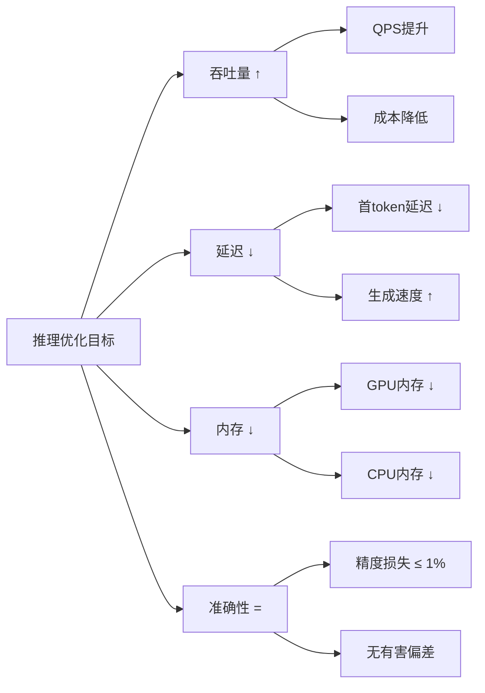
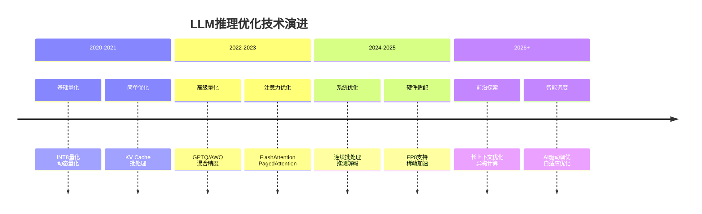

# LLM 推理优化

> 📚 **知识定位**：本文档详细讲解LLM推理优化的核心技术、原理和实践，是[[inference-engine-mastery]]知识体系的重要组成部分。

## 🎯 优化目标与权衡

### 核心优化目标


### 优化权衡矩阵
| 优化技术 | 吞吐量提升 | 延迟改善 | 内存节省 | 准确性影响 | 实现复杂度 |
|----------|------------|----------|----------|------------|------------|
| **INT4量化** | 2-3x | 1.5-2x | 75% | -1% ~ -3% | 低 |
| **INT8量化** | 1.5-2x | 1.2-1.5x | 50% | -0.5% ~ -1% | 低 |
| **FlashAttention** | 1.2-1.5x | 2-4x | 20-30% | 无 | 中 |
| **PagedAttention** | 2-4x | 1.1-1.3x | 40-60% | 无 | 高 |
| **连续批处理** | 3-10x | 1.2-1.5x | 10-20% | 无 | 中 |
| **推测解码** | 2-3x | 2-3x | 10-20% | 无 | 高 |
| **张量并行** | 线性扩展 | 1.2-1.5x | 1/N | 无 | 高 |

## 📚 问题定义与瓶颈分析

### Transformer 推理瓶颈
```python
# 自回归生成的计算复杂度
def autoregressive_generation(model, prompt, max_length):
    """
    传统推理流程：每步都重新计算所有token的K、V
    时间复杂度：O(n² × d)  # n: 序列长度, d: 模型维度
    空间复杂度：O(n × d)   # KV Cache存储
    """
    tokens = tokenize(prompt)
    
    for step in range(max_length):
        # 每步都重新计算所有历史token的K、V（低效！）
        kv_cache = compute_kv_cache(model, tokens)  # O(step × d)
        
        # 只使用最后一个token的输出生成下一个token
        next_token = generate_next_token(model, tokens, kv_cache)
        tokens.append(next_token)
    
    return tokens
```

### 瓶颈量化分析
```python
# 瓶颈分析脚本
def analyze_bottlenecks(model, input_batch, device='cuda'):
    """分析推理瓶颈"""
    import torch
    import time
    
    results = {}
    
    # 1. 计算时间分析
    start = time.time()
    with torch.no_grad():
        output = model(input_batch)
    compute_time = time.time() - start
    results['compute_time'] = compute_time
    
    # 2. 内存使用分析
    if device == 'cuda':
        results['gpu_memory_used'] = torch.cuda.memory_allocated() / 1024**3  # GB
        results['gpu_memory_cached'] = torch.cuda.memory_reserved() / 1024**3
    
    # 3. KV Cache大小估算
    batch_size, seq_len = input_batch.shape
    num_layers = model.config.num_hidden_layers
    num_heads = model.config.num_attention_heads
    head_dim = model.config.hidden_dim // num_heads
    
    kv_cache_size = 2 * num_layers * num_heads * head_dim * seq_len * batch_size * 4  # 4字节/FP32
    results['kv_cache_size_gb'] = kv_cache_size / 1024**3
    
    return results
```

## 🔧 优化技术详解

### 1. 模型量化技术

#### 量化原理与分类
```python
import torch
import numpy as np

class QuantizationManager:
    """量化管理器：支持多种量化方法"""
    
    def __init__(self, method='symmetric', bits=8):
        self.method = method
        self.bits = bits
        self.q_min = -2**(bits-1) + 1 if method == 'symmetric' else 0
        self.q_max = 2**(bits-1) - 1 if method == 'symmetric' else 2**bits - 1
    
    def quantize_symmetric(self, tensor):
        """对称量化：将值映射到[-127, 127]范围"""
        abs_max = torch.max(torch.abs(tensor))
        scale = abs_max / self.q_max
        
        quantized = torch.round(tensor / scale)
        quantized = torch.clamp(quantized, self.q_min, self.q_max).to(torch.int8)
        
        return quantized, scale
    
    def quantize_asymmetric(self, tensor):
        """非对称量化：将值映射到[0, 255]范围"""
        t_min, t_max = torch.min(tensor), torch.max(tensor)
        scale = (t_max - t_min) / (self.q_max - self.q_min)
        zero_point = torch.round(self.q_min - t_min / scale)
        zero_point = torch.clamp(zero_point, self.q_min, self.q_max)
        
        quantized = torch.round(tensor / scale + zero_point)
        quantized = torch.clamp(quantized, self.q_min, self.q_max).to(torch.uint8)
        
        return quantized, scale, zero_point
    
    def dequantize_symmetric(self, quantized, scale):
        """对称反量化"""
        return quantized.float() * scale
    
    def calculate_quantization_error(self, original, quantized, scale):
        """计算量化误差"""
        reconstructed = self.dequantize_symmetric(quantized, scale)
        mse = torch.mean((original - reconstructed) ** 2)
        relative_error = mse / torch.mean(original ** 2)
        
        return {
            'mse': mse.item(),
            'relative_error': relative_error.item(),
            'snr': 10 * torch.log10(torch.mean(original ** 2) / mse).item()  # 信噪比
        }
```

#### 主流量化方法对比
```python
class GPTQQuantizer:
    """GPTQ量化：基于二阶信息的权重量化"""
    
    def __init__(self, model, tokenizer, bits=4, group_size=128):
        self.model = model
        self.tokenizer = tokenizer
        self.bits = bits
        self.group_size = group_size
        self.hessian_inv = None
    
    def compute_hessian_inverse(self, calibration_data):
        """计算Hessian矩阵的逆（二阶导数信息）"""
        # 使用Fisher信息矩阵近似Hessian
        hessian = torch.zeros_like(self.get_model_params())
        
        for batch in calibration_data:
            outputs = self.model(batch, labels=batch)
            loss = outputs.loss
            
            # 计算梯度
            gradients = torch.autograd.grad(loss, self.model.parameters())
            
            # 累加Hessian近似
            for i, grad in enumerate(gradients):
                hessian[i] += grad.data.view(-1) ** 2
        
        # 添加正则化避免奇异
        hessian_inv = 1.0 / (hessian + 1e-6)
        
        return hessian_inv
    
    def quantize_layer_optimal(self, weight, hessian_inv_row):
        """使用二阶信息优化量化"""
        # 按组量化
        num_groups = weight.numel() // self.group_size
        quantized_weight = torch.zeros_like(weight)
        
        for g in range(num_groups):
            start_idx = g * self.group_size
            end_idx = start_idx + self.group_size
            
            group_weight = weight.view(-1)[start_idx:end_idx]
            group_hessian = hessian_inv_row[start_idx:end_idx]
            
            # 计算最优量化参数
            abs_max = torch.max(torch.abs(group_weight))
            scale = abs_max / (2**(self.bits-1) - 1)
            
            # 量化并补偿误差
            quantized_group = torch.round(group_weight / scale)
            error = group_weight - quantized_group * scale
            
            # 使用Hessian信息补偿误差
            compensation = error * group_hessian / (group_hessian.sum() + 1e-6)
            quantized_weight.view(-1)[start_idx:end_idx] = quantized_group + compensation
        
        return quantized_weight, scale
    
    def quantize_model(self):
        """量化整个模型"""
        quantized_model = {}
        
        for name, param in self.model.named_parameters():
            if 'weight' in name:
                # 获取对应的Hessian信息
                hessian_row = self.hessian_inv[self.get_param_index(name)]
                
                # 优化量化
                quantized_param, scale = self.quantize_layer_optimal(
                    param.data, hessian_row
                )
                
                quantized_model[name] = {
                    'weight': quantized_param,
                    'scale': scale,
                    'bits': self.bits
                }
        
        return quantized_model
```

### 2. KV Cache 优化技术

#### PagedAttention原理与实现
```python
class PagedAttentionManager:
    """分页注意力管理器：类似OS虚拟内存"""
    
    def __init__(self, block_size=16, num_blocks=1000):
        self.block_size = block_size
        self.num_blocks = num_blocks
        
        # 内存管理
        self.free_blocks = list(range(num_blocks))
        self.block_table = {}  # 逻辑块 -> 物理块映射
        self.KV_cache = {}     # 物理块 -> KV数据
        
        # 监控统计
        self.stats = {
            'allocations': 0,
            'deallocations': 0,
            'fragmentation': 0,
            'cache_hits': 0,
            'cache_misses': 0
        }
    
    def allocate_block(self, sequence_id):
        """为序列分配新的KV缓存块"""
        if not self.free_blocks:
            # 内存不足，触发回收
            self.evict_blocks()
            
            if not self.free_blocks:
                raise ValueError("内存不足，无法分配新块")
        
        # 分配物理块
        physical_block = self.free_blocks.pop()
        
        # 更新块表
        if sequence_id not in self.block_table:
            self.block_table[sequence_id] = []
        
        self.block_table[sequence_id].append(physical_block)
        
        # 初始化KV缓存
        self.KV_cache[physical_block] = {
            'key': torch.zeros(self.block_size, self.n_heads, self.head_dim),
            'value': torch.zeros(self.block_size, self.n_heads, self.head_dim),
            'valid_count': 0
        }
        
        self.stats['allocations'] += 1
        
        return physical_block
    
    def add_token_kv(self, sequence_id, token_pos, key, value):
        """添加新的token的KV到缓存"""
        # 计算逻辑块位置
        logical_block = token_pos // self.block_size
        offset = token_pos % self.block_size
        
        # 如果需要新块
        if logical_block >= len(self.block_table[sequence_id]):
            self.allocate_block(sequence_id)
        
        # 获取物理块
        physical_block = self.block_table[sequence_id][logical_block]
        
        # 写入KV缓存
        self.KV_cache[physical_block]['key'][offset] = key
        self.KV_cache[physical_block]['value'][offset] = value
        self.KV_cache[physical_block]['valid_count'] += 1
        
        return physical_block
    
    def get_kv_cache(self, sequence_id, positions):
        """获取指定位置的KV缓存"""
        kv_data = {'key': [], 'value': []}
        
        for pos in positions:
            logical_block = pos // self.block_size
            offset = pos % self.block_size
            
            if logical_block < len(self.block_table[sequence_id]):
                physical_block = self.block_table[sequence_id][logical_block]
                
                kv_data['key'].append(self.KV_cache[physical_block]['key'][offset])
                kv_data['value'].append(self.KV_cache[physical_block]['value'][offset])
                
                self.stats['cache_hits'] += 1
            else:
                self.stats['cache_misses'] += 1
        
        return torch.stack(kv_data['key']), torch.stack(kv_data['value'])
    
    def evict_blocks(self):
        """内存不足时回收块（LRU策略）"""
        # 简化实现：回收最旧的块
        # 实际应用中需要更复杂的策略（LRU、LFU等）
        
        # 找到最旧的序列
        oldest_sequence = min(self.block_table.keys(), 
                            key=lambda x: len(self.block_table[x]))
        
        # 回收最后一个块
        if self.block_table[oldest_sequence]:
            block_to_free = self.block_table[oldest_sequence].pop()
            self.free_blocks.append(block_to_free)
            
            # 清理缓存
            if block_to_free in self.KV_cache:
                del self.KV_cache[block_to_free]
            
            self.stats['deallocations'] += 1
```

#### KV Cache量化技术
```python
class KVCacheQuantizer:
    """KV Cache量化：减少内存占用"""
    
    def __init__(self, bits=8, dynamic_range=True):
        self.bits = bits
        self.dynamic_range = dynamic_range
        self.q_min = 0 if bits == 8 else -128
        self.q_max = 255 if bits == 8 else 127
    
    def quantize_kv_cache(self, key_cache, value_cache):
        """量化KV Cache"""
        quantized_key = self._quantize_tensor(key_cache)
        quantized_value = self._quantize_tensor(value_cache)
        
        return {
            'key': quantized_key['tensor'],
            'key_scale': quantized_key['scale'],
            'value': quantized_value['tensor'],
            'value_scale': quantized_value['scale']
        }
    
    def _quantize_tensor(self, tensor):
        """量化单个张量"""
        if self.dynamic_range:
            # 动态范围量化：每层、每头独立量化
            t_min, t_max = tensor.min(), tensor.max()
            scale = (t_max - t_min) / (self.q_max - self.q_min)
            zero_point = torch.round(self.q_min - t_min / scale)
        else:
            # 静态范围量化：使用预设范围
            scale = torch.max(torch.abs(tensor)) / self.q_max
            zero_point = 0
        
        # 量化
        quantized = torch.round(tensor / scale + zero_point)
        quantized = torch.clamp(quantized, self.q_min, self.q_max)
        
        return {
            'tensor': quantized.to(torch.int8 if self.bits == 8 else torch.uint8),
            'scale': scale,
            'zero_point': zero_point
        }
    
    def dequantize_kv_cache(self, quantized_cache):
        """反量化KV Cache用于计算"""
        key = self._dequantize_tensor(
            quantized_cache['key'], 
            quantized_cache['key_scale']
        )
        value = self._dequantize_tensor(
            quantized_cache['value'], 
            quantized_cache['value_scale']
        )
        
        return key, value
    
    def _dequantize_tensor(self, quantized, scale):
        """反量化单个张量"""
        return (quantized.float() - quantized.float().mean()) * scale
    
    def calculate_memory_savings(self, original_shape):
        """计算内存节省"""
        original_bytes = torch.prod(torch.tensor(original_shape)) * 4  # FP32
        quantized_bytes = torch.prod(torch.tensor(original_shape)) * (self.bits / 8)
        
        savings = 1 - (quantized_bytes / original_bytes)
        
        return {
            'original_mb': original_bytes / 1024**2,
            'quantized_mb': quantized_bytes / 1024**2,
            'savings_percent': savings * 100
        }
```

### 3. 计算优化技术

#### FlashAttention实现
```python
import torch
import triton

@triton.jit
def flash_attention_forward_kernel(
    Q, K, V, output,
    scale, seqlen, head_dim,
    BLOCK_SIZE: tl.constexpr
):
    """FlashAttention的Triton kernel实现"""
    # 分块计算，减少HBM读写
    row_idx = tl.program_id(0)
    col_idx = tl.program_id(1)
    
    # 计算当前块的Q
    q_offset = row_idx * seqlen * head_dim + col_idx * BLOCK_SIZE * head_dim
    q_block = tl.load(Q + q_offset + tl.arange(0, BLOCK_SIZE)[:, None] * head_dim + 
                      tl.arange(0, head_dim)[None, :])
    
    # 在线softmax计算
    max_val = -float('inf')
    sum_exp = 0.0
    
    # 遍历所有K块
    for k_start in range(0, seqlen, BLOCK_SIZE):
        # 加载K块
        k_offset = k_start * head_dim
        k_block = tl.load(K + k_offset + tl.arange(0, BLOCK_SIZE)[:, None] * head_dim + 
                          tl.arange(0, head_dim)[None, :])
        
        # 计算注意力分数
        qk = tl.dot(q_block, tl.trans(k_block)) * scale
        
        # 在线softmax更新
        block_max = tl.max(qk, axis=1)
        new_max = tl.maximum(max_val, block_max)
        
        # 更新exp和sum
        exp_corrected = tl.exp(qk - new_max)
        sum_exp = sum_exp * tl.exp(max_val - new_max) + tl.sum(exp_corrected, axis=1)
        max_val = new_max
        
        # 加载V块并累加
        v_block = tl.load(V + k_offset + tl.arange(0, BLOCK_SIZE)[:, None] * head_dim + 
                          tl.arange(0, head_dim)[None, :])
        
        output_block = tl.dot(exp_corrected, v_block)
        
        # 存储结果
        out_offset = row_idx * seqlen * head_dim + col_idx * BLOCK_SIZE * head_dim
        tl.store(output + out_offset + tl.arange(0, BLOCK_SIZE)[:, None] * head_dim + 
                tl.arange(0, head_dim)[None, :], output_block / sum_exp)

def flash_attention_forward(Q, K, V, causal=False):
    """Flash Attention前向传播"""
    batch, seqlen, nheads, headdim = Q.shape
    
    # 初始化输出
    output = torch.zeros_like(Q)
    scale = 1.0 / (headdim ** 0.5)
    
    # 调用Triton kernel
    BLOCK_SIZE = 128
    grid = (batch * nheads, seqlen // BLOCK_SIZE)
    
    flash_attention_forward_kernel[grid](
        Q, K, V, output,
        scale, seqlen, headdim,
        BLOCK_SIZE=BLOCK_SIZE
    )
    
    return output
```

#### 算子融合技术
```python
class OperatorFusion:
    """算子融合：减少内核启动开销"""
    
    @staticmethod
    def fuse_linear_relu(linear_weight, linear_bias, input_tensor):
        """融合Linear + ReLU操作"""
        # 传统方式：两次内核启动
        # linear_out = torch.nn.functional.linear(input_tensor, linear_weight, linear_bias)
        # relu_out = torch.relu(linear_out)
        
        # 融合方式：一次内核启动
        # 计算linear，立即应用ReLU
        output = torch.zeros_like(input_tensor)
        
        # 融合的CUDA kernel（伪代码）
        # __global__ void fused_linear_relu_kernel(...) {
        #     float val = dot(input, weight) + bias;
        #     output = val > 0 ? val : 0;  // ReLU
        # }
        
        return output
    
    @staticmethod
    def fuse_layer_norm_residual(layer_norm_weight, layer_norm_bias, 
                               residual_weight, residual_bias, input_tensor):
        """融合LayerNorm + 残差连接"""
        # 计算LayerNorm
        mean = torch.mean(input_tensor, dim=-1, keepdim=True)
        var = torch.var(input_tensor, dim=-1, keepdim=True)
        normalized = (input_tensor - mean) / torch.sqrt(var + 1e-5)
        
        # 应用LayerNorm参数
        ln_out = normalized * layer_norm_weight + layer_norm_bias
        
        # 残差连接
        output = ln_out + input_tensor
        
        return output
    
    @staticmethod
    def fuse_attention_projection(attn_weight, attn_bias, 
                                 proj_weight, proj_bias, input_tensor):
        """融合注意力计算和投影"""
        # 注意力计算
        batch, seq_len, hidden_dim = input_tensor.shape
        
        # QKV投影（融合）
        qkv = torch.nn.functional.linear(input_tensor, attn_weight, attn_bias)
        q, k, v = qkv.chunk(3, dim=-1)
        
        # 注意力计算
        attn_scores = torch.matmul(q, k.transpose(-2, -1)) / (hidden_dim ** 0.5)
        attn_probs = torch.softmax(attn_scores, dim=-1)
        attn_output = torch.matmul(attn_probs, v)
        
        # 输出投影（融合）
        output = torch.nn.functional.linear(attn_output, proj_weight, proj_bias)
        
        return output
```

### 4. 批处理优化技术

#### 动态批处理实现
```python
import asyncio
from collections import deque
import time

class DynamicBatcher:
    """动态批处理管理器"""
    
    def __init__(self, model, max_batch_size=32, max_wait_time=0.1):
        self.model = model
        self.max_batch_size = max_batch_size
        self.max_wait_time = max_wait_time
        
        self.pending_queue = deque()
        self.processing_batch = None
        self.batch_lock = asyncio.Lock()
        
        # 统计信息
        self.stats = {
            'total_requests': 0,
            'total_batches': 0,
            'avg_batch_size': 0,
            'avg_wait_time': 0
        }
    
    async def add_request(self, request):
        """添加请求到批处理队列"""
        request['arrival_time'] = time.time()
        self.pending_queue.append(request)
        self.stats['total_requests'] += 1
        
        # 检查是否应该立即处理
        if len(self.pending_queue) >= self.max_batch_size:
            await self.process_batch()
        elif self.pending_queue[0]['arrival_time'] + self.max_wait_time < time.time():
            await self.process_batch()
        
        # 等待结果
        return await request['future']
    
    async def process_batch(self):
        """处理当前批次"""
        async with self.batch_lock:
            if not self.pending_queue:
                return
            
            # 选择批次
            batch = []
            while self.pending_queue and len(batch) < self.max_batch_size:
                batch.append(self.pending_queue.popleft())
            
            # 执行推理
            batch_start_time = time.time()
            results = await self.execute_batch(batch)
            batch_time = time.time() - batch_start_time
            
            # 更新统计
            self.stats['total_batches'] += 1
            self.stats['avg_batch_size'] = (
                (self.stats['avg_batch_size'] * (self.stats['total_batches'] - 1) + 
                 len(batch)) / self.stats['total_batches']
            )
            
            # 设置结果
            for i, request in enumerate(batch):
                wait_time = batch_start_time - request['arrival_time']
                request['future'].set_result({
                    'output': results[i],
                    'batch_size': len(batch),
                    'processing_time': batch_time,
                    'wait_time': wait_time
                })
    
    async def execute_batch(self, batch):
        """执行批次推理"""
        # 准备输入
        inputs = [req['input'] for req in batch]
        
        # 模型推理
        with torch.no_grad():
            outputs = self.model(inputs)
        
        return outputs
    
    def get_stats(self):
        """获取批处理统计"""
        return self.stats.copy()
```

#### 连续批处理实现
```python
class ContinuousBatcher:
    """连续批处理：请求级别的动态调度"""
    
    def __init__(self, model, max_num_seqs=256):
        self.model = model
        self.max_num_seqs = max_num_seqs
        
        # 序列组管理
        self.sequence_groups = {}
        self.running_groups = {}
        self.waiting_groups = {}
        
        # 调度器
        self.scheduler = SequenceScheduler()
        
        # 监控
        self.throughput_monitor = ThroughputMonitor()
    
    def add_request(self, request_id, prompt, sampling_params):
        """添加新请求"""
        # 创建序列组
        seq_group = SequenceGroup(
            request_id=request_id,
            prompt=prompt,
            sampling_params=sampling_params,
            status='waiting'
        )
        
        self.sequence_groups[request_id] = seq_group
        self.waiting_groups[request_id] = seq_group
        
        # 触发调度
        self.schedule()
    
    def schedule(self):
        """调度序列组"""
        # 等待队列 -> 运行队列
        while (self.waiting_groups and 
               len(self.running_groups) < self.max_num_seqs):
            
            # 选择下一个序列组
            next_group = self.scheduler.select_next(
                self.waiting_groups, 
                self.running_groups
            )
            
            if next_group is None:
                break
            
            # 移动到运行队列
            request_id = next_group.request_id
            del self.waiting_groups[request_id]
            self.running_groups[request_id] = next_group
            next_group.status = 'running'
    
    def step(self):
        """执行一个解码步骤"""
        if not self.running_groups:
            return
        
        # 准备输入
        input_ids = []
        position_ids = []
        sampling_params = []
        
        for group_id, group in self.running_groups.items():
            # 获取当前token
            current_token = group.get_current_token()
            input_ids.append(current_token)
            
            # 位置信息
            position_ids.append(group.get_current_position())
            
            # 采样参数
            sampling_params.append(group.sampling_params)
        
        # 执行推理
        with torch.no_grad():
            outputs = self.model(
                input_ids=torch.tensor(input_ids),
                position_ids=torch.tensor(position_ids)
            )
        
        # 处理输出
        finished_groups = []
        for i, (group_id, group) in enumerate(self.running_groups.items()):
            # 获取下一个token
            next_token = self.sample_token(outputs[i], sampling_params[i])
            
            # 更新序列组
            group.add_token(next_token)
            
            # 检查是否完成
            if group.is_finished():
                finished_groups.append(group_id)
                group.status = 'finished'
        
        # 移除完成的序列组
        for group_id in finished_groups:
            del self.running_groups[group_id]
        
        # 继续调度
        self.schedule()
        
        # 更新吞吐量监控
        self.throughput_monitor.update(len(self.running_groups))
```

## 📊 性能监控与分析

### 性能指标定义
```python
class PerformanceMetrics:
    """性能指标计算器"""
    
    def __init__(self):
        self.metrics = {
            'throughput': [],      # tokens/second
            'latency': [],         # seconds
            'memory_usage': [],    # GB
            'gpu_utilization': [], # percentage
            'batch_size': [],      # requests/batch
            'queue_length': []     # pending requests
        }
    
    def calculate_throughput(self, tokens_generated, time_elapsed):
        """计算吞吐量"""
        throughput = tokens_generated / time_elapsed
        self.metrics['throughput'].append(throughput)
        return throughput
    
    def calculate_latency(self, request_start, request_end):
        """计算延迟"""
        latency = request_end - request_start
        self.metrics['latency'].append(latency)
        return latency
    
    def calculate_memory_efficiency(self, tokens_generated, memory_used):
        """计算内存效率"""
        efficiency = tokens_generated / memory_used  # tokens/GB
        return efficiency
    
    def get_summary(self):
        """获取性能摘要"""
        return {
            'avg_throughput': np.mean(self.metrics['throughput']),
            'p95_latency': np.percentile(self.metrics['latency'], 95),
            'max_memory': max(self.metrics['memory_usage']),
            'avg_gpu_util': np.mean(self.metrics['gpu_utilization']),
            'avg_batch_size': np.mean(self.metrics['batch_size'])
        }
```

### 性能分析工具
```python
class PerformanceAnalyzer:
    """性能分析器：识别瓶颈"""
    
    def __init__(self, model, profiler=None):
        self.model = model
        self.profiler = profiler or torch.profiler.profile(
            activities=[torch.profiler.ProfilerActivity.CPU, 
                       torch.profiler.ProfilerActivity.CUDA],
            record_shapes=True,
            profile_memory=True,
            with_stack=True
        )
    
    def analyze_inference(self, input_batch, num_runs=100):
        """分析推理性能"""
        results = {
            'compute_time': [],
            'memory_usage': [],
            'kernel_time': [],
            'overhead_time': []
        }
        
        for _ in range(num_runs):
            # 开始分析
            start_time = time.time()
            
            with self.profiler:
                # 推理
                output = self.model(input_batch)
            
            end_time = time.time()
            
            # 收集指标
            results['compute_time'].append(end_time - start_time)
            
            # GPU内存使用
            if torch.cuda.is_available():
                results['memory_usage'].append(
                    torch.cuda.memory_allocated() / 1024**3
                )
        
        # 分析瓶颈
        analysis = self.identify_bottlenecks(results)
        
        return results, analysis
    
    def identify_bottlenecks(self, results):
        """识别性能瓶颈"""
        analysis = {
            'bottleneck_type': 'unknown',
            'recommendations': []
        }
        
        avg_compute_time = np.mean(results['compute_time'])
        avg_memory = np.mean(results['memory_usage'])
        
        # 判断瓶颈类型
        if avg_compute_time > 0.1:  # 100ms阈值
            analysis['bottleneck_type'] = 'compute'
            analysis['recommendations'].extend([
                '考虑使用FlashAttention',
                '尝试算子融合',
                '检查是否有不必要的计算'
            ])
        
        if avg_memory > 8:  # 8GB阈值
            analysis['bottleneck_type'] = 'memory'
            analysis['recommendations'].extend([
                '考虑模型量化（INT8/INT4）',
                '使用PagedAttention',
                '减少批处理大小'
            ])
        
        return analysis
```

## 🔍 调优方法论

### 调优流程
```python
class OptimizationPipeline:
    """优化流水线：系统化的调优流程"""
    
    def __init__(self, model, baseline_metrics):
        self.model = model
        self.baseline_metrics = baseline_metrics
        self.optimization_history = []
    
    def run_optimization_pipeline(self):
        """运行完整优化流水线"""
        optimization_steps = [
            self.step1_profiling,
            self.step2_bottleneck_analysis,
            self.step3_technique_selection,
            self.step4_implementation,
            self.step5_validation,
            self.step6_deployment
        ]
        
        current_model = self.model
        current_metrics = self.baseline_metrics
        
        for step in optimization_steps:
            print(f"执行步骤: {step.__name__}")
            
            # 执行步骤
            new_model, new_metrics, step_results = step(
                current_model, current_metrics
            )
            
            # 记录历史
            self.optimization_history.append({
                'step': step.__name__,
                'before_metrics': current_metrics,
                'after_metrics': new_metrics,
                'improvement': self.calculate_improvement(
                    current_metrics, new_metrics
                ),
                'details': step_results
            })
            
            # 更新当前状态
            if new_metrics['performance_score'] > current_metrics['performance_score']:
                current_model = new_model
                current_metrics = new_metrics
                print(f"✓ {step.__name__} 改进成功")
            else:
                print(f"✗ {step.__name__} 未改进，跳过")
        
        return current_model, current_metrics, self.optimization_history
    
    def step1_profiling(self, model, metrics):
        """步骤1：性能分析"""
        profiler = PerformanceAnalyzer(model)
        results, analysis = profiler.analyze_inference(model.sample_input)
        
        return model, metrics, {'profiling_results': results, 'analysis': analysis}
    
    def step2_bottleneck_analysis(self, model, metrics):
        """步骤2：瓶颈分析"""
        analysis = self.optimization_history[-1]['details']['analysis']
        
        bottleneck_type = analysis['bottleneck_type']
        recommendations = analysis['recommendations']
        
        return model, metrics, {
            'bottleneck_type': bottleneck_type,
            'recommendations': recommendations
        }
    
    def step3_technique_selection(self, model, metrics):
        """步骤3：技术选择"""
        bottleneck_type = self.optimization_history[-1]['details']['bottleneck_type']
        
        # 根据瓶颈类型选择优化技术
        if bottleneck_type == 'compute':
            techniques = ['flash_attention', 'operator_fusion']
        elif bottleneck_type == 'memory':
            techniques = ['quantization', 'paged_attention']
        else:
            techniques = ['continuous_batching', 'dynamic_batching']
        
        return model, metrics, {'selected_techniques': techniques}
    
    def step4_implementation(self, model, metrics):
        """步骤4：技术实现"""
        techniques = self.optimization_history[-1]['details']['selected_techniques']
        
        # 实现选定技术
        optimized_model = self.implement_techniques(model, techniques)
        
        return optimized_model, metrics, {'implemented_techniques': techniques}
    
    def step5_validation(self, model, metrics):
        """步骤5：验证优化效果"""
        # 测量新性能
        new_metrics = self.measure_performance(model)
        
        # 验证准确性
        accuracy_preserved = self.validate_accuracy(model)
        
        return model, new_metrics, {
            'accuracy_preserved': accuracy_preserved,
            'performance_improvement': self.calculate_improvement(metrics, new_metrics)
        }
    
    def step6_deployment(self, model, metrics):
        """步骤6：部署准备"""
        # 准备部署配置
        deployment_config = self.generate_deployment_config(model, metrics)
        
        return model, metrics, {'deployment_config': deployment_config}
```

## 📈 实际应用案例

### 案例1：高并发API服务优化
```python
# 高并发场景优化配置
optimization_config = {
    'model': {
        'name': 'meta-llama/Llama-2-7b-hf',
        'quantization': 'awq_4bit',
        'precision': 'float16'
    },
    'inference_engine': {
        'name': 'vllm',
        'config': {
            'tensor_parallel_size': 2,
            'max_num_seqs': 256,
            'max_num_batched_tokens': 8192,
            'enable_prefix_caching': True,
            'block_size': 16
        }
    },
    'optimization': {
        'flash_attention': True,
        'continuous_batching': True,
        'paged_attention': True,
        'kv_cache_quantization': False  # 保持精度
    },
    'hardware': {
        'gpu_count': 2,
        'gpu_type': 'NVIDIA A100 40GB',
        'memory_fraction': 0.9
    }
}
```

### 案例2：边缘设备部署
```python
# 边缘设备优化配置
edge_config = {
    'model': {
        'name': 'TheBloke/Llama-2-7B-Chat-GGUF',
        'quantization': 'Q4_K_M',
        'format': 'gguf'
    },
    'inference_engine': {
        'name': 'llama.cpp',
        'config': {
            'n_ctx': 2048,
            'n_threads': 8,
            'n_gpu_layers': 0,  # CPU推理
            'use_mmap': True,
            'use_mlock': False
        }
    },
    'optimization': {
        'quantization': 'Q4_K_M',
        'memory_mapping': True,
        'batch_processing': False,  # 单请求
        'flash_attention': False
    },
    'hardware': {
        'cpu': 'Intel i7-12700H',
        'ram': '16GB DDR4',
        'storage': 'NVMe SSD'
    }
}
```

## 🎯 优化效果评估

### 评估指标体系
| 指标类别 | 具体指标 | 计算公式 | 优化目标 | 评估工具 |
|----------|----------|----------|----------|----------|
| **性能指标** | 吞吐量 | tokens/second | ↑ | vllm benchmark |
| | 延迟 | time-to-first-token | ↓ | 自定义计时 |
| | 并发能力 | concurrent requests | ↑ | locust |
| **资源指标** | GPU利用率 | GPU utilization % | 80-95% | nvidia-smi |
| | 内存效率 | tokens/GB | ↑ | 监控脚本 |
| | CPU利用率 | CPU utilization % | 70-90% | htop |
| **质量指标** | 准确性 | task accuracy | = | 评估数据集 |
| | 生成质量 | human evaluation | = | 人工评估 |
| | 一致性 | output consistency | = | 多次运行对比 |

### 优化效果对比
```python
def compare_optimization_results(baseline, optimized):
    """对比优化前后结果"""
    comparison = {}
    
    # 性能提升
    comparison['throughput_improvement'] = (
        (optimized['throughput'] - baseline['throughput']) / 
        baseline['throughput'] * 100
    )
    
    comparison['latency_reduction'] = (
        (baseline['latency'] - optimized['latency']) / 
        baseline['latency'] * 100
    )
    
    comparison['memory_reduction'] = (
        (baseline['memory_usage'] - optimized['memory_usage']) / 
        baseline['memory_usage'] * 100
    )
    
    # 成本效益
    comparison['cost_per_token'] = (
        optimized['total_cost'] / optimized['total_tokens']
    )
    
    comparison['cost_reduction'] = (
        (baseline['cost_per_token'] - comparison['cost_per_token']) / 
        baseline['cost_per_token'] * 100
    )
    
    return comparison
```

## 🔗 知识关联

### 相关文档
- [[inference-engine-mastery]] - 推理引擎知识体系主索引
- [[inference-engine-principles]] - 推理引擎原理详解
- [[inference-engine-tuning]] - 推理引擎调优实践
- [[inference-engine-selection]] - 推理引擎选型指南
- [[model-compression-distillation]] - 模型压缩与蒸馏技术

### 技术演进


---

> 💡 **学习建议**：推理优化是一个快速发展的领域，建议定期关注最新论文和开源项目。实践是掌握这些技术的最佳方式，建议从具体项目开始，逐步深入。

**参考文献**：
1. FlashAttention: Fast and Memory-Efficient Exact Attention with IO-Awareness
2. vLLM: Efficient Memory Management for Large Language Model Serving with PagedAttention
3. GPTQ: Accurate Post-Training Quantization for Generative Pre-trained Transformers
4. AWQ: Activation-aware Weight Quantization for LLM Compression and Acceleration

**最后更新**：2026-08-17  
**维护者**：Claudian  
**状态**：活跃维护中
