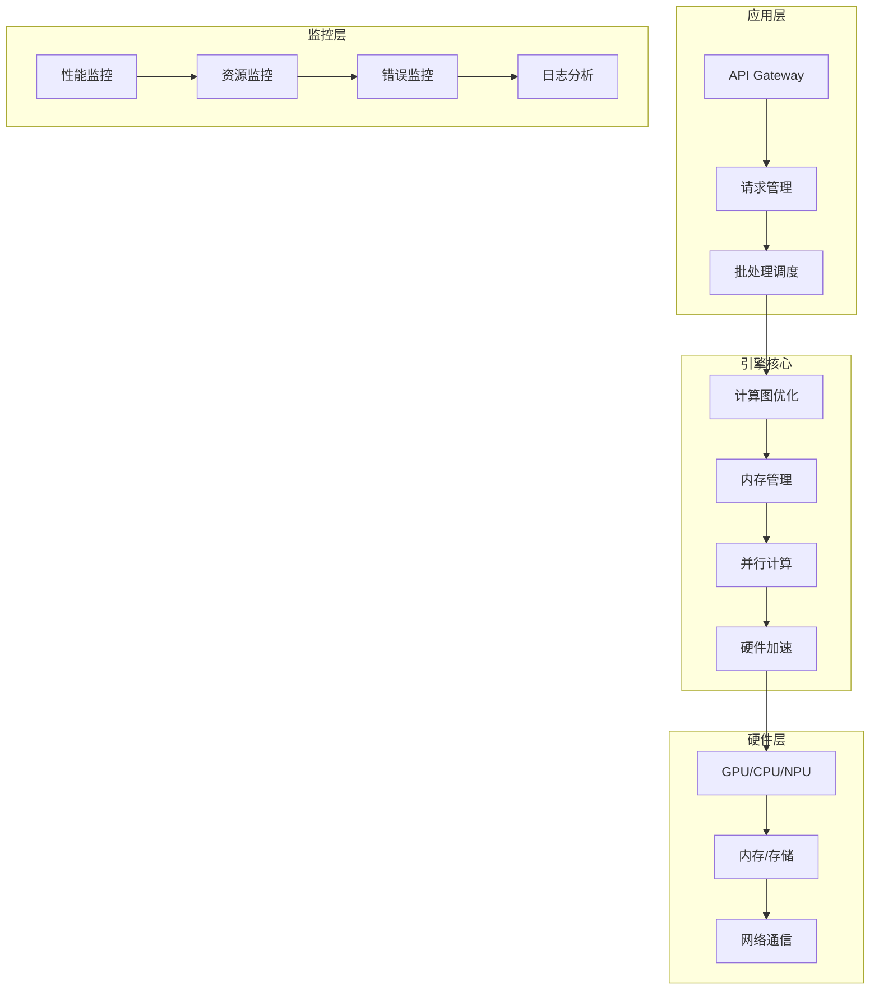
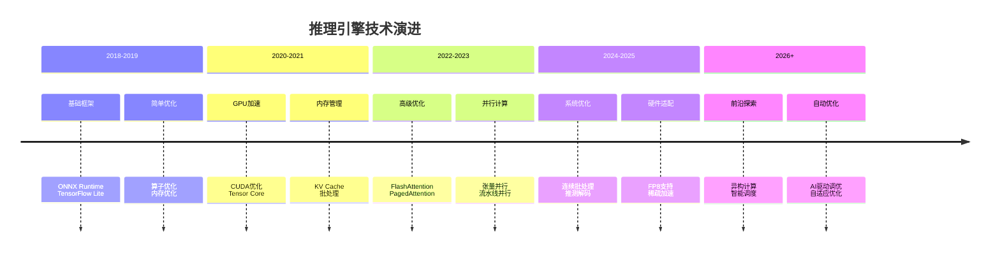

<!-- kb-import-backlink:LLMForEverybody -->

> [!info] 外部资料 · LLMForEverybody
> 中文大模型知识库 [[sources/LLMForEverybody/索引|LLMForEverybody 导航]] 中的相关章节：
> - [[sources/LLMForEverybody/02-第二章-部署与推理/大模型推理框架（一）综述|推理框架综述]]
> - [[sources/LLMForEverybody/01-第一章-预训练/FlashAttentionv2相比于v1有哪些更新？|FlashAttention v2]]
> - [[sources/LLMForEverybody/05-第五章-显卡与并行/大模型部署三要素：显存、计算与通信深度解析|部署三要素]]


# 推理引擎原理详解：从理论到实现

> 📚 **知识定位**：本文档深入解析推理引擎的核心原理，为[[推理 引擎 精通]]知识体系提供理论基础。

## 🎯 学习目标

通过本文档的学习，你将：
1. **理解架构**：掌握推理引擎的整体架构设计
2. **掌握原理**：理解核心优化技术的实现原理
3. **分析瓶颈**：能够识别和分析推理性能瓶颈
4. **设计优化**：能够设计针对性的优化方案

## 🏗️ 推理引擎架构

### 整体架构图


### 核心组件详解
```python
class InferenceEngineCore:
    """推理引擎核心组件"""
    
    def __init__(self, config):
        self.config = config
        
        # 核心组件
        self.model_loader = ModelLoader()
        self.graph_optimizer = GraphOptimizer()
        self.memory_manager = MemoryManager()
        self.parallel_executor = ParallelExecutor()
        self.hardware_accelerator = HardwareAccelerator()
        
        # 监控组件
        self.performance_monitor = PerformanceMonitor()
        self.resource_monitor = ResourceMonitor()
        
    def initialize(self, model_path):
        """初始化引擎"""
        # 1. 加载模型
        model = self.model_loader.load(model_path)
        
        # 2. 优化计算图
        optimized_graph = self.graph_optimizer.optimize(model)
        
        # 3. 分配内存
        self.memory_manager.allocate(optimized_graph)
        
        # 4. 设置并行
        self.parallel_executor.setup(optimized_graph)
        
        # 5. 配置硬件加速
        self.hardware_accelerator.configure(optimized_graph)
        
        return optimized_graph
    
    def execute(self, input_batch):
        """执行推理"""
        # 1. 预处理
        preprocessed = self.preprocess(input_batch)
        
        # 2. 内存管理
        memory_view = self.memory_manager.get_view(preprocessed)
        
        # 3. 并行执行
        output = self.parallel_executor.execute(memory_view)
        
        # 4. 后处理
        postprocessed = self.postprocess(output)
        
        # 5. 性能监控
        self.performance_monitor.record(postprocessed)
        
        return postprocessed
```

## 🧠 计算图优化

### 计算图基础
```python
class ComputationalGraph:
    """计算图：表示模型的计算流程"""
    
    def __init__(self):
        self.nodes = {}  # 计算节点
        self.edges = {}  # 数据依赖
        self.constants = {}  # 常量节点
        
    def add_node(self, node_id, op_type, inputs, outputs):
        """添加计算节点"""
        self.nodes[node_id] = {
            'op_type': op_type,
            'inputs': inputs,
            'outputs': outputs,
            'attributes': {}
        }
        
        # 添加边（依赖关系）
        for input_name in inputs:
            if input_name not in self.edges:
                self.edges[input_name] = []
            self.edges[input_name].append(node_id)
    
    def topological_sort(self):
        """拓扑排序：确定执行顺序"""
        in_degree = {node: 0 for node in self.nodes}
        
        # 计算入度
        for node_id, node in self.nodes.items():
            for input_name in node['inputs']:
                if input_name in self.edges:
                    for dependent in self.edges[input_name]:
                        in_degree[dependent] += 1
        
        # BFS拓扑排序
        queue = [node for node, degree in in_degree.items() if degree == 0]
        sorted_nodes = []
        
        while queue:
            node = queue.pop(0)
            sorted_nodes.append(node)
            
            # 更新依赖节点的入度
            if node in self.edges:
                for dependent in self.edges[node]:
                    in_degree[dependent] -= 1
                    if in_degree[dependent] == 0:
                        queue.append(dependent)
        
        return sorted_nodes
    
    def calculate_memory_requirements(self):
        """计算内存需求"""
        memory_usage = {}
        
        for node_id, node in self.nodes.items():
            # 计算输出张量大小
            output_size = self.calculate_tensor_size(node['outputs'])
            memory_usage[node_id] = output_size
        
        return memory_usage
```

### 算子融合技术
```python
class OperatorFusionOptimizer:
    """算子融合优化器"""
    
    def __init__(self):
        # 融合规则定义
        self.fusion_rules = {
            'linear_relu': {
                'pattern': ['linear', 'relu'],
                'fused_op': 'fused_linear_relu',
                'speedup': 1.5
            },
            'layer_norm_residual': {
                'pattern': ['layer_norm', 'add'],
                'fused_op': 'fused_layer_norm_residual',
                'speedup': 1.3
            },
            'attention_projection': {
                'pattern': ['attention', 'linear'],
                'fused_op': 'fused_attention_projection',
                'speedup': 1.4
            }
        }
    
    def optimize(self, graph):
        """执行算子融合优化"""
        optimized_graph = ComputationalGraph()
        
        # 查找可融合的模式
        fusion_candidates = self.find_fusion_candidates(graph)
        
        # 应用融合
        for candidate in fusion_candidates:
            fused_node = self.apply_fusion(graph, candidate)
            optimized_graph.add_node(fused_node)
        
        # 添加未融合的节点
        for node_id, node in graph.nodes.items():
            if node_id not in [c['node_id'] for c in fusion_candidates]:
                optimized_graph.add_node(node_id, node['op_type'], 
                                       node['inputs'], node['outputs'])
        
        return optimized_graph
    
    def find_fusion_candidates(self, graph):
        """查找可融合的算子模式"""
        candidates = []
        
        # 遍历计算图
        sorted_nodes = graph.topological_sort()
        
        for i, node_id in enumerate(sorted_nodes):
            node = graph.nodes[node_id]
            
            # 检查是否匹配融合模式
            for rule_name, rule in self.fusion_rules.items():
                if self.matches_pattern(graph, node_id, rule['pattern']):
                    candidates.append({
                        'node_id': node_id,
                        'rule': rule_name,
                        'pattern': rule['pattern'],
                        'fused_op': rule['fused_op']
                    })
        
        return candidates
    
    def apply_fusion(self, graph, candidate):
        """应用融合操作"""
        rule = self.fusion_rules[candidate['rule']]
        
        # 创建融合节点
        fused_node = {
            'op_type': rule['fused_op'],
            'inputs': self.collect_inputs(graph, candidate),
            'outputs': self.collect_outputs(graph, candidate),
            'attributes': {
                'fusion_type': candidate['rule'],
                'original_nodes': candidate['pattern']
            }
        }
        
        return fused_node
```

### 常量折叠优化
```python
class ConstantFoldingOptimizer:
    """常量折叠优化器：在编译时计算常量表达式"""
    
    def optimize(self, graph):
        """执行常量折叠"""
        optimized_graph = ComputationalGraph()
        
        # 识别常量节点
        constant_nodes = self.identify_constants(graph)
        
        # 计算常量表达式
        folded_constants = self.fold_constants(graph, constant_nodes)
        
        # 重建计算图
        for node_id, node in graph.nodes.items():
            if node_id in constant_nodes:
                # 替换为计算结果
                constant_value = folded_constants[node_id]
                optimized_graph.add_constant(node_id, constant_value)
            else:
                # 保持原节点
                optimized_graph.add_node(node_id, node['op_type'],
                                       node['inputs'], node['outputs'])
        
        return optimized_graph
    
    def identify_constants(self, graph):
        """识别常量节点"""
        constant_nodes = set()
        
        for node_id, node in graph.nodes.items():
            # 如果节点的所有输入都是常量
            all_constants = True
            for input_name in node['inputs']:
                if not self.is_constant(graph, input_name):
                    all_constants = False
                    break
            
            if all_constants:
                constant_nodes.add(node_id)
        
        return constant_nodes
    
    def fold_constants(self, graph, constant_nodes):
        """折叠常量表达式"""
        folded = {}
        
        for node_id in constant_nodes:
            node = graph.nodes[node_id]
            
            # 获取输入值
            input_values = []
            for input_name in node['inputs']:
                if input_name in graph.constants:
                    input_values.append(graph.constants[input_name])
                else:
                    # 递归计算
                    input_values.append(self.compute_constant(graph, input_name))
            
            # 执行常量计算
            result = self.compute_operation(node['op_type'], input_values)
            folded[node_id] = result
        
        return folded
    
    def compute_operation(self, op_type, inputs):
        """执行常量操作"""
        if op_type == 'add':
            return inputs[0] + inputs[1]
        elif op_type == 'multiply':
            return inputs[0] * inputs[1]
        elif op_type == 'matmul':
            return torch.matmul(inputs[0], inputs[1])
        else:
            raise ValueError(f"未知操作类型: {op_type}")
```

## 💾 内存管理

### 内存池化技术
```python
class MemoryPool:
    """内存池：预分配和复用内存"""
    
    def __init__(self, initial_size=1024*1024*1024):  # 1GB
        self.pool = bytearray(initial_size)
        self.free_blocks = [(0, initial_size)]  # (offset, size)
        self.used_blocks = {}
        
        # 统计信息
        self.stats = {
            'allocations': 0,
            'deallocations': 0,
            'fragmentation': 0,
            'peak_usage': 0
        }
    
    def allocate(self, size, alignment=64):
        """分配内存块"""
        # 查找合适的空闲块
        for i, (offset, block_size) in enumerate(self.free_blocks):
            if block_size >= size:
                # 分割块
                allocated_offset = offset
                remaining_offset = offset + size
                remaining_size = block_size - size
                
                # 更新空闲列表
                self.free_blocks[i] = (remaining_offset, remaining_size)
                
                # 记录使用情况
                self.used_blocks[allocated_offset] = {
                    'size': size,
                    'alignment': alignment
                }
                
                self.stats['allocations'] += 1
                self.stats['peak_usage'] = max(
                    self.stats['peak_usage'],
                    sum(block['size'] for block in self.used_blocks.values())
                )
                
                return allocated_offset
        
        # 没有足够空间，扩展池
        return self.expand_pool(size)
    
    def deallocate(self, offset):
        """释放内存块"""
        if offset in self.used_blocks:
            block_info = self.used_blocks.pop(offset)
            size = block_info['size']
            
            # 添加回空闲列表
            self.free_blocks.append((offset, size))
            
            # 合并相邻空闲块
            self.merge_free_blocks()
            
            self.stats['deallocations'] += 1
    
    def merge_free_blocks(self):
        """合并相邻的空闲块"""
        # 按偏移量排序
        self.free_blocks.sort(key=lambda x: x[0])
        
        merged_blocks = []
        for offset, size in self.free_blocks:
            if merged_blocks and merged_blocks[-1][0] + merged_blocks[-1][1] == offset:
                # 合并相邻块
                merged_blocks[-1] = (merged_blocks[-1][0], merged_blocks[-1][1] + size)
            else:
                merged_blocks.append((offset, size))
        
        self.free_blocks = merged_blocks
    
    def get_fragmentation_ratio(self):
        """计算内存碎片率"""
        total_free = sum(size for _, size in self.free_blocks)
        max_free_block = max(size for _, size in self.free_blocks) if self.free_blocks else 0
        
        if total_free == 0:
            return 0
        
        fragmentation = 1 - (max_free_block / total_free)
        return fragmentation
```

### KV Cache内存管理
```python
class KVCacheManager:
    """KV Cache内存管理器"""
    
    def __init__(self, max_cache_size, block_size=16):
        self.max_cache_size = max_cache_size
        self.block_size = block_size
        
        # 内存块管理
        self.cache_blocks = {}
        self.free_blocks = list(range(max_cache_size // block_size))
        self.used_blocks = {}
        
        # 序列管理
        self.sequence_caches = {}
        
        # 监控
        self.stats = {
            'cache_hits': 0,
            'cache_misses': 0,
            'evictions': 0,
            'memory_usage': 0
        }
    
    def get_kv_cache(self, sequence_id, position):
        """获取指定位置的KV缓存"""
        # 计算块索引
        block_index = position // self.block_size
        offset = position % self.block_size
        
        # 检查序列缓存
        if sequence_id in self.sequence_caches:
            if block_index in self.sequence_caches[sequence_id]:
                # 缓存命中
                self.stats['cache_hits'] += 1
                return self.sequence_caches[sequence_id][block_index][offset]
        
        # 缓存未命中
        self.stats['cache_misses'] += 1
        return None
    
    def set_kv_cache(self, sequence_id, position, key, value):
        """设置KV缓存"""
        # 计算块索引
        block_index = position // self.block_size
        offset = position % self.block_size
        
        # 如果序列没有缓存，分配新块
        if sequence_id not in self.sequence_caches:
            self.sequence_caches[sequence_id] = {}
        
        # 如果块不存在，分配新块
        if block_index not in self.sequence_caches[sequence_id]:
            block_id = self.allocate_block()
            self.sequence_caches[sequence_id][block_index] = {
                'block_id': block_id,
                'keys': torch.zeros(self.block_size, self.n_heads, self.head_dim),
                'values': torch.zeros(self.block_size, self.n_heads, self.head_dim),
                'valid_count': 0
            }
        
        # 存储KV
        block = self.sequence_caches[sequence_id][block_index]
        block['keys'][offset] = key
        block['values'][offset] = value
        block['valid_count'] += 1
        
        # 更新内存使用
        self.update_memory_usage()
    
    def allocate_block(self):
        """分配内存块"""
        if not self.free_blocks:
            # 内存不足，触发回收
            self.evict_blocks()
            
            if not self.free_blocks:
                raise ValueError("KV Cache内存不足")
        
        # 分配块
        block_id = self.free_blocks.pop()
        self.used_blocks[block_id] = {
            'allocated_time': time.time(),
            'access_count': 0
        }
        
        return block_id
    
    def evict_blocks(self):
        """回收内存块（LRU策略）"""
        # 按访问时间排序
        sorted_blocks = sorted(
            self.used_blocks.items(),
            key=lambda x: x[1]['allocated_time']
        )
        
        # 回收最旧的块
        blocks_to_evict = sorted_blocks[:len(sorted_blocks) // 4]  # 回收25%
        
        for block_id, _ in blocks_to_evict:
            self.free_blocks.append(block_id)
            del self.used_blocks[block_id]
            self.stats['evictions'] += 1
    
    def update_memory_usage(self):
        """更新内存使用统计"""
        used_memory = len(self.used_blocks) * self.block_size * self.n_heads * self.head_dim * 2  # key + value
        self.stats['memory_usage'] = used_memory / 1024**3  # GB
```

## ⚡ 并行计算

### 数据并行
```python
class DataParallel:
    """数据并行：将数据分布到多个设备"""
    
    def __init__(self, model, device_ids):
        self.model = model
        self.device_ids = device_ids
        self.models = {}
        
        # 复制模型到每个设备
        for device_id in device_ids:
            device = torch.device(f'cuda:{device_id}')
            self.models[device_id] = self.replicate_model(model, device)
    
    def replicate_model(self, model, device):
        """复制模型到指定设备"""
        replicated = model.to(device)
        return replicated
    
    def forward(self, input_batch):
        """前向传播"""
        batch_size = len(input_batch)
        chunk_size = batch_size // len(self.device_ids)
        
        # 分割输入
        chunks = []
        for i in range(len(self.device_ids)):
            start_idx = i * chunk_size
            end_idx = start_idx + chunk_size if i < len(self.device_ids) - 1 else batch_size
            chunks.append(input_batch[start_idx:end_idx])
        
        # 并行执行
        outputs = {}
        for device_id, chunk in zip(self.device_ids, chunks):
            device = torch.device(f'cuda:{device_id}')
            chunk_tensor = torch.tensor(chunk).to(device)
            
            # 前向传播
            with torch.no_grad():
                output = self.models[device_id](chunk_tensor)
                outputs[device_id] = output.cpu()
        
        # 合并结果
        combined_output = torch.cat([outputs[device_id] for device_id in self.device_ids])
        
        return combined_output
    
    def all_reduce_gradients(self):
        """AllReduce梯度同步"""
        # 在数据并行中，需要同步梯度
        # 这里简化实现，实际使用NCCL等通信库
        
        for param in self.model.parameters():
            if param.grad is not None:
                # 收集所有设备的梯度
                gradients = []
                for device_id in self.device_ids:
                    device = torch.device(f'cuda:{device_id}')
                    gradient = param.grad.to(device)
                    gradients.append(gradient)
                
                # 平均梯度
                avg_gradient = torch.mean(torch.stack(gradients), dim=0)
                
                # 分发平均梯度
                for device_id in self.device_ids:
                    device = torch.device(f'cuda:{device_id}')
                    self.models[device_id].weight.grad = avg_gradient.to(device)
```

### 模型并行（张量并行）
```python
class TensorParallel:
    """张量并行：将单个层的计算分布到多个设备"""
    
    def __init__(self, model, device_ids, split_dim=0):
        self.model = model
        self.device_ids = device_ids
        self.split_dim = split_dim
        
        # 分割模型层
        self.split_layers = self.split_model_layers()
    
    def split_model_layers(self):
        """分割模型层"""
        split_layers = {}
        
        for name, layer in self.model.named_modules():
            if isinstance(layer, torch.nn.Linear):
                # 分割线性层
                weight = layer.weight
                bias = layer.bias if layer.bias is not None else None
                
                # 按设备分割权重
                chunks = torch.chunk(weight, len(self.device_ids), dim=self.split_dim)
                
                for device_id, chunk in zip(self.device_ids, chunks):
                    device = torch.device(f'cuda:{device_id}')
                    split_layer = torch.nn.Linear(
                        chunk.shape[1], chunk.shape[0], bias=bias is not None
                    )
                    split_layer.weight = torch.nn.Parameter(chunk.to(device))
                    
                    if bias is not None:
                        split_bias = torch.chunk(bias, len(self.device_ids))[self.device_ids.index(device_id)]
                        split_layer.bias = torch.nn.Parameter(split_bias.to(device))
                    
                    split_layers[f"{name}_{device_id}"] = split_layer
        
        return split_layers
    
    def forward(self, input_batch):
        """前向传播"""
        # 分发输入到所有设备
        device_outputs = {}
        
        for device_id in self.device_ids:
            device = torch.device(f'cuda:{device_id}')
            input_tensor = torch.tensor(input_batch).to(device)
            
            # 执行该设备的层
            with torch.no_grad():
                output = self.execute_device_layers(device_id, input_tensor)
                device_outputs[device_id] = output
        
        # 合并输出（AllReduce操作）
        combined_output = self.all_reduce_outputs(device_outputs)
        
        return combined_output
    
    def execute_device_layers(self, device_id, input_tensor):
        """执行指定设备的层"""
        output = input_tensor
        
        for name, layer in self.split_layers.items():
            if f"_{device_id}" in name:
                output = layer(output)
        
        return output
    
    def all_reduce_outputs(self, device_outputs):
        """AllReduce操作：合并所有设备的输出"""
        # 简化实现：平均所有设备的输出
        outputs = list(device_outputs.values())
        combined = torch.mean(torch.stack(outputs), dim=0)
        
        return combined
```

### 流水线并行
```python
class PipelineParallel:
    """流水线并行：将模型不同层分布到多个设备"""
    
    def __init__(self, model, device_ids, chunks=4):
        self.model = model
        self.device_ids = device_ids
        self.chunks = chunks
        
        # 分割模型层
        self.stage_layers = self.split_model_stages()
        
        # 流水线调度器
        self.scheduler = PipelineScheduler(chunks, len(device_ids))
    
    def split_model_stages(self):
        """分割模型层到不同阶段"""
        stages = {}
        layers = list(self.model.children())
        layers_per_stage = len(layers) // len(self.device_ids)
        
        for stage_id, device_id in enumerate(self.device_ids):
            start_idx = stage_id * layers_per_stage
            end_idx = start_idx + layers_per_stage if stage_id < len(self.device_ids) - 1 else len(layers)
            
            stage_layers = torch.nn.Sequential(*layers[start_idx:end_idx])
            stages[stage_id] = {
                'layers': stage_layers.to(torch.device(f'cuda:{device_id}')),
                'device': torch.device(f'cuda:{device_id}')
            }
        
        return stages
    
    def forward(self, input_batch):
        """流水线前向传播"""
        # 分割输入为微批次
        micro_batches = self.split_into_micro_batches(input_batch)
        
        # 执行流水线
        stage_outputs = {}
        
        for stage_id, device_id in enumerate(self.device_ids):
            device = self.stage_layers[stage_id]['device']
            layers = self.stage_layers[stage_id]['layers']
            
            # 获取当前阶段的输入
            if stage_id == 0:
                stage_input = micro_batches[0].to(device)
            else:
                # 从前一阶段接收输入
                prev_device = self.stage_layers[stage_id-1]['device']
                stage_input = stage_outputs[stage_id-1].to(device)
            
            # 执行计算
            with torch.no_grad():
                stage_output = layers(stage_input)
                stage_outputs[stage_id] = stage_output
        
        # 返回最后一个阶段的输出
        final_output = stage_outputs[len(self.device_ids)-1]
        
        return final_output.cpu()
    
    def split_into_micro_batches(self, input_batch):
        """分割输入为微批次"""
        batch_size = len(input_batch)
        micro_batch_size = batch_size // self.chunks
        
        micro_batches = []
        for i in range(self.chunks):
            start_idx = i * micro_batch_size
            end_idx = start_idx + micro_batch_size if i < self.chunks - 1 else batch_size
            micro_batches.append(input_batch[start_idx:end_idx])
        
        return micro_batches
```

## 🔧 硬件加速

### GPU加速优化
```python
class GPUAccelerator:
    """GPU加速器"""
    
    def __init__(self, device_ids):
        self.device_ids = device_ids
        self.cuda_streams = {}
        
        # 初始化CUDA
        self.initialize_cuda()
    
    def initialize_cuda(self):
        """初始化CUDA环境"""
        for device_id in self.device_ids:
            device = torch.device(f'cuda:{device_id}')
            
            # 设置设备
            torch.cuda.set_device(device)
            
            # 创建CUDA流
            stream = torch.cuda.Stream(device)
            self.cuda_streams[device_id] = stream
            
            # 预热GPU
            self.warmup_gpu(device)
    
    def warmup_gpu(self, device):
        """GPU预热"""
        # 执行一些计算来预热GPU
        warmup_tensor = torch.randn(100, 100).to(device)
        _ = torch.matmul(warmup_tensor, warmup_tensor)
        torch.cuda.synchronize(device)
    
    def execute_with_streams(self, operations):
        """使用CUDA流并行执行操作"""
        stream_outputs = {}
        
        for device_id, operation in zip(self.device_ids, operations):
            device = torch.device(f'cuda:{device_id}')
            stream = self.cuda_streams[device_id]
            
            # 在指定流上执行操作
            with torch.cuda.stream(stream):
                input_tensor = operation['input'].to(device)
                
                with torch.no_grad():
                    output = operation['model'](input_tensor)
                    stream_outputs[device_id] = output
        
        # 同步所有流
        for device_id in self.device_ids:
            torch.cuda.synchronize(torch.device(f'cuda:{device_id}'))
        
        return stream_outputs
    
    def optimize_memory_layout(self, tensor, device_id):
        """优化内存布局"""
        device = torch.device(f'cuda:{device_id}')
        
        # 确保内存对齐
        aligned_tensor = self.align_memory(tensor)
        
        # 使用连续内存
        if not aligned_tensor.is_contiguous():
            aligned_tensor = aligned_tensor.contiguous()
        
        return aligned_tensor.to(device)
    
    def align_memory(self, tensor, alignment=256):
        """内存对齐"""
        # 计算对齐后的大小
        current_size = tensor.numel() * tensor.element_size()
        aligned_size = (current_size + alignment - 1) // alignment * alignment
        
        # 创建对齐的张量
        aligned_tensor = torch.empty(aligned_size // tensor.element_size(), 
                                   dtype=tensor.dtype, 
                                   device=tensor.device)
        
        # 复制数据
        aligned_tensor[:tensor.numel()] = tensor.view(-1)
        
        return aligned_tensor.view(tensor.shape)
```

### CPU优化技术
```python
class CPUAccelerator:
    """CPU加速器"""
    
    def __init__(self, num_threads=None):
        self.num_threads = num_threads or os.cpu_count()
        
        # 设置线程数
        torch.set_num_threads(self.num_threads)
        
        # 检查CPU特性
        self.cpu_features = self.detect_cpu_features()
        
        # 优化配置
        self.optimization_config = self.configure_optimizations()
    
    def detect_cpu_features(self):
        """检测CPU特性"""
        features = {
            'avx2': False,
            'avx512': False,
            'sse4': False,
            'fma': False
        }
        
        # 检测CPU指令集支持
        # 这里简化实现，实际使用cpuid等指令
        try:
            import cpuinfo
            info = cpuinfo.get_cpu_info()
            features['avx2'] = 'avx2' in info.get('flags', [])
            features['avx512'] = 'avx512' in info.get('flags', [])
            features['sse4'] = 'sse4' in info.get('flags', [])
            features['fma'] = 'fma' in info.get('flags', [])
        except:
            pass
        
        return features
    
    def configure_optimizations(self):
        """配置CPU优化"""
        config = {
            'num_threads': self.num_threads,
            'use_mkl': self.check_mkl_support(),
            'use_openmp': self.check_openmp_support(),
            'memory_layout': 'channels_last' if self.cpu_features['avx2'] else 'channels_first'
        }
        
        return config
    
    def optimize_model_for_cpu(self, model):
        """为CPU优化模型"""
        # 设置内存格式
        if self.optimization_config['memory_layout'] == 'channels_last':
            model = model.to(memory_format=torch.channels_last)
        
        # 量化优化
        if self.cpu_features['avx2'] or self.cpu_features['avx512']:
            model = self.quantize_model_for_cpu(model)
        
        return model
    
    def quantize_model_for_cpu(self, model):
        """为CPU量化模型"""
        # 使用动态量化
        quantized_model = torch.quantization.quantize_dynamic(
            model,
            {torch.nn.Linear},  # 量化线性层
            dtype=torch.qint8
        )
        
        return quantized_model
    
    def parallel_execute(self, model, input_batch):
        """并行执行推理"""
        # 使用多线程并行
        with torch.no_grad():
            # 设置线程数
            torch.set_num_threads(self.num_threads)
            
            # 执行推理
            output = model(input_batch)
        
        return output
```

## 📊 性能分析与监控

### 性能分析器
```python
class PerformanceProfiler:
    """性能分析器：详细分析推理性能"""
    
    def __init__(self):
        self.metrics = {
            'compute_time': [],
            'memory_usage': [],
            'bandwidth_usage': [],
            'kernel_time': []
        }
        
        # 性能计数器
        self.counters = {
            'flops': 0,
            'memory_accesses': 0,
            'cache_hits': 0,
            'cache_misses': 0
        }
    
    def profile_inference(self, model, input_batch, num_runs=100):
        """分析推理性能"""
        results = {
            'average_time': 0,
            'throughput': 0,
            'memory_efficiency': 0,
            'bottlenecks': []
        }
        
        times = []
        memory_usages = []
        
        for _ in range(num_runs):
            # 清空缓存
            torch.cuda.empty_cache()
            
            # 记录开始时间
            start_time = time.time()
            start_memory = torch.cuda.memory_allocated() if torch.cuda.is_available() else 0
            
            # 执行推理
            with torch.no_grad():
                output = model(input_batch)
            
            # 记录结束时间
            end_time = time.time()
            end_memory = torch.cuda.memory_allocated() if torch.cuda.is_available() else 0
            
            # 计算指标
            inference_time = end_time - start_time
            memory_used = end_memory - start_memory
            
            times.append(inference_time)
            memory_usages.append(memory_used)
        
        # 计算统计信息
        results['average_time'] = np.mean(times)
        results['throughput'] = len(input_batch) / results['average_time']
        results['memory_efficiency'] = np.mean(memory_usages) / 1024**3  # GB
        
        # 识别瓶颈
        results['bottlenecks'] = self.identify_bottlenecks(times, memory_usages)
        
        return results
    
    def identify_bottlenecks(self, times, memory_usages):
        """识别性能瓶颈"""
        bottlenecks = []
        
        # 检查计算瓶颈
        avg_time = np.mean(times)
        if avg_time > 0.1:  # 100ms阈值
            bottlenecks.append({
                'type': 'compute',
                'severity': 'high',
                'recommendation': '考虑使用FlashAttention或算子融合'
            })
        
        # 检查内存瓶颈
        avg_memory = np.mean(memory_usages) / 1024**3  # GB
        if avg_memory > 8:  # 8GB阈值
            bottlenecks.append({
                'type': 'memory',
                'severity': 'high',
                'recommendation': '考虑模型量化或减少批处理大小'
            })
        
        # 检查带宽瓶颈
        if len(memory_usages) > 1:
            memory_bandwidth = np.diff(memory_usages) / np.diff(times)
            avg_bandwidth = np.mean(memory_bandwidth)
            
            if avg_bandwidth < 100e9:  # 100GB/s阈值
                bottlenecks.append({
                    'type': 'bandwidth',
                    'severity': 'medium',
                    'recommendation': '优化内存访问模式或使用内存映射'
                })
        
        return bottlenecks
```

### 资源监控器
```python
class ResourceMonitor:
    """资源监控器：监控系统资源使用"""
    
    def __init__(self):
        self.gpu_monitor = GPUMonitor()
        self.cpu_monitor = CPUMonitor()
        self.memory_monitor = MemoryMonitor()
        
        # 历史记录
        self.history = {
            'gpu_utilization': [],
            'cpu_utilization': [],
            'memory_usage': [],
            'timestamp': []
        }
    
    def start_monitoring(self, interval=1.0):
        """开始监控"""
        self.monitoring = True
        self.monitor_thread = threading.Thread(target=self.monitor_loop, args=(interval,))
        self.monitor_thread.start()
    
    def monitor_loop(self, interval):
        """监控循环"""
        while self.monitoring:
            # 收集指标
            gpu_util = self.gpu_monitor.get_utilization()
            cpu_util = self.cpu_monitor.get_utilization()
            memory_usage = self.memory_monitor.get_usage()
            
            # 记录历史
            self.history['gpu_utilization'].append(gpu_util)
            self.history['cpu_utilization'].append(cpu_util)
            self.history['memory_usage'].append(memory_usage)
            self.history['timestamp'].append(time.time())
            
            # 等待下一个间隔
            time.sleep(interval)
    
    def stop_monitoring(self):
        """停止监控"""
        self.monitoring = False
        self.monitor_thread.join()
    
    def get_resource_summary(self):
        """获取资源使用摘要"""
        if not self.history['timestamp']:
            return None
        
        return {
            'gpu_utilization': {
                'average': np.mean(self.history['gpu_utilization']),
                'peak': max(self.history['gpu_utilization']),
                'current': self.history['gpu_utilization'][-1]
            },
            'cpu_utilization': {
                'average': np.mean(self.history['cpu_utilization']),
                'peak': max(self.history['cpu_utilization']),
                'current': self.history['cpu_utilization'][-1]
            },
            'memory_usage': {
                'average': np.mean(self.history['memory_usage']),
                'peak': max(self.history['memory_usage']),
                'current': self.history['memory_usage'][-1]
            }
        }
    
    def detect_anomalies(self):
        """检测资源使用异常"""
        anomalies = []
        
        # 检测GPU使用率异常
        if self.history['gpu_utilization']:
            avg_gpu = np.mean(self.history['gpu_utilization'])
            if avg_gpu > 95:  # GPU使用率过高
                anomalies.append({
                    'type': 'gpu_overutilization',
                    'severity': 'high',
                    'recommendation': '检查是否有不必要的GPU操作或内存泄漏'
                })
        
        # 检测内存使用异常
        if self.history['memory_usage']:
            memory_growth = np.diff(self.history['memory_usage'])
            if np.any(memory_growth > 0.1):  # 内存快速增长
                anomalies.append({
                    'type': 'memory_leak',
                    'severity': 'medium',
                    'recommendation': '检查是否有未释放的内存或缓存'
                })
        
        return anomalies
```

## 🔗 知识关联

### 相关文档
- [[推理 引擎 精通]] - 推理引擎知识体系主索引
- [[LLM 推理 优化]] - LLM推理优化技术详解
- [[推理 引擎 调优]] - 推理引擎调优实践
- [[Transformer 架构]] - Transformer架构原理
- [[模型 压缩 蒸馏]] - 模型压缩技术

### 技术演进


---

> 💡 **学习建议**：理解推理引擎原理需要结合理论和实践。建议先掌握基础概念，然后通过具体项目加深理解。性能分析是优化的关键，要学会使用各种监控工具。

**参考文献**：
1. CUDA Programming Guide - NVIDIA
2. FlashAttention: Fast and Memory-Efficient Exact Attention
3. vLLM: Efficient Memory Management for Large Language Model Serving
4. Tensor Parallelism for Large Language Models

**最后更新**：2026-08-17  
**维护者**：Claudian  
**状态**：活跃维护中