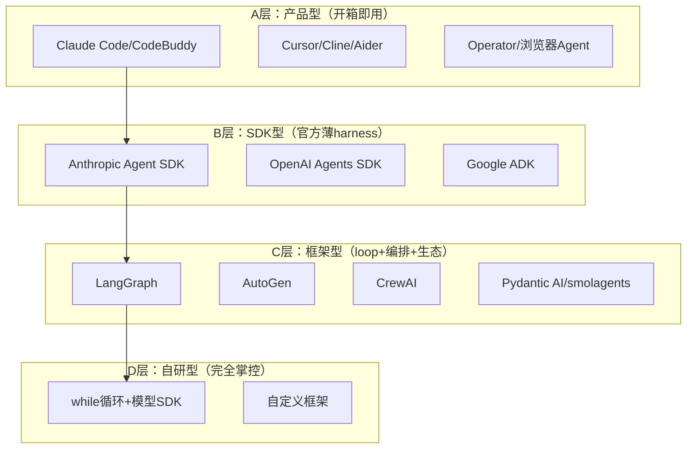
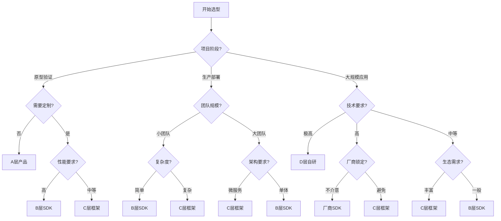

# Harness框架对比指南：如何选择适合的harness

> 📚 **知识定位**：本文档提供harness框架的全面对比和选型指南，是对[[LLM 智能体 测试框架]]分类的详细展开。

## 🎯 框架分类体系

### 四层分类模型


### 分类详细说明
| 类型 | 定位 | 控制力 | 开发速度 | 适用场景 |
|------|------|--------|----------|----------|
| **A. 产品型** | 开箱即用的Agent应用 | 低 | 最快 | 快速验证、最终用户 |
| **B. SDK型** | 官方提供的薄harness | 中 | 快 | 生产级应用、可控开发 |
| **C. 框架型** | 完整harness+编排生态 | 中高 | 中等 | 复杂场景、团队协作 |
| **D. 自研型** | 完全自定义harness | 最高 | 慢 | 特殊需求、教学研究 |

## 📊 核心框架详细对比

### 1. 产品型harness（A层）

#### Claude Code / CodeBuddy
```yaml
名称: Claude Code / CodeBuddy
类型: 终端/IDE编程Agent
定位: 开箱即用的编程助手
核心特性:
  - 本地harness运行
  - 文件/Shell/MCP集成
  - 上下文管理
  - 工具调用
  - 安全沙箱

优势:
  - 零配置即用
  - 深度集成开发环境
  - 官方维护和支持
  - 安全可控

劣势:
  - 定制化有限
  - 依赖特定厂商
  - 功能范围固定

适用场景:
  - 个人开发者
  - 快速原型开发
  - 学习和探索

技术栈:
  - Python/TypeScript
  - Anthropic API
  - MCP协议
  - 本地文件系统
```

#### Cursor / Cline / Aider
```yaml
名称: Cursor / Cline / Aider
类型: 编程Agent（编辑器/CLI集成）
定位: 智能编程助手
核心特性:
  - 代码生成和修改
  - 上下文感知
  - 多文件编辑
  - 版本控制集成
  - 团队协作

优势:
  - 深度编辑器集成
  - 强大的代码理解
  - 实时协作支持
  - 丰富的插件生态

劣势:
  - 学习曲线较陡
  - 资源消耗较大
  - 依赖网络连接

适用场景:
  - 专业开发团队
  - 大型项目开发
  - 代码审查和重构
```

### 2. SDK型harness（B层）

#### Anthropic Agent SDK
```yaml
名称: Anthropic Agent SDK
类型: 官方Agent开发SDK
定位: 薄harness，自己搭Agent
核心特性:
  - Tool-use loop（工具调用循环）
  - Sub-agents（子Agent）
  - Tracing（追踪）
  - Context management（上下文管理）

优势:
  - 官方支持和维护
  - 与Claude模型深度集成
  - 轻量级设计
  - 类型安全（Python/TypeScript）

劣势:
  - 仅支持Anthropic模型
  - 功能相对基础
  - 需要自行扩展

适用场景:
  - 基于Claude的应用
  - 需要官方支持的项目
  - 轻量级Agent开发

代码示例:
  ```python
  from anthropic_agent_sdk import Agent, Tool
  
  # 定义工具
  weather_tool = Tool(
      name="get_weather",
      description="获取天气信息",
      parameters={"city": "string"}
  )
  
  # 创建Agent
  agent = Agent(
      model="claude-3-sonnet",
      tools=[weather_tool],
      system_prompt="你是一个天气助手"
  )
  
  # 运行Agent
  response = agent.run("北京天气怎么样？")
  ```
```

#### OpenAI Agents SDK
```yaml
名称: OpenAI Agents SDK
类型: 官方Agent开发SDK
定位: 轻量级harness，强调handoffs
核心特性:
  - Handoffs（交接）
  - Guardrails（护栏）
  - Tracing（追踪）
  - Multi-agent（多Agent）

优势:
  - 官方支持
  - 强大的handoff机制
  - 内置guardrails
  - 与OpenAI模型集成

劣势:
  - 仅支持OpenAI模型
  - 相对较新
  - 文档和示例有限

适用场景:
  - 基于GPT的应用
  - 多Agent协作场景
  - 需要安全控制的场景

代码示例:
  ```python
  from openai_agents_sdk import Agent, Handoff, Guardrail
  
  # 定义guardrail
  safety_guardrail = Guardrail(
      name="safety_check",
      check_fn=lambda x: "危险" not in x
  )
  
  # 创建Agent
  agent = Agent(
      name="assistant",
      model="gpt-4",
      guardrails=[safety_guardrail]
  )
  
  # 运行Agent
  response = agent.run("帮我查天气")
  ```
```

#### Google ADK (Agent Development Kit)
```yaml
名称: Google ADK
类型: 全栈式Agent开发套件
定位: 从单Agent到多Agent的官方运行时
核心特性:
  - 多工具/多Agent支持
  - 记忆管理
  - 部署闭环
  - 与Gemini深度集成

优势:
  - 全栈解决方案
  - 强大的多Agent支持
  - 与Google Cloud集成
  - 企业级特性

劣势:
  - 较重，学习曲线陡
  - 依赖Google Cloud
  - 仅支持Gemini模型

适用场景:
  - 企业级应用
  - 复杂多Agent系统
  - Google Cloud用户

技术栈:
  - Python/JS
  - Gemini API
  - Google Cloud
  - Kubernetes
```

### 3. 框架型harness（C层）

#### LangGraph
```yaml
名称: LangGraph
类型: 图化有状态harness
定位: 复杂工作流编排
核心特性:
  - 状态图定义
  - 节点和边
  - 持久化状态
  - 人机交互
  - 流式输出

优势:
  - 强大的状态管理
  - 可视化工作流
  - 丰富的生态系统
  - 企业级特性

劣势:
  - 学习曲线陡
  - 相对较重
  - 依赖LangChain生态

适用场景:
  - 复杂工作流
  - 需要状态管理
  - 企业级应用

代码示例:
  ```python
  from langgraph.graph import StateGraph, END
  
  # 定义状态
  class AgentState:
      messages: list
      next_action: str
  
  # 创建图
  workflow = StateGraph(AgentState)
  
  # 添加节点
  workflow.add_node("think", think_node)
  workflow.add_node("act", act_node)
  workflow.add_node("observe", observe_node)
  
  # 添加边
  workflow.add_edge("think", "act")
  workflow.add_edge("act", "observe")
  workflow.add_conditional_edges(
      "observe",
      should_continue,
      {"continue": "think", "end": END}
  )
  
  # 编译图
  app = workflow.compile()
  ```
```

#### AutoGen
```yaml
名称: AutoGen
类型: 对话式多Agent harness
定位: 微软的多Agent协作框架
核心特性:
  - 对话式Agent
  - 代码生成与执行
  - 人机协作
  - 可定制Agent

优势:
  - 强大的多Agent支持
  - 代码执行沙箱
  - 微软支持
  - 丰富的示例

劣势:
  - 相对较新
  - 文档不够完善
  - 性能优化空间

适用场景:
  - 多Agent对话
  - 代码生成任务
  - 研究和探索

代码示例:
  ```python
  from autogen import AssistantAgent, UserProxyAgent
  
  # 创建Assistant Agent
  assistant = AssistantAgent(
      name="assistant",
      llm_config={"model": "gpt-4"}
  )
  
  # 创建User Proxy Agent
  user_proxy = UserProxyAgent(
      name="user_proxy",
      human_input_mode="TERMINATE",
      code_execution_config={"work_dir": "coding"}
  )
  
  # 开始对话
  user_proxy.initiate_chat(
      assistant,
      message="帮我写一个排序算法"
  )
  ```
```

#### CrewAI
```yaml
名称: CrewAI
类型: 角色制多Agent harness
定位: 以角色为中心的协作框架
核心特性:
  - Agent角色定义
  - 任务委派
  - 层级管理
  - 工具集成

优势:
  - 直观的角色定义
  - 强大的协作能力
  - 易于使用
  - 丰富的工具集成

劣势:
  - 定制化有限
  - 性能优化不足
  - 文档不够详细

适用场景:
  - 团队协作任务
  - 角色扮演场景
  - 内容创作

代码示例:
  ```python
  from crewai import Agent, Task, Crew
  
  # 定义Agent
  researcher = Agent(
      role="研究员",
      goal="深入研究给定主题",
      backstory="你是一个经验丰富的研究员",
      tools=[search_tool]
  )
  
  writer = Agent(
      role="作家",
      goal="将研究结果写成文章",
      backstory="你是一个专业的技术作家",
      tools=[writing_tool]
  )
  
  # 定义任务
  research_task = Task(
      description="研究AI Agent的最新进展",
      agent=researcher
  )
  
  writing_task = Task(
      description="将研究结果写成博客文章",
      agent=writer
  )
  
  # 创建Crew
  crew = Crew(
      agents=[researcher, writer],
      tasks=[research_task, writing_task],
      verbose=True
  )
  
  # 执行
  result = crew.kickoff()
  ```
```

#### 轻量级框架对比
| 框架 | 语言 | 特点 | 适用场景 | 学习曲线 |
|------|------|------|----------|----------|
| **Pydantic AI** | Python | 类型安全、依赖注入 | 生产级后端 | 中等 |
| **smolagents** | Python | 极简、CodeAgent | 教学/原型 | 低 |
| **Agno** | Python | 多模态、记忆一体 | 多模态Agent | 中等 |
| **LlamaIndex** | Python | 数据/RAG驱动 | 检索增强Agent | 中等 |

### 4. 自研型harness（D层）

#### 自研harness架构
```python
class CustomHarness:
    """自研harness基础架构"""
    
    def __init__(self, model, tools, config):
        self.model = model
        self.tools = tools
        self.config = config
        self.history = []
        self.memory = MemoryManager()
        self.tracer = Tracer()
    
    def run(self, user_input):
        """主运行循环"""
        # 1. 准备上下文
        context = self.prepare_context(user_input)
        
        # 2. 推理循环
        while True:
            # 调用模型
            response = self.model.generate(context)
            
            # 解析响应
            parsed = self.parse_response(response)
            
            # 检查是否需要工具调用
            if parsed.get('tool_call'):
                # 执行工具
                tool_result = self.execute_tool(parsed['tool_call'])
                
                # 更新上下文
                context = self.update_context(context, tool_result)
                
                # 记录trace
                self.tracer.log_tool_call(parsed['tool_call'], tool_result)
            else:
                # 返回最终答案
                return parsed['answer']
    
    def prepare_context(self, user_input):
        """准备上下文"""
        # 组装prompt
        prompt = self.assemble_prompt(user_input)
        
        # 检索相关记忆
        relevant_memory = self.memory.retrieve(user_input)
        
        # 注入记忆
        if relevant_memory:
            prompt = self.inject_memory(prompt, relevant_memory)
        
        return prompt
    
    def execute_tool(self, tool_call):
        """执行工具调用"""
        tool_name = tool_call['name']
        tool_args = tool_call['arguments']
        
        # 查找工具
        tool = self.find_tool(tool_name)
        
        if not tool:
            return f"工具 {tool_name} 不存在"
        
        try:
            # 执行工具
            result = tool.execute(tool_args)
            return result
        except Exception as e:
            return f"工具执行失败: {str(e)}"
```

#### 自研harness的优势与挑战
```yaml
优势:
  - 完全掌控：可以完全定制harness行为
  - 深度优化：针对特定场景深度优化
  - 无依赖：不依赖第三方框架
  - 学习价值：深入理解harness原理

挑战:
  - 开发成本高：需要实现所有harness功能
  - 维护负担重：需要自行维护所有组件
  - 生态缺失：无法享受社区生态
  - 风险自负：所有问题都需要自行解决

适用场景:
  - 特殊需求：框架无法满足的特殊需求
  - 教学研究：学习harness原理
  - 极致性能：需要极致优化的场景
  - 安全敏感：需要完全掌控的场景
```

## 🔍 核心特性对比矩阵

### 功能完整性对比
| 特性 | A层产品 | B层SDK | C层框架 | D层自研 |
|------|---------|--------|---------|---------|
| **状态管理** | ✅ 内置 | ⚠️ 基础 | ✅ 完整 | ⚠️ 需实现 |
| **工具调用** | ✅ 内置 | ✅ 内置 | ✅ 内置 | ⚠️ 需实现 |
| **上下文管理** | ✅ 内置 | ⚠️ 基础 | ✅ 完整 | ⚠️ 需实现 |
| **错误处理** | ✅ 内置 | ⚠️ 基础 | ✅ 完整 | ⚠️ 需实现 |
| **安全控制** | ✅ 内置 | ✅ 内置 | ⚠️ 部分 | ⚠️ 需实现 |
| **可观测性** | ✅ 内置 | ✅ 内置 | ✅ 完整 | ⚠️ 需实现 |
| **多Agent支持** | ⚠️ 有限 | ✅ 内置 | ✅ 完整 | ⚠️ 需实现 |
| **部署支持** | ✅ 内置 | ⚠️ 基础 | ✅ 完整 | ⚠️ 需实现 |

### 性能对比
| 指标 | A层产品 | B层SDK | C层框架 | D层自研 |
|------|---------|--------|---------|---------|
| **启动时间** | 最快 | 快 | 中等 | 取决于实现 |
| **内存占用** | 低 | 低 | 中等 | 取决于实现 |
| **响应延迟** | 低 | 低 | 中等 | 取决于实现 |
| **并发能力** | 中等 | 中等 | 高 | 取决于实现 |
| **可扩展性** | 低 | 中等 | 高 | 最高 |

### 易用性对比
| 维度 | A层产品 | B层SDK | C层框架 | D层自研 |
|------|---------|--------|---------|---------|
| **学习曲线** | 最低 | 低 | 中等 | 高 |
| **文档质量** | 高 | 高 | 中等 | 无 |
| **示例丰富度** | 高 | 中等 | 高 | 无 |
| **社区支持** | 中等 | 中等 | 高 | 无 |
| **调试便利性** | 高 | 中等 | 高 | 取决于实现 |

### 生态系统对比
| 维度 | A层产品 | B层SDK | C层框架 | D层自研 |
|------|---------|--------|---------|---------|
| **工具集成** | 有限 | 中等 | 丰富 | 无 |
| **插件生态** | 有限 | 中等 | 丰富 | 无 |
| **第三方支持** | 有限 | 中等 | 丰富 | 无 |
| **企业支持** | 高 | 高 | 中等 | 无 |

## 🎯 选型决策框架

### 决策流程图


### 选型决策表
| 场景 | 推荐类型 | 具体框架 | 理由 |
|------|----------|----------|------|
| **快速原型** | A层 | Claude Code/Cursor | 零配置即用，快速验证想法 |
| **个人项目** | B层 | Anthropic/OpenAI SDK | 轻量级，官方支持 |
| **小团队生产** | B层 | 官方SDK | 平衡开发速度和控制力 |
| **复杂工作流** | C层 | LangGraph | 强大的状态管理和编排 |
| **多Agent协作** | C层 | AutoGen/CrewAI | 专门的多Agent支持 |
| **企业级应用** | C层 | LangGraph/Google ADK | 完整的生态和企业特性 |
| **极致性能** | D层 | 自研 | 完全掌控，深度优化 |
| **特殊需求** | D层 | 自研 | 框架无法满足时的选择 |

### 成本效益分析
```python
def harness_selection_analysis(scenario):
    """harness选型成本效益分析"""
    
    analysis = {
        'prototype': {
            'recommended': 'A层产品',
            'framework': 'Claude Code/Cursor',
            'development_time': '1-2天',
            'cost': '低',
            'risk': '低',
            'scalability': '低'
        },
        'small_team': {
            'recommended': 'B层SDK',
            'framework': 'Anthropic/OpenAI SDK',
            'development_time': '1-2周',
            'cost': '中低',
            'risk': '中低',
            'scalability': '中'
        },
        'complex_workflow': {
            'recommended': 'C层框架',
            'framework': 'LangGraph',
            'development_time': '2-4周',
            'cost': '中',
            'risk': '中',
            'scalability': '高'
        },
        'enterprise': {
            'recommended': 'C层框架/D层自研',
            'framework': 'LangGraph/Google ADK/自研',
            'development_time': '1-3月',
            'cost': '高',
            'risk': '中高',
            'scalability': '极高'
        }
    }
    
    return analysis.get(scenario, analysis['small_team'])
```

## 🔧 实际案例对比

### 案例1：天气查询Agent
```yaml
场景: 简单的天气查询Agent
需求:
  - 查询天气信息
  - 简单对话
  - 快速开发

方案对比:
  A层:
    框架: Claude Code
    开发时间: 0.5天
    优势: 零配置，立即可用
    劣势: 定制化有限
    
  B层:
    框架: Anthropic Agent SDK
    开发时间: 1天
    优势: 轻量级，可定制
    劣势: 需要编写工具代码
    
  C层:
    框架: LangGraph
    开发时间: 2天
    优势: 完整功能，可扩展
    劣势: 相对较重
    
  D层:
    框架: 自研
    开发时间: 3-5天
    优势: 完全掌控
    劣势: 开发成本高

推荐: B层SDK（Anthropic Agent SDK）
理由: 平衡开发速度和控制力，适合简单但需要一定定制的场景
```

### 案例2：客服Agent系统
```yaml
场景: 企业级客服Agent系统
需求:
  - 多轮对话
  - 工单管理
  - 知识库集成
  - 监控和审计
  - 高可用

方案对比:
  A层:
    框架: 不适用
    理由: 功能不足，无法满足企业需求
    
  B层:
    框架: Google ADK
    开发时间: 4-6周
    优势: 全栈解决方案，企业级特性
    劣势: 依赖Google Cloud
    
  C层:
    框架: LangGraph + 自定义扩展
    开发时间: 6-8周
    优势: 灵活性高，可深度定制
    劣势: 需要较多开发工作
    
  D层:
    框架: 自研
    开发时间: 3-6月
    优势: 完全掌控，针对优化
    劣势: 开发成本极高

推荐: C层框架（LangGraph）
理由: 平衡功能完整性、灵活性和开发成本，适合企业级应用
```

### 案例3：多Agent研究系统
```yaml
场景: 多Agent协作研究系统
需求:
  - 多个专家Agent协作
  - 任务分解和委派
  - 结果整合
  - 研究报告生成

方案对比:
  A层:
    框架: 不适用
    理由: 不支持多Agent协作
    
  B层:
    框架: OpenAI Agents SDK
    开发时间: 3-4周
    优势: 强大的handoff机制
    劣势: 仅支持OpenAI模型
    
  C层:
    框架: AutoGen/CrewAI
    开发时间: 2-3周
    优势: 专门的多Agent支持
    劣势: 相对较新
    
  D层:
    框架: 自研
    开发时间: 6-8周
    优势: 完全定制多Agent逻辑
    劣势: 开发复杂度高

推荐: C层框架（AutoGen/CrewAI）
理由: 专门的多Agent支持，开发效率高，适合协作场景
```

## 📈 最佳实践建议

### 选型最佳实践
1. **从简单开始**：优先考虑B层SDK，除非有明确理由选择其他
2. **渐进式采用**：可以从A层产品验证想法，再迁移到B/C层
3. **团队能力匹配**：选择团队能够掌握的框架
4. **生态考虑**：优先选择有活跃社区和丰富生态的框架
5. **长期维护**：考虑框架的长期维护和支持

### 开发最佳实践
1. **模块化设计**：将harness组件模块化，便于替换和升级
2. **接口抽象**：定义清晰的接口，降低框架依赖
3. **测试覆盖**：为harness组件编写充分的测试
4. **监控先行**：在开发初期就考虑可观测性
5. **安全内置**：将安全控制作为核心组件

### 运维最佳实践
1. **统一部署**：使用容器化统一部署不同框架
2. **集中监控**：建立统一的监控和告警体系
3. **成本控制**：监控和优化token使用和API调用
4. **灾备方案**：为关键组件准备灾备方案
5. **持续优化**：基于监控数据持续优化harness

## 🔗 知识关联

### 相关文档
- [[LLM 智能体 测试框架]] - harness基础概念和分类
- [[智能体 框架]] - 框架对比总览
- [[轻量 智能体 框架]] - 轻量级框架对比
- [[测试框架 深入 深入]] - 为什么需要harness
- [[智能体 工具 使用 MCP]] - 工具调用机制
- [[智能体 编排 模式]] - 多Agent编排

### 官方资源
- [Anthropic Agent SDK文档](https://docs.anthropic.com/)
- [OpenAI Agents SDK文档](https://platform.openai.com/docs)
- [Google ADK文档](https://cloud.google.com/agent-development-kit)
- [LangGraph文档](https://langchain-ai.github.io/langgraph/)
- [AutoGen文档](https://microsoft.github.io/autogen/)
- [CrewAI文档](https://docs.crewai.com/)

---

> 💡 **选型建议**：没有"最好"的harness框架，只有"最适合"的。根据项目阶段、团队能力、性能需求和预算约束，选择最适合的框架。记住，框架是工具，解决问题才是目的。

**参考文献**：
1. Choosing the Right Agent Framework: A Decision Guide
2. Agent Harness Patterns: From Prototype to Production
3. Comparative Analysis of LLM Agent Frameworks
4. Best Practices for Agent Development in Enterprise

**最后更新**：2026-08-17  
**维护者**：Claudian  
**状态**：活跃维护中