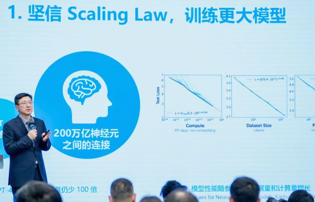
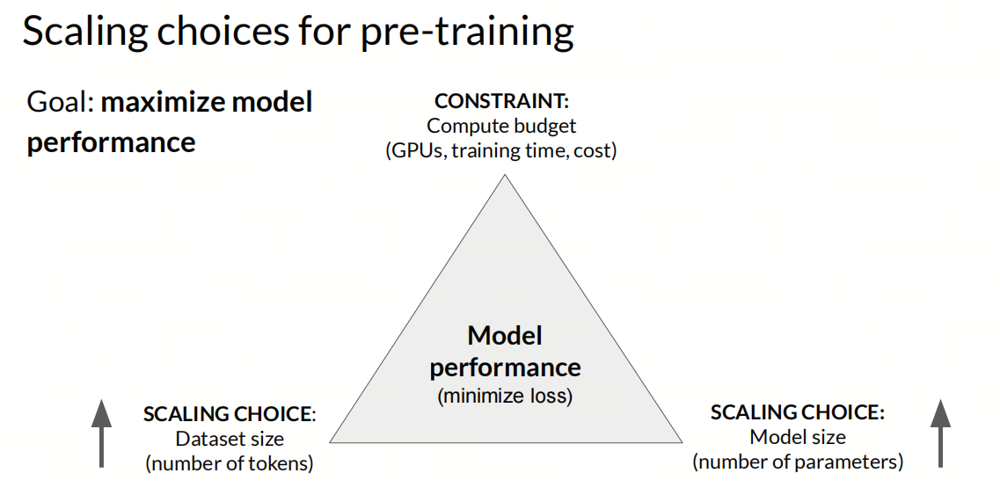
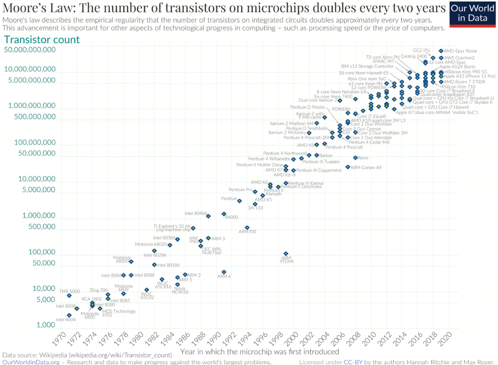
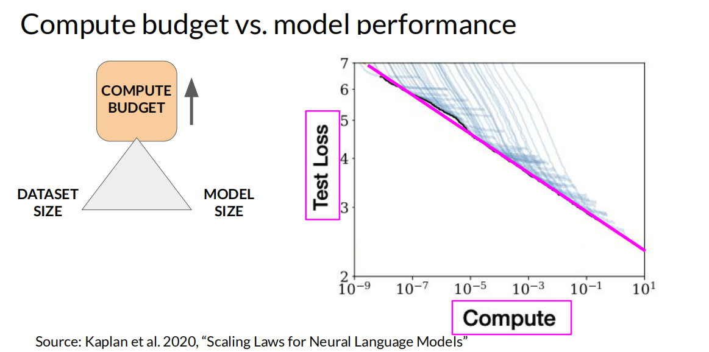
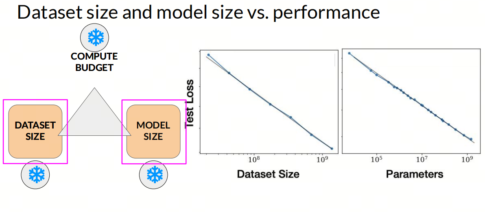

# What Is Scaling Law, the Thing Everyone Keeps Talking About?

## 1. What is Scaling Law?

`Scaling Law` usually means a law of scaling. The term is used a little differently across fields, but the core idea is the same: under certain conditions, a system's properties or performance change in a predictable way as its scale changes.

In artificial intelligence and machine learning, `Scaling Law` usually describes how model quality changes as we increase model size, for example the number of parameters, the amount of data, and the compute budget. These relationships often look close to a power law.

## 2. What can be called a law?

A law is a statement about an objective pattern in how things develop and change under certain conditions. It is supported by practice and evidence.

You can also think of a law as a theoretical model. It describes the real world in a specific situation and at a specific scale, but at other scales it may ***stop working*** or become ***less accurate***.

Usually, we call something a law only after it has been tested many times and widely accepted. Newton's three laws, Moore's law, and similar ideas are familiar examples.

- Newton's first law: an object stays at rest or continues moving in a straight line at constant speed unless an external force makes it change that state.

- Moore's law: the number of transistors that can fit on an integrated circuit roughly doubles every 18 months, and performance grows along with it.

- Murphy's law: if something can go wrong, it will go wrong (`Anything that can go wrong will go wrong`).

- The Pareto principle: 80% of the result comes from 20% of the causes. It is also called the 80/20 rule.

`Scaling Law` is often mentioned next to Moore's law. Moore's law guided the computer industry for decades. `Scaling Law` is a newer idea in AI. It matters a lot for training and deploying large models, but it has not been tested by time for nearly as long.

## 3. Is a law always universal?

### The turkey and the farmer

The turkey and the farmer is a classic philosophical thought experiment. It comes from Bertrand Russell's turkey problem, and Liu Cixin later referred to and developed a similar idea in the science-fiction novel `The Three-Body Problem`.

The story goes like this. A group of turkeys lives on a farm, and every day at 11 in the morning the farmer comes to feed them. One scientist turkey watches this for almost a whole year and never sees an exception. So it discovers the great law of its universe: `food appears every day at 11 in the morning`. On Thanksgiving morning, it announces this law to the other turkeys. But at 11, food does not appear. The farmer comes and takes them away to be slaughtered.

The point is that our understanding of natural patterns often rests on limited observations and experience. Those observations do not necessarily reveal the full nature of the phenomenon. Even if a pattern holds in most known cases, we cannot rule out the possibility that it fails under unknown conditions or conditions we have not observed yet. In `The Three-Body Problem`, this idea is used to think about scientific laws, the limits of human knowledge, and unknown forces in the universe.

## 4. Why study Scaling Law?

- Predicting model quality: with `Scaling Law`, researchers can estimate how much a model might improve under a given compute budget and data budget. This helps teams make better decisions before starting an expensive training run.

- Optimizing resources: `Scaling Law` helps researchers and engineers allocate compute and data more effectively, so they can get the best model quality within a limited budget.

## References

[1] [deeplearning.ai](https://www.deeplearning.ai/courses/generative-ai-with-llms/)

[2] [定律-百科](https://baike.baidu.com/item/%E5%AE%9A%E5%BE%8B/2076576)

## Author's GitHub and WeChat

[GitHub: LLMForEverybody](https://github.com/luhengshiwo/LLMForEverybody)
