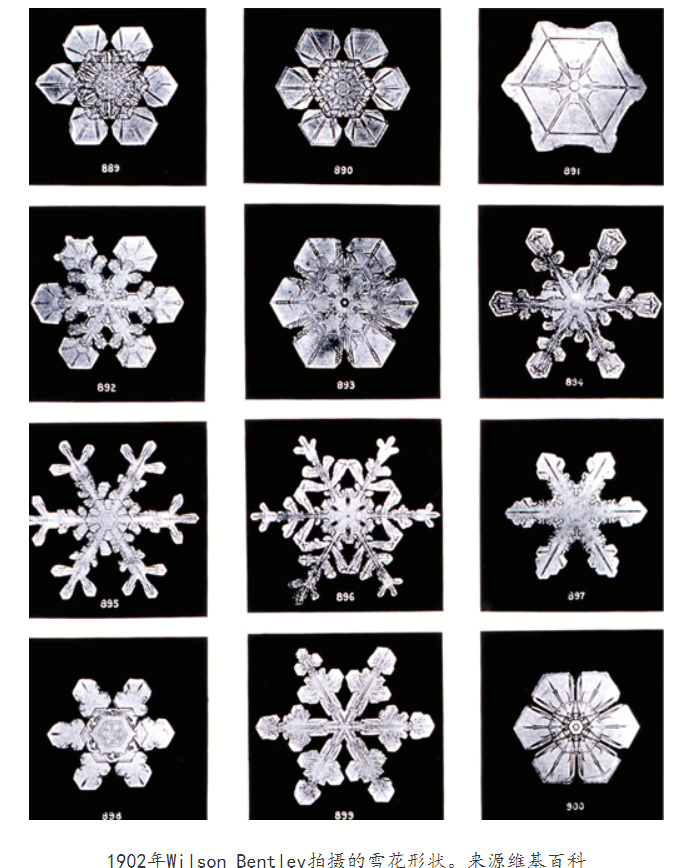
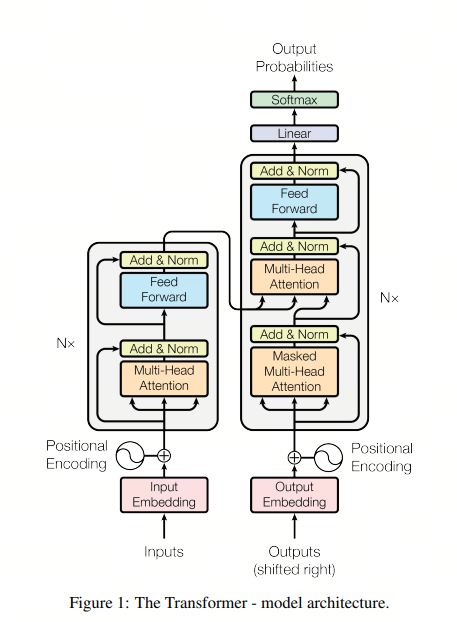
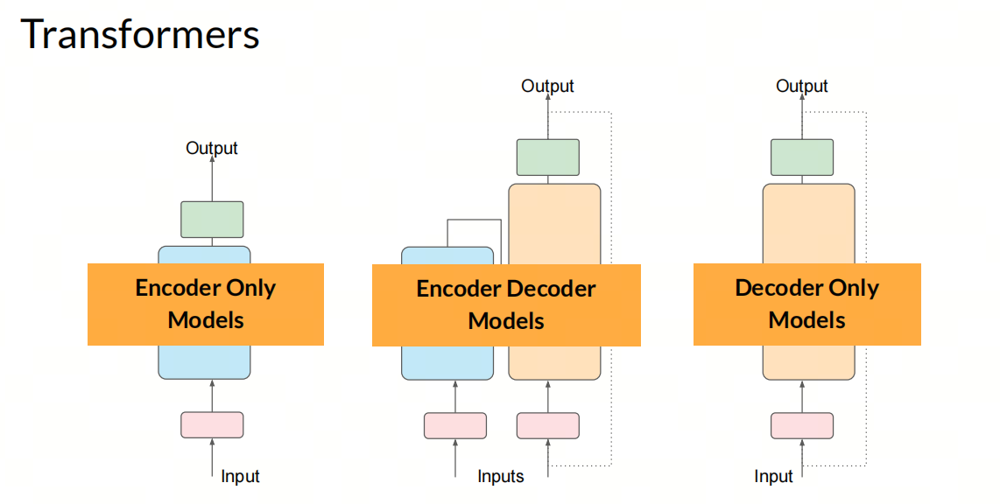
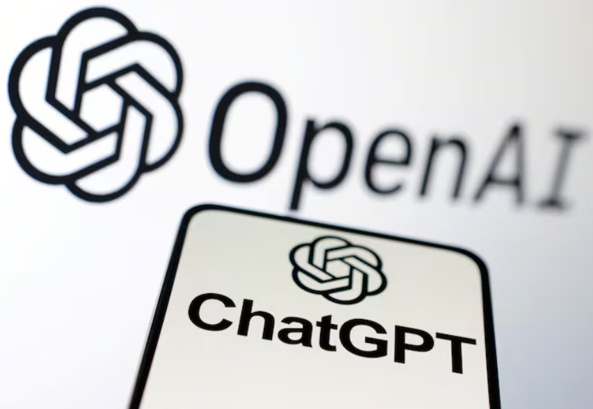

# Intelligence Emergence and the Origin of AGI

## 1. Emergence

***Emergence***

Emergence is the appearance of new, previously unpredictable patterns or behaviors in a complex system, arising from the interaction of many simple elements.

The formation of a snowflake is a good example of the beauty and complexity of emergent phenomena in nature. A single water molecule is simple, but when countless water molecules in the atmosphere meet cold air and start crystallizing, they spontaneously organize into the complex crystal structure of a snowflake with a specific symmetry.

Other examples of emergence include ant colony behavior, fish schools, bird flocks, and other complex collective phenomena that arise from the simple behavior of individual participants.

## 2. `The Poetry Cloud`

`The Poetry Cloud` is a novella by Chinese science fiction writer Liu Cixin, published in March 2003 in `Science Fiction World`. It is the second part of his "grand art series." Readers nominated it for that year's Galaxy Award, and it was later included in the collection `Best Chinese Science Fiction Works of 2003`.

An alien civilization with incredibly powerful technology, capable of destroying stars, faces a challenge from Earth life, which it sees as weeds and insects: the aliens discover that the human art of poetry lies far beyond technological control. Unable to clone human poetry, this civilization simply creates a program that brute-forces every possible combination of written characters, consumes all the energy of the Solar System to store a colossal amount of data, and forms a nebula on a galaxy-like scale.

I suspect this alien civilization from 2003 had not yet encountered intelligence emergence. Otherwise, it might not have solved the problem with such crude brute force.

## 3. Intelligence Emergence

***Intelligence Emergence***

Intelligence emergence is one of the key concepts in complex systems science. It describes a situation where, in a system made of many simple elements interacting in certain ways, new and previously unpredictable properties or behaviors appear spontaneously. These properties do not belong to any single element. They belong to the system as a whole.

In artificial intelligence, intelligence emergence usually refers to the phenomenon where, as an AI model grows in scale, for example in parameter count, it begins to show abilities or behaviors that were not explicitly programmed beforehand.

Signs of intelligence emergence include adaptability, new behavior, and complexity. For example, large language models such as GPT-3, after training, can unexpectedly write poetry, create articles, and even generate code. These abilities were not explicitly written into the program or directly specified in the training data. The model learned them on its own from a large amount of data.

Before GPT-3, it was hard for people to imagine that an AI model could generate natural language so freely. But as model scale and training data grew, signs of intelligence emergence appeared more and more often.

## 4. The Origin of GPT-3

1. In 2017, the Google Machine Translation team published `Attention is All You Need`. In it, the authors fully abandoned architectures such as RNN and CNN and used only Attention for machine translation, achieving strong results. This was the first proposal of Transformer.

> Comment: at the time, Transformer was an encoder-decoder architecture designed specifically for machine translation.

2. In June 2018, OpenAI published `Improving Language Understanding by Generative Pre-Training`, GPT-1, with 117 million parameters. The model used the decoder part of Transformer for feature extraction. This was the first application of Transformer in a pre-trained language model. The pre-training corpus included English Wikipedia, WebText, and other large text datasets.

> Comment: OpenAI saw this paper and took its decoder part for natural language understanding tasks. Importantly, OpenAI used the model for NLU at the time: intent recognition, named entity recognition, and other NLP tasks. The paper title, `Language Understanding`, shows the original intent well.

3. In October 2018, Google published `BERT: Pre-training of Deep Bidirectional Transformers for Language Understanding`, BERT, with 110 million to 1.3 billion parameters. The model used the encoder part of Transformer for feature extraction and surpassed GPT on a large set of NLP tasks.

> Comment: Google saw OpenAI's work and, for novelty, chose the encoder part for natural language understanding. Thanks to bidirectionality, BERT was stronger than GPT on NLU tasks.

4. In February 2019, OpenAI published `Language Models are Unsupervised Multitask Learners`, GPT-2, with 1.5 billion parameters. The model still used the decoder part of Transformer for feature extraction, and its quality was comparable to BERT.

> Comment: when OpenAI saw BERT beat GPT, it had two paths: follow Google's successful route and admit that its original choice between two options was wrong, or continue its own path and keep exploring the decoder. OpenAI chose the second route and continued developing GPT, which led to GPT-2.
> GPT-2 was comparable to BERT on natural language understanding tasks, but it also had a noticeable text generation ability, and that became its strength.

5. In June 2020, OpenAI published `Language Models are Few-Shot Learners`, GPT-3, with 175 billion parameters. The model still used the decoder part of Transformer for feature extraction, but by then its text generation was already impressive.

> Comment: probably while working on GPT-2, OpenAI noticed its generative ability and therefore continued exploring GPT-3. In GPT-3, text generation became truly impressive. OpenAI's approach was to keep increasing model scale, and this is where intelligence emergence began to show more clearly.

6. In July 2021, OpenAI published `Evaluating Large Language Models Trained on Code`, Codex.

7. In 2022, OpenAI published `Training language models to follow instructions with human feedback`, InstructGPT.

8. At the end of 2022, ChatGPT was launched based on GPT-3.5 and became a phenomenal product.

## 5. A Few Stories About OpenAI

The GPT project was only one of many OpenAI projects, and not even the most visible one. At that time, OpenAI had:

- ***Gym***: an open-source toolkit for reinforcement learning, widely used in academia and industry;
- ***Universe***: a reinforcement learning platform that let AI learn in games;
- ***OpenAI Five***: an AI system for Dota 2 that could play against humans;
- ***Dactyl***: an AI system for a robotic hand that could perform different operations;
- and other projects.

You can see that OpenAI's projects at the time mainly revolved around reinforcement learning. It felt like the reference point was DeepMind, acquired by Google, with its famous AlphaGo and AlphaStar.

## 6. Summary

At first, OpenAI also did not assume that a decoder could be used as a language model. During research, it accidentally found the route that scale solves many things.

And Google, after creating Transformer, could not hold onto the first-mover advantage. OpenAI used Transformer in GPT, and this eventually became one of the reasons the Google "Transformer eight" all left.

That is part of the charm of technological development: what matters is not only who invents something first, but who manages to use the invention better.

## References

[1] [【科普阅读】又下雪了，你观察过雪花的形状吗？](https://www.cma.gov.cn/2011xwzx/2011xqxxw/2011xqxyw/201902/t20190214_514696.html)

[2] [诗云百科词条](https://baike.baidu.com/item/%E8%AF%97%E4%BA%91/6642267)

[3] [Attention Is All You Need](https://arxiv.org/pdf/1706.03762)

[4] [GPT-1](https://cdn.openai.com/research-covers/language-unsupervised/language_understanding_paper.pdf)

[5] [Bert](https://arxiv.org/pdf/1810.04805)

[6] [GPT-2](https://cdn.openai.com/better-language-models/language_models_are_unsupervised_multitask_learners.pdf)

[7] [GPT-3](https://arxiv.org/pdf/2005.14165)

[8] [36k:Transformer论文「重磅更新」，八子全部离职](https://36kr.com/p/2372013517760776)

## Author's GitHub and WeChat

[GitHub: LLMForEverybody](https://github.com/luhengshiwo/LLMForEverybody)

---

## 📚 相关概念

[[concepts/Transformer 架构|Transformer 架构]] | [[concepts/LLM 评估 基准|LLM 评估 基准]] | [[entities/DeepSeek|DeepSeek]] | [[sources/Vaswani 2017 Attention|Vaswani 2017 Attention]] | [[sources/DeepSeek 4 技术|DeepSeek 4 技术]]

> 📌 来源：[[sources/LLMForEverybody/索引|LLMForEverybody 导航]] · 章节：AGI之路
