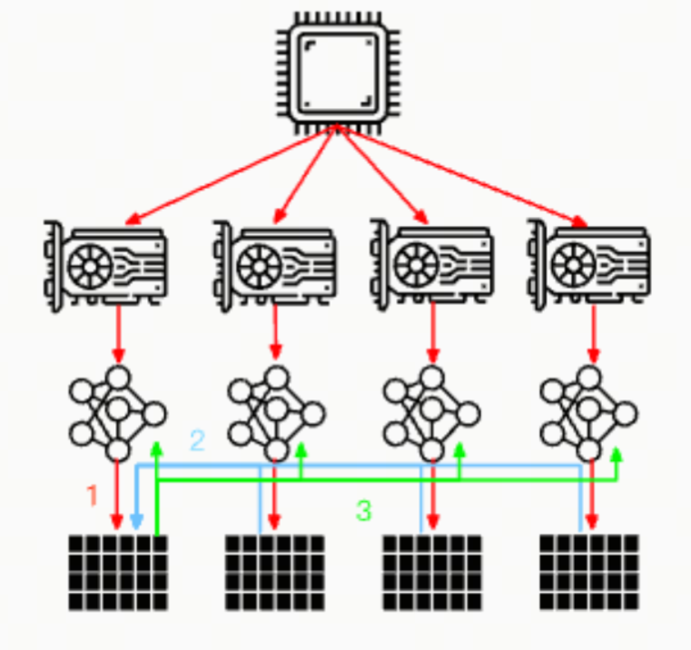

# LLM Distributed Training Parallelism, Part 2: Data Parallelism

## Introduction

Data Parallelism is a common parallel computing strategy. It splits a large dataset into several small batches or subsets, then trains the model on several GPUs at the same time. In LLM training, data parallelism helps speed up training effectively.

## DP and DDP

***DP (Data Parallel)***: data parallelism in the narrow sense, DP, is the simplest parallelization strategy. It distributes copies of the model across several GPUs on one machine. Each GPU has its own copy of the model and processes different subsets of data. At the end of each training step, all GPUs synchronize model parameters.



***DDP (Distributed Data Parallel)***: when data volume grows, training efficiency across several GPUs on one machine becomes limited. At that point, distributed data parallelism, DDP, is needed. DDP distributes model copies across several machines. Each machine has several GPUs, and each GPU has a model copy. At the end of each training step, all GPUs synchronize model parameters.

## ZeRO Data Parallel

***ZeRO***, short for "Zero Redundancy Optimizer", is a memory management technology proposed by Microsoft Research for optimizing distributed training. It is designed to solve the memory bottleneck that appears in large-scale distributed training, especially when training large deep learning models. ZeRO optimizes memory use by reducing redundant data, making it possible to train larger models on limited hardware resources.


You may also have heard of FSDP (Fully Sharded Data Parallel). ZeRO Data Parallel and FSDP can be viewed as similar technologies: both implement data parallelism by sharding model parameters across multiple devices.

## How ZeRO Data Parallel Works

The principle of ZeRO Data Parallel is not hard to understand. Here I quote the explanation from the official Hugging Face documentation [1].

Consider a simple model with 3 layers, where each layer has 3 parameters:

La | Lb | Lc
---|----|---
a0 | b0 | c0
a1 | b1 | c1
a2 | b2 | c2

Layer La has weights a0, a1, and a2.

If we have 3 GPUs, sharded DDP (= Zero-DP) splits the model across 3 GPUs like this:

GPU0:

La | Lb | Lc
---|----|---
a0 | b0 | c0

GPU1:

La | Lb | Lc
---|----|---
a1 | b1 | c1

GPU2:

La | Lb | Lc
---|----|---
a2 | b2 | c2

Now each GPU receives the normal mini-batch it would have received in DP:

```plaintext
x0 => GPU0
x1 => GPU1
x2 => GPU2
```

The inputs do not change. They "think" they will be processed by a normal model.

First, the inputs enter layer La.

Focus only on GPU0: x0 needs parameters a0, a1, and a2 to execute its forward path, but GPU0 has only a0. So it fetches a1 from GPU1 and a2 from GPU2, assembling all parts of the model.

At the same time, GPU1 receives mini-batch x1. It has only a1 but needs a0 and a2, so it fetches them from GPU0 and GPU2.

The same happens on GPU2, which receives x2. It fetches a0 and a1 from GPU0 and GPU1 and uses its a2 to reconstruct the full tensor.

All 3 GPUs reconstruct the full tensor and run forward propagation.

Once computation is complete, data that is no longer needed is discarded. It is used only during computation. Reconstruction is efficiently performed through prefetch.

The whole process repeats first for layer Lb, then forward for Lc, then backward for Lc, and then backward through Lc -> Lb -> La.

## A More Visual Explanation

A company organizes a three-day camping trip, and each person carries part of the gear:

```plaintext
A carries the tent
B carries snacks
C carries water
```

Every evening, they share what they have and receive what they do not have from others. In the morning, they assemble the distributed gear again and continue the journey. This is Sharded DDP/ZeRO DP.

Compare this with the simple strategy: everyone would have to carry their own tent, snacks, and water, which is much less efficient. The simple strategy is DataParallel (DP and DDP).

In the next article, we will look at pipeline parallelism.

## References

<div id="refer-anchor-1"></div>

[1] [Model Parallelism](https://huggingface.co/docs/transformers/v4.15.0/en/parallelism)

[2] [ZeRO: Memory Optimizations Toward Training Trillion Parameter Models](https://arxiv.org/pdf/1910.02054)

## Author's GitHub and WeChat

[GitHub: LLMForEverybody](https://github.com/luhengshiwo/LLMForEverybody)


---

## 📚 相关概念

[[concepts/Transformer 架构|Transformer 架构]] | [[concepts/分词器 LLM|分词器 LLM]] | [[concepts/LLM 训练 流水线|LLM 训练 流水线]] | [[concepts/RLHF DPO 对齐|RLHF DPO 对齐]] | [[concepts/LoRA PEFT 微调|LoRA PEFT 微调]] | [[concepts/多模态 LLM|多模态 LLM]] | [[concepts/模型 压缩 蒸馏|模型 压缩 蒸馏]] | [[entities/Hugging Face|Hugging Face]] | [[entities/DeepSeek|DeepSeek]] | [[entities/mindspore Transformer|mindspore Transformer]] | [[sources/Vaswani 2017 Attention|Vaswani 2017 Attention]] | [[sources/LLM 训练 流水线 指南|LLM 训练 流水线 指南]] | [[sources/DeepSeek 4 技术|DeepSeek 4 技术]]

> 📌 来源：[[sources/LLMForEverybody/索引|LLMForEverybody 导航]] · 章节：预训练
