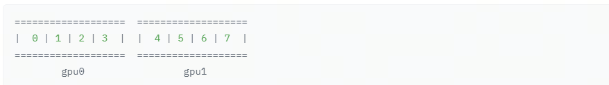
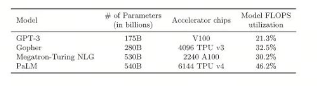

# LLM Distributed Training Parallelism, Part 3: Pipeline Parallelism

## Introduction

We know that large companies often work efficiently because everything is organized like an assembly line: each person is responsible for one part of the work. In parallel training, `pipeline parallelism` is an important technique. It splits model training into several stages, with a separate device responsible for each stage. This improves training efficiency. In this article, we will look at the basic principle of `pipeline parallelism`.

Below, `pipeline`, "assembly line", and "pipeline" all refer to the same concept.

## Naive Model Parallelism

Naive model parallelism (`Naive Model Parallelism`) means distributing groups of model layers across several GPUs. When data enters or leaves a layer, it switches to the device where that model layer is located. The rest of the process stays the same.

For example, the diagram below shows an 8-layer model:

We split it vertically in half: layers 0-3 are placed on GPU0, and layers 4-7 are placed on GPU1.

Now, when data moves from layer 0 to layer 1, from layer 1 to layer 2, and from layer 2 to layer 3, this is normal model execution. But when data needs to move from layer 3 to layer 4, it has to be transferred from GPU0 to GPU1, creating communication overhead. If the GPUs are on the same compute node, such as the same physical machine, this copy is very fast. But if the GPUs are on different compute nodes, such as multiple machines, communication overhead can be much higher.

Then layers 4, 5, 6, and 7 run as in a normal model. When layer 7 finishes, the data usually needs to be sent back to layer 0, where the label is located, or the label needs to be sent to the final layer. After that, loss can be computed and the optimizer can start working.

***Disadvantages***

- At any specific moment, all GPUs except one are idle.

- `shared embeddings` may require copying back and forth between GPUs.

## Pipeline Parallelism

***Pipeline parallelism (`PP`)*** is almost the same as `Naive MP`, but it solves the GPU idle problem: the incoming batch is split into micro-batches, and the pipeline is manually created, so different GPUs can participate in computation at the same time.

In the illustration from the [GPipe article](https://ai.googleblog.com/2019/03/introducing-gpipe-open-source-library.html), the top part shows `Naive MP`, and the bottom part shows `PP`:

***Bubble***

From the lower part of the figure, it is easy to see that `PP` has fewer dead zones. A dead zone means the GPU is idle. These idle regions are called `bubbles`.

Both parts of the figure show 4-stage parallelism. In other words, 4 GPUs participate in the pipeline. So there are 4 pipeline stages in the forward pass: F0, F1, F2, and F3, followed by backward stages: B3, B2, B1, and B0.

`PP` introduces a new tunable hyperparameter: `chunks`. It controls how many data blocks are sent through the same pipeline stage sequentially. For example, in the lower part of the figure above, `chunks = 4`. GPU0 performs the same forward pass for blocks 0, 1, 2, and 3 (`F0,0`, `F0,1`, `F0,2`, `F0,3`), then waits until the other GPUs finish their work. Only when they begin finishing does GPU0 become active again and run the backward pass for blocks 3, 2, 1, and 0 (`B0,3`, `B0,2`, `B0,1`, `B0,0`).

With `chunks=1`, we effectively get `Naive MP`, which is very inefficient. With a very large `chunks` value, the micro-batch becomes very small, which can also be inefficient. So you need to **experiment** to find the value where GPU utilization is best.

Some `bubbles`, or dead time, remain because the final forward stage has to wait for the pipeline's backward stage. The goal of choosing an optimal number of chunks is to reach high parallelism across all participating GPUs, improve utilization, and minimize bubble size.

In the next article, we will look at tensor parallelism.

## References

[1] [Model Parallelism](https://huggingface.co/docs/transformers/v4.15.0/en/parallelism)

[2] [Introducing GPipe, an Open Source Library for Efficiently Training Large-scale Neural Network Models](https://ai.googleblog.com/2019/03/introducing-gpipe-open-source-library.html)

## Author's GitHub and WeChat

[GitHub: LLMForEverybody](https://github.com/luhengshiwo/LLMForEverybody)

The repository contains the original Markdown files. The project is fully open source, and Stars and Forks are welcome.

---

## 📚 相关概念

[[concepts/Transformer 架构|Transformer 架构]] | [[concepts/分词器 LLM|分词器 LLM]] | [[concepts/LLM 训练 流水线|LLM 训练 流水线]] | [[concepts/RLHF DPO 对齐|RLHF DPO 对齐]] | [[concepts/LoRA PEFT 微调|LoRA PEFT 微调]] | [[concepts/多模态 LLM|多模态 LLM]] | [[concepts/模型 压缩 蒸馏|模型 压缩 蒸馏]] | [[entities/Hugging Face|Hugging Face]] | [[entities/DeepSeek|DeepSeek]] | [[entities/mindspore Transformer|mindspore Transformer]] | [[sources/Vaswani 2017 Attention|Vaswani 2017 Attention]] | [[sources/LLM 训练 流水线 指南|LLM 训练 流水线 指南]] | [[sources/DeepSeek 4 技术|DeepSeek 4 技术]]

> 📌 来源：[[sources/LLMForEverybody/索引|LLMForEverybody 导航]] · 章节：预训练
