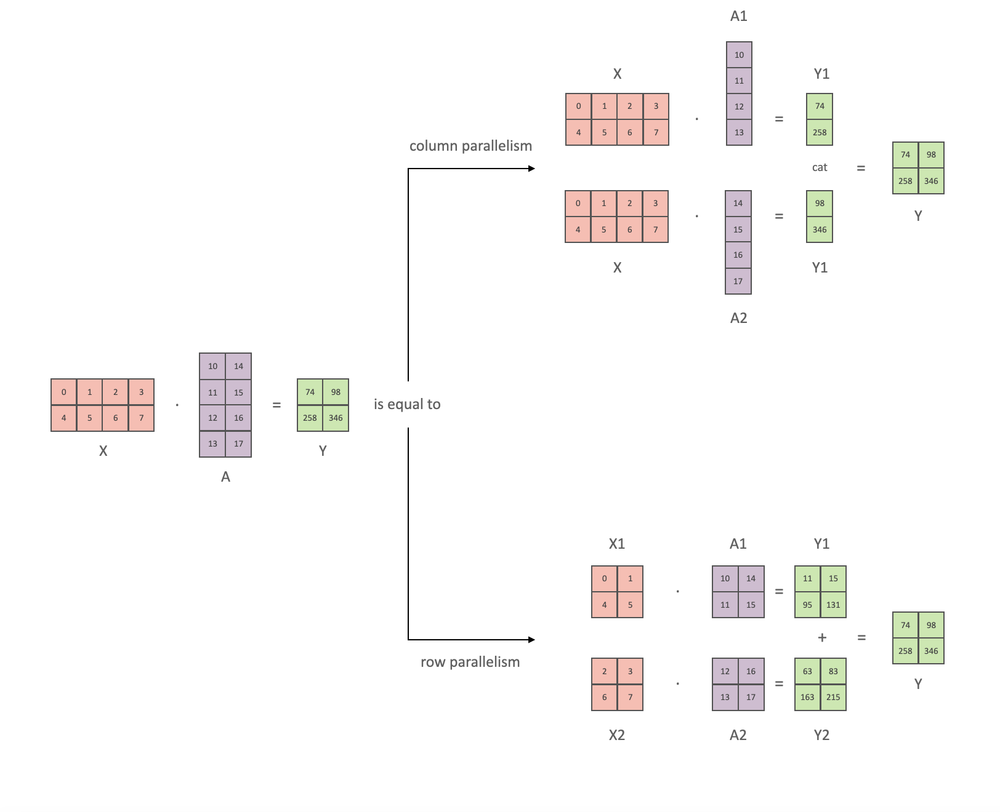
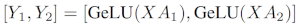
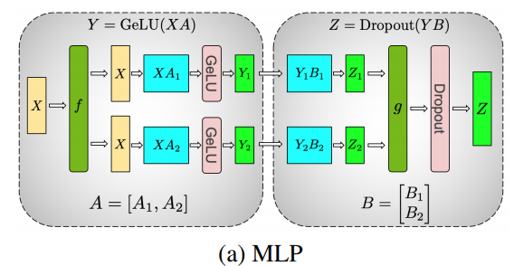
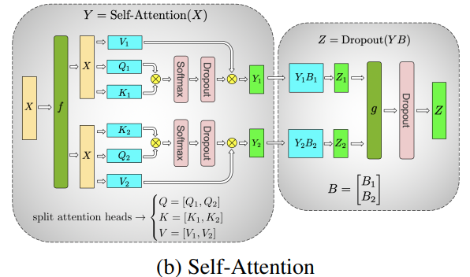

# LLM Distributed Training Parallelism, Part 4: Tensor Parallelism

## Introduction

In the Transformer architecture, there are two main compute-heavy parts: Self-Attention and MLP. In previous articles, we covered model parallelism and data parallelism. In this article, we look at tensor parallelism, a finer-grained form of parallelism that can further improve model training efficiency.

Tensor parallelism uses a property of matrix multiplication: it can be computed in parallel. Model parameters are split into several parts, each part is computed on a separate device, and then results are assembled. Below, we look separately at how tensor parallelism is implemented for FFN and Self-Attention.

## MLP

The main building blocks of MLP are fully connected `nn.Linear` layers followed by a nonlinear GeLU activation.

Following the notation from the Megatron paper [2], the dot product can be written as `Y = GeLU(XA)`, where `X` and `Y` are the input and output vectors, and `A` is the weight matrix.

Looking at the computation in matrix form, it is easy to see how matrix multiplication can be split across several GPUs:

If we split weight matrix `A` by columns across `N` GPUs and run the matrix multiplications from `XA_1` to `XA_n` in parallel, we get `N` output vectors: `Y_1`, `Y_2`, ..., `Y_n`. These vectors can be passed independently into GeLU:

Using this principle, an MLP of any depth can be updated without synchronization between GPUs until the very end, when the output vector needs to be assembled again.

The Megatron-LM authors give a useful example:

## Self-Attention

Tensor parallelism for Self-Attention is even simpler, because self-attention is naturally multi-head attention: each head can be assigned to a separate GPU.

In the figure above, self-attention can be computed in parallel on 2 GPUs: each GPU computes the attention mechanism for one head. In principle, as many heads as you have, that many GPUs can be used for parallel computation.

> Important note: `TP` requires a very fast network, so using `TP` across multiple nodes is not recommended. In practice, if one node has 4 GPUs, the maximum `TP` degree is 4. If you need `TP` degree 8, you need a node with at least 8 GPUs.

In the next article, we will look at hybrid parallelism.

## References

[1] [Model Parallelism](https://huggingface.co/docs/transformers/v4.15.0/en/parallelism)

[2] [Efficient Large-Scale Language Model Training on GPU Clusters Using Megatron-LM](https://arxiv.org/abs/2104.04473)

## Author's GitHub and WeChat

[GitHub: LLMForEverybody](https://github.com/luhengshiwo/LLMForEverybody)

The repository contains the original Markdown files. The project is fully open source, and Stars and Forks are welcome.
