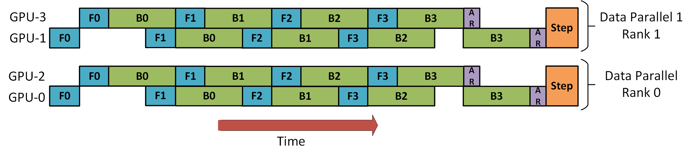

# LLM Distributed Training Parallelism, Part 5: Hybrid Parallelism

## Introduction

You may have heard of 3D parallelism many times. Earlier we discussed data parallelism, pipeline parallelism, and tensor parallelism. Each of those is a kind of 1D parallelism.

In some classifications, pipeline parallelism and tensor parallelism are considered model parallelism techniques.

Hybrid parallelism means using several parallelism techniques at the same time: for example, data parallelism plus model parallelism, data parallelism plus pipeline parallelism, or data parallelism plus tensor parallelism.

## DP + PP

Combining data parallelism and pipeline parallelism is a common 2D hybrid parallelism technique.

The figure below, from the [DeepSpeed pipeline parallelism tutorial](https://www.deepspeed.ai/tutorials/pipeline/), shows how to combine `DP` and `PP`.

The important point is that `DP Rank 0` does not see GPU2, and `DP Rank 1` does not see GPU3. From the perspective of `DP`, there are only GPU0 and GPU1, and it feeds data to them as if there were only two GPUs. GPU0 secretly offloads part of its work to GPU2 through `PP`. GPU1 does the same through GPU3.

Since each dimension needs at least 2 GPUs, this example requires at least 4 GPUs.

## DP + PP + TP

For more efficient training, 3D parallelism appeared: `PP` is combined with `TP` and `DP`, as shown below.

The figure comes from the blog [3D parallelism: Scaling to trillion-parameter models](https://www.microsoft.com/en-us/research/blog/deepspeed-extreme-scale-model-training-for-everyone/).

Since each dimension needs at least 2 GPUs, this setup requires at least 8 GPUs.

## DP + PP + TP + ZeRO

This is what people often call 4D parallelism. ZeRO is a technique proposed by DeepSpeed: it splits model parameters into several parts, each part is computed on a separate device, and results are assembled. In essence, this combines ZeRO-DP with `PP` and optionally `TP`.

For ZeRO-DP, see [LLM Distributed Training Parallelism, Part 2: Data Parallelism](LLM 分布式 训练 并行 部分 2 数据 并行.md).

Important: when ZeRO-DP is combined with `PP` and optionally `TP`, usually only Stage 1 ZeRO is enabled, meaning optimizer sharding.

In theory, Stage 2 ZeRO, meaning gradient sharding, can be used with `PP`, but it hurts performance.

Each micro-batch requires an extra collective Reduce-Scatter operation to aggregate gradients before sharding. This can greatly increase communication overhead. Because of the nature of `PP`, smaller micro-batches are used inside the Macro-Batch, and the main task is to balance arithmetic intensity, meaning micro-batch size, against minimizing pipeline bubbles, meaning number of micro-batches. So these communication costs become noticeable.

Also, because `PP` already reduces the number of layers per device, memory savings are not very large. `PP` already reduces gradient size to `1/PP`, and on top of that, the extra saving from gradient sharding is not as noticeable as in pure `DP`.

For the same reason, Stage 3 ZeRO is also not the best choice: it requires even more inter-node communication.

Since we have ZeRO, we get another advantage: ZeRO-Offload. Because Stage 1 is used, optimizer states can be offloaded to CPU.

## References

[1] [Model Parallelism](https://huggingface.co/docs/transformers/v4.15.0/en/parallelism)

[2] [Pipeline Parallelism tutorial](https://www.deepspeed.ai/tutorials/pipeline/)

[3] [3D parallelism: Scaling to trillion-parameter models](https://www.microsoft.com/en-us/research/blog/deepspeed-extreme-scale-model-training-for-everyone/)

## Author's GitHub and WeChat

[GitHub: LLMForEverybody](https://github.com/luhengshiwo/LLMForEverybody)

The repository contains the original Markdown files. The project is fully open source, and Stars and Forks are welcome.

---

## 📚 相关概念

[[concepts/Transformer 架构|Transformer 架构]] | [[concepts/分词器 LLM|分词器 LLM]] | [[concepts/LLM 训练 流水线|LLM 训练 流水线]] | [[concepts/RLHF DPO 对齐|RLHF DPO 对齐]] | [[concepts/LoRA PEFT 微调|LoRA PEFT 微调]] | [[concepts/多模态 LLM|多模态 LLM]] | [[concepts/模型 压缩 蒸馏|模型 压缩 蒸馏]] | [[entities/Hugging Face|Hugging Face]] | [[entities/DeepSeek|DeepSeek]] | [[entities/mindspore Transformer|mindspore Transformer]] | [[sources/Vaswani 2017 Attention|Vaswani 2017 Attention]] | [[sources/LLM 训练 流水线 指南|LLM 训练 流水线 指南]] | [[sources/DeepSeek 4 技术|DeepSeek 4 技术]]

> 📌 来源：[[sources/LLMForEverybody/索引|LLMForEverybody 导航]] · 章节：预训练
