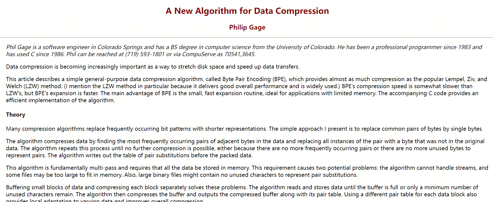
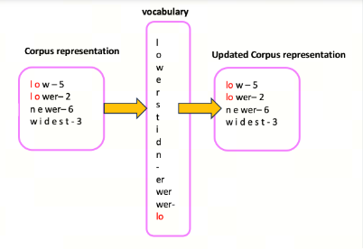

# Understanding LLM Tokenizers, Part 2: BPE (Byte-Pair Encoding)

## BPE (Byte-Pair Encoding)

Byte-Pair Encoding (BPE) was originally developed as a text compression algorithm. Philip Gage first proposed it in 1994 in the article `A New Algorithm for Data Compression`. Later, OpenAI used BPE as the Tokenizer foundation when pretraining GPT models. This approach is used in many Transformer models, including GPT, GPT-2, RoBERTa, BART, and DeBERTa.



In this article, I will try to explain BPE as intuitively as possible, using language and examples.

This article looks at tokenization for English text. Chinese tokenization will be discussed in the next materials.

## 1. Intuitive Understanding

Assume we have a corpus containing these words:

```plaintext
faster</ w>: 8, higher</ w>:6, stronger</ w>:7
```

The number shows how many times the word appears in the corpus.

> Note: `</ w>` marks the end of a word. The letter "w" is used because it is the first letter of "word"; this is a common naming convention. The exact token may differ across implementations or tokenization methods.

**First**, we treat every character as a separate token:

```plaintext
f a s t e r</ w>: 8, h i g h e r</ w>: 6, s t r o n g e r</ w>: 7
```

The corresponding vocabulary is:

```plaintext
'a', 'e', 'f', 'g', 'h', 'i', 'n', 'o', 'r', 's', 't', 'r</ w>'
```

**Second**, we count how often each adjacent token pair appears in the corpus:

```plaintext
'fa':8,'as':8,'st':15,'te':8,'er</ w>':21,'hi':6,'ig':6,'gh':6,'he':6,'tr':7,'ro':7,'on':7,'ng':7,'ge':7
```

```plaintext
8+8+15+8+21+6+6+6+6+7+7+7+7+7=115
```

We merge the most frequent character pair, `'e'` and `'r</ w>'`, into `'er</ w>'`. This is where the name byte pair comes from. The tokens become:

```plaintext
f a s t er</ w>: 8, h i g h er</ w>: 6, s t r o n g er</ w>: 7
```

The vocabulary changes to:

```plaintext
'a', 'f', 'g', 'h', 'i', 'n', 'o', 's','r', 't', 'er</ w>'
```

> Important: at this step, `'e'` and `'r</ w>'` were absorbed into `'er'`, because they no longer appear separately anywhere in the tokens except inside `'er'`.

**Third**, `'er</ w>'` is now its own token. We count adjacent token pair frequencies again:

```plaintext
'fa':8,'as':8,'st':15,'ter</ w>':8,'hi':6,'ig':6,'gh':6,'her</ w>':6,'tr':7,'ro':7,'on':7,'ng':7,'ger</ w>':7
```

We merge the most frequent pair, `'t'` and `'er</ w>'`, into `'ter</ w>'`. The tokens become:

```plaintext
f a s ter</ w>: 8, h i g h er</ w>: 6, s t r o n g er</ w>: 7
```

The vocabulary changes to:

```plaintext
'a', 'f', 'g', 'h', 'i', 'n', 'o', 's','r', 't', 'er</ w>', 'ter</ w>'
```

> Important: here `'er</ w>'` and `'t'` were not fully absorbed into `'ter</ w>'`, because both still appear elsewhere in the tokenized corpus.



**Repeat these steps** until reaching the target number of tokens or target number of iterations.

These two values are the hyperparameters of the BPE algorithm and can be adjusted for the specific task.

After understanding BPE, we can look at WordPiece and SentencePiece.

## References

[1] [A New Algorithm for Data Compression](http://www.pennelynn.com/Documents/CUJ/HTML/94HTML/19940045.HTM)

[2] [wiki:BPE](https://en.wikipedia.org/wiki/Byte_pair_encoding)

[3] [Byte-Pair Encoding tokenization](https://huggingface.co/learn/nlp-course/en/chapter6/5)

## Follow My GitHub and WeChat. No Time to Explain, Hop In.

[GitHub: LLMForEverybody](https://github.com/luhengshiwo/LLMForEverybody)

The repository contains the original Markdown files, all fully open source. Stars and forks are welcome.
