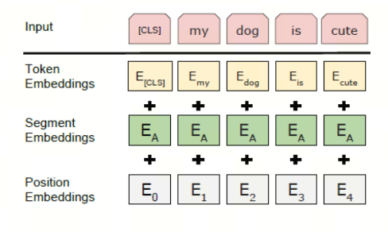

# Understanding LLM Tokenizers, Part 3: WordPiece

WordPiece is a tokenization algorithm developed by Google for pretraining BERT. It was later reused in many BERT-based Transformer models, such as DistilBERT, MobileBERT, Funnel Transformers, and MPNET. Its training process is very similar to BPE, but the actual tokenization method is different.


The name WordPiece points to its key function: splitting a word into pieces. It describes the basic operation directly.

In this article, I will try to explain the WordPiece tokenizer as intuitively as possible, using language and examples.

This article looks at tokenization for English text. Chinese tokenization will be discussed in later materials.

It is recommended to read the first two articles first:

> Insert link

The workflow of a WordPiece tokenizer is very similar to BPE. The difference is how it chooses which token pair to merge.

## 1. Intuitive Understanding

Assume we have a corpus containing these words:

```plaintext
faster</ w>: 8, higher</ w>:6, stronger</ w>:7
```

The number shows how many times the word appears in the corpus.

> Note: `</ w>` marks the end of a word. The letter "w" is used because it is the first letter of "word"; this is a common naming convention. The exact token may differ across implementations or tokenization methods.

**First**, we treat every character as a separate token:

```plaintext
f a s t e r</ w>: 8, h i g h e r</ w>: 6, s t r o n g e r</ w>: 7
```

The corresponding vocabulary is:

```plaintext
'a', 'e', 'f', 'g', 'h', 'i', 'n', 'o', 'r', 's', 't', 'r</ w>'
```

> Important: starting from the second step, WordPiece differs from BPE.

**Second**, we calculate a **score** for each token pair:

```plaintext
score = freq_of_pair / (freq_of_first_element * freq_of_second_element)
```

You may see the formula with `log`; that turns division into subtraction and simplifies computation.

```plaintext
'fa':1/8,'as':1/15,'st':1/15,'te':8/(21*15),'er</ w>':1/21,'hi':1/6,'ig':1/13,'gh':1/13,'he':1/21,'tr':1/15,'ro':1/7,'on':1/7,'ng':1/13,'ge':7/(13*21)
```

Now we merge the character pair with the highest score, 1/6, meaning `'h'` and `'i'`, into `'hi'`. The tokens become:

```plaintext
f a s t e r</ w>: 8, hi g h e r</ w>: 6, s t r o n g e r</ w>: 7
```

The vocabulary changes to:

```plaintext
'a', 'f', 'g', 'e','r','n', 'o', 's','r', 't', 'hi'
```

**Repeat these steps** until reaching the target number of tokens, target number of iterations, or another stopping condition.



These are the hyperparameters of the WordPiece algorithm, and they can be adjusted for a specific task.

> Important: `berttokenize` in Hugging Face uses WordPiece tokenization, but it differs from the description above by additionally using `##` to show that a subword is not the beginning of a word.

After understanding WordPiece, we can look at Unigram and SentencePiece.

## References

[1] [WordPiece tokenization](https://huggingface.co/learn/nlp-course/zh-CN/chapter6/6?fw=pt)

[2] [A brief overview of tokenizers](https://zhuanlan.zhihu.com/p/360290118)

## Follow My GitHub and WeChat. No Time to Explain, Hop In.

[GitHub: LLMForEverybody](https://github.com/luhengshiwo/LLMForEverybody)

The repository contains the original Markdown files, all fully open source. Stars and forks are welcome.


---

## 📚 相关概念

[[concepts/Transformer 架构|Transformer 架构]] | [[concepts/分词器 LLM|分词器 LLM]] | [[concepts/LLM 训练 流水线|LLM 训练 流水线]] | [[concepts/RLHF DPO 对齐|RLHF DPO 对齐]] | [[concepts/LoRA PEFT 微调|LoRA PEFT 微调]] | [[concepts/多模态 LLM|多模态 LLM]] | [[concepts/模型 压缩 蒸馏|模型 压缩 蒸馏]] | [[entities/Hugging Face|Hugging Face]] | [[entities/DeepSeek|DeepSeek]] | [[entities/mindspore Transformer|mindspore Transformer]] | [[sources/Vaswani 2017 Attention|Vaswani 2017 Attention]] | [[sources/LLM 训练 流水线 指南|LLM 训练 流水线 指南]] | [[sources/DeepSeek 4 技术|DeepSeek 4 技术]]

> 📌 来源：[[sources/LLMForEverybody/索引|LLMForEverybody 导航]] · 章节：预训练
