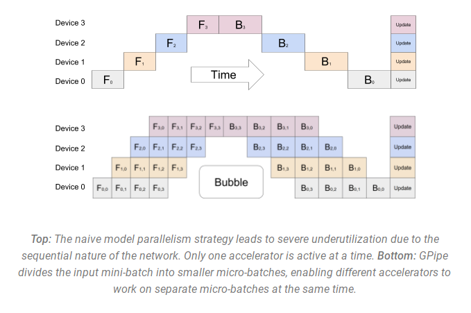

# LLM Training Frameworks, Part 1: Overview

## 1. Introduction

PyTorch is a very popular deep learning framework, with many advantages: dynamic computation graphs, ease of use, flexibility, and strong community support. But for LLM training, we need more specialized frameworks to cover special requirements. The main reason is `distributed training support`.

`Distributed training support`: large models usually require distributed training across multiple GPUs or TPUs. Although PyTorch supports distributed training, LLM training frameworks can provide more optimized distributed training strategies, such as model parallelism and data parallelism.

In previous materials, I discussed parallelization technologies in distributed training. See these articles:

LLM Distributed Training Parallelism, Part 1: Overview

LLM Distributed Training Parallelism, Part 2: Data Parallelism

LLM Distributed Training Parallelism, Part 3: Pipeline Parallelism

LLM Distributed Training Parallelism, Part 4: Tensor Parallelism

LLM Distributed Training Parallelism, Part 5: Mixed Parallelism

## 2. A Brief Introduction to Parallelization Technologies

In LLM training, we usually use several parallelization technologies:

1. DataParallel (DP): the same configuration is copied several times, and each copy receives part of the data. Processing happens in parallel, and all copies synchronize at the end of each training step.

2. TensorParallel (TP): each tensor is split into several blocks. Instead of storing the whole tensor on one GPU, each tensor shard is placed on its own GPU. During processing, each shard is processed separately and in parallel on different GPUs, and results are synchronized at the end of the step. This is called horizontal parallelism because the split happens along a horizontal dimension.

3. PipelineParallel (PP): the model is split vertically by layers across several GPUs, so each GPU stores only one layer or a few layers of the model. Each GPU processes different pipeline stages in parallel and works on a small part of the batch.

4. MixedParallel (MP): an approach that combines data parallelism, model parallelism, and pipeline parallelism. It lets you run data parallelism and model parallelism across several GPUs at the same time, while also using pipeline parallelism inside each GPU group.

## 3. Training Frameworks

There are now many large-model training frameworks that help speed up large model training. These frameworks usually provide more optimized distributed training strategies, such as model parallelism and data parallelism. I selected four influential mainstream frameworks:

1. FSDP

Fully Sharded Data Parallel (FSDP)[1](#refer-anchor-1) is a data parallelism method first proposed in FairScale-FSDP in 2021 and later integrated into PyTorch 1.11.

FSDP can be viewed as an implementation of `ZeRO-3`, one of the three levels of the ZeRO algorithm proposed in Microsoft DeepSpeed. By sharding model gradients, optimizer states, and parameters, each GPU stores only part of the parameter information, optimizing resource usage and improving training efficiency. FSDP is also closely co-designed with several core PyTorch components, including Tensor implementation, scheduler system, and CUDA memory caching allocator, to provide a non-invasive user experience and high training efficiency.

2. DeepSpeed

DeepSpeed[2](#refer-anchor-2) is a deep learning optimization library developed by Microsoft Research. It is designed for efficient and scalable training of large models. DeepSpeed significantly improves training efficiency and reduces resource requirements through advanced parallelism strategies, memory optimization technologies such as the ZeRO memory optimizer, and mixed precision training.

3. Megatron-LM

Megatron-LM[3](#refer-anchor-3) is NVIDIA's distributed training framework for large language models. It supports model training in multi-node, multi-GPU environments. Through model parallelism, Megatron-LM can train models with hundreds of billions of parameters. It combines Data Parallelism, Tensor Parallelism, and Pipeline Parallelism to train large models such as GPT-3.

`Small tip`: **transformer** can also mean **Transformer**, and **megatron** is **Megatron**.

4. Accelerate

Accelerate[4](#refer-anchor-4) from Hugging Face is a library for simplifying and speeding up deep learning model training. It supports distributed training across different hardware configurations, including CPU, GPU, TPU, and so on. Accelerate lets users easily switch between different parallelization strategies and also supports mixed precision training, which can further improve training efficiency.

Below is the parallelization strategy support of different frameworks as of 2024/10/12:

| Framework | DP | PP | TP | 3D parallelism |
| :--- |:----:| :----: |:---: |:---: |
| PyTorch(FSDP) | yes | no | no | no |
| DeepSpeed | yes | yes | yes | yes |
| Megatron-LM | yes | yes | yes | yes |
| Accelerate | yes | no | no | no |

## References

[1] [Getting Started with Fully Sharded Data Parallel(FSDP)](https://pytorch.org/tutorials/intermediate/FSDP_tutorial.html)

[2] [DeepSpeed](https://github.com/microsoft/DeepSpeed)

[3] [Megatron-LM](https://github.com/NVIDIA/Megatron-LM)

[4] [Accelerate](https://huggingface.co/docs/accelerate/index)

[5] My Zhihu

## Author's GitHub and WeChat

[GitHub: LLMForEverybody](https://github.com/luhengshiwo/LLMForEverybody)

The repository contains the original Markdown files and is fully open source. Stars and forks are welcome.
