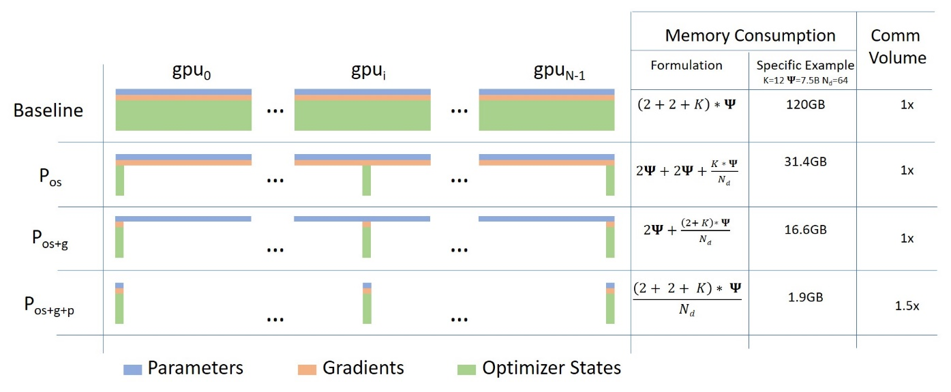
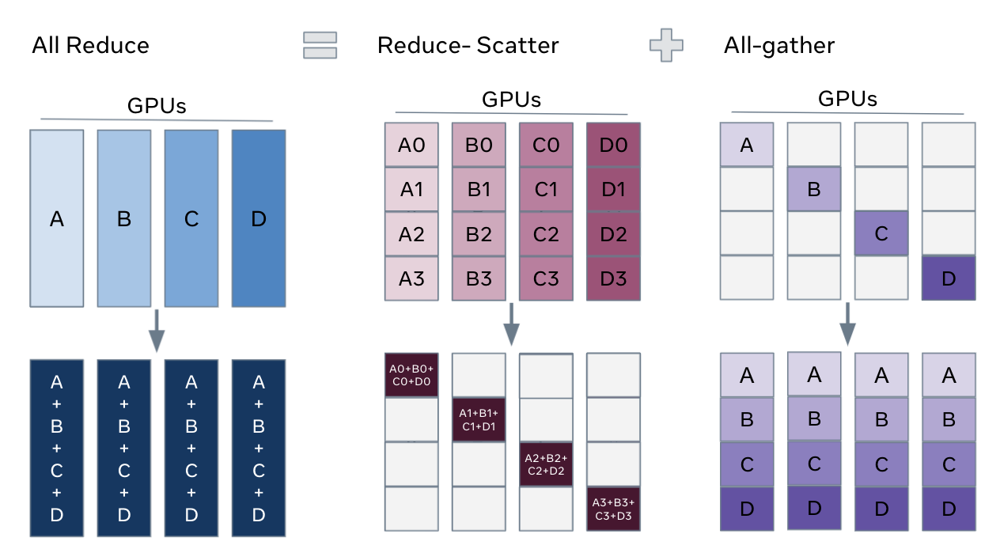

# LLM Training Frameworks, Part 2: FSDP

Fully Sharded Data Parallel (FSDP)[1](#refer-anchor-1) is a data parallelism method first proposed in FairScale-FSDP in 2021 and later integrated into PyTorch 1.11.

FSDP can be viewed as an implementation of `ZeRO-3`, one of the three levels of the ZeRO algorithm proposed in Microsoft DeepSpeed. By sharding model gradients, optimizer states, and parameters, each GPU stores only part of the parameter information, optimizing resource usage and improving training efficiency. FSDP is also closely co-designed with several core PyTorch components, including Tensor implementation, scheduler system, and CUDA memory caching allocator, to provide a non-invasive user experience and high training efficiency.

## 1. DP, DDP, and ZeRO

***DP (Data Parallel)***: data parallelism in the narrow sense, DP, is the simplest parallelization strategy. It distributes model copies across several GPUs on one machine. Each GPU has its own model copy and processes different subsets of data. At the end of each training step, all GPUs synchronize model parameters.

***DDP (Distributed Data Parallel)***: when data volume grows, training efficiency across several GPUs on one machine becomes limited. At that point, distributed data parallelism, DDP, is needed. DDP distributes model copies across several machines. Each machine has several GPUs, and each GPU has a model copy. At the end of each training step, all GPUs synchronize model parameters.

***ZeRO***, short for "Zero Redundancy Optimizer", is a memory management technology proposed by Microsoft Research for optimizing distributed training. It is designed to solve the memory bottleneck that appears in large-scale distributed training, especially when training large deep learning models. ZeRO optimizes memory use by reducing redundant data, making it possible to train larger models on limited hardware resources.



## 2. Explanation

Consider a simple model with 3 layers, where each layer has 3 parameters:

La | Lb | Lc
---|----|---
a0 | b0 | c0
a1 | b1 | c1
a2 | b2 | c2

Layer La has weights a0, a1, and a2.

If we have 3 GPUs, sharded DDP (= Zero-DP) splits the model across 3 GPUs like this:

GPU0:

La | Lb | Lc
---|----|---
a0 | b0 | c0

GPU1:

La | Lb | Lc
---|----|---
a1 | b1 | c1

GPU2:

La | Lb | Lc
---|----|---
a2 | b2 | c2

Now each GPU receives the normal mini-batch it would have received in DP:

```plaintext
x0 => GPU0
x1 => GPU1
x2 => GPU2
```

The inputs do not change. They "think" they will be processed by a normal model.

First, the inputs enter layer La.

Focus only on GPU0: x0 needs parameters a0, a1, and a2 to execute its forward path, but GPU0 has only a0. So it fetches a1 from GPU1 and a2 from GPU2, assembling all parts of the model.

At the same time, GPU1 receives mini-batch x1. It has only a1 but needs a0 and a2, so it fetches them from GPU0 and GPU2.

The same happens on GPU2, which receives x2. It fetches a0 and a1 from GPU0 and GPU1 and uses its a2 to reconstruct the full tensor.

All 3 GPUs reconstruct the full tensor and run forward propagation.

Once computation is complete, data that is no longer needed is discarded. It is used only during computation. Reconstruction is efficiently performed through prefetch.

The whole process repeats first for layer Lb, then forward for Lc, then backward for Lc, and then backward through Lc -> Lb -> La.

## 3. A More Visual Explanation

A company organizes a three-day camping trip, and each person carries part of the gear:

```plaintext
A carries the tent
B carries snacks
C carries water
```

Every evening, they share what they have and receive what they do not have from others. In the morning, they assemble the distributed gear again and continue the journey. This is Sharded DDP/ZeRO DP.

Compare this with the simple strategy: everyone would have to carry their own tent, snacks, and water, which is much less efficient.

## 4. FSDP

ZeRO has three algorithm levels: `ZeRO-1`, `ZeRO-2`, and `ZeRO-3`. `ZeRO-3` is the highest level: it shards model gradients, optimizer states, and parameters, so each GPU stores only part of the parameter information. This optimizes resource use and improves training efficiency. FSDP is an implementation of ZeRO-3.

## 5. FSDP in PyTorch



Using FSDP in PyTorch lets you train large models efficiently, especially when GPU memory is limited. FSDP is a data parallelism technology that shards model parameters, gradients, and optimizer states across several devices. The main steps are:

1. **Initialize the distributed environment**:
   First initialize the distributed environment for communication between processes. This is usually done through `torch.distributed.init_process_group`.

2. **Set local rank**:
   Each process needs to set the GPU it should use based on its `local_rank`. This can be obtained from environment variables or command line arguments.

3. **Create the FSDP model**:
   Use the `FullyShardedDataParallel` class to wrap your model. This allows model parameters to be sharded across several GPUs. For example:
   ```python
   from torch.distributed.fsdp import FullyShardedDataParallel

   model = MyModel()
   model = model.to(device)  # move the model to GPU
   fsdp_model = FullyShardedDataParallel(model, ...other parameters...)
   ```

4. **Configure FSDP parameters**:
   FSDP provides many parameters to control behavior, such as `cpu_offload`, which determines whether parameters are offloaded to CPU, and `sharding_strategy`, which sets the sharding strategy.

5. **Train the model**:
   In the training loop, FSDP automatically handles parameter sharding and gradient aggregation. You only need to run forward and backward propagation as usual.

6. **Save and load the model**:
   When using FSDP, saving and loading the model may require special handling so sharded parameters are processed correctly.

Below is a more detailed code example showing how to use FSDP to train a simple model:

```python
import torch
import torch.nn as nn
from torch.distributed.fsdp import FullyShardedDataParallel, CPUOffload

class MyModel(nn.Module):
    def __init__(self):
        super(MyModel, self).__init__()
        self.layer1 = nn.Linear(8, 4)
        self.layer2 = nn.Linear(4, 16)
        self.layer3 = nn.Linear(16, 4)

    def forward(self, x):
        x = torch.relu(self.layer1(x))
        x = torch.relu(self.layer2(x))
        x = self.layer3(x)
        return x

torch.distributed.init_process_group(backend='nccl')

local_rank = torch.distributed.get_rank()
world_size = torch.distributed.get_world_size()
torch.cuda.set_device(local_rank)

model = MyModel().to(local_rank)

fsdp_model = FullyShardedDataParallel(
    model,
    cpu_offload=CPUOffload(offload_params=True),
)

criterion = nn.MSELoss()
optimizer = torch.optim.Adam(fsdp_model.parameters(), lr=0.001)

for epoch in range(num_epochs):
    for data, target in dataloader:
        data, target = data.to(local_rank), target.to(local_rank)
        optimizer.zero_grad()
        output = fsdp_model(data)
        loss = criterion(output, target)
        loss.backward()
        optimizer.step()
```

## 6. FSDP in Hugging Face/Accelerate

As an advanced deep learning library, Hugging Face provides Accelerate, which helps users use distributed training technologies more easily, including FSDP. Accelerate provides a simple API that can turn a model into an FSDP model with only a few lines of code and automatically handle distributed training details.

```shell
compute_environment: LOCAL_MACHINE
debug: false
distributed_type: FSDP
downcast_bf16: 'no'
fsdp_config:
  fsdp_auto_wrap_policy: TRANSFORMER_BASED_WRAP
  fsdp_backward_prefetch_policy: BACKWARD_PRE
  fsdp_forward_prefetch: false
  fsdp_cpu_ram_efficient_loading: true
  fsdp_offload_params: false
  fsdp_sharding_strategy: FULL_SHARD
  fsdp_state_dict_type: SHARDED_STATE_DICT
  fsdp_sync_module_states: true
  fsdp_transformer_layer_cls_to_wrap: BertLayer
  fsdp_use_orig_params: true
machine_rank: 0
main_training_function: main
mixed_precision: bf16
num_machines: 1
num_processes: 2
rdzv_backend: static
same_network: true
tpu_env: []
tpu_use_cluster: false
tpu_use_sudo: false
use_cpu: false
```

`tip`: on September 13, 2024, almost a year after Accelerate development became stable, Accelerate 1.0.0 was officially released as the first release candidate.


Below is the parallelization strategy support of different frameworks as of 2024/10/12:

| Framework | DP | PP | TP | 3D parallelism |
| :--- |:----:| :----: |:---: |:---: |
| PyTorch(FSDP) | yes | no | no | no |
| DeepSpeed | yes | yes | yes | yes |
| Megatron-LM | yes | yes | yes | yes |
| Accelerate | yes | no | no | no |

## References

<div id="refer-anchor-1"></div>

[1] [Getting Started with Fully Sharded Data Parallel(FSDP)](https://pytorch.org/tutorials/intermediate/FSDP_tutorial.html)

<div id="refer-anchor-2"></div>

[2] [Accelerate](https://huggingface.co/docs/accelerate/index)

## Author's GitHub and WeChat

[GitHub: LLMForEverybody](https://github.com/luhengshiwo/LLMForEverybody)

The repository contains the original Markdown files and is fully open source. Stars and forks are welcome.
