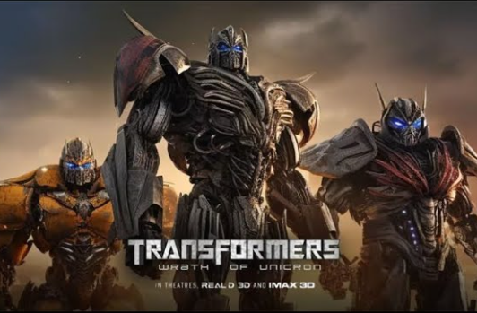
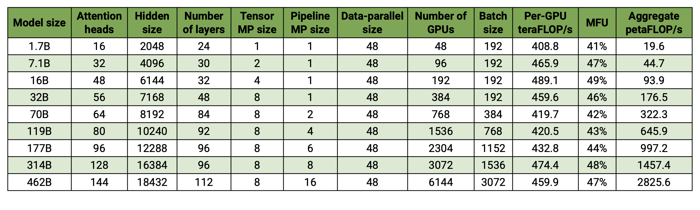

# LLM Training Frameworks, Part 4: Megatron-LM

Megatron-LM[1](#refer-anchor-1) is NVIDIA's distributed training framework for large language models. It supports model training in multi-node, multi-GPU environments. Megatron-LM uses Model Parallelism, allowing models with hundreds of billions of parameters to be trained. The framework combines Data Parallelism, Tensor Parallelism, and Pipeline Parallelism to train large models such as GPT-3.

`Small tip`: **transformer** can also mean **Transformer**, and **megatron** is **Megatron**.




## 1. Megatron-LM Features

Megatron-LM reproduces large models such as GPT-3 through data parallelism, tensor parallelism, and pipeline parallelism. It combines several parallelism strategies for training large language models, including Tensor Parallelism, Pipeline Parallelism, and Data Parallelism. These technologies help solve GPU memory limits, compute complexity, and parallelism strategy choices, making it possible to train larger models with limited hardware resources.



Megatron-LM features include:

1. **Data loading**: it has an efficient DataLoader where data is tokenized and shuffled before training. It also splits data into numbered indexed sequences and saves the indices, so tokenization only needs to be computed once;

2. **Fused CUDA kernels**: Megatron-LM uses Apex's fused AdamW implementation, which is faster than the PyTorch implementation. The idea of fused kernels is to combine similar operations that PyTorch usually runs separately into one hardware operation, reducing memory movement across many separate computations;

3. **Model parallelism technologies**: supports different parallelism strategies, including tensor parallelism, sequence parallelism, pipeline parallelism, context parallelism, and MoE expert parallelism;

4. **Optimizer and activation checkpointing**: the built-in distributed optimizer and activation recomputation function provide efficiency and stability during training;

5. **FlashAttention**: an efficient attention implementation that noticeably improves training speed;

6. **Multimodal support**: recent versions add support for multimodal training, expanding use cases.

## 2. Megatron-LM Implementation in PyTorch

To use Megatron-LM in PyTorch, you can follow these steps:

1. **Install dependencies**: make sure PyTorch, CUDA, NCCL, and NVIDIA APEX are installed. To simplify environment setup, you can use NVIDIA's NGC PyTorch container.

2. **Clone the Megatron-LM repository**:
   ```bash
   git clone https://github.com/NVIDIA/Megatron-LM.git
   ```

3. **Install Megatron-LM**: install Megatron-LM dependencies in the cloned repository directory.
   ```bash
   cd Megatron-LM
   pip install -r requirements.txt
   ```

4. **Prepare data**: Megatron-LM supports different datasets, such as Wikipedia, OpenWebText, and others. Download the dataset and preprocess it into a format the model can read.

5. **Train the model**: Megatron-LM provides training scripts. You can modify configuration files to set model size, number of training epochs, learning rate, and other parameters, then start training.

6. **Evaluate the model and run inference**: after training finishes, use Megatron-LM evaluation scripts to evaluate model performance, and run text generation or other inference tasks.

## 3. Megatron-LM Implementation in Accelerate

When using Megatron-LM, you can simplify distributed training with Hugging Face Accelerate. Accelerate provides a simple interface for integrating DeepSpeed and Megatron-LM, making distributed training in PyTorch easier.

Basic steps for distributed training with Megatron-LM and Accelerate:

1. **Install Megatron-LM and Accelerate**:
   - Install Megatron-LM and Accelerate with `pip`:
     ```bash
     pip install megatron-lm accelerate
     ```

2. **Prepare the environment**:
   - Make sure recent versions of PyTorch, CUDA, NCCL, and NVIDIA APEX are installed.
   - You can use NVIDIA's PyTorch container from NGC, which includes the needed setup.

3. **Configure Megatron-LM**:
   - Create a Megatron-LM configuration file that defines model parameters, training parameters, and so on.
   - Configure data paths, model save path, and other parameters.

4. **Write the training script**:
   - Import required libraries and define the model, dataloader, and optimizer.
   - Use the `Accelerator` object from Accelerate to prepare the model, optimizer, and dataloader.

5. **Start training**:
   - Use Accelerate's `launch` command to start distributed training.
   - Specify the configuration file, training script, and needed parameters.

6. **Monitor and tune**:
   - During training, use Megatron-LM tools for performance monitoring and tuning.

7. **Save and load checkpoints**:
   - Use Megatron-LM's checkpoint mechanism to save and load the model.

As of the completion of this article (2024/10/14), Megatron-LM support in Accelerate mainly focuses on DP; Accelerate does not yet have PP and TP.

Below is the parallelization strategy support of different frameworks as of 2024/10/14:

| Framework | DP | PP | TP | 3D parallelism |
| :--- |:----:| :----: |:---: |:---: |
| PyTorch(FSDP) | yes | no | no | no |
| DeepSpeed | yes | yes | yes | yes |
| Megatron-LM | yes | yes | yes | yes |
| Accelerate | yes | no | no | no |

## References

<div id="refer-anchor-1"></div>

[1] [Megatron-LM](https://github.com/NVIDIA/Megatron-LM)

## Follow My GitHub and WeChat Account, No Time to Explain, Hop In.

[GitHub: LLMForEverybody](https://github.com/luhengshiwo/LLMForEverybody)

The repository contains the original Markdown files. It is fully open source, and Stars and Forks are welcome.


---

## 📚 相关概念

[[concepts/Transformer 架构|Transformer 架构]] | [[concepts/分词器 LLM|分词器 LLM]] | [[concepts/LLM 训练 流水线|LLM 训练 流水线]] | [[concepts/RLHF DPO 对齐|RLHF DPO 对齐]] | [[concepts/LoRA PEFT 微调|LoRA PEFT 微调]] | [[concepts/多模态 LLM|多模态 LLM]] | [[concepts/模型 压缩 蒸馏|模型 压缩 蒸馏]] | [[entities/Hugging Face|Hugging Face]] | [[entities/DeepSeek|DeepSeek]] | [[entities/mindspore Transformer|mindspore Transformer]] | [[sources/Vaswani 2017 Attention|Vaswani 2017 Attention]] | [[sources/LLM 训练 流水线 指南|LLM 训练 流水线 指南]] | [[sources/DeepSeek 4 技术|DeepSeek 4 技术]]

> 📌 来源：[[sources/LLMForEverybody/索引|LLMForEverybody 导航]] · 章节：预训练
