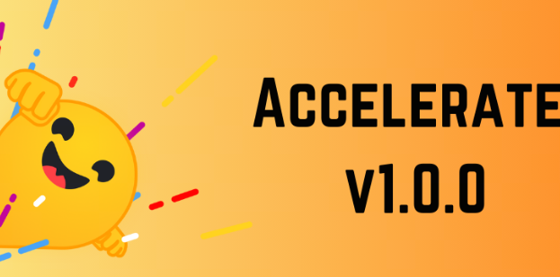

# LLM Training Frameworks, Part 5: Accelerate

Accelerate[1](#refer-anchor-1) from Hugging Face is a library for simplifying and speeding up deep learning model training. It supports distributed training across different hardware configurations, including CPU, GPU, TPU, and others. Accelerate lets users easily switch between different parallelism strategies and also supports mixed precision training, which further improves training efficiency.

## 1. Import

Accelerate requires only four extra lines of code to make the same PyTorch code work in any distributed configuration. It makes large-scale training and inference simple, efficient, and adaptable.

```python
+ from accelerate import Accelerator
+ accelerator = Accelerator()

+ model, optimizer, training_dataloader, scheduler = accelerator.prepare(
+     model, optimizer, training_dataloader, scheduler
+ )

  for batch in training_dataloader:
      optimizer.zero_grad()
      inputs, targets = batch
      inputs = inputs.to(device)
      targets = targets.to(device)
      outputs = model(inputs)
      loss = loss_function(outputs, targets)
+     accelerator.backward(loss)
      optimizer.step()
      scheduler.step()
```

## 2. Accelerate Features



1. **Distributed training support**: Accelerate supports distributed training on one node or multiple nodes, including multi-CPU, multi-GPU, and TPU configurations. It abstracts away boilerplate code related to distributed training, letting you focus on training logic instead of communication and synchronization.

2. **Mixed precision training support**: Accelerate provides tools and optimizations for mixed precision training, such as half-precision floating point. Mixed precision can reduce memory use and compute cost with almost no quality loss.

3. **Device placement and management**: Accelerate automatically handles device placement, moving data and models to the right devices to fully use available compute resources. This simplifies multi-device training and avoids the complexity of manual device distribution.

4. **High integration**: Accelerate integrates smoothly with other tools and libraries in the PyTorch ecosystem. It is compatible with common PyTorch dataloaders and optimizers and can be used with extensions such as DeepSpeed, Megatron-LM, and PyTorch Fully Sharded Data Parallel (FSDP).

5. **Configurable CLI tool**: Accelerate provides a CLI tool that makes it convenient to configure and test the training environment without manually writing launch scripts.

6. **Support for different hardware platforms**: Accelerate supports CPU, GPU, TPU, and hardware devices that support mixed precision training, such as FP16/BFloat16 and FP8 mixed precision with Transformer Engine.

7. **Simpler code migration**: Accelerate lets you convert single-machine training into distributed training with almost no code changes, improving model training speed and efficiency.

8. **Support for different training modes**: Accelerate supports different training modes, including CPU/single GPU (TPU)/multiple GPU (TPU), DDP mode, fp32/fp16, and others.

## 3. Support for Other Frameworks

Accelerate provides a simple and flexible way to speed up and scale PyTorch training scripts without writing a lot of boilerplate. Below are some integrations between Accelerate and other PyTorch ecosystem tools and libraries:

1. **Integration with PyTorch Fully Sharded Data Parallel (FSDP)**:
   FSDP is a data parallelism technology in PyTorch that can shard model parameters across several GPUs, reducing the memory pressure on one GPU. Accelerate supports FSDP so users can implement FSDP data parallelism in PyTorch more easily.

2. **Integration with DeepSpeed**:
   Accelerate lets users use DeepSpeed capabilities through `DeepSpeedPlugin`, such as ZeRO optimization. In an Accelerate configuration file, users can specify DeepSpeed configuration such as `zero_stage` and `gradient_accumulation_steps`, and enable or disable mixed precision training. This lets users use DeepSpeed optimization strategies through Accelerate without changing the original PyTorch training code.

3. **Integration with Megatron-LM**:
   Megatron-LM is a library for training large-scale Transformer models, supporting model parallelism and data parallelism. Accelerate supports Megatron-LM, allowing users to apply Accelerate's distributed training capabilities on top of Megatron-LM.

As of the completion of this article (2024/10/14), support for other frameworks in Accelerate mainly focuses on DP, because Accelerate does not yet have PP and TP.

Below is the parallelization strategy support of different frameworks as of 2024/10/12:

| Framework | DP | PP | TP | 3D parallelism |
| :--- |:----:| :----: |:---: |:---: |
| PyTorch(FSDP) | yes | no | no | no |
| DeepSpeed | yes | yes | yes | yes |
| Megatron-LM | yes | yes | yes | yes |
| Accelerate | yes | no | no | no |

## References

<div id="refer-anchor-1"></div>

[1] [Accelerate](https://huggingface.co/docs/accelerate/index)

## Follow My GitHub and WeChat Account, No Time to Explain, Hop In.

[GitHub: LLMForEverybody](https://github.com/luhengshiwo/LLMForEverybody)

The repository contains the original Markdown files. It is fully open source, and Stars and Forks are welcome.


---

## 📚 相关概念

[[concepts/Transformer 架构|Transformer 架构]] | [[concepts/分词器 LLM|分词器 LLM]] | [[concepts/LLM 训练 流水线|LLM 训练 流水线]] | [[concepts/RLHF DPO 对齐|RLHF DPO 对齐]] | [[concepts/LoRA PEFT 微调|LoRA PEFT 微调]] | [[concepts/多模态 LLM|多模态 LLM]] | [[concepts/模型 压缩 蒸馏|模型 压缩 蒸馏]] | [[entities/Hugging Face|Hugging Face]] | [[entities/DeepSeek|DeepSeek]] | [[entities/mindspore Transformer|mindspore Transformer]] | [[sources/Vaswani 2017 Attention|Vaswani 2017 Attention]] | [[sources/LLM 训练 流水线 指南|LLM 训练 流水线 指南]] | [[sources/DeepSeek 4 技术|DeepSeek 4 技术]]

> 📌 来源：[[sources/LLMForEverybody/索引|LLMForEverybody 导航]] · 章节：预训练
