## Zero. Introduction

If your feed has been full of DeepSeek lately, you will probably want to read its technical reports, especially v3 and r1. Those two reports quietly assume that the reader is already familiar with modern large-model training techniques.

So for beginners, reading those reports can be painful. The first hard stop will probably be MLA (Multi-head Latent Attention), a technique introduced in DeepSeek V2.

This article tries to walk through the path from MHA to MQA, GQA, and then MLA, along with the reasons behind that path. I will include the necessary background right away so you do not have to keep recursively searching for missing concepts. For beginners, the logic is linear. If you already know a section, you can just jump to the part you care about.

From this article, you will get the background needed to understand MLA:

1. Multi-Head Attention (MHA)
2. Positional encoding and RoPE
3. KV Cache, prefilling and decoding
4. Why MHA had to evolve into MQA and GQA

You will also understand the technical core of MLA:

1. A guess at how the MLA idea may have appeared from 0 to 1
2. The key technical points of MLA

## One. Multi-Head Attention (MHA)

If you have read the GPT series papers, the self-attention you studied there is Multi-Head Attention (MHA). MHA contains h Query, Key, and Value matrices, and the Key and Value matrix weights are not shared across attention heads.

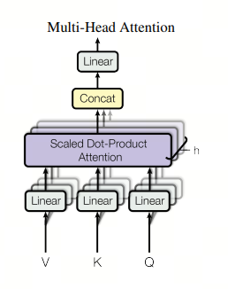

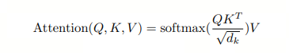

A little more detail:

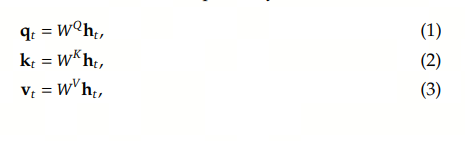

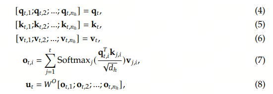

## Two. KV Cache: An Inference-Time Engineering Optimization

KV Cache is an engineering optimization that has existed since GPT-2. It is mainly used during generation, or decode, to cache previously computed key-value pairs, avoiding repeated computation and saving compute resources and time.

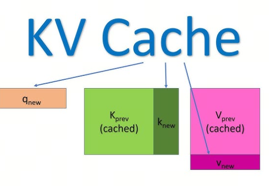

Inference has two stages: prefill and decode.

The Prefill stage processes the entire input sequence, generates the first output token, and initializes the KV Cache.

The Decode stage generates the following tokens one by one. If KV Cache exists, each step only needs to process the newly generated token, instead of recomputing Key and Value for all previous tokens.

I added a KV Cache example in Appendix 1 for reference.

## Three. MQA and GQA: Reducing the Cost of Multi-Head Attention

Since we are using a "space for time" strategy to speed up inference, the occupied VRAM becomes a new optimization target. Can we reduce the size of KV Cache?

In 2019 and 2023, the industry introduced MQA (Multi Query Attention) and GQA (Grouped Query Attention), respectively, to reduce KV Cache size.

There is no denying that both approaches affect large-model capability, but in both cases people generally believe the quality loss can be compensated through extra training or by increasing the FFN/GLU size.

MQA reduces KV Cache by sharing keys and values inside the Attention mechanism. There are still multiple queries, but only one set of keys and values. All queries use the same KV group, so KV Cache becomes smaller.

In GQA, not all queries share one KV group. Instead, queries inside one group share one KV group. This reduces KV Cache while preserving accuracy better. It is a compromise between MHA and MQA.

## Four. MLA: When the Road Seems to End, Another One Opens

### 4.1 Where Is the Next Innovation Point After MHA, MQA, and GQA?

MQA and GQA optimize how many KV values we cache. The intuition is simple: if we cache fewer KV values, we use less VRAM, and the drop in large-model capability can be compensated with extra training or a larger FFN/GLU.

If we want to reduce KV Cache usage even further, thinking only about the count is no longer enough. We have to think about KV itself: can each cached KV be made smaller than before?

We know an M*N matrix can be approximated by the product of an M*k matrix and a k*N matrix. So if we decompose the K or V matrix into the product of two smaller matrices, should the cached memory footprint not become smaller?

But there is a problem: if we simply decompose the large K/V matrix into two smaller matrices and cache them, inference still has to compute the full K matrix. Then caching loses its purpose, because the point of the cache is to reduce computation.

Is there a method that reduces cache size without increasing inference-time computation?

Let's look at how DeepSeek V2 handles this.

### 4.2 MLA Problems and Solutions

In the V2 paper, the expression for $K_t$ changes from $W^Kh_t$ to $W^{UK}W^{DKV}h_t$. Previously, the model cached $W^Kh_t$. Now it caches part of $K_t$, namely $W^{DKV}h_t$. The paper defines this as $c^{KV}_t$, which achieves the goal of reducing K size.

Notice that in $W^{UK}$, the letter $U$ means UP, increasing the dimension of the next matrix. In $W^{DKV}$, the letter $D$ means Down, reducing the dimension. The ${DK}$ part indicates that K and V share the same down-projection matrix, so it is enough to cache the same $c^{KV}_t$.

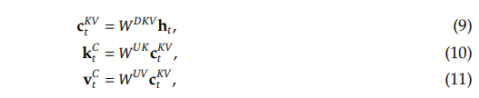

#### 4.2.1 More Computation During Inference

So far, it looks like everything is fine. But notice this: during inference, to get $K^{C}_t$ and $V^{C}_t$, we still have to multiply by $W^{UK}$ or $W^{UV}$. That means we lose the point of caching. What should we do?

Can we reduce the computation at this step during inference? If inference must explicitly reconstruct through $W^{UK}$ or $W^{UV}$, there is no solution. Luckily, $W^{UK}$ and $W^{UV}$ are only intermediate variables, and with a transformation we can elegantly avoid extra inference computation.

Look at the attention factor:

$${o}_{t,i} = \sum_{j=1}^{t} \text{Softmax}_j\frac{\mathbf{q}_{t,i}^T k_{t,j}}{\sqrt{d_h}}{v}_{j,i}$$

where $t$ denotes the t-th input/output, and $i$ denotes the i-th head.

$$(W^q_tx_t)^{T}*W^{UK}_tc^{KV}_t
= x_t^{T}*{W^q_t}^{T}*W^{UK}_t*c^{KV}_t
= x_t^{T}*({W^q_t}^{T}*W^{UK}_t)*c^{KV}_t$$

Using associativity of matrix multiplication, we can precompute ${W^q_t}^{T}*W^{UK}_t$ during inference. Then decode computation barely increases. This is called matrix absorption.

Similarly, $W^{UV}$ can also be absorbed into $W^{o}$. The important part is to handle transposes and related transformations carefully so the mathematical identity stays intact.

This is how DeepSeek V2 gets both benefits.

#### 4.2.2 MLA Is Not Compatible with RoPE Positional Encoding

But MLA introduces a new problem: compatibility with RoPE positional encoding. The authors even discussed this with Su Jianlin, the inventor of RoPE, and this is mentioned in his May 2024 blog post. The quote is shown below:

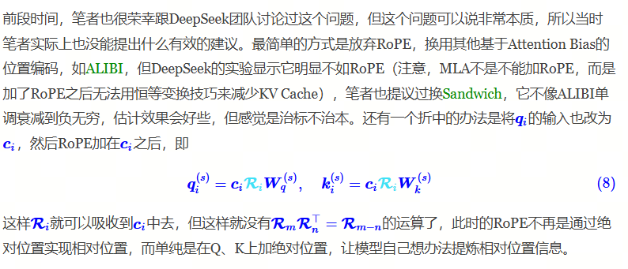

DeepSeek's final solution is to add another d dimensions to Q and K, used separately to store the positional vector. During inference, the model caches $c^{KV}_t$ and $K^R_t$.

### 4.3 The Full MLA Algorithm

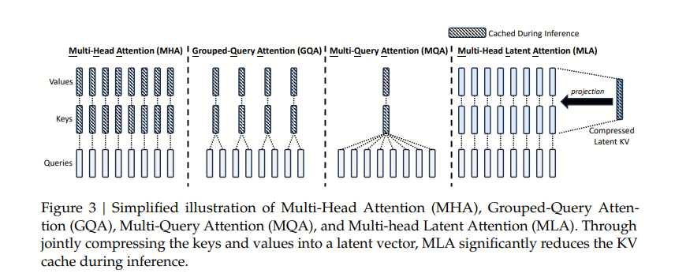

We can look at the full MLA algorithm, including RoPE positional encoding. The boxed parts are what gets cached.

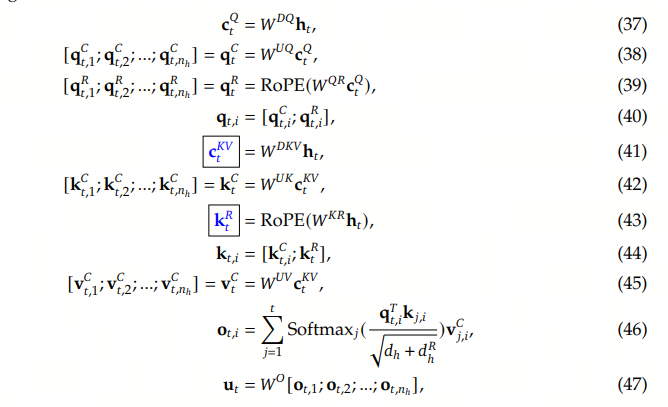

## Appendix 1. KV Cache

During inference, whether KV Cache is present has a major effect on the compute process and efficiency of a large model.

Using the prompt "真忒修斯之船是一个" and the generated completion "分享平台" as an example, let's compare inference without KV Cache and with KV Cache:

1. Inference without KV Cache

Principle: every time a new token is generated, the model has to receive the entire historical sequence again, meaning prompt plus already generated tokens, and recompute Key and Value vectors for all tokens.

Example process:

- Step 1: feed the full prompt "真忒修斯之船是一个", compute Key/Value for all tokens, and generate the first token "分".
  - Compute volume: the model needs to process 9 tokens, assuming "真忒修斯之船是一个" tokenizes into 9 tokens.
- Step 2: feed "真忒修斯之船是一个分", recompute Key/Value for all 10 tokens, and generate "享".
  - Redundant computation: Key/Value for the first 9 tokens is computed again.
- Step 3: feed "真忒修斯之船是一个分享", recompute Key/Value for 11 tokens, and generate "平".
- Step 4: feed "真忒修斯之船是一个分享平", recompute Key/Value for 12 tokens, and generate "台".

Problems:

- Redundant computation: when generating every token, Key/Value for all historical tokens must be recomputed. Complexity is $O(n^2)$, and VRAM usage plus compute time rise sharply with sequence length.
- High VRAM usage: VRAM has to store intermediate results for the whole historical sequence. For example, when generating "台", it needs to cache Key/Value for 10 tokens.

2. Inference with KV Cache

Principle: during prefill, Key/Value is computed and cached for the prompt. In the following decode stage, only the new token's Key/Value needs to be computed, while old results are reused from the cache.

Example process:

- Prefill: feed the full prompt "真忒修斯之船是一个", compute and cache Key/Value for its 9 tokens, and generate the first token "分".
- Decode:
  - Step 1: feed the new token "分", compute only its Key/Value, combine it with the 9 cached Key/Value pairs, and generate "享".
  - Step 2: feed the new token "享", compute its Key/Value, combine it with 10 cached Key/Value pairs, and generate "平".
  - Step 3: feed the new token "平", compute its Key/Value, combine it with 11 cached Key/Value pairs, and generate "台".

Benefits:

- Less computation: complexity drops from $O(n^2)$ to $O(n)$; each decode step only computes Key/Value for the new token.
- Better VRAM usage: only cached Key/Value has to be stored. The VRAM usage formula is $4blh(s+n)$, and reuse avoids redundant storage.
- Higher speed: experiments show that KV Cache can improve throughput by dozens of times.

3. Key comparison

| Dimension | Without KV Cache | With KV Cache |
| :---: |:----:| :----: |
| Compute complexity | $O(n^2)$, grows quadratically with sequence length | $O(n)$, only the new token is computed |
| VRAM usage | Stores intermediate results for the whole sequence, high VRAM requirements | Caches Key/Value, controlled VRAM requirements |
| Generation speed | Low, because historical tokens are repeatedly recomputed | High, because only the new token is computed and the cache is reused |
| Suitable scenarios | Short sequence generation (<100 tokens) | Long sequence generation, such as API input or video generation |

## Appendix 2. Relative Positional Encoding RoPE

Rotation Position Encoding.

RoPE was proposed to use relative position information between tokens. It assumes that the dot product between the query vector $q_m$ and key vector $k_n$ can be expressed by a function $g$. The inputs to this function g are word embedding vectors $x_m$, $x_n$, and the relative position between them, $m-n$.

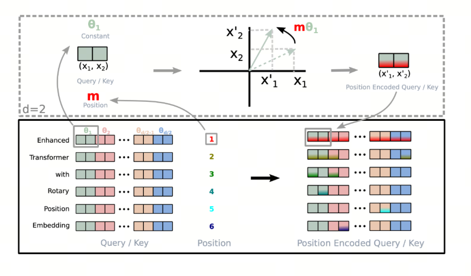

Bold hypothesis, careful verification. Now our goal is to find a suitable function $g$ so that $g(x_m, x_n, m-n)$ can capture relative position information between word vectors.
RoPE proposes this: when the word vector is two-dimensional, the plane can be treated as a complex plane. If we define function $f$ as follows, then we can find the corresponding function $g$.

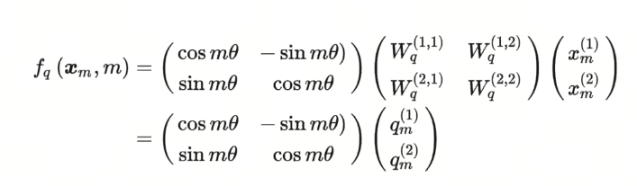

Re denotes the real part of a complex number. Going one step further, function $f$ can be defined like this:

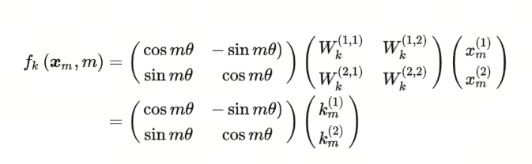

Isn't the original query matrix being multiplied by a rotation matrix here? In other words, after adding positional information $m$, using RoPE is equivalent to rotating the original query matrix. That is where "rotary" comes from.
Similarly, $f_K$ can be written like this:

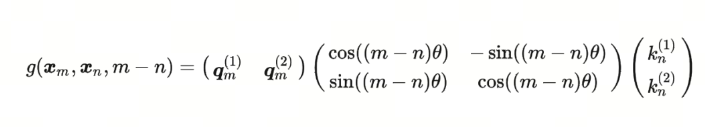

Then the corresponding function $g$ is:

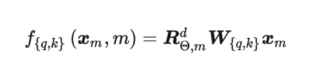

## References

[1] [Attention is all you need](https://arxiv.org/abs/1706.03762)

[2] [Fast Transformer Decoding: One Write-Head is All You Need](https://arxiv.org/abs/1911.02150)

[3] [GQA: Training Generalized Multi-Query Transformer Models from Multi-Head Checkpoints](https://arxiv.org/abs/2305.13245)

[4] [DeepSeek-V2: A Strong, Economical, and Efficient Mixture-of-Experts Language Model](https://arxiv.org/abs/2405.04434)

[5] [The ultimate tradeoff between cache and quality: from MHA, MQA, GQA to MLA](https://spaces.ac.cn/archives/10091)
