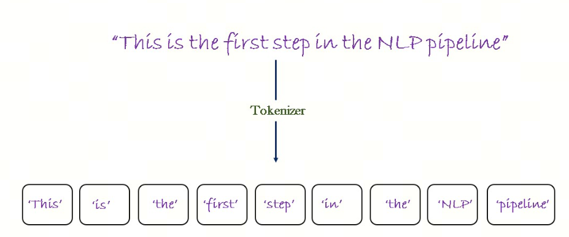
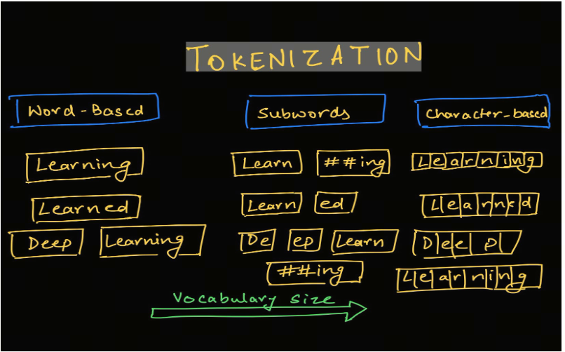

# Understanding LLM Tokenizers, Part 1: Word Level, Character Level, Subword Level

## Token and Tokenizer

You probably already know that the input and output unit of an LLM is a token, not a word or a letter. In Chinese, it is not exactly a word or a character either. But what is a token?

> We often use the word token directly. In some texts it may be translated as "token" or "label." If "label" appears below, it means token.

A token is the result of splitting text with a Tokenizer. A Tokenizer is the tool that splits text into tokens.

In LLMs, Tokenizers usually use three common splitting methods: word level, character level, and subword level. We will cover them in several short articles. I will look at the problem from two sides: English, a West Germanic language, and Chinese, from the Sinitic language group.

Thanks here to @Tao-Yida for the correction: English belongs to the West Germanic branch of the Germanic languages, such as English, German, and Dutch, not to the Latin/Romance group, such as French, Spanish, and Italian.

## 1. Word Level

### English

Word-level tokenization is the simplest method: split text into words by spaces or punctuation.

For example, take this sentence:

>Let's do some NLP tasks.

If we split by spaces, we get these tokens:

>Let's, do, some, NLP, tasks.

If we split by punctuation, we get:

>Let, ', s, do, some, NLP, tasks, .

### Chinese

In Chinese, tokenization is more complex. Chinese has no spaces, so splitting text into words is much harder than in English. Consider this example:

>我们来做一个自然语言处理任务。

One possible tokenization result is:

>我们，来，做，一个，自然语言处理，任务。

The advantage of this method is that it is simple and easy to understand. The downside is that it handles unknown words poorly, also called Out-of-Vocabulary or OOV. The familiar `jieba` library is based on this general approach.

> `jieba` uses statistical and rule-based methods, combining TF-IDF, TextRank, and other techniques. It builds a word graph based on a prefix dictionary and uses dynamic programming to find the maximum-probability path, which gives the segmentation result. For unknown words, `jieba` uses an HMM, a hidden Markov model, based on the ability of Chinese characters to form words, and uses the Viterbi algorithm for recognition and segmentation.

## 2. Character Level

### English

Character level splits text into tokens at the letter level. This approach has a few advantages:

- the vocabulary becomes much smaller;
- OOV becomes much less of a problem, because any word can be built from characters.

For example, take this sentence:

>Let's do some NLP tasks.

After character-level splitting, we get:

>L, e, t, ', s, d, o, s, o, m, e, N, L, P, t, a, s, k, s, .

### Chinese

In Chinese, character level means splitting text into tokens at the Chinese-character level.

For example, take this sentence:

>我们来做一个自然语言处理任务。

After splitting by character, we get:

>我，们，来，做，一，个，自，然，语，言，处，理，任，务，。

This method is not perfect either. Intuitively, working with characters instead of words is not always meaningful. In English, a single letter usually carries little meaning by itself, while the word carries the meaning. In Chinese, each character contains more information than a letter in Latin-based languages.

Also, the model ends up processing many more tokens. With word-level tokenization, a word may be one token. With character-level tokenization, the same word can easily become 10 or more tokens.

## 3. Subword Level

In practice, both character-level and word-level tokenization have shortcomings. Subword level sits between the two.

> Sub-word is often translated as "subword."

Subword tokenization algorithms follow this principle: frequent words should not be split into smaller subwords, while rare words should be broken into meaningful subwords.

### English

Consider this example:

> Let's do Sub-word level tokenizer.

Tokenization result:

> let's</ w>, do</ w>, Sub, -word</ w>, level</ w>, token, izer</ w>, .</ w>,

`</ w>` usually marks the end of a word. The letter "w" is used because it is the first letter of "word"; this is a common naming convention. The exact marker may differ across implementations or tokenization methods.

### Chinese

In Chinese, it may seem that there is no concept of subword: the smallest unit appears to be the character. So how can we use subword tokenization? Maybe through components and radicals? Do not rush. We will discuss that later.

## 4. Other Subword Tokenizers

It looks like most of the race is around subword tokenizers, so the industry has gradually developed a whole series of tokenization algorithms, including:

- Byte-Pair Encoding (BPE)
- WordPiece
- Unigram
- SentencePiece
- BBPE

In the next articles in this series, we will continue looking at these common subword tokenizers.

## References

[1] [Tokenizer](https://huggingface.co/learn/nlp-course/zh-CN/chapter2/4?fw=pt)

[2] [word_vs_character_level_tokenization](https://njoroge.tomorrow.co.ke/blog/ai/word_vs_character_level_tokenization)

[3] [tokenization-in-natural-language-processing](https://wisdomml.in/tokenization-in-natural-language-processing/)

## Follow My GitHub and WeChat. No Time to Explain, Hop In.

[GitHub: LLMForEverybody](https://github.com/luhengshiwo/LLMForEverybody)

The repository contains the original Markdown files, all fully open source. Stars and forks are welcome.
