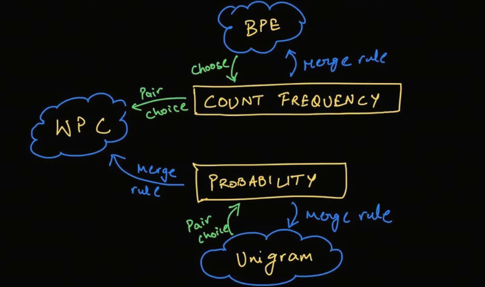

# Understanding LLM Tokenizers, Part 4: Unigram

SentencePiece often uses the Unigram algorithm. This tokenization algorithm is used by models such as AlBERT, T5, mBART, Big Bird, and XLNet.


Compared with BPE and WordPiece, Unigram works differently: it starts with a large vocabulary, then deletes tokens from it until it reaches the desired vocabulary size.

At each training step, the Unigram algorithm calculates the loss of the corpus under the current vocabulary.

Then for each token in the vocabulary, it calculates how much the total loss would increase if that token were removed, and looks for the token with the smallest loss increase.

Such tokens have less influence on the total corpus loss, so in a sense they are "less needed" and are the best candidates for deletion.

## Building the Base Vocabulary

The first step of Unigram is to build a base vocabulary containing all possible tokens.

Here we will no longer use the `olympic` example. Instead, we will use the official Hugging Face example. The reason is simple: the author is too lazy to calculate that many probabilities by hand.

Assume we have a corpus containing these words:

```plaintext
("hug", 10), ("pug", 5), ("pun", 12), ("bun", 4), ("hugs", 5)
```

The numbers show how many times each word appears.

Then our base vocabulary looks like this. It contains all subwords:

```plaintext
["h", "u", "g", "hu", "ug", "p", "pu", "n", "un", "b", "bu", "s", "hug", "gs", "ugs"]
```

## The Unigram Model

First, count the frequencies of all subwords in this base vocabulary:

```plaintext
("h", 15) ("u", 36) ("g", 20) ("hu", 15) ("ug", 20) ("p", 17) ("pu", 17) ("n", 16) ("un", 16) ("b", 4) ("bu", 4) ("s", 5) ("hug", 15) ("gs", 5) ("ugs", 5)
```

The total frequency is 210, so the probability of one subword, for example `'ug'`, is 20/210.

A Unigram model is the simplest language model. It assumes each word is independent, so we can directly calculate the probability of each word.

For example, the probability of one tokenization of `'pug'`, `['p','u','g']`, is:

$$p(['p','u','g']) = P('p')*P('u')*P('g') = 5/210 * 36/210 * 20/210 = 0.000389$$

The probability of another tokenization, `['pu','g']`, is:

$$p(['pu','g']) = P('pu')*P('g') = 5/210 * 20/210 = 0.0022676$$

So for the word `'pug'`, we can calculate the probabilities of all tokenization options and choose the one with the highest probability.

```plaintext
['p','u','g'] 0.000389
['pu','g'] 0.0022676
["p", "ug"] : 0.0022676
```

We choose `['pu','g']` as the tokenization of `'pug'`. If probabilities are equal, we can choose the first option.

In this way, we can process all words with the tokenizer and get the large vocabulary mentioned above.

In practice, there is a small problem: exhaustive search is too expensive. So expensive, in fact, that the author of this article also does not want to calculate it all by hand.

> Question: if our word has n characters, how many tokenization options are there under exhaustive search? Welcome to the comments.

In practice, the Viterbi algorithm can be used to solve this search problem.

The Viterbi algorithm is outside the scope of this article. If you are interested, you can read more about it yourself.

## Deleting Tokens

Now we already have a large vocabulary. Next we need to delete some tokens until we reach the target vocabulary size.

The deletion logic is like layoffs in a company: whoever affects the whole system least gets removed.

Important: base characters cannot be deleted. We need them to generate OOV words.

For the corpus above:

```plaintext
("hug", 10), ("pug", 5), ("pun", 12), ("bun", 4), ("hugs", 5)
```

Assume that after the previous step, we have tokenized each word and obtained these segmentations and scores:

```plaintext
"hug": ["hug"] (score 0.071428)
"pug": ["pu", "g"] (score 0.007710)
"pun": ["pu", "n"] (score 0.006168)
"bun": ["bu", "n"] (score 0.001451)
"hugs": ["hug", "s"] (score 0.001701)
```

> Important: in the shown tokenizer, individual characters are omitted. For example, the tokenization of `"hug"` actually includes `["h","u","g","hug"]`, but for simplicity `["h","u","g"]` is omitted.

Now we need to calculate the influence of each token on the overall result. This loss is negative log likelihood, calculated from these scores.

Initial loss:

$$10 * (-log(0.071428)) + 5 * (-log(0.007710)) + 12 * (-log(0.006168)) + 4 * (-log(0.001451)) + 5 * (-log(0.001701)) = 169.8$$

Assume the token we want to remove is `'hug'`. Then the tokenizations of `hug` and `hugs` are affected. After updating the token table without `'hug'`, the scores become:

```plaintext
"hug": ["hu", "g"] (score 0.006802)
"hugs": ["hu", "gs"] (score 0.001701)
```

Loss change:

$$hug: - 10 * (-log(0.071428)) + 10 * (-log(0.006802)) = 23.5 $$

$$hugs: - 5 * (-log(0.001701)) + 5 * (-log(0.001701)) = 0 $$

The total change is 23.5.

We iterate over all tokens, find the one with the smallest loss increase, and delete it.

Repeat these steps until the target vocabulary size is reached.



Now you understand the basic principles of BPE and Unigram. Next, we will discuss the tokenization tool SentencePiece.

## References

<div id="refer-anchor-1"></div>

## Follow My GitHub and WeChat. No Time to Explain, Hop In.

[GitHub: LLMForEverybody](https://github.com/luhengshiwo/LLMForEverybody)

The repository contains the original Markdown files, all fully open source. Stars and forks are welcome.
