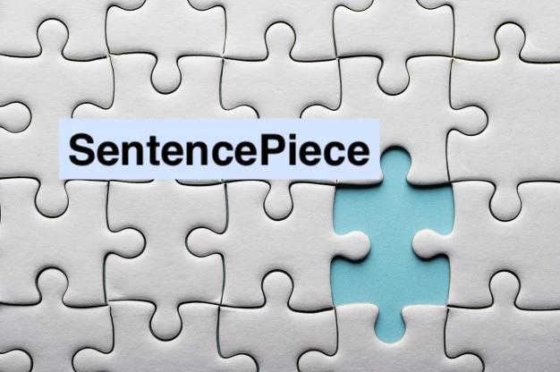
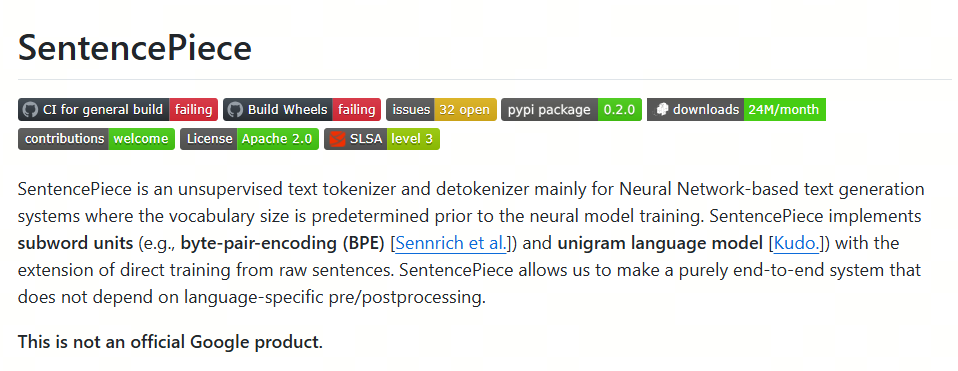

# Understanding LLM Tokenizers, Part 5: SentencePiece

Great, we finally reached one of the most widely used tokenizers in LLMs: SentencePiece.

In the tokenizers discussed earlier, English, which has spaces, and Chinese, which has no spaces, often use different tokenization methods. In LLMs, we need one unified tokenizer that can handle multiple languages.

That requires a unified way to encode characters. It should support different languages and not change its encoding principle depending on the language.

## SentencePiece

SentencePiece is a universal tokenizer developed by Google. It works with different languages, and its name already hints at how it works.

Remember WordPiece? WordPiece first splits a word into minimal pieces, then merges them into new tokens.

SentencePiece splits a sentence into minimal pieces, then merges them into tokens. This description applies to the BPE implementation; if Unigram is used, the logic is different. But this is where the name comes from.

SentencePiece has several features:

- fully data-driven: the tokenization and detokenization model is trained directly on sentences, with no pre-segmentation;
- language-agnostic: a sentence is treated as a sequence of Unicode characters, without language-specific logic;
- multiple subword algorithms: supports BPE and Unigram;
- fast and lightweight: splits text quickly and uses little memory;
- self-contained: the same model file gives the same tokenization and detokenization results;
- directly generates vocabulary IDs: manages the vocabulary-to-ID mapping and can produce vocabulary ID sequences directly from raw sentences;
- NFKC-based normalization: performs NFKC text normalization.

## Unicode

Official Unicode website: https://home.unicode.org/

Unicode, whose full name is the Unicode Standard, is an information technology industry standard. The Unicode Consortium uses the Chinese name `统一码`; it is also translated as universal code, universal character set, or universal character encoding. Unicode collects and encodes most of the world's writing systems, allowing computers to process and display text through one unified character set. This reduces switching and conversion problems between different encodings and gives a cross-platform solution to garbled text.

So all languages in the world can use one encoding method. For LLMs, there is only one "language" left: Unicode.

On this basis, we can apply the BPE or Unigram algorithms already discussed for tokenization.

You can review the principles and implementation of BPE and Unigram in the previous articles.

Finally, we will look at another BPE variant: BBPE.

## References

[1] [Unigram tokenization](https://huggingface.co/learn/nlp-course/en/chapter6/7?fw=pt)

[2] [github:sentencepiece](https://github.com/google/sentencepiece)

## Follow My GitHub and WeChat. No Time to Explain, Hop In.

[GitHub: LLMForEverybody](https://github.com/luhengshiwo/LLMForEverybody)

The repository contains the original Markdown files, all fully open source. Stars and forks are welcome.
