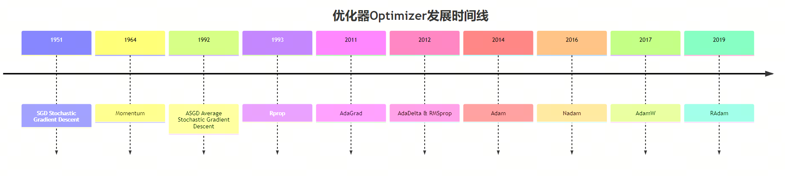
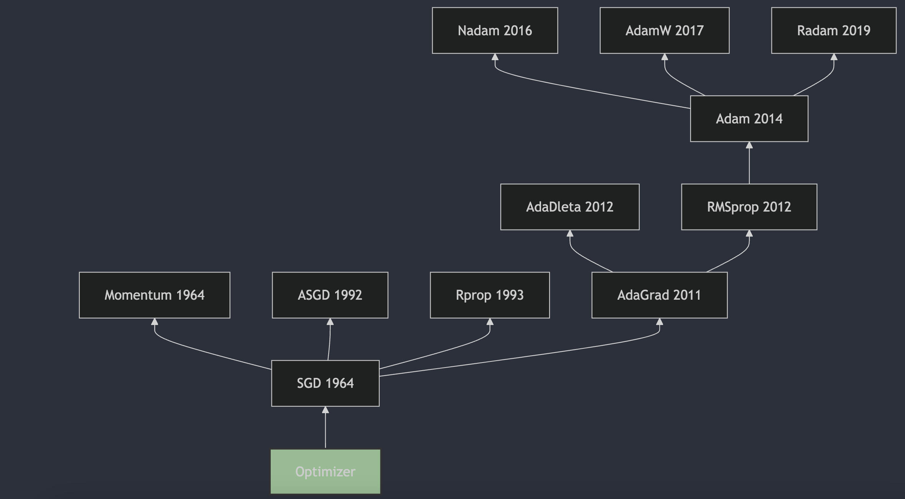

3 minutes a day: fully understanding neural network optimizers, part 1. Overview

An optimizer updates model parameters during training. Its goal is to adjust parameters to minimize the loss function, meaning the difference between the model's predictions and the real data.

From 1951, when Herbert Robbins and Sutton Monro proposed SGD in "A Stochastic Approximation Method," to 2017, when AdamW became the mainstream choice, optimizer development has already spanned more than 70 years. In this series, we will look at neural network optimizers from a historical perspective and hopefully understand the evolution of optimization algorithms more clearly.

## Development History

### 1. SGD 1951

Stochastic Gradient Descent (SGD) is an iterative optimization method for differentiable objective functions, a stochastic approximation of gradient descent. The origins of SGD go back to 1951, when Herbert Robbins and Sutton Monro first described stochastic approximation in "A Stochastic Approximation Method" [1](#refer-anchor-1). It can be viewed as a predecessor of SGD. Then J. Kiefer and J. Wolfowitz published "Stochastic Estimation of the Maximum of a Regression Function" [2](#refer-anchor-2) in 1952, which is closer to the modern machine-learning view of SGD.

### 2. Momentum 1964

Momentum was first proposed by B.T. Polyak in 1964. It is used to speed up convergence of gradient descent algorithms, especially on optimization problems with high condition numbers. Polyak described it in "Some methods of speeding up the convergence of iteration methods" [3](#refer-anchor-3), published in "USSR Computational Mathematics and Mathematical Physics." Momentum adds part of the previous step's velocity to each update, helping the algorithm accelerate in consistent directions and reduce oscillation on flat parts of the objective function. Later, it became widely used in machine learning, especially deep learning, and became an important part of optimization algorithms.

### 3. ASGD 1992

Averaged Stochastic Gradient Descent (ASGD) is an iterative optimization method for differentiable objective functions, a stochastic approximation of gradient descent. ASGD appeared in 1992, when B.T. Polyak first described it in "Acceleration of Stochastic Approximation by Averaging" [4](#refer-anchor-4). ASGD updates parameters based on the average of several stochastic gradients, reducing random-gradient variance and improving convergence speed. When training deep neural networks, this method can help the algorithm converge faster to an optimal solution.

### 4. Rprop 1993

Rprop (Resilient Backpropagation) was proposed by Martin Riedmiller and Hermann Braun in 1993. It is described in detail in "A Direct Adaptive Method for Faster Backpropagation Learning: The RPROP Algorithm" [5](#refer-anchor-5), published at an IEEE conference in 1993. Rprop computes updates using only the sign of the gradient, not its magnitude, and dynamically adjusts the step size independently for each weight. This removes some built-in weaknesses of traditional gradient descent, and through local adaptation to the behavior of the error function, it makes training more efficient and easier to understand.

### 5. AdaGrad 2011

AdaGrad (Adaptive Gradient Algorithm) was proposed by John Duchi, Elad Hazan, and Yoram Singer. The algorithm is described in detail in the 2011 paper "Adaptive Subgradient Methods for Online Learning and Stochastic Optimization" [6](#refer-anchor-6), published in the "Journal of Machine Learning Research." AdaGrad's main feature is independent learning-rate adjustment for each parameter: rarely updated parameters get a larger learning rate, while frequently updated parameters get a smaller one. This adaptive learning-rate adjustment is especially useful for sparse data because it gives more attention to sparse features. But AdaGrad has a drawback: the accumulated sum of squared gradients can make the learning rate too small, so training almost stops in later stages. To solve this, later researchers proposed AdaGrad variants such as AdaDelta and Adam.

### 6. AdaDelta 2012

AdaDelta was proposed by Matthew D. Zeiler in 2012. A detailed description and the algorithm principles can be found in "ADADELTA: An Adaptive Learning Rate Method" [7](#refer-anchor-7). AdaDelta is designed to solve AdaGrad's monotonically decreasing learning-rate problem. It limits the window of accumulated gradients and adjusts the learning rate, allowing the algorithm to adaptively tune each parameter's learning rate during training without manual setup. The method is robust to noisy gradient information, different model architectures, different data patterns, and hyperparameter choices.

### 7. RMSProp 2012

RMSProp (Root Mean Square Propagation) was proposed by Geoffrey Hinton in his Coursera course "Neural Networks for Machine Learning" [8](#refer-anchor-8), first released in 2012. RMSProp is an adaptive learning-rate optimization method. It uses an exponential moving average of squared gradients to adjust each parameter's learning rate, speed up training, and reduce oscillation during training. It is especially suitable for non-convex optimization problems and is widely used in deep learning.

### 8. Adam 2014

Adam (Adaptive Moment Estimation) was proposed by Diederik P. Kingma and Jimmy Ba in 2014. A detailed description and the algorithm principles can be found in "Adam: A Method for Stochastic Optimization" [9](#refer-anchor-9), first submitted to arXiv on December 22, 2014, and later published at ICLR 2015. Adam combines the advantages of AdaGrad and RMSProp. It computes estimates of the first and second moments of the gradient to assign independent adaptive learning rates to different parameters and train the network more effectively.

***AdaMax*** is also mentioned in the paper as a variant that can optimize certain tasks more effectively in some cases.

### 9. Nadam 2016

Nadam (Nesterov-accelerated Adaptive Moment Estimation) was proposed by Tim Salimans et al. in 2016. It combines the advantages of Adam and Nesterov Accelerated Gradient (NAG) to improve optimization quality. A detailed description and the algorithm principles can be found in "Incorporating Nesterov Momentum into Adam" [10](#refer-anchor-10), first submitted to arXiv in 2016 and later published at ICLR 2017.

### 10. AdamW 2017

AdamW was proposed by Ilya Loshchilov and Frank Hutter. A detailed description and the algorithm principles can be found in "Decoupled Weight Decay Regularization" [11](#refer-anchor-11), published in 2017. In this work, the authors pointed out several problems with traditional Adam's handling of weight decay and proposed AdamW as a solution. AdamW decouples weight decay from the gradient update, so weight decay is applied more effectively at each iteration. In practice, this has been shown to improve convergence speed and model generalization.

### 11. RAdam 2019

RAdam (Rectified Adam) was proposed by Liyuan Liu et al. A detailed description and the algorithm principles can be found in "On the Variance of the Adaptive Learning Rate and Beyond" [12](#refer-anchor-12), first published in 2019 and presented at ICLR 2020. The paper proposes RAdam, which introduces a rectification term to solve the high variance of adaptive learning rates in early model training, improving stability and robustness in optimization.

## References

[1] [A Stochastic Approximation Method](https://www.jstor.org/stable/2236626)

[2] [Stochastic Estimation of the Maximum of a Regression Function](https://projecteuclid.org/journals/annals-of-mathematical-statistics/volume-23/issue-3/Stochastic-Estimation-of-the-Maximum-of-a-Regression-Function/10.1214/aoms/1177729392.full)

[3] [Some methods of speeding up the convergence of iteration methods](https://www.sciencedirect.com/science/article/abs/pii/0041555364901375)

[4] [Acceleration of stochastic approximation by averaging](https://dl.acm.org/doi/10.1137/0330046)

[5] [A Direct Adaptive Method for Faster Backpropagation Learning: The RPROP Algorithm](https://citeseerx.ist.psu.edu/viewdoc/summary?doi=10.1.1.21.1417)

[6] [Adaptive Subgradient Methods for Online Learning and Stochastic Optimization](https://jmlr.org/papers/v12/duchi11a.html)

[7] [ADADELTA: An Adaptive Learning Rate Method](https://arxiv.org/abs/1212.5701)

[8] [Neural Networks for Machine Learning](https://www.cs.toronto.edu/~tijmen/csc321/slides/lecture_slides_lec6.pdf)

[9] [Adam: A Method for Stochastic Optimization](https://arxiv.org/abs/1412.6980)

[10] [Incorporating Nesterov Momentum into Adam](https://openreview.net/forum?id=OM0jvwB8jIp57ZJjtNEZ)

[11] [DECOUPLED WEIGHT DECAY REGULARIZATION](https://arxiv.org/pdf/1711.05101)

[12] [On the Variance of the Adaptive Learning Rate and Beyond](https://arxiv.org/abs/1908.03265)

[13] [Optimizers in Deep Learning](https://musstafa0804.medium.com/optimizers-in-deep-learning-7bf81fed78a0)

## Follow my GitHub and WeChat account: no time to explain, everyone aboard!

[GitHub: LLMForEverybody](https://github.com/luhengshiwo/LLMForEverybody)

The repository has the original Markdown files, and the project is fully open source. Stars and forks are very welcome.
