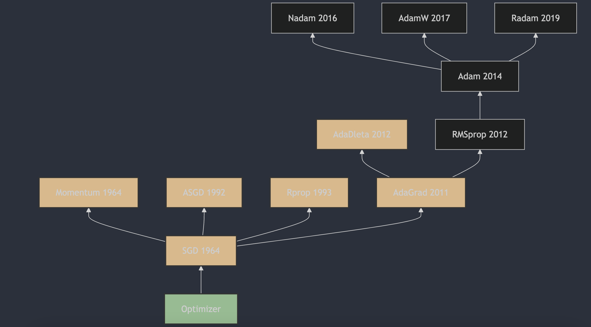

Understanding neural network optimizers in 3 minutes a day, part 7: AdaDelta

## 1. The Appearance of AdaDelta

AdaDelta was proposed by Matthew D. Zeiler in 2012. A detailed description and the algorithm principles can be found in "ADADELTA: An Adaptive Learning Rate Method" [1](#refer-anchor-7). AdaDelta is meant to solve the monotonically decreasing learning-rate problem in AdaGrad. It limits the window size of accumulated gradients and adapts the learning rate through that. During training, the algorithm can adaptively tune the learning rate for each parameter without manual setup. This approach is fairly robust to noisy gradient information, different model architectures, different data types, and hyperparameter choices.

## 2. How AdaDelta Works

AdaDelta is an adaptive learning-rate optimization algorithm that solves the problem caused by AdaGrad's decreasing learning rate. AdaDelta limits the window size of accumulated gradients and does not require a global learning rate, because it adaptively adjusts the learning rate based on previous parameter updates.

The AdaDelta update rules look like this:

1. Initialize two state variables: exponentially weighted average of accumulated squared gradients `s`, and exponentially weighted average of accumulated updates `delta`.
2. At each iteration, compute gradient `g`.
3. Update the exponentially weighted average of accumulated squared gradients `s`:
   $s = \rho \cdot s + (1 - \rho) \cdot g^2$
4. Compute parameter update `delta_p`:
   $\delta_p = -\frac{\sqrt{\delta + \epsilon}}{\sqrt{s + \epsilon}} \cdot g$
5. Update parameter `w`:
   $w = w + \delta_p$
6. Update the exponentially weighted average of accumulated updates `delta`:
   $\delta = \rho \cdot \delta + (1 - \rho) \cdot \delta_p^2$

Here `ρ` is the coefficient for computing the exponentially weighted average of squared gradients, usually set to 0.9, and `ε` is a very small number, for example `1e-6`, that improves numerical stability.

## 3. Main Features of AdaDelta

Advantages of AdaDelta include:

- Adaptive learning rate that does not need manual tuning.
- Works well with sparse data.
- Speeds up model convergence.

Possible drawbacks:

- Sensitive to hyperparameters `ρ` and `ε`.
- In some cases, it can lead to unstable training.

## References

[1] [ADADELTA: An Adaptive Learning Rate Method](https://arxiv.org/abs/1212.5701)

## Author's GitHub and WeChat

[GitHub: LLMForEverybody](https://github.com/luhengshiwo/LLMForEverybody)

The repository has the original Markdown files, and it is fully open source. Stars and forks are very welcome.
