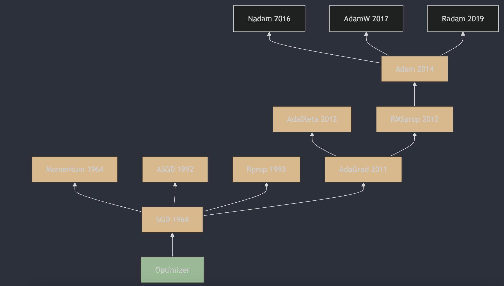

Understanding neural network optimizers in 3 minutes a day, part 9: Adam

## 1. The Appearance of Adam

Adam (Adaptive Moment Estimation) was proposed by Diederik P. Kingma and Jimmy Ba in 2014. A detailed description and the algorithm principles can be found in "Adam: A Method for Stochastic Optimization" [1](#refer-anchor-9), first submitted to arXiv on December 22, 2014, and later published at ICLR 2015. Adam combines the advantages of AdaGrad and RMSProp: it computes estimates of the first and second moments of the gradient to set independent adaptive learning rates for different parameters and train the network more effectively.

## 2. How Adam Works

Adam (Adaptive Moment Estimation) is an adaptive learning-rate optimization algorithm used in deep learning. It combines the advantages of AdaGrad and RMSProp: it adjusts the learning rate of each parameter by computing an estimate of the first moment of the gradient (the mean) and an estimate of the second moment (the uncentered variance), implementing an adaptive learning rate.

Key features of Adam:

1. **Momentum**: by analogy with physical momentum, it helps the algorithm improve stability during optimization and reduce oscillation.
2. **Adaptive learning rate**: Adam maintains its own learning rate for each parameter, making the algorithm more flexible when adapting to different parameter-update needs.
3. **Bias correction**: since the algorithm uses exponentially weighted moving averages to compute estimates of the first and second moments of the gradient, bias appears in the early stage. Adam corrects this bias, making the estimates more accurate.

The Adam update rules look like this:

1. Initialize the first moment estimate (momentum) $m_t$ and the second moment estimate (moving average of squared gradients) $v_t$ as zeros, and set time step $t=1$.
2. At each iteration, compute gradient $g_t$.
3. Update first moment estimate $m_t$ and second moment estimate $v_t$:

   $m_t = \beta_1 \cdot m_{t-1} + (1 - \beta_1) \cdot g_t$

   $v_t = \beta_2 \cdot v_{t-1} + (1 - \beta_2) \cdot g_t^2$

4. Compute bias-corrected first moment estimate $\hat{m}_t$ and second moment estimate $\hat{v}_t$:

   $\hat{m}_t = \frac{m_t}{1 - \beta_1^t}$

   $\hat{v}_t = \frac{v_t}{1 - \beta_2^t}$

5. Update parameters $ \theta $:

   $\theta_t = \theta_{t-1} - \eta \cdot \frac{\hat{m}_t}{\sqrt{\hat{v}_t} + \epsilon}$

   Here $\eta$ is the learning rate, $\epsilon$ is a small constant for numerical stability, for example $1e-8$, and $\beta_1$ and $\beta_2$ are hyperparameters usually set to 0.9 and 0.999.

## 3. Main Features of Adam

Adam is widely popular because it is efficient and effective on many deep learning tasks, especially with large datasets and complex models. But it also has potential problems. For example, in some cases it may diverge. To solve this, researchers proposed several improved algorithms, such as Yogi. In practice, hyperparameters $\beta_1$, $\beta_2$, learning rate $\eta$, and $\epsilon$ usually need to be tuned for the specific task to get the best performance.

## References

[1] [Adam: A Method for Stochastic Optimization](https://arxiv.org/abs/1412.6980)

## Author's GitHub and WeChat

[GitHub: LLMForEverybody](https://github.com/luhengshiwo/LLMForEverybody)

The repository has the original Markdown files, and it is fully open source. Stars and forks are very welcome.
