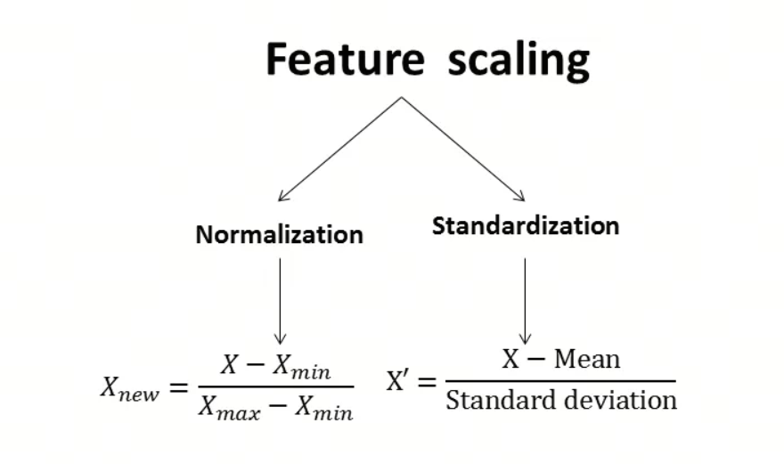
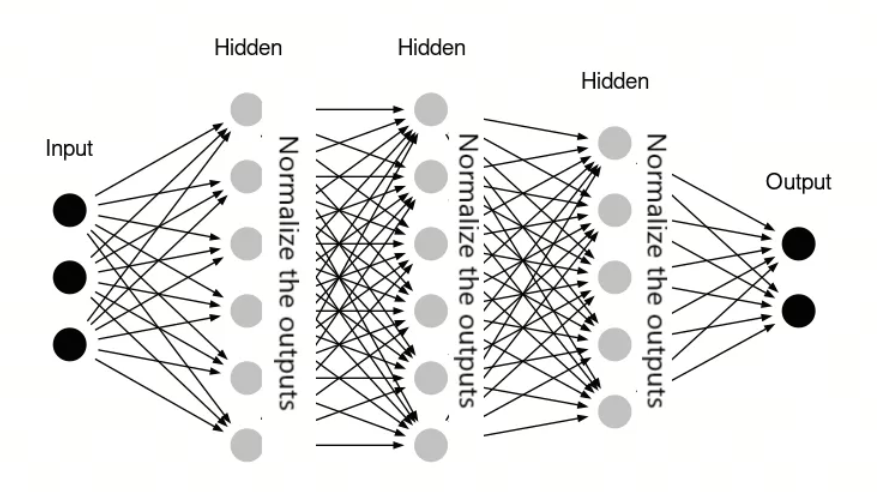
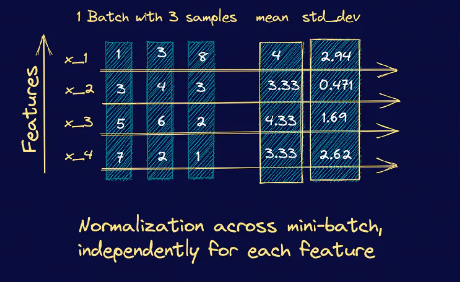
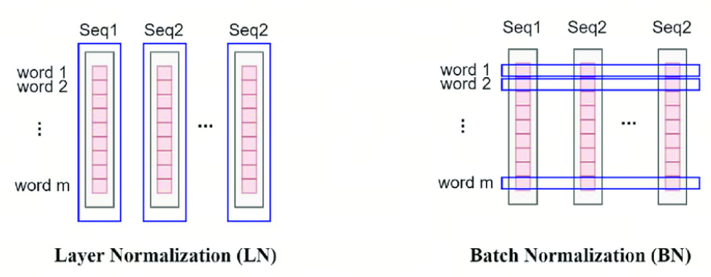

Why do Transformers use LayerNorm instead of BatchNorm? A 10-minute explanation.

## 1. Norm (Normalization)

First, the Norm in LayerNorm and BatchNorm is short for Normalization. It is not "norm" in the mathematical norm sense.

In statistics, Normalization usually means scaling data into a fixed range. A similar term, Standardization, usually means scaling data to a distribution with mean 0 and variance 1. What is the difference?

Normalization scales data into the 0 to 1 range, while standardization scales data toward a normal distribution with mean 0 and variance 1.

Sometimes Normalization and Standardization are mixed together. It is enough to read the context carefully and not get stuck on the terminology.

## 2. BatchNorm

BatchNorm (Batch Normalization) is designed to improve the speed, stability, and quality of neural network training. Sergey Ioffe and Christian Szegedy proposed it in 2015. The main problem BatchNorm tries to solve is internal covariate shift during deep neural network training, meaning changes in the input distribution of different network layers.

Internal covariate shift means that as the network becomes deeper, the input distribution of each layer, meaning the output of the previous layer, may keep changing. This can cause gradient problems during training, such as vanishing or exploding gradients, and reduce convergence speed and stability.

BatchNorm works like this:

- Normalization: during training, BatchNorm normalizes each mini-batch. It computes the mean and variance of that batch and uses these statistics to standardize the data so the mean becomes 0 and the variance becomes 1.

- Scaling and shifting: the normalized data passes through two learnable parameters, a scaling coefficient (gamma) and a shifting coefficient (beta). These parameters let the network learn the best normalization behavior during training.

- Application: BatchNorm is usually applied between neural network layers, especially after a convolutional or fully connected layer and before the activation function.

In classic machine learning, we often use a similar approach: normalize or standardize one feature across the batch dimension to improve model generalization.

## 3. LayerNorm

Layer Normalization, or LayerNorm, is a deep learning technique for stabilizing neural network training and improving quality. It was proposed by Jimmy Lei Ba, Jamie Ryan Kiros, and Geoffrey E. Hinton in 2016. LayerNorm is similar to Batch Normalization: both aim to reduce internal covariate shift, but they differ in how normalization is performed.

The main idea of LayerNorm is to normalize each layer of the neural network, rather than each mini-batch. More precisely, LayerNorm computes the mean and variance of all activations for one sample in the corresponding layer, then uses these statistics to normalize that sample's activations. This method does not depend on mini-batch statistics, so it reduces the noise problems of BatchNorm and allows training with smaller mini-batches.

LayerNorm works like this:

- Normalization: for each layer, LayerNorm computes the mean and variance of all activations in that layer. These statistics are then used to normalize the activations so that, for each sample, the activation mean is 0 and the variance is 1.

- Scaling and shifting: just like BatchNorm, the normalized data passes through two learnable parameters, a scaling coefficient (gamma) and a shifting coefficient (beta). These parameters let the network learn the best normalization behavior during training.

- Application: LayerNorm can be applied to any neural network layer, including convolutional and recurrent layers. It is usually placed before the activation function.

## 4. Why Transformers Use LayerNorm Instead of BatchNorm

Normalization techniques are meant to fight internal covariate shift. Their essence is to bring data to a shared standard so it can be compared and processed effectively.

To achieve that, ***we need to make sure the data points participating in normalization are comparable in nature.*** It is enough to remember this sentence.

- **Batch Normalization (BatchNorm)**: this normalizes data across the whole batch. More precisely, BatchNorm looks at each column in the batch: those values represent the same feature across different samples. Since those features are statistically related, it makes sense to normalize them together. It is like comparing different students' scores in the same subject in the same class. The scores are on the same scale, so they can be compared directly.

- **Layer Normalization (LayerNorm)**: unlike BatchNorm, LayerNorm is suitable when different samples are hard to compare directly, such as in Transformer self-attention. In these models, data at each position represents different features, so direct batch-level normalization can lose meaning. LayerNorm's solution is to normalize all features of each sample separately instead of relying on the whole batch. It is like evaluating each student's performance across all subjects, not just one subject, so you can better understand each student's overall level.

## References

[1] [Do Standardization and normalization transform the data into normal distribution?](https://python.plainenglish.io/do-standardization-and-normalization-transform-the-data-into-normal-distribution-cb5857ab9c63)

[2] [Build Better Deep Learning Models with Batch and Layer Normalization](https://www.pinecone.io/learn/batch-layer-normalization/)

## Follow my GitHub and WeChat account: no time to explain, everyone aboard!

[GitHub: LLMForEverybody](https://github.com/luhengshiwo/LLMForEverybody)

The repository has the original Markdown files, and the project is fully open source. Stars and forks are very welcome.
