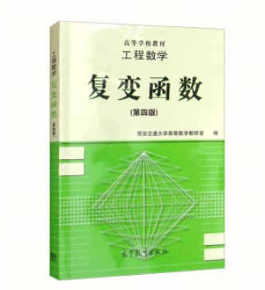
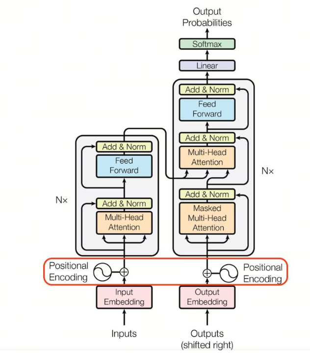
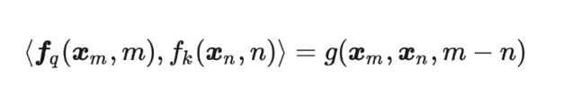
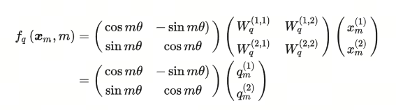
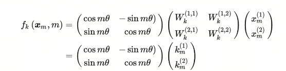

# Applying Complex Functions in LLM Positional Encoding

## 1. Introduction

I am a little embarrassed to admit it, but in graduate school my research area was complex analysis, and in the almost ten years since graduation I have barely used it.

I still remember introducing myself during an internship and saying that I worked on complex analysis. The interviewer did not really understand, so I explained: it is the study of the imaginary number $i$, which appears when you take the square root of -1.

In artificial intelligence, we often use mathematics such as matrices, probability theory, and a little calculus. But recently, while studying positional encoding in LLMs, I was surprised to find an application of complex analysis, and memories from ten years ago gradually started coming back.

## 2. What Is a Complex Number?

A complex number is a basic mathematical concept that extends the real number system and allows a broader set of mathematical operations. A complex number has two parts: real and imaginary. The general form is:

$$ a + bi$$

where $a$ is the real part, $b$ is the imaginary part, and $i$ is the imaginary unit, where $ i^2 = -1 $.

Complex numbers have two main special cases:

1. **Real number**: when the imaginary part $b$ is 0, the complex number becomes a real number.
2. **Imaginary number**: when the real part $a$ is 0 and the imaginary part $b$ is nonzero, the complex number is called purely imaginary.

Basic arithmetic operations can be performed on complex numbers: addition, subtraction, multiplication, and division. These operations follow specific rules. For example, when adding two complex numbers, add their real and imaginary parts separately:

$$ (a + bi) + (c + di) = (a + c) + (b + d)i $$

Multiplication is a little more complex, using distributivity and the property of the imaginary unit $i$:

$$(a + bi)(c + di) = ac + adi + bci + bdi^2
 = (ac - bd) + (ad + bc)i $$

Division of complex numbers involves rationalizing the denominator, usually by multiplying by the complex conjugate.

Complex numbers are widely used in mathematics, physics, engineering, and other fields. For example, in signal processing, quantum mechanics, and electrical engineering, complex numbers provide a powerful tool for describing periodic phenomena and rotations.

## 3. Functions of a Complex Variable

Functions of a complex variable are an important branch of mathematics. They study functions over the complex number domain, where both the argument and value of the function are complex numbers. The theory of functions of a complex variable is used in many engineering and scientific fields. Here are some majors where complex analysis is commonly studied:

- Mathematics: functions of a complex variable are a required course for mathematics students because they extend and deepen calculus.
- Electrical engineering: in signal processing and system analysis, functions of a complex variable are used to analyze AC circuits.
- Electronic engineering: complex-domain methods are used in the design and analysis of control systems.
- Physics: in quantum mechanics and electromagnetism, the theory of functions of a complex variable is used to solve wave equations and potential problems.
- Computer science and engineering: functions of a complex variable are used in algorithm design, image processing, and signal processing algorithms.
- Aerospace engineering: in fluid dynamics and control system analysis, functions of a complex variable are used for mathematical modeling.
- Mechanical engineering: the theory helps solve problems in vibration analysis and heat conduction.
- Civil engineering: in structural analysis and seismic engineering, functions of a complex variable are used to solve some dynamic problems.
- Biology and biomedical engineering: in biosignal processing and biophysical modeling, functions of a complex variable help analyze and understand dynamic behavior in biological systems.
- Financial mathematics and economics: in some advanced economic models and financial instrument valuation, the theory can provide analytical tools.
- Control theory: in stability analysis and controller design, functions of a complex variable are one of the basic tools.

A course on functions of a complex variable usually includes analytic functions, complex integrals, series expansions, residue theorems, conjugate harmonic functions, and so on.

In machine learning, complex numbers are relatively rare. But in some special areas, such as signal processing, image processing, and pattern recognition, the properties and operation rules of complex numbers can provide useful tools and techniques.

Ten years after graduation, I again felt the appeal of complex numbers, this time in positional encoding for large language models. The mathematical properties and operation rules of complex numbers gave Transformer a new positional encoding method. This method is called RoPE (Rotary Position Embedding).

## 4. Positional Encoding and RoPE

Positional Encoding is a technique that gives a model information about the position of each element in a sequence when processing sequences.

In natural language processing (NLP), especially when using Transformer models, positional encoding is especially important because Transformer itself has no built-in mechanism for handling the order of elements in a sequence.

The main goal of positional encoding is to let the model distinguish word order in the input sequence and better understand sentence structure and meaning.

**Rotary Position Encoding, RoPE**

RoPE proposes using relative position information between tokens. It assumes that the dot product between query vector $q_m$ and key vector $k_n$ can be expressed by some function $g$. The inputs to $g$ are word embeddings $x_m$, $x_n$, and their relative position $m-n$:

A bold hypothesis, careful verification. Now our goal is to find a suitable function $g$, so that $g(x_m, x_n, m-n)$ can capture relative position information between word vectors.

RoPE states: if word vectors are two-dimensional, the plane can be turned into the complex plane. If function $f$ is defined as follows, the corresponding $g$ can be found:

$Re$ means the real part of a complex number. More precisely, $f$ can be defined as:

Isn't this the original query matrix multiplied by a rotation matrix? In other words, after adding positional information $m$, if we use RoPE, the original query matrix is effectively rotated. That is where the word **rotary** comes from.

Similarly, $f_K$ can be written as:

The corresponding function $g$ looks like this:

## 5. A Few Thoughts

RoPE does not use especially deep complex number theory. It basically uses only Euler's formula. Euler's formula was published around 1740, but even such a simple application can work in LLMs. It made me wonder: could there be other mathematical knowledge that may also turn out to be useful in large language models?

> Rotary positional encoding was developed by the outstanding **Su Jianlin**. He introduced the most beautiful formula in mathematics, Euler's formula, into it.
> You can follow his blog `Scientific Space`: https://kexue.fm/. There is a lot to learn there.

## References

[1] [RoFormer: Enhanced Transformer with Rotary Position Embedding](https://arxiv.org/abs/2104.09864)

[2] [GitHub: LLMForEverybody](https://github.com/luhengshiwo/LLMForEverybody)

---

## 📚 相关概念

[[concepts/Transformer 架构|Transformer 架构]] | [[concepts/分词器 LLM|分词器 LLM]] | [[concepts/LLM 训练 流水线|LLM 训练 流水线]] | [[concepts/RLHF DPO 对齐|RLHF DPO 对齐]] | [[concepts/LoRA PEFT 微调|LoRA PEFT 微调]] | [[concepts/多模态 LLM|多模态 LLM]] | [[concepts/模型 压缩 蒸馏|模型 压缩 蒸馏]] | [[entities/Hugging Face|Hugging Face]] | [[entities/DeepSeek|DeepSeek]] | [[entities/mindspore Transformer|mindspore Transformer]] | [[sources/Vaswani 2017 Attention|Vaswani 2017 Attention]] | [[sources/LLM 训练 流水线 指南|LLM 训练 流水线 指南]] | [[sources/DeepSeek 4 技术|DeepSeek 4 技术]]

> 📌 来源：[[sources/LLMForEverybody/索引|LLMForEverybody 导航]] · 章节：预训练
