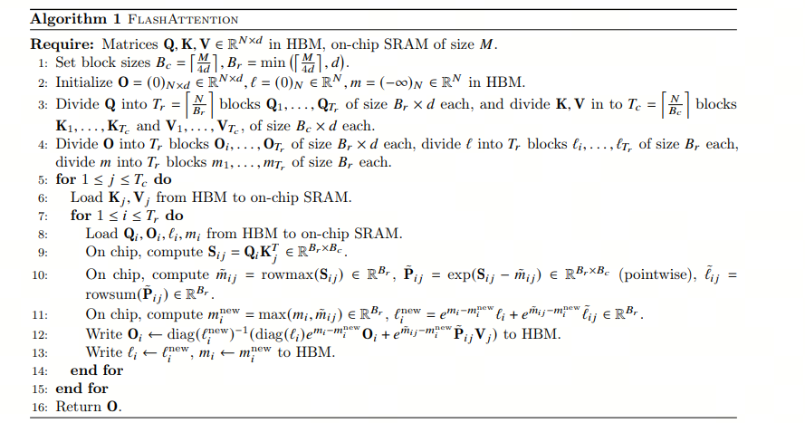

Many years later, when you run into **FlashAttention**, you may suddenly remember that math class from the first semester of your final school year. Summer break had just ended, the sun was ruthless, and the classroom felt like a steamer. Even the air seemed too tired to move. Sunlight slipped through the gaps in the curtains and, like a mischievous kid, kept jumping onto the blackboard, outlining the teacher's formulas in gold. The teacher stood there, full of fire, talking about geometric progressions and limits, while your mind had already flown to the cafeteria, wondering whether you could still get a hot serving of tomato scrambled eggs at lunch.

"Watch closely, I am going to transform it!" the teacher's voice suddenly got louder, as if he was about to turn into a superhero. You woke up from your cafeteria daydream and thought: transform it? Can this math problem turn into lunch? Your classmates were also fighting sleep with everything they had. Someone was slumped on the desk like a dead bug, someone was silently counting the minutes until the bell. Sunlight poured freely across the room, and in that haze it almost felt like math might also become as simple and clear as cafeteria food.

## 1. FlashAttention

FlashAttention is a newer attention algorithm developed by research teams from Stanford University and the University at Buffalo. It was designed to solve the high time and memory complexity that traditional Transformer models run into when processing long sequences. The core idea is to reduce reads and writes between GPU high-bandwidth memory (HBM) and on-chip GPU SRAM. Through tiling and recomputation, it greatly reduces how often the algorithm has to touch HBM, which speeds things up and lowers memory usage.

Because FlashAttention is IO-aware, it optimizes the memory access pattern, makes Transformer models more efficient on long sequences, and makes it more practical to build strong models with longer context windows.

## 2. What You Need to Know About GPUs for LLMs

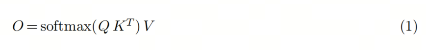

You need a clear basic picture of what LLM training and inference demand. A large language model usually means heavier requirements for compute and storage. So when choosing GPUs, you care about compute power, video memory, and compatibility with the rest of the hardware.

**The compute wall** is the huge gap between the compute power of one GPU and the total compute required by the model. A single A100 has only 312 TFLOPS of compute, while GPT-3 required a total of 314 ZFLOPs. The gap is 9 orders of magnitude.

**The VRAM wall** means one GPU cannot fully store the parameters of a large model. GPT-3's 175 billion parameters alone need 700 GB of memory if you count 4 bytes per parameter, while an NVIDIA A100 has only 80 GB of VRAM.

**The communication wall** mostly means that, during distributed training, the compute nodes in a cluster have to synchronize parameters frequently, and communication performance affects the overall training speed. If this wall is handled poorly, you can end up with a larger cluster that trains less efficiently.

Today, GPU compute is stronger than GPU communication, so communication becomes the bottleneck. Transformer self-attention creates a lot of IO: data is read from HBM into SRAM, then the computation happens.

So the idea of FlashAttention is to reduce IO by doing more computation, balancing the shape of modern GPUs: compute is strong, communication is relatively weaker.

## Self-Attention

To understand the key FlashAttention algorithm, start from regular Self-Attention. See From Online Softmax to FlashAttention[1](#refer-anchor-1).

If we ignore batch and the scaling factor, Self-Attention can be written briefly like this:

> $Attention(Q, K, V) = softmax(\frac{QK^T}{\sqrt{d_k}})V$

Here Q, K, V, and O are two-dimensional matrices with shape (L, D), where L is the sequence length and D is the dimension of each head. The softmax function is applied along the last dimension.

The standard Self-Attention computation has three steps:

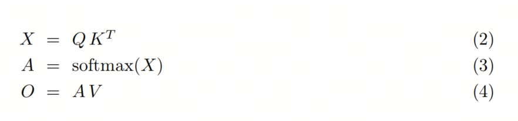

In FlashAttention, we do not need to put X and A into global memory (HBM). We place formula (1) inside one CUDA kernel or tensor kernel. That avoids a large amount of IO.

FlashAttention does not materialize the X and A matrices in global memory. Instead, it fuses the whole computation from formula (1) into a single CUDA kernel. To do that, the algorithm has to manage on-chip memory carefully, for example with a streaming algorithm, because NVIDIA GPU shared memory (SRAM) is small. Classic algorithms such as matrix multiplication use tiling so the on-chip memory footprint stays within hardware limits. That works because addition is associative, so full matrix multiplication can be decomposed into a sum of many tiled matrix multiplications. But Self-Attention contains softmax, and softmax is not directly associative. That makes it hard to simply split Self-Attention into tiles. Can we make softmax associative?

Gut feeling: our goal is to compute O. Usually we get all of Q, K, and V, then compute the result in three steps. But maybe we can take a small block of Q, K, and V, compute part of O at once, and then figure out how to merge those partial O values into the full O.

The hard part: matrices can be added, but softmax cannot be added directly.

The solution: the last problem on the math exam, a geometric progression.

## Safe Softmax

The softmax formula looks like this:

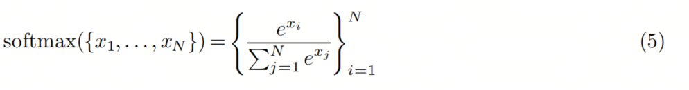

$x_i$ can be very large, and then $e^{x_i}$ overflows. The maximum float16 value is 65536, and when $x_i$ is greater than 12, $e^x$ is already outside the valid range. So in practice we use Safe Softmax:

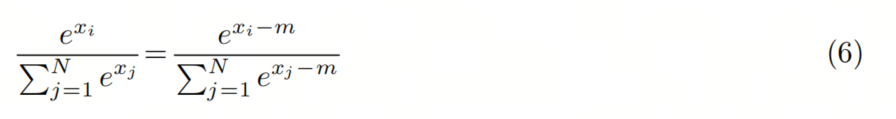

where:

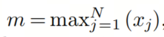

From here we can summarize the Safe Softmax computation. Call it a three-step algorithm:

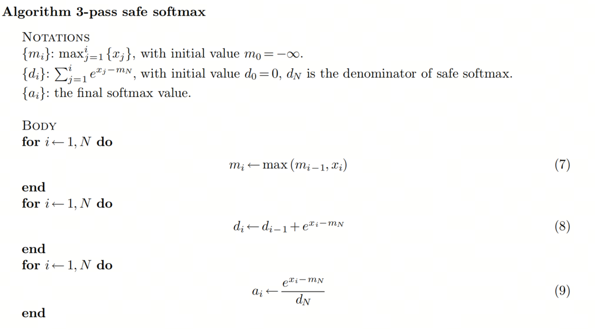

This is the traditional self-attention algorithm: we need to iterate from 1 to N three times. ${x_i}$ comes from QK and is the pre-softmax value, which means we have to read Q and K three times. That creates a lot of IO overhead.

## Online Softmax

If equations 7, 8, and 9 could be merged into one loop, we could reduce global memory access from 3 passes to 1. Unfortunately, equations 7 and 8 cannot be merged into the same loop, because 8 depends on $m_N$, and $m_N$ is only known after the first loop finishes.

Careful, exam math is starting now.

To remove the dependency on N, we can build another sequence as a replacement for the original one. In other words, we look for a geometric progression, in recursive form, that removes the dependency on N.

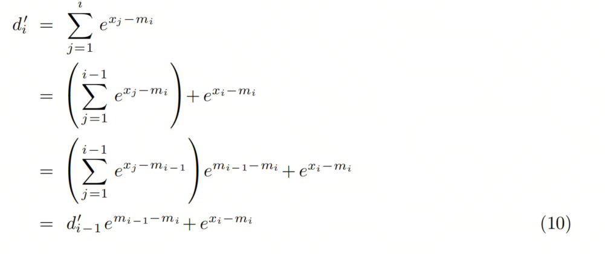

This recursive form depends only on $m_i$ and $m_{i-1}$, so $m_j$ and $d'_j$ can be computed in the same loop.

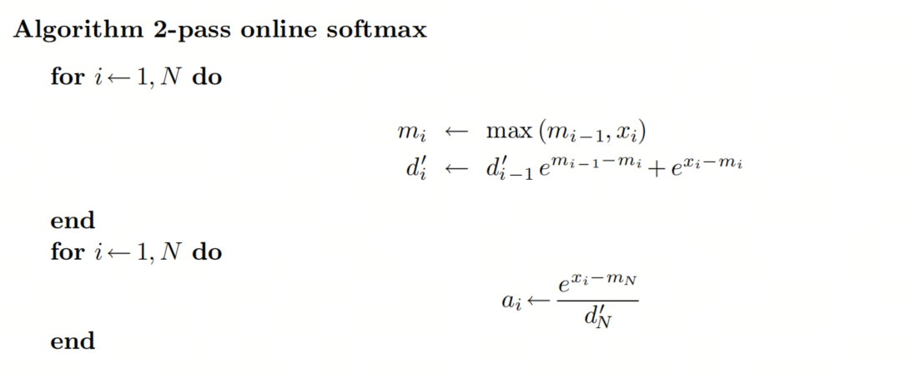

This is the algorithm proposed in the Online Softmax paper. But to finish the softmax computation, it still needs two passes. Can we reduce that to one pass and minimize global IO?

## FlashAttention

For softmax itself, unfortunately, the answer is no. But in Self-Attention, the final goal is not the attention score matrix A. The final goal is O, which equals A V. Can we find a one-step recursive form for O? Computing the kth row of Self-Attention, with every row computed independently, can be written as a recursive algorithm. To keep the explanation simple, we only discuss one row:

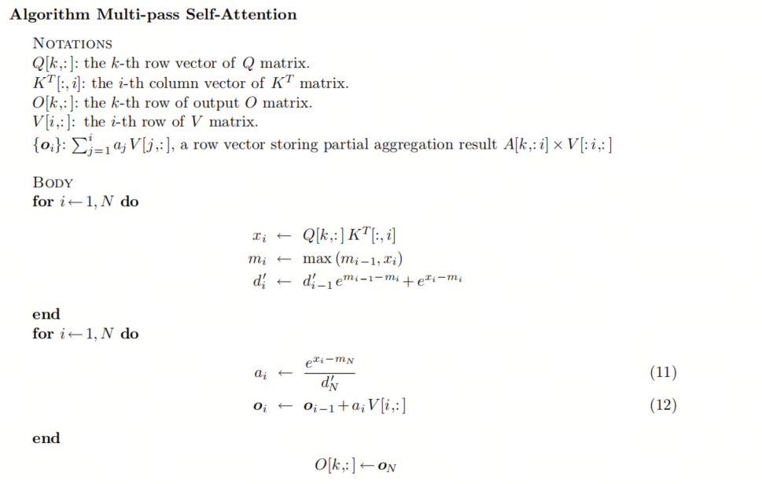

Replace $a_i$ in formula 12 with the definition from formula 11:

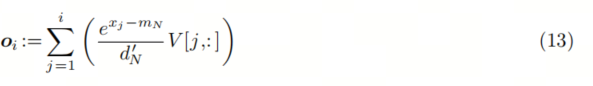

This still depends on $m_N$ and $d_N$, and those two values cannot be known before the previous loop finishes. But we can use the same replacement trick from Online Softmax: create a substitute sequence $o'$.

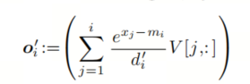

Then we can find a recursive relationship between $o_i$ and $o_{i-1}$:

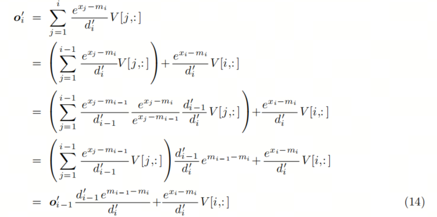

Now the whole Self-Attention computation can be merged into one loop:

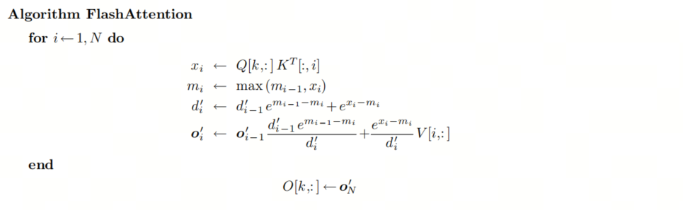

At this point, all the data is small enough to load into GPU SRAM. Since the operations in this algorithm are associative, it works with tiling. If we compute the state tile by tile, the algorithm looks like this:

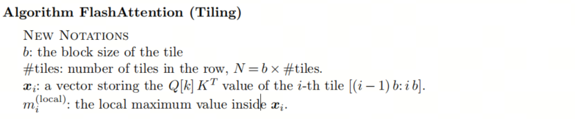

## Takeaways

The key part of FlashAttention is building a recursion, basically a geometric progression, that lets us accumulate partial results into the global result. Then we do not have to load every value at once and compute everything step by step.

Building this kind of geometric progression is roughly the level of the last problem on a math exam.

## References

[1] From Online Softmax to FlashAttention: https://courses.cs.washington.edu/courses/cse599m/23sp/notes/flashattn.pdf

[2] [GitHub: LLMForEverybody](https://github.com/luhengshiwo/LLMForEverybody)

---

## 📚 相关概念

[[concepts/Transformer 架构|Transformer 架构]] | [[concepts/分词器 LLM|分词器 LLM]] | [[concepts/LLM 训练 流水线|LLM 训练 流水线]] | [[concepts/RLHF DPO 对齐|RLHF DPO 对齐]] | [[concepts/LoRA PEFT 微调|LoRA PEFT 微调]] | [[concepts/多模态 LLM|多模态 LLM]] | [[concepts/模型 压缩 蒸馏|模型 压缩 蒸馏]] | [[entities/Hugging Face|Hugging Face]] | [[entities/DeepSeek|DeepSeek]] | [[entities/mindspore Transformer|mindspore Transformer]] | [[sources/Vaswani 2017 Attention|Vaswani 2017 Attention]] | [[sources/LLM 训练 流水线 指南|LLM 训练 流水线 指南]] | [[sources/DeepSeek 4 技术|DeepSeek 4 技术]]

> 📌 来源：[[sources/LLMForEverybody/索引|LLMForEverybody 导航]] · 章节：预训练
