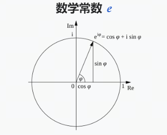
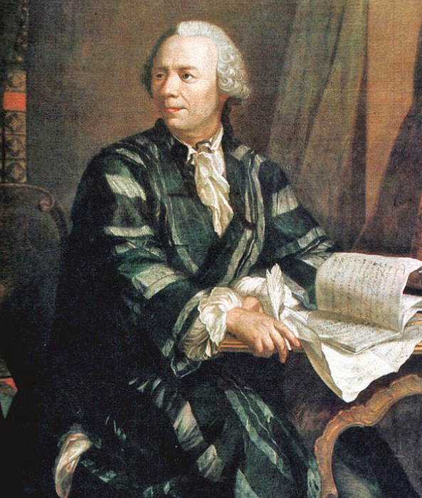

## 1. Introduction

Maybe you have heard of Euler's formula somewhere. Maybe mathematics does not feel close to you at all. Either way, you may have accidentally opened this article, skimmed it, closed it, and gone back to your work or study. But that does not stop you from pausing for a moment to appreciate its beauty.
Years from now, you may not remember reading this article, but you may remember that mathematics has one very beautiful formula.

## 2. Euler's Formula

***Euler's formula*** is a formula from complex analysis that connects trigonometric functions with the complex exponential function. It is named after Leonhard Euler. Euler's formula states that for any real number x:

$$
e^{ix} = \cos(x) + i\sin(x)
$$

where e is the base of the natural logarithm, i is the imaginary unit, and cos and sin are the trigonometric cosine and sine functions. The parameter x is measured in radians.

It is a very beautiful formula: it connects trigonometric functions, the exponential function, and complex numbers, and it is one of the gems of mathematics.

## 3. Euler's Identity

***Euler's identity*** is a special case of Euler's formula. When x = π, Euler's formula becomes:

$$
e^{i\pi} + 1 = 0
$$

This formula is considered one of the most beautiful formulas in mathematics. It connects five of the most important mathematical constants: 0, 1, e, i, and π.

## 4. Euler's Contributions

Leonhard Euler (April 15, 1707 - September 18, 1783) was a Swiss mathematician, physicist, astronomer, geographer, logician, and engineer. He was one of the pioneers of modern mathematics.

Euler made major contributions to many areas of mathematics, including mathematical analysis and graph theory. He introduced and popularized many mathematical terms and notations that are still used today, for example:

- function notation $f(x)$;
- notation of the imaginary unit $\sqrt {-1}$ as $i$;
- notation of pi as $\pi$;
- the summation sign $\Sigma$;
- the difference sign $\Delta$;
- notation of triangle sides with lowercase letters and triangle angles with uppercase letters;
- the definition of the base of the natural logarithm $e$, also called Euler's number;
- besides that, he made outstanding contributions to mechanics, fluid dynamics, optics, astronomy, and music theory.

Euler was an outstanding mathematician of the 18th century and one of the greatest mathematicians of all time. He was also extremely productive: his scientific works fill 60 to 80 volumes.

After Euler's death, several famous mathematicians praised his contribution to mathematics. For example, the French mathematician ***Pierre-Simon Laplace*** said: "Read Euler, read Euler, he is the master of us all."

The German mathematician ***Carl Friedrich Gauss*** wrote: "The study of Euler's works will remain the best school for the different fields of mathematics, and nothing else can replace it."

## References

[1] [Wiki: Leonhard Euler](https://zh.wikipedia.org/wiki/%E8%90%8A%E6%98%82%E5%93%88%E5%BE%B7%C2%B7%E6%AD%90%E6%8B%89)

[2] [GitHub: LLMForEverybody](https://github.com/luhengshiwo/LLMForEverybody)
