The easiest way to understand Mamba (English translation)

## At the Very Beginning

In February 2024, a paper called Mamba was rejected by ICLR, which caused a strong reaction in both academia and industry. Mamba is seen as an architecture that could challenge the Transformer.

The original author, Jack Cook, proposed the easiest way to understand Mamba:

Original article: https://jackcook.com/2024/02/23/mamba.html

Since the translator's level is limited, mistakes are unavoidable during translation. Please be understanding. If you notice any problems, point them out in the comments and I will try to fix them as soon as possible.

Reading note: there will be snake images in the article. Mamba was Kobe's nickname (R.I.P), and mamba is also a kind of cobra. The black mamba is the fastest snake in the world.

## Main Text Starts Here

Today, practically every language model whose name you can remember is a Transformer model. For example, OpenAI [ChatGPT](https://chatgpt.com/), Google [Gemini](https://deepmind.google/technologies/gemini/), and GitHub [Copilot](https://github.com/features/copilot) are based on the [Transformer](https://nlp.seas.harvard.edu/annotated-transformer/). But the Transformer has a fundamental drawback: it is based on Attention, and Attention computation grows quadratically with sequence length. Put simply, this is fine for quick interactions, like asking ChatGPT to tell a joke. But for prompts that require a lot of words, like asking ChatGPT to summarize a 100-page document, the Transformer can get very slow.

Many models have tried to solve this problem, but few have done it as impressively as [Mamba](https://arxiv.org/abs/2312.00752). Mamba was published by [Albert Gu](https://x.com/_albertgu) and [Tri Dao](https://tridao.me/) two months ago. It appears to outperform Transformers of comparable size while scaling linearly with sequence length. If you are looking for a deep technical explanation of Mamba and a full Triton implementation, you are in the wrong place. The legendary [Sasha Rush](https://rush-nlp.com/) has already written [Mamba: The Hard Way](https://srush.github.io/annotated-mamba/hard.html). But if you have not heard of Mamba (or Triton), or if you want an overview of Mamba's main ideas, this article should fit. The original title is Mamba: The Easy Way.

The prospect of an accurate language model with linear runtime made many people excited about the future of language model architectures, especially Sasha, who [put quite a bit of money on it](https://www.isattentionallyouneed.com/). In this post, I will try to explain how Mamba works in a fairly direct way, especially if you have studied a little computer science before. Let's begin.

> Note 1: an accurate language model with linear runtime means a language model with algorithmic complexity $O(n)$, where computation time grows linearly as sequence length increases. Transformer algorithmic complexity is $O(n^2)$.

> Note 2: when the text says Sasha Rush put quite a bit of money on it, it refers to a bet between him and another person about whether the Transformer will be replaced by another architecture before January 1, 2027. Sasha Rush thinks it will be, while the other participant, [Jonathan Frankle](http://www.jfrankle.com/), thinks it will not.

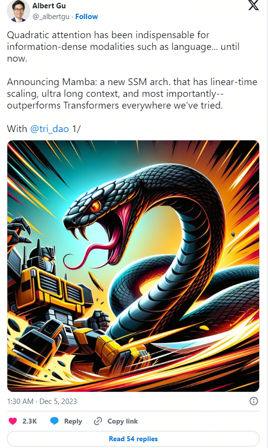

## Background: S4

The Mamba architecture is mostly based on [S4](https://arxiv.org/abs/2111.00396), a modern State Space Model (SSM) architecture. I will briefly summarize the important parts here, but if you want to understand S4 in more detail, I strongly recommend reading another Sasha post, [The Annotated S4](https://srush.github.io/annotated-s4/).

In general, S4 learns to map input $x(t)$ to output $y(t)$ through an intermediate state $h(t)$. Here $x,y,h$ are functions of $t$, because SSMs are meant to work well with continuous data such as audio, sensor data, and images. S4 connects them through three continuous parameter matrices $A,B,C$. They are linked by the following two equations, 1a and 1b in the Mamba paper:

$$\begin{align*}
h'(t) &= Ah(t)+Bx(t) \\
y(t) &= Ch(t)
\end{align*}$$

> Note: here $s(t)$ is the external input, $h'(t)$ is the state at the next time step, not a derivative, and $y(t)$ is the output. The key feature of these equations is that they are linear, so S4 can process sequences in $O(n)$ time. This is Mamba's main advantage.

In practice, we work with discrete data, such as text. To do that, we need to [discretize](https://en.wikipedia.org/wiki/Discretization) the SSM: convert continuous parameters $A,B,C$ into discrete parameters $\bar{A},\bar{B},C$ with a special fourth parameter. I will not explain the details of discretization here, but if you are interested, the S4 authors wrote an excellent [blog post](https://hazyresearch.stanford.edu/blog/2022-01-14-s4-3) about it. After discretization, the SSM can be represented by two equations, 2a and 2b:

$$\begin{align*}
h(t) &= \bar{A}h_{t-1}+\bar{B}x_t \\
y(t) &= Ch_t
\end{align*}$$

These equations form a recurrence, similar to what you see in recurrent neural networks (RNNs). At each step $t$, we combine the hidden state from the previous time step $h_{t-1}$ with the current input $x_t$ to get the new hidden state $h_t$. Below you can see how this works when predicting the next word in a sentence. In this example, after "My name is Jack" we predict "and".

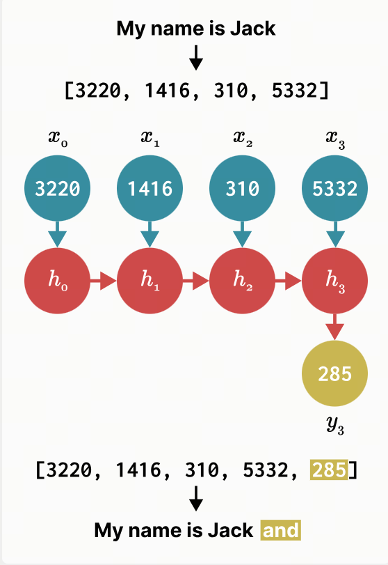

So we can basically use S4 like an RNN, generating one token at a time. But the really interesting thing about S4 is that it can also be used like a convolutional neural network (CNN). In the example above, let's see what happens if we expand the previous discrete equation while trying to compute $h_3$. For simplicity, assume $x_-1=0$.

$$\begin{align*}
h_0 &= \bar{B}x_o \\
h_1 &= \bar{A}(\bar{B}x_o) +\bar{B}x_1\\
h_2 &= \bar{A}(\bar{A}(\bar{B}x_o) +\bar{B}x_1) +\bar{B}x_2\\
h_3 &= \bar{A}(\bar{A}(\bar{A}(\bar{B}x_o) +\bar{B}x_1) +\bar{B}x_2) +\bar{B}x_3\\
\end{align*}$$

After computing $h_3$, we can plug it into the equation for $y_3$ to predict the next word.

$$\begin{align*}
y_3 &= C(\bar{A}(\bar{A}(\bar{A}(\bar{B}x_o) +\bar{B}x_1) +\bar{B}x_2) +\bar{B}x_3)\\
y_3 &= C\bar{A}\bar{A}\bar{A}\bar{B}x_o +C\bar{A}\bar{A}\bar{B}x_1 +C\bar{A}\bar{B}x_2 +C\bar{B}x_3\\
\end{align*}$$

Now notice that $y_3$ can actually be computed as a dot product, where the vector on the right is just our input $x$:

Suppose we have two matrices A and B, and their product can be written as:

$$
y_3 =
\begin{pmatrix}
C\bar{A}\bar{A}\bar{A}\bar{B} & C\bar{A}\bar{A}\bar{B} & C\bar{A}\bar{B} & C\bar{B}\\
\end{pmatrix}
\begin{pmatrix}
x_0 \\
x_1 \\
x_2 \\
x_3 \\
\end{pmatrix}
$$

Since $\bar{A},\bar{B},C$ are constants, we can precompute the left vector and store it as a convolution kernel $\bar{K}$. Then we can easily compute $y$ with [convolution](https://en.wikipedia.org/wiki/Convolution), as shown in equations 3a and 3b from the Mamba paper:

$$\begin{align*}
\bar{K} &= \begin{pmatrix}
C\bar{B} & C\bar{A}\bar{B} & ... & C\bar{A}^{k}\bar{B} \\
\end{pmatrix}\\
y &= \bar{K}*x\\
\end{align*}$$

Importantly, these recurrent and convolutional forms, which I like to call "RNN mode" and "CNN mode," are mathematically equivalent. This lets S4 change shape depending on your needs without changing the output. We can compare the differences between these modes in Table 1 from the S4 paper. It shows runtime complexity for training and inference in each form, with the best result for each metric in bold.

| | Convolution | Recurrence | S4 |
| :--- |:----:| :----: |:---: |
| training | $\tilde{L}H(B+H)$ | $BLH^2$ | $BH(\tilde{H}+\tilde{L})+B\tilde{L}H$ |
| parallelizable | yes | no | yes |
| inference | $LH^2$ | $H^2$ | $H^2$ |

Notice: CNN mode is better for training, while RNN mode is better for inference. In CNN mode, we can use parallelism and train on multiple examples at once. In RNN mode, although we can only compute one step at a time, the amount of work at each step stays exactly the same. Since S4 can use both modes, it basically gets the best of both worlds: fast training and even faster inference.

## Idea 1: Selectivity

Now we can move to Mamba's first main idea: selectivity. Let's recall the two equations that define the discrete form of S4:

$$\begin{align*}
h(t) &= \bar{A}h_{t-1}+\bar{B}x_t \\
y(t) &= Ch_t
\end{align*}$$

Notice that in S4, our discrete parameters $\bar{A},\bar{B},C$ are constants. But Mamba allows these parameters to change depending on the input. The result looks roughly like this:

$$\begin{align*}
h(t) &= S_{\bar{A}}(x_t)h_{t-1}+S_{\bar{B}}(x_t)x_t \\
y(t) &= S_{C}(x_t)h_t
\end{align*}$$

The authors believe selectivity, or input dependence, is important for many tasks. I like to think about it this way: because S4 has no selectivity, it has to treat every part of the input in exactly the same way. But when you read a sentence, some words inevitably matter more than others. Suppose we have a model that classifies a sentence by intent, and we give it: "I want to order a hamburger." Without selectivity, S4 spends the same "effort" processing every word. Press the button below to see what happens when the sentence is processed one word at a time.

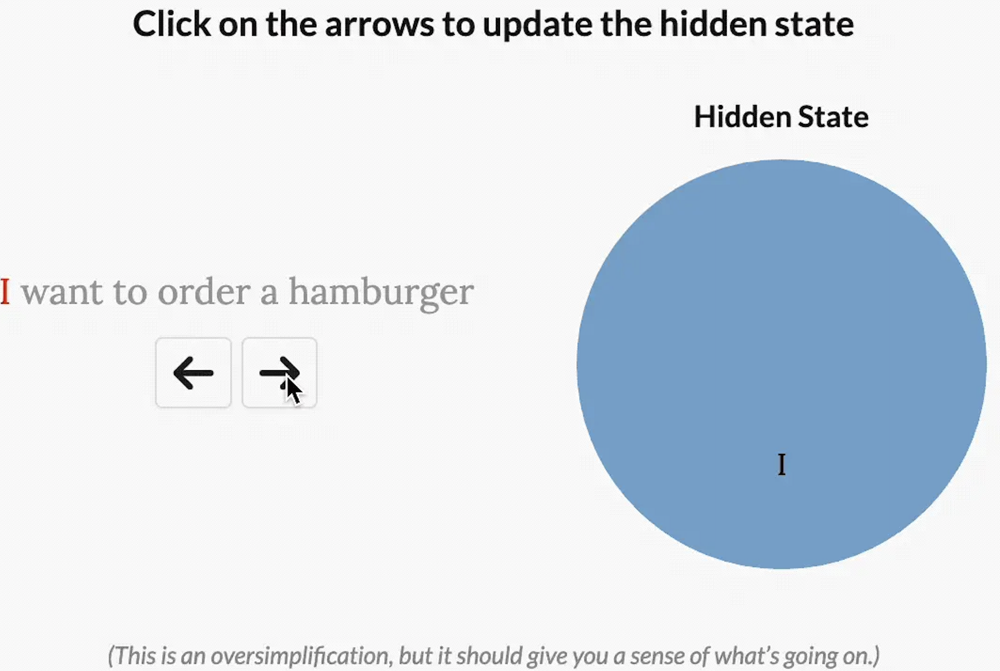

> Note: in the original article there is a button here. After pressing it, an animation shows the Mamba processing flow. Here the gif is shown directly. The same applies to the next places like this.

But for a model trying to classify the intent of this phrase, you would probably want it to "pay attention" to some words more than others. How much do "want" and "to" really contribute to the deeper meaning of the sentence? In practice, it would be useful to spend limited resources more on words like "order," to understand what the user wants to do, and "hamburger," to understand what the user is ordering. By making model parameters functions of the input, Mamba can "pay attention" to the parts of the input that matter more for the current task.

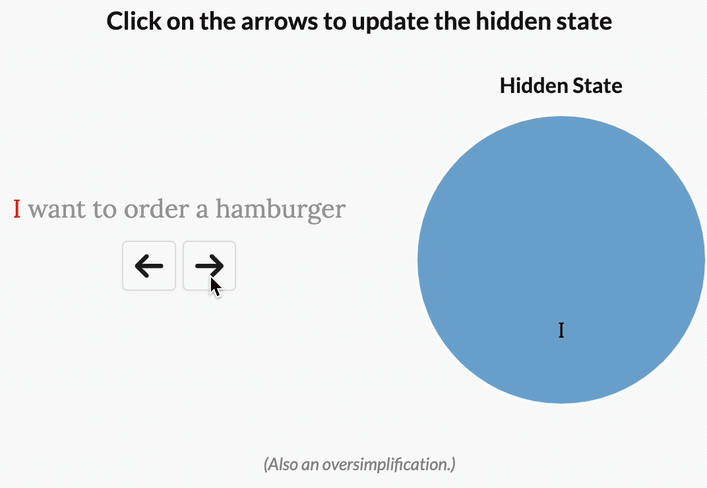

But selectivity creates a problem. Recall the convolution kernel we computed earlier.

$$\begin{align*}
\bar{K} &= \begin{pmatrix}
C\bar{B} & C\bar{A}\bar{B} & ... & C\bar{A}^{k}\bar{B} \\
\end{pmatrix}\\
\end{align*}$$

In S4, we can precompute this kernel, store it, and multiply it by input $x$. This works because $\bar{A},\bar{B},C$ are constants. But as said above, in Mamba these matrices change depending on the input. So we cannot precompute $\bar{K}$, and we cannot use CNN mode to train the model. If we want selectivity, we have to train in RNN mode. We can cross out formula 3b for dramatic effect.

$$\bcancel{\cancel{y = \bar{K}*x}}$$

This left the Mamba authors with a problem: training in RNN mode is very slow. Imagine training a model on sequences of 1,000 tokens. A CNN basically computes dot products between its kernel and the input vector, and it can do those computations in parallel. By contrast, an RNN has to sequentially update its hidden state 1,000 times. The slow training time of RNNs, more or less, stopped them from really taking off. That led the Mamba authors to the second big idea.

## Idea 2: Fast Training Without Convolution

Mamba's second main idea is to train in RNN mode very, very fast. At some point, Gu and Dao realized that their recurrence was very similar to the scan algorithm, also known as prefix sum. To compute a prefix sum, you take an input array $\begin{bmatrix} x_1, x_2, x_3,...,x_n \end{bmatrix}$ and return an output array where each element is the sum of that element and all elements before it. In other words, the first output element is $x_1$, the second is $x_1+x_2$, the third is $x_1+x_2+x_3$, and so on. An example is shown below.

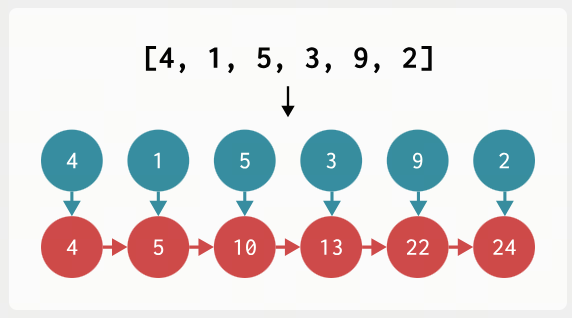

Now let's draw the process of updating Mamba's hidden state in RNN mode. Wait a second...

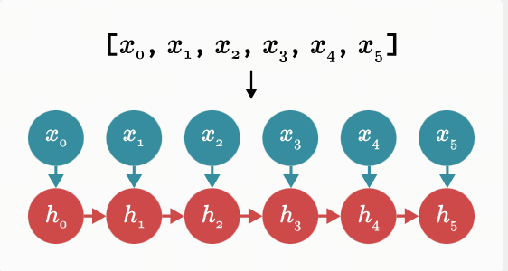

Let's think about this. If we formalize prefix sum, we can write it as:

$$h_t = h_{t-1}+x_t $$

This equation forms a recurrence: at each step, we compute a new value by adding the current input to the previously stored value. Now look again at the recurrence that updates Mamba's hidden state.

$$h_t = \bar{A}h_{t-1}+\bar{B}x_t $$

They really are similar. And the great thing is this: although computing prefix sum seems inherently sequential, we actually have efficient parallel algorithms for it. The figure below shows a parallel prefix sum algorithm in action, where each vertical line represents an array element.

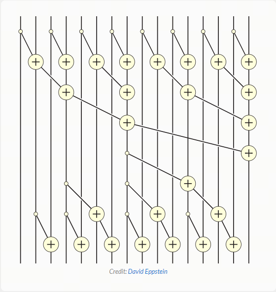

Take a minute to convince yourself that this algorithm works: pick any vertical line, start at the top, and move downward while tracking each addition to previous array elements. When you reach the bottom, you should get the sum of all elements to the left of that line. For example, after the first element is added to the second, the third array element eventually receives the value added to the second element. So by the end of the parallel scan, the third element contains the sum of the first, second, and third elements.

If you run this algorithm in a single thread, without parallelism, it takes longer than simple sequential addition. But GPUs have many processors and can compute with a high degree of parallelism. So we can compute prefix sum, or scan, in roughly $O(log(n))$.

That is how the Mamba authors realized that if they wanted to train efficiently in RNN mode, they might be able to use parallel scan. Since PyTorch [currently has no scan implementation](https://github.com/pytorch/pytorch/issues/50688), the Mamba authors wrote their own, but it did not work perfectly.

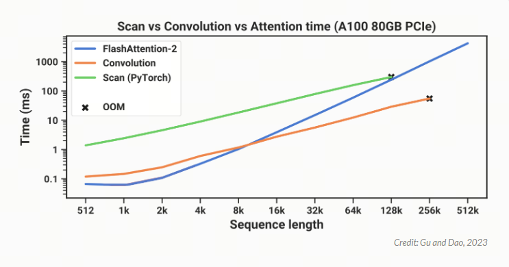

The figure above shows that their PyTorch-based scan implementation (green) is always slower than [FlashAttention-2](https://arxiv.org/abs/2307.08691) (blue), currently the fastest implementation of "exact Attention." At a sequence length of 128,000 tokens, scan seems to almost catch up in runtime, but it also runs out of memory. To make Mamba more practical, it had to be faster. This reminded the Mamba authors of Dao's earlier work on FlashAttention.

## Overview: FlashAttention

FlashAttention is a very fast implementation of Attention. At the time of publication, FlashAttention trained BERT-large 15% faster than the previous fastest training time, and 3 times faster than the widely used GPT-2 implementation in HuggingFace.

Briefly, the key to FlashAttention is this: different GPU operations run at different speeds. The authors realized that some GPU operations are compute-bound, meaning they are limited by GPU computation speed. Other operations are memory-bound, meaning they are limited by the speed of data transfer on the GPU.

Imagine you are playing a game with a friend: your friend has to run 50 meters to bring you two numbers, and then you have to multiply them by hand. When your friend starts running, the timer starts; when you get the answer, the timer stops. Suppose the numbers are 439,145,208 and 142,426,265. Multiplying them by hand takes a while. Your friend may need 5 seconds to bring the numbers, and you may need 60 seconds to do the multiplication. So overall you are compute-bound, because most of the time is spent calculating. Now suppose you need to multiply 4 and 3. Your friend still needs 5 seconds to run 50 meters, but you can compute the answer instantly. Now you are memory-bound, because most of the time is spent transferring data.

> Note: this is the best explanation of compute-bound and memory-bound I have seen so far: very visual and easy to follow.

In this analogy, your GPU is basically racing against time to move data into the right places so it can compute. For example, consider masking. To compute a mask vector, the GPU only needs to erase data values where the mask is zero, and keep them unchanged where the mask is one. If we denote masking by $\oslash$, an example looks like this: the mask forces us to set the last three elements to zero:

$$
\begin{pmatrix} 4&9&4&1&2&7\end{pmatrix}\oslash\begin{pmatrix}1&1&1&0&0&0 \end{pmatrix} = \boxed{\begin{pmatrix}4&9&4&0&0&0 \end{pmatrix}}$$

Because this is very easy to compute, the GPU spends most of its time transferring memory: moving the data and mask matrix into the right places for computation. That means masking is memory-bound. Matrix multiplication, on the other hand, involves a huge number of additions and multiplications. Since computation time is much larger than memory-transfer time, matrix multiplication is compute-bound. With that in mind, let's look at the computations performed during Attention. Note: the original sometimes uses matmul for matrix multiplication, short for matrix multiplication.

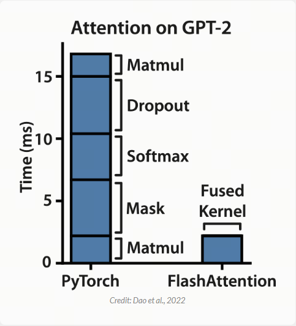

It turns out that dropout, softmax, and masking, which make up a large part of Attention runtime, are memory-bound. This means that during Attention computation we spend most of the time waiting for the GPU to move data around. With that in mind, I imagine the FlashAttention authors asked: how can we speed up operations limited by memory transfer?

This led them to another key observation: GPUs have two main memory regions. One is High Bandwidth Memory (HBM): very large, but very slow. The other is Static Random-Access Memory (SRAM): very small, but very fast. Let's compare these two memory regions on an A100 GPU:

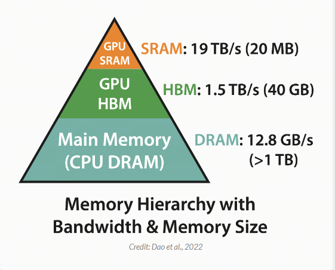

The FlashAttention authors realized that if these GPU memory regions are used especially carefully, memory-bound operations can be much more efficient. They used a technique called tiling: a small chunk of data is moved from HBM, the slower memory, into SRAM, the faster memory; computation happens in SRAM; then the result is moved back from SRAM into HBM. This makes FlashAttention very, very fast, while its results remain numerically comparable to Attention.

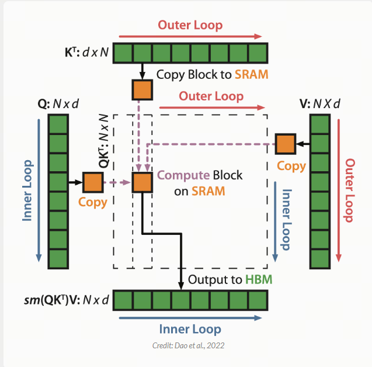

The details of how this works are fascinating, and I recommend reading the [FlashAttention paper](https://arxiv.org/abs/2205.14135) to learn more. But for understanding Mamba overall, this is enough.

## Back to Mamba

Remember that before discussing FlashAttention, we were trying to speed up the parallel scan implementation. Below is the same graph as before. It shows that the PyTorch scan implementation (green) is always slower than the fastest "exact" Transformer, FlashAttention (blue).

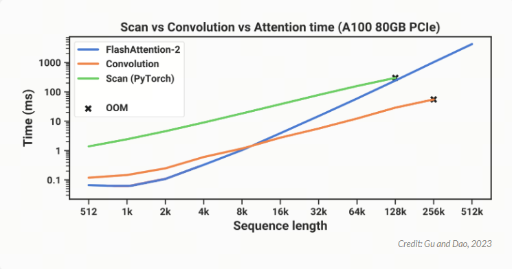

It turns out that applying the same memory-aware tiling to scan computation can speed it up significantly. Thanks to this optimization, Mamba (red) is now faster than FlashAttention-2 (blue) at every sequence length.

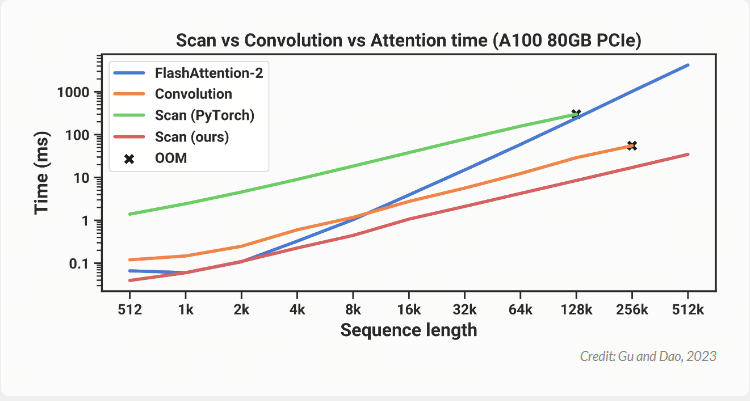

These results show that, in terms of speed, Mamba is practical: it runs faster than the fastest exact Transformers. But is it actually good at language modeling?

## Results

Gu and Dao evaluated Mamba on a set of sequence modeling tasks involving language, genomics, and audio. I am not very familiar with the last two areas, but the results look impressive: Mamba set a new state of the art for modeling DNA from the Human Genome Project and audio from a piano music dataset. At the same time, the language results especially excited many people. A large part of online discussion about Mamba focused on Figure 4, shown below.

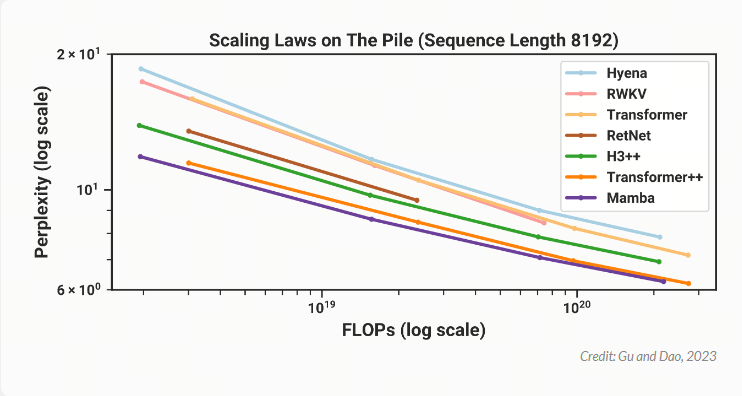

In this graph, model size increases to the right, and language modeling quality improves as you move downward. That means the best models should be in the lower left: small, meaning fast, and still very good at language modeling. Since Gu and Dao are researchers, they do not have thousands of GPUs to train GPT-4-sized models. So they compared models by training many smaller variants, roughly from 125 million to 1.3 billion parameters. As the graph shows, the results look very promising. Compared with other models of similar size, Mamba appears to be the best at language modeling.

## What Comes Next?

I really enjoyed writing this post, because I think Mamba brings innovation to language modeling in a very unique and interesting way. Unfortunately, some reviewers disagreed: Gu and Dao originally planned to present Mamba at ICLR in May, but the paper was rejected a few weeks ago, which caused a fair amount of confusion online.

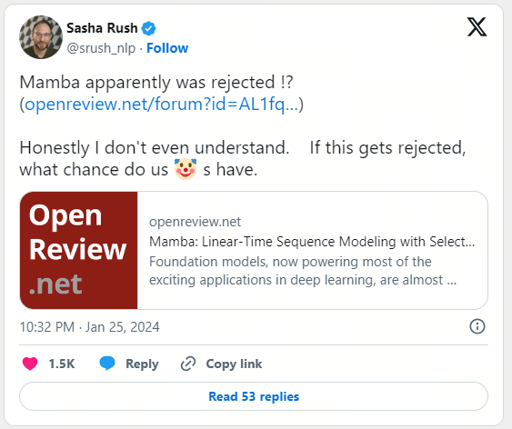

I think Gu and Dao are now working on the next version of the paper, and I also suspect that some companies with many GPUs are now trying to understand whether Mamba's efficiency holds at larger model sizes. Since we increasingly need models that can process more and more tokens at once, if linear-time models such as Mamba can show strong quality, maybe one day they will provide the answer. Until then, we can keep improving our clumsy old Transformers.

## End of Main Text

## Also Used While Writing This Article

[1] [MODELING SEQUENCES WITH STRUCTURED STATE SPACES](https://stacks.stanford.edu/file/druid:mb976vf9362/gu_dissertation-augmented.pdf)

[2] [Mamba: Linear-Time Sequence Modeling with Selective State Spaces](https://arxiv.org/pdf/2312.00752)

## Follow my GitHub and WeChat Official Account: no time to explain, hurry aboard!

[GitHub: LLMForEverybody](https://github.com/luhengshiwo/LLMForEverybody)

The repository has the original Markdown files, and everything is fully open source. Stars and forks are very welcome.
