# From the Beauty of Euler's Formula to RoPE

Maybe you have heard of Euler's formula somewhere. Maybe mathematics is not your thing at all. Either way, you may accidentally open this article, skim it, close it, and go back to work or study. But that does not stop you from pausing for a moment and appreciating its beauty.

Several years from now, you may not remember reading this article, but you may remember that mathematics has one very beautiful formula.

## 1. Euler's Formula and Euler's Identity

***Euler's formula*** is a formula from complex analysis that connects trigonometric functions with the complex exponential function. It is named after Leonhard Euler. Euler's formula states that for any real number x:

$$
e^{ix} = \cos(x) + i\sin(x)
$$

where e is the base of the natural logarithm, i is the imaginary unit, and cos and sin are the trigonometric functions cosine and sine; x is measured in radians.

This is a very beautiful formula: it connects trigonometric functions, the exponential function, and complex numbers, and is one of the jewels of mathematics.

***Euler's identity*** is a special case of Euler's formula. When x = pi, Euler's formula becomes:

$$
e^{i\pi} + 1 = 0
$$

This formula is considered one of the most beautiful formulas in mathematics: it connects five of the most important mathematical constants: 0, 1, e, i, and pi.

> Huge thanks to **Su Jianlin** for introducing such a beautiful formula into positional encoding design. You can follow his blog `科学空间`: https://kexue.fm/. There is a lot to learn there.

## 2. Prerequisite Knowledge

To understand RoPE, you need a few preliminaries:

1. Euler's formula
2. complex numbers / the complex plane
3. a few trigonometric formulas

***Important!!!*** Before diving into many formulas, first understand:

- the complex plane and Euler's formula are introduced only to simplify computation;
- Euler's formula is widely used in mathematics, physics, and engineering exactly because of these properties;
- the proof first considers two-dimensional word vectors, then extends easily to the multidimensional case through matrix properties;
- in the two-dimensional proof, the complex plane is introduced because it lets us use the elegant mathematical properties of Euler's formula and simplify the process.

## 3. Rotary Position Encoding, RoPE

**Rotary Position Encoding, RoPE**

RoPE was proposed to use relative position information between tokens. It assumes that the dot product between query vector $q_m$ and key vector $k_n$ can be expressed by a function $g$, whose inputs are word embedding vectors $x_m$, $x_n$, and their relative position $m-n$:

A bold hypothesis needs careful verification. Now our goal is to find a suitable function $g$, so that $g(x_m, x_n, m-n)$ can capture relative position information between word vectors.

RoPE proposes this: when the word vector is two-dimensional, the plane can be transformed into the complex plane. If we define function $f$ as follows, we can find the corresponding function $g$.

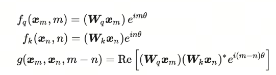

$Re$ means the real part of a complex number. The function $f$ can then be defined as:

Isn't the original query matrix being multiplied by a rotation matrix here? In other words, after adding positional information $m$, RoPE is equivalent to rotating the original query matrix. That is where the word **rotary** comes from.

Similarly, $f_K$ can be expressed as:

The corresponding function $g$ is:

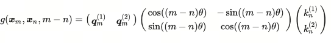

## 4. From Two Dimensions to the Multidimensional Case

In the two-dimensional case, we introduced the complex plane to use the elegant mathematical properties of Euler's formula and simplify the process. In the multidimensional case, we can directly use matrix properties to simplify the process. To generalize two-dimensional RoPE to multidimensional RoPE, just replace the rotation matrix $R$ in two-dimensional RoPE with a multidimensional rotation matrix $R$.

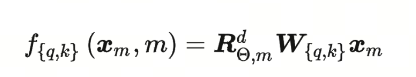

Because the dot product has linear additivity, RoPE of any ***even dimension*** can be represented as a concatenation of two-dimensional cases.

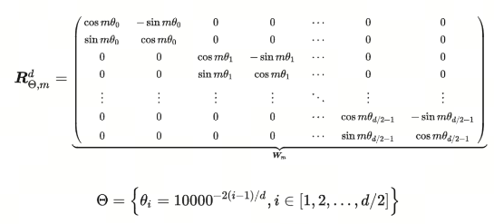

That is, the rotation matrix $R^d_{\theta,m}$ is added to the original $q*k$ matrix. This is the idea of RoPE.

The original paper has an intuitive diagram:

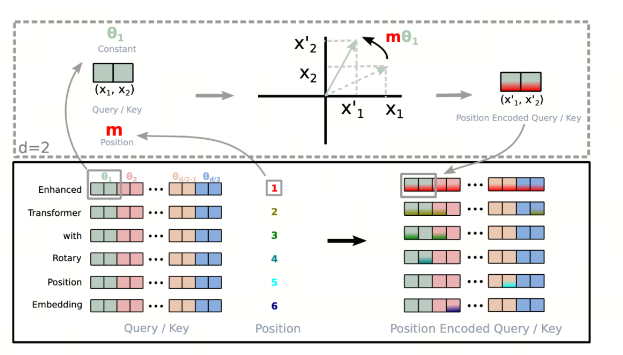

## 5. RoPE Proof

Note: this proof is built on the two-dimensional case, and the two-dimensional case can be extended to the multidimensional case using the matrix properties from the previous section.

In the two-dimensional case, we formally transform it into the complex plane.

According to the RoPE construction, the encoded form of $q,v$ and the dot product $<q,v>$ looks like this:

Why does the formula above satisfy this condition:

First, recall Euler's formula:

$$
e^{ix} = \cos(x) + i\sin(x)
$$

then:

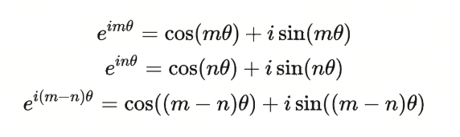

Look at the query matrix. We can see:

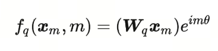

Here $W_q$ is a two-dimensional matrix, $x_m$ is a two-dimensional vector, and their product is also a two-dimensional vector. We denote it as $q_m$. $q^{(1)}_m$ and $q^{(2)}_m$ mean the first and second dimensions.

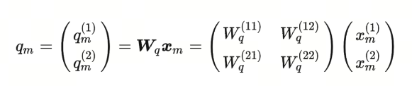

Now we need to transform $q_m$ into complex form, moving this two-dimensional plane into the complex plane, where the real part is the first dimension (x-axis) and the imaginary part is the second dimension (y-axis).

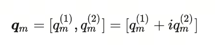

Now $f_q(x_m,m)$ can be expressed as:

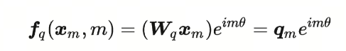

This is the product of two complex numbers:

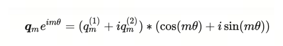

After a simple expansion:

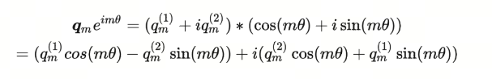

Then, returning from the complex plane back to the real two-dimensional plane, the formula can be written as:

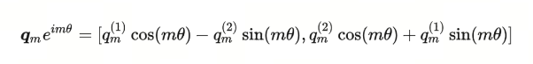

This is actually the query vector without positional information multiplied by a rotation matrix. That is the idea of RoPE.

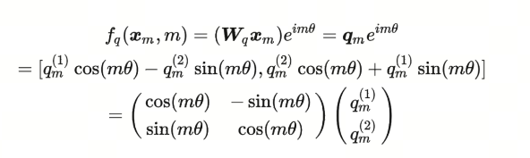

Similarly, we can get the RoPE form for the key vector:

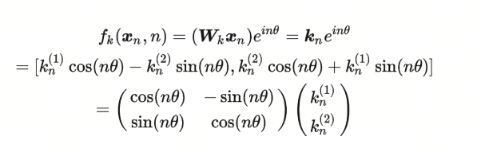

Finally, we can get the dot product form of RoPE:

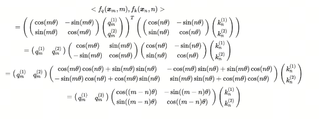

## Summary

RoPE elegantly uses the complex plane and Euler's formula to encode positional information into query and key vectors, allowing the model to use relative position information between tokens. The idea of RoPE is to rotate query and key vectors. That is where "rotary" comes from.

## References

[1] [Understand rotary encoding (RoPE) in ten minutes](https://hub.baai.ac.cn/view/29979)

[2] [The Transformer positional encoding that researchers keep puzzling over](https://kexue.fm/archives/8130)

[3] [Transformer development path: 2. Rotary positional encoding, combining the strengths of different approaches](https://kexue.fm/archives/8265)

[4] [Transformer study notes, part 1: Positional Encoding](https://zhuanlan.zhihu.com/p/454482273)

[5] [RoFormer: Enhanced Transformer with Rotary Position Embedding](https://arxiv.org/abs/2104.09864)

[6] [GitHub: LLMForEverybody](https://github.com/luhengshiwo/LLMForEverybody)
