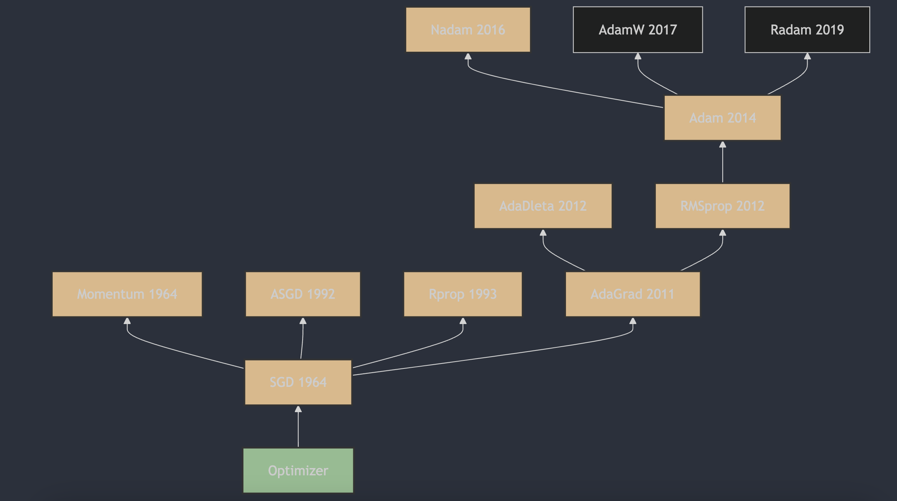

Understanding neural network optimizers in 3 minutes a day, part 10: Nadam

## 1. The Appearance of Nadam

Nadam (Nesterov-accelerated Adaptive Moment Estimation) was proposed by Tim Salimans et al. in 2016. It combines the advantages of Adam and Nesterov Accelerated Gradient (NAG) to improve optimization quality. A detailed description and the algorithm principles can be found in "Incorporating Nesterov Momentum into Adam" [1](#refer-anchor-10), first submitted to arXiv in 2016 and later published at ICLR 2017.

## 2. How Nadam Works

Nadam (Nesterov-accelerated Adaptive Moment Estimation) is an optimizer that combines Nesterov momentum (NAG) with the Adam optimization algorithm. It is designed to improve optimization quality, especially in deep learning.

The Nadam update rules look like this:

1. Initialize the first moment estimate (momentum) $m_0$ and the second moment estimate (moving average of squared gradients) $v_0$ as zeros, and set time step $t=1$.
2. At each iteration, compute gradient $g_t$.
3. Update first moment estimate $m_t$ and second moment estimate $v_t$:

   $m_t = \beta_1 \cdot m_{t-1} + (1 - \beta_1) \cdot g_t$

   $v_t = \beta_2 \cdot v_{t-1} + (1 - \beta_2) \cdot g_t^2$

4. Compute bias-corrected first moment estimate $\hat{m}_t$ and second moment estimate $\hat{v}_t$:

   $\hat{m}_t = \frac{m_t}{1 - \beta_1^t}$

   $\hat{v}_t = \frac{v_t}{1 - \beta_2^t}$

5. Compute Nadam's specific corrected momentum $\hat{m}_t^{'}$:

   $\hat{m}_t^{'} = \beta_1 \cdot m_{t-1} +\frac{(1 - \beta_1) \cdot g_t}{1 - \beta_1^t}$

6. Update parameters $\theta$:

   $\theta_t = \theta_{t-1} - \eta \cdot \frac{\hat{m}_t^{'}}{\sqrt{\hat{v}_t} + \epsilon}$

In the Nadam update formula, $\hat{m}_t^{'}$ is the corrected momentum combined with Nesterov momentum. When computing the update, it takes the previous step's velocity into account. This Nesterov-momentum feature is the main difference between Nadam and Adam.

## 3. Main Features of Nadam

Advantages of Nadam include:

- It combines the advantages of Nesterov momentum and Adam: it has both an adaptive learning rate and Nesterov momentum, so it can converge faster.
- It works well when optimizing deep learning models.

Possible drawbacks of Nadam:

- The initial learning rate and two decay coefficients must be set manually, so hyperparameter tuning is fairly complex.
- It may cause oscillations during training, especially with a high learning rate.
- Since it combines Adam and Nesterov momentum, the optimization process can become too complex, increasing compute load.

In practice, Nadam is usually used to train deep learning models, especially when fast convergence and optimization on sparse datasets are needed. In many cases it performs well, but hyperparameters need to be tuned carefully to get the best result.

## References

[1] [Incorporating Nesterov Momentum into Adam](https://openreview.net/forum?id=OM0jvwB8jIp57ZJjtNEZ)

## Author's GitHub and WeChat

[GitHub: LLMForEverybody](https://github.com/luhengshiwo/LLMForEverybody)

The repository has the original Markdown files, and it is fully open source. Stars and forks are very welcome.
