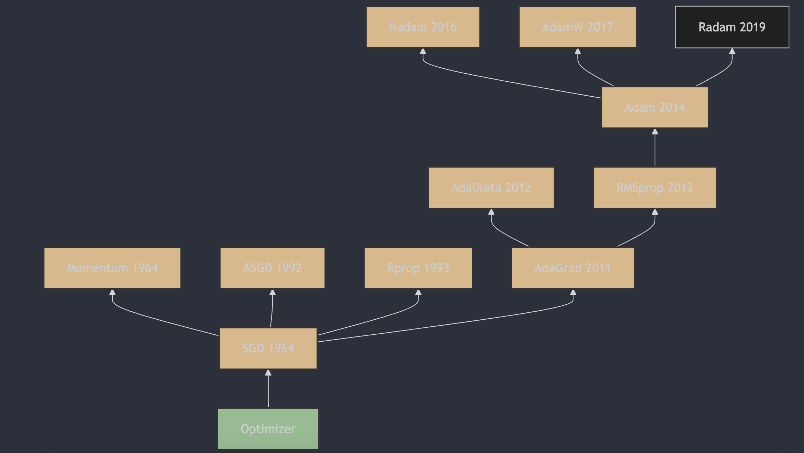

Understanding neural network optimizers in 3 minutes a day, part 11: AdamW

## 1. The Appearance of AdamW

AdamW was proposed by Ilya Loshchilov and Frank Hutter. A detailed description and the algorithm principles can be found in "Decoupled Weight Decay Regularization" [1](#refer-anchor-11), published in 2017. In this paper, the authors pointed out several problems in traditional Adam when using weight decay, and proposed AdamW as the solution. AdamW decouples weight decay from the gradient update, so weight decay is applied more effectively at each iteration. In practice, this approach has been shown to improve model convergence speed and generalization ability.

## 2. How AdamW Works

AdamW is an improvement over the Adam optimizer and mainly solves the problem of using weight decay in Adam. In standard Adam, weight decay is directly added to the gradient. In AdamW, it is applied differently: it acts directly on the parameter update.

The AdamW update formulas look like this:

1. Initialize the first moment estimate (momentum) $m_0$ and the second moment estimate (moving average of squared gradients) $v_0$ as zeros, and set time step $t=1$.

2. At each iteration, compute gradient $g_t$.

3. Update first moment estimate $m_t$ and second moment estimate $v_t$:

   $m_t = \beta_1 \cdot m_{t-1} + (1 - \beta_1) \cdot g_t$

   $v_t = \beta_2 \cdot v_{t-1} + (1 - \beta_2) \cdot g_t^2$

4. Compute bias-corrected first moment estimate $\hat{m}_t$ and second moment estimate $\hat{v}_t$:

   $\hat{m}_t = \frac{m_t}{1 - \beta_1^t}$

   $\hat{v}_t = \frac{v_t}{1 - \beta_2^t}$

5. Update parameters $\theta$, where $\lambda$ is the weight-decay coefficient:

   $\theta_t = \theta_{t-1} - \eta \left( \frac{\hat{m}_t}{\sqrt{\hat{v}_t} + \epsilon} + \lambda \theta_{t-1} \right)$

In AdamW, weight decay $ \lambda $ is multiplied by learning rate $ \eta $ and then subtracted from the parameters, rather than being added to the gradient. This method is believed to better control model complexity, prevent overfitting, and often improve model quality.

In practical applications, choosing AdamW or another optimizer usually depends on the needs of the task and experimental evaluation of the algorithm's performance.

## 3. Main Features of AdamW

AdamW (Adam with Weight Decay) is a popular optimization algorithm that improves the original Adam algorithm, especially in how it handles weight decay. Below are AdamW's advantages and disadvantages.

### Advantages:

1. **Improved weight-decay handling**: AdamW solves the original Adam problem with weight decay by applying it during parameter update rather than during gradient computation. This makes the weight-decay effect more consistent and effective.

2. **Reduced overfitting**: weight decay is a regularization technique that helps reduce model overfitting. By applying weight decay reasonably, AdamW can improve model generalization.

3. **Preserves momentum and adaptive learning-rate benefits**: AdamW keeps Adam's momentum benefits and AdaGrad's adaptive learning-rate benefits, helping speed up convergence and adapt to different parameter-update needs.

### Disadvantages:

1. **Hyperparameter tuning**: AdamW introduces extra hyperparameters, such as the weight-decay coefficient, which may require more tuning to find the best hyperparameter combination.

2. **Sensitivity to learning rate**: AdamW may be more sensitive to learning-rate choice than SGD and some other optimizers. A poorly chosen learning rate can hurt training results.

## References

[1] [DECOUPLED WEIGHT DECAY REGULARIZATION](https://arxiv.org/pdf/1711.05101)

## Author's GitHub and WeChat

[GitHub: LLMForEverybody](https://github.com/luhengshiwo/LLMForEverybody)

The repository has the original Markdown files, and it is fully open source. Stars and forks are very welcome.
