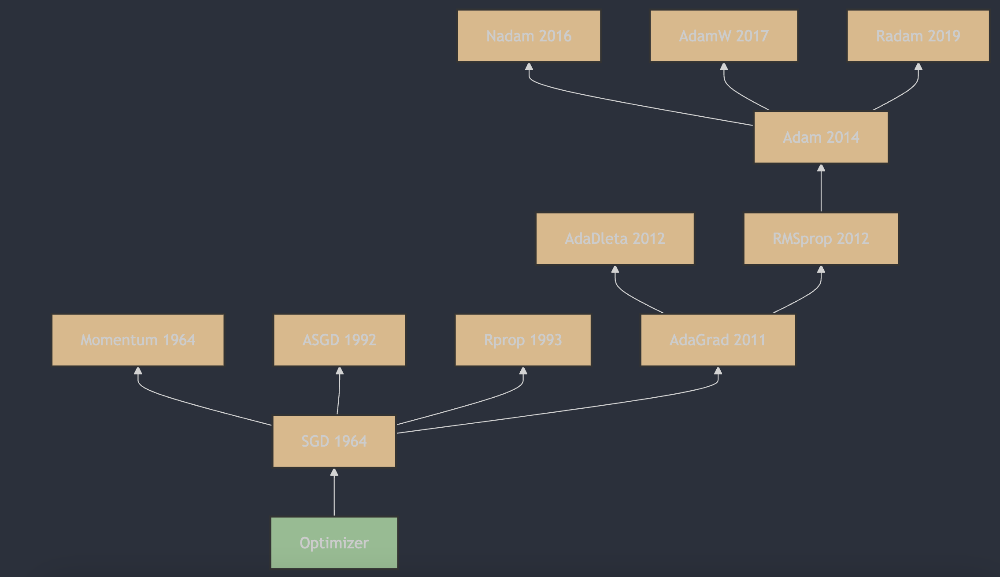

Understanding neural network optimizers in 3 minutes a day, part 12: RAdam

## 1. The Appearance of RAdam

RAdam (Rectified Adam) was proposed by Liyuan Liu et al. A detailed description and the algorithm principles can be found in "On the Variance of the Adaptive Learning Rate and Beyond" [1](#refer-anchor-12), which first appeared in 2019 and was later published at ICLR 2020. The paper proposed RAdam: by introducing a rectification factor, it solves the problem of overly high adaptive learning-rate variance in early model training, improving the stability and robustness of optimization.

## 2. How RAdam Works

RAdam (Rectified Adam) is an optimization algorithm and a variant of Adam, designed to solve Adam's unstable performance across different datasets and tasks. RAdam dynamically adjusts the learning rate for different training stages, improving model training results.

### Main Features of RAdam:

1. **Dynamic learning-rate adjustment**: RAdam dynamically adjusts the learning rate according to training progress, matching the needs of different training stages.

2. **Adaptiveness**: RAdam can automatically adjust the optimization strategy based on training-data characteristics, improving adaptability across datasets and tasks.

3. **Ease of use**: RAdam is implemented similarly to Adam, so it is easy to use in existing deep learning frameworks.

### RAdam Update Rules:

The update rules of RAdam are similar to Adam, but a rectification factor is added during parameter updates to improve optimization efficiency. The concrete formulas are:

1. Initialize the first moment estimate (momentum) $m_t$ and the second moment estimate (moving average of squared gradients) $v_t$ as zeros, and set time step $t=1$.

2. At each iteration, compute gradient $g_t$.

3. Update first moment estimate $m_t$ and second moment estimate $v_t$:

   $m_t = \beta_1 \cdot m_{t-1} + (1 - \beta_1) \cdot g_t$

   $v_t = \beta_2 \cdot v_{t-1} + (1 - \beta_2) \cdot g_t^2$

4. Compute bias-corrected first moment estimate $\hat{m}_t $ and second moment estimate $ \hat{v}_t$:

   $\hat{m}_t = \frac{m_t}{1 - \beta_1^t}$

   $\hat{v}_t = \frac{v_t}{1 - \beta_2^t}$

5. Dynamically adjust the learning rate depending on the training stage:

    $\rho_\infty = \frac{2}{1 - \beta_2} - 1$

    $\rho_t = \rho_\infty - \frac{2t\beta_2^t}{1 - \beta_2^t}$

    $\text{if } \rho_t > 5, \text{ then:}$

    $r_t = \sqrt{\frac{(\rho_t - 4)(\rho_t - 2)\rho_\infty}{(\rho_\infty - 4)(\rho_\infty - 2)\rho_t}}$

    $\text{otherwise:}$

    $r_t = 1$

6. Update parameters $\theta$:

   $\theta_t = \theta_{t-1} - \eta_t \cdot \frac{\hat{m}_t}{\sqrt{\hat{v}_t} + \epsilon}$

Here $\eta$ is the initial learning rate, $\epsilon$ is a small constant for numerical stability, for example $1e-8$, and $\beta_1$ and $\beta_2$ are hyperparameters usually set to 0.9 and 0.999.

## Advantages and Disadvantages of RAdam:

**Advantages**:

- Dynamically adjusts the learning rate, improving optimization efficiency.
- Highly adaptive and suitable for different datasets and tasks.

**Disadvantages**:

- Compared with original Adam, RAdam is slightly more complex to implement.
- More hyperparameters need tuning, which can make configuration harder.

On some tasks, RAdam can perform better than Adam and other optimizers, but its effectiveness also depends on the specific task and dataset. In practice, experiments may be needed to determine whether RAdam is suitable for a given task.

## References

[1] [On the Variance of the Adaptive Learning Rate and Beyond](https://arxiv.org/abs/1908.03265)

## Author's GitHub and WeChat

[GitHub: LLMForEverybody](https://github.com/luhengshiwo/LLMForEverybody)

The repository has the original Markdown files, and it is fully open source. Stars and forks are very welcome.
