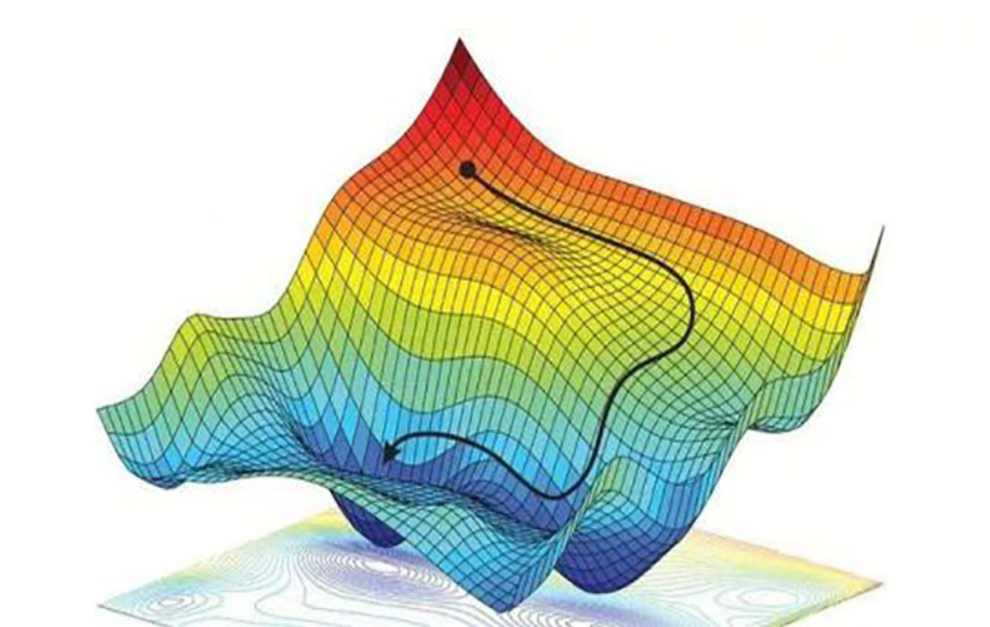
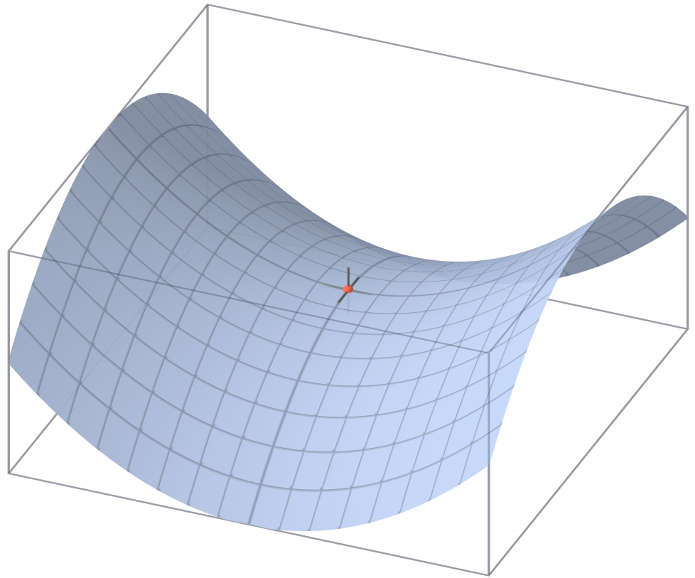
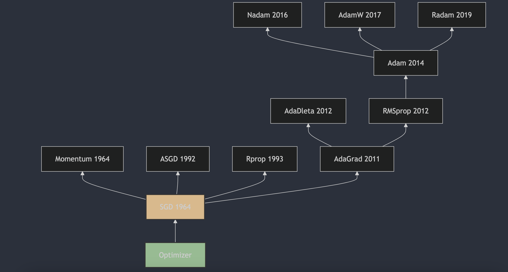

3 minutes a day: fully understanding neural network optimizers, part 2. SGD

## 1. SGD

Stochastic Gradient Descent (SGD) is an iterative optimization method for differentiable objective functions, a stochastic approximation of gradient descent. The origins of SGD go back to 1951, when Herbert Robbins and Sutton Monro first described stochastic approximation in "A Stochastic Approximation Method" [1]. It can be viewed as a predecessor of SGD. Then J. Kiefer and J. Wolfowitz published "Stochastic Estimation of the Maximum of a Regression Function" [2] in 1952, which is closer to the modern machine-learning view of SGD.

The update formula for Stochastic Gradient Descent (SGD) is a variant of gradient descent. It is used to optimize an objective function, especially on large datasets. At each iteration, SGD uses only one example or a small mini-batch of examples to compute the gradient, then updates the model parameters. This reduces the compute cost of each iteration and helps the algorithm escape local minima.

The SGD parameter update formula is:

$$\theta_{t+1} = \theta_t - \eta_t \nabla J(\theta_t; x^{(i)}, y^{(i)})$$

where:

- $\theta_t$ denotes the model parameters at time step t, such as weights and biases;
- $\eta_t$ denotes the learning rate, which controls the step size when updating parameters;
- $\nabla J(\theta_t; x^{(i)}, y^{(i)})$ denotes the gradient of loss function J with respect to parameters $\theta_t$ on example $(x^{(i)}, y^{(i)})$;
- $\theta_{t+1}$ is the updated model parameters.

In practice, learning rate $\eta_t$ can be fixed or can gradually decrease over time (learning rate decay) to help training stay stable and converge.

## 2. SGD's Weakness: Non-Convex Optimization

A non-convex optimization problem means the objective function has multiple local minima. In this situation, SGD may fall into a local minimum that is hard to escape. The reason is that SGD uses only one example or a small mini-batch at each iteration to compute the gradient. Because of that, the gradient direction may be inaccurate and affect the parameter update direction.

**Saddle point**

In optimization and machine learning, a saddle point is a critical point of the objective function where derivatives are positive in some directions (uphill) and negative in others (downhill). In other words, a saddle point is neither a local minimum nor a local maximum. It is a kind of mix of the two.

More precisely:

- Local minimum: in every neighborhood of the point, the function value is greater than or equal to the value at that point;
- Local maximum: in every neighborhood of the point, the function value is less than or equal to the value at that point;
- Saddle point: in some directions around the point, the function value is greater than or equal to the value at the point, while in other directions it is less than or equal.

In two-dimensional space, a saddle point can be imagined as the shape of a saddle: if you move from one side of the saddle to the top and then to the other side, you first go through an uphill section, which looks like a local minimum, and then a downhill section, which looks like a local maximum.

In machine learning, especially deep learning, saddle points can create difficulties for gradient-based optimization methods such as gradient descent. The algorithm can get stuck near a saddle point because the gradient there is zero, and the algorithm cannot tell which direction to move next.

## References

[1] [A Stochastic Approximation Method](https://www.jstor.org/stable/2236626)

[2] [Stochastic Estimation of the Maximum of a Regression Function](https://projecteuclid.org/journals/annals-of-mathematical-statistics/volume-23/issue-3/Stochastic-Estimation-of-the-Maximum-of-a-Regression-Function/10.1214/aoms/1177729392.full)

## Follow my GitHub and WeChat account: no time to explain, everyone aboard!

[GitHub: LLMForEverybody](https://github.com/luhengshiwo/LLMForEverybody)

The repository has the original Markdown files, and the project is fully open source. Stars and forks are very welcome.

---

## 📚 相关概念

[[concepts/Transformer 架构|Transformer 架构]] | [[concepts/分词器 LLM|分词器 LLM]] | [[concepts/LLM 训练 流水线|LLM 训练 流水线]] | [[concepts/RLHF DPO 对齐|RLHF DPO 对齐]] | [[concepts/LoRA PEFT 微调|LoRA PEFT 微调]] | [[concepts/多模态 LLM|多模态 LLM]] | [[concepts/模型 压缩 蒸馏|模型 压缩 蒸馏]] | [[entities/Hugging Face|Hugging Face]] | [[entities/DeepSeek|DeepSeek]] | [[entities/mindspore Transformer|mindspore Transformer]] | [[sources/Vaswani 2017 Attention|Vaswani 2017 Attention]] | [[sources/LLM 训练 流水线 指南|LLM 训练 流水线 指南]] | [[sources/DeepSeek 4 技术|DeepSeek 4 技术]]

> 📌 来源：[[sources/LLMForEverybody/索引|LLMForEverybody 导航]] · 章节：预训练
