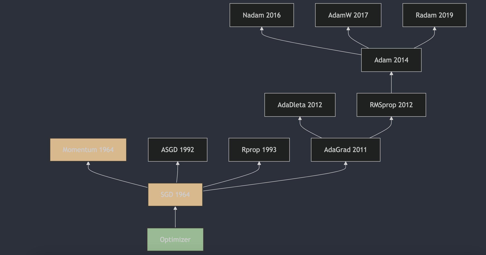

Understanding neural network optimizers in 3 minutes a day, part 3: Momentum

Previously, we started from basic SGD, looked at the details of the SGD algorithm, and discussed its weaknesses in deep neural networks. This article introduces Momentum, which solves some of SGD's problems.

## 1. The Appearance of Momentum

Momentum was first proposed by B.T. Polyak in 1964. This method is used to speed up convergence of gradient descent, especially for optimization problems with high condition numbers. Polyak described it in "Some methods of speeding up the convergence of iteration methods" [1], published in "USSR Computational Mathematics and Mathematical Physics." Momentum adds part of the previous step's velocity to each update, helping the algorithm accelerate in consistent directions and reduce oscillations on flat parts of the objective function. Later, it became widely used in machine learning, especially deep learning, and became an important part of the optimizer family.

## 2. Exponentially Weighted Average

Before moving to Momentum, let's understand exponentially weighted average (EWA).

Exponentially Weighted Average (EWA) is a statistical method for computing a weighted average of a set of values, where more recent data points receive more weight. This is useful in signal processing, time-series analysis, machine learning, and other areas, especially when you need to react quickly to recent changes in data.

The formula for exponentially weighted average is:

$$ \text{EWA}_t = \beta \cdot \text{EWA}_{t-1} + (1 - \beta) \cdot x_t $$

where:

- $ \text{EWA}_t $ is the exponentially weighted average at time $t$.
- $\beta$ is the decay factor between 0 and 1, which controls the weight of historical data.
- $x_t$ is the observed value at time $t$.
- $\text{EWA}_{t-1}$ is the exponentially weighted average at the previous time step.

The choice of decay factor $\beta$ strongly affects the exponentially weighted average. If $\beta$ is close to 1, historical data has a long-lasting effect and the smoothing is stronger. If $\beta$ is close to 0, new data has a stronger effect and the response to changes is faster.

One feature of exponentially weighted average is that it is not too sensitive to outliers, because the weight of each data point decreases exponentially over time. So this method is very useful when working with noisy data.

## 3. Momentum

Momentum is a widely used optimization strategy in deep learning. It introduces a momentum term to speed up convergence of gradient descent and improve stability. The basic idea is to imitate physical momentum: accumulate information from past gradients and use it to adjust the direction and magnitude of parameter updates. Momentum is computed through an exponentially weighted average.

The update formulas for Momentum can be written as:

$$
\begin{align}
v_t &= \gamma v_{t-1} + \eta_t \nabla J(\theta_t) \\
\theta_t &= \theta_{t-1} - v_t
\end{align}
$$

where:

- $ v_t$ is the momentum term at time step $t$, computed through an exponentially weighted average;
- $\gamma$ is the momentum decay coefficient, usually set in the range $[0,1)$, such as 0.9 or 0.99;
- $\eta_t$ is the learning rate;
- $\nabla J(\theta_t) $ is the gradient of the loss function at parameters $\theta_t$.

Advantages of Momentum:

1. **Faster convergence**: accumulated historical gradients let parameter updates accelerate in consistent directions.
2. **Reduced oscillation**: helps reduce oscillation during training, especially on flat parts of the objective function or near a minimum.
3. **Escaping local minima**: in some cases, momentum helps the algorithm escape a local minimum and find a better global minimum.

## 4. Why Is Exponentially Weighted Average Called "Exponential"?

It is called "exponential" because, when computing the average, the weights of data from different time steps decay exponentially.

At each computation, the new element $x_t$ receives weight $(1 - \beta)$, while the previous exponentially weighted average $\text{EWA}_{t-1}$ receives weight $\beta$. Since $\beta$ is close to 1, the older the data is, the faster its weight decreases as a power of $\beta$. That is where the name "exponential" comes from.

$$
\begin{align*}
v_{100} &= 0.9 \cdot v_{99} + 0.1 \cdot \theta_{100} \\
v_{99} &= 0.9 \cdot v_{98} + 0.1 \cdot \theta_{99} \\
v_{98} &= 0.9 \cdot v_{97} + 0.1 \cdot \theta_{98} \\
v_{97} &= 0.9 \cdot v_{96} + 0.1 \cdot \theta_{97} \\
\cdots \\
v_{1} &= 0.9 \cdot v_{0} + 0.1 \cdot \theta_{1} \\
v_{0} &= 0
\end{align*}
$$

Expand the recursion and compute $v_{100}$:

$$
v_{100} = 0.1 \cdot \theta_{100} + 0.9 \cdot 0.1 \cdot \theta_{99} + 0.9^2 \cdot 0.1 \cdot \theta_{98} + \cdots + 0.9^{99} \cdot 0.1 \cdot \theta_{1}
$$

In general, after enough time steps, earlier data has very little influence on the final result. When $\beta = 0.9$, $0.9^{99} \approx 1.0 \times 10^{-5}$, so the contribution of $\theta_{1}$ to $v_{100}$ can basically be ignored. Usually no more than $1/1-\beta$ time steps of data are considered, and older data is treated as negligible.

According to the limit formula:

$$lim_{{x\to 0}}{(1-x)^{\frac{1}{x}}} = \frac{1}{e}$$

Here, when $x= 1- \beta $, we get ${\beta^{\frac{1}{1-\beta}}} = \frac{1}{e}$.

## 5. Why Is the Algorithm Called "Momentum"?

The name comes from the physical idea of momentum. The algorithm adds information from gradients of previous iterations into the parameter update, imitating the momentum of a moving object. Because of this, during optimization the algorithm keeps a certain "inertia" and can adjust its search direction and step length more smoothly when the curvature of the objective function changes or when noise is present.

In physics, momentum measures the state of motion of an object and is related to mass and velocity. By analogy, Momentum in machine learning can be seen as adding "inertia" to optimization: during iterations, the algorithm uses previous gradient information to adjust the current update direction and step length. So it moves more smoothly over the objective surface and is less likely to get stuck in local minima or flat regions.

## References

[1] [Some methods of speeding up the convergence of iteration methods](https://www.sciencedirect.com/science/article/abs/pii/0041555364901375)

## Author's GitHub and WeChat

[GitHub: LLMForEverybody](https://github.com/luhengshiwo/LLMForEverybody)

The repository has the original Markdown files, and it is fully open source. Stars and forks are very welcome.

---

## 📚 相关概念

[[concepts/Transformer 架构|Transformer 架构]] | [[concepts/分词器 LLM|分词器 LLM]] | [[concepts/LLM 训练 流水线|LLM 训练 流水线]] | [[concepts/RLHF DPO 对齐|RLHF DPO 对齐]] | [[concepts/LoRA PEFT 微调|LoRA PEFT 微调]] | [[concepts/多模态 LLM|多模态 LLM]] | [[concepts/模型 压缩 蒸馏|模型 压缩 蒸馏]] | [[entities/Hugging Face|Hugging Face]] | [[entities/DeepSeek|DeepSeek]] | [[entities/mindspore Transformer|mindspore Transformer]] | [[sources/Vaswani 2017 Attention|Vaswani 2017 Attention]] | [[sources/LLM 训练 流水线 指南|LLM 训练 流水线 指南]] | [[sources/DeepSeek 4 技术|DeepSeek 4 技术]]

> 📌 来源：[[sources/LLMForEverybody/索引|LLMForEverybody 导航]] · 章节：预训练
