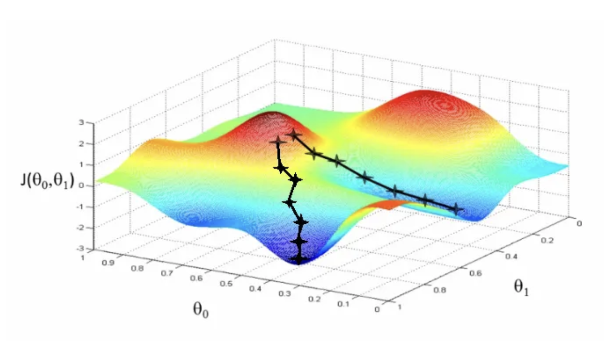
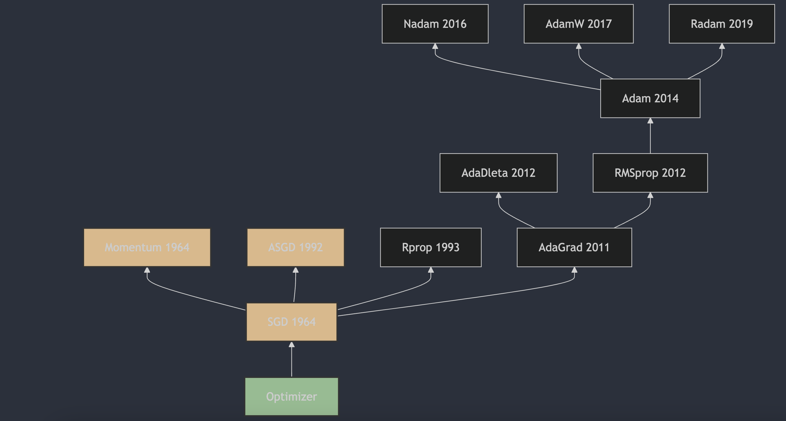

Understanding neural network optimizers in 3 minutes a day, part 4: ASGD

## 1. The Appearance of ASGD

Averaged Stochastic Gradient Descent (ASGD) is an iterative optimization method for differentiable objective functions, and it is a stochastic approximation of gradient descent. ASGD appeared in 1992, when B.T. Polyak first described it in "Acceleration of Stochastic Approximation by Averaging" [1](#refer-anchor-4). ASGD updates parameters using the average of several stochastic gradients to reduce random-gradient variance and improve convergence speed. When training deep neural networks, this method can help the algorithm converge faster to an optimal solution.

## 2. How ASGD Works

Unlike Momentum, discussed in the previous article, which applies an exponentially weighted average to gradients, ASGD averages several stochastic gradients. The ASGD update looks like this:

1. Initialize parameters $\theta_0$ and learning rate $\eta$.
2. For each iteration $t$, compute gradient $g_t$.
3. Update parameters $\theta$:

   $$\theta_{t+1} = \theta_t - \eta \cdot \frac{1}{t+1} \sum_{i=1}^{t} g_i$$

   where $g_i$ is the gradient at the i-th iteration.

In this update formula, $\sum_{i=1}^{t} g_i$ is the sum of all gradients from the first iteration to the current one, then divided by $t+1$ to compute the average. As the number of iterations grows, the coefficient $\frac{1}{t+1}$ multiplied by learning rate $\eta $ gradually becomes smaller. This makes the update step shrink over time, helping the algorithm become more stable near the optimal solution.

The key feature of ASGD is that during training it accumulates the sum of all gradients and uses this accumulated sum to update parameters. This helps reduce noise in stochastic gradient descent, and over time the parameter updates gradually approach zero, allowing the algorithm to stabilize near the optimal solution. Also, ASGD usually uses the average value of parameters across all iterations as the final model parameters after training, which further improves generalization.

## 3. Differences Between ASGD and Momentum

ASGD and Momentum are neural network optimization algorithms. The main difference is how they update parameters. Both are designed to improve basic stochastic gradient descent (SGD), but they work differently:

1. **Momentum**:
   - Momentum updates parameters by combining the exponentially weighted average of previous gradients, the momentum term, with the current gradient. This helps speed up convergence during gradient descent and reduce gradient oscillation in high-curvature regions.

2. **ASGD**:
   - ASGD updates parameters by computing the simple average of all historical gradients, rather than using an exponentially weighted average like Momentum.
   - One key feature of ASGD is that it uses the same learning rate at each iteration, but the effective learning rate naturally decreases over time because the denominator \( t \) grows with the number of iterations.

**Main differences**:

- **How historical gradients are handled**: Momentum uses an exponentially weighted average to compute momentum, while ASGD uses a simple arithmetic average.
- **Learning-rate adjustment**: in Momentum, the learning rate is fixed or may change over time; in ASGD, the learning rate naturally decreases as the number of iterations increases.
- **Convergence behavior**: Momentum usually gives better acceleration in high-curvature regions, while ASGD smooths gradient updates by averaging historical gradients and reduces the effect of noise.

## References

[1] [Acceleration of stochastic approximation by averaging](https://dl.acm.org/doi/10.1137/0330046)

## Author's GitHub and WeChat

[GitHub: LLMForEverybody](https://github.com/luhengshiwo/LLMForEverybody)

The repository has the original Markdown files, and it is fully open source. Stars and forks are very welcome.
