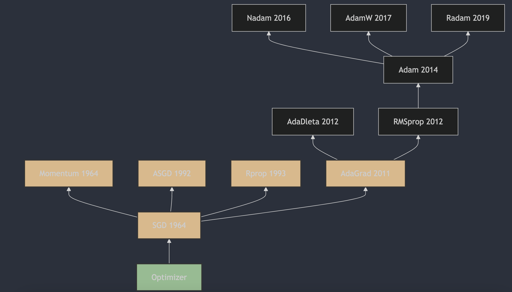

Understanding neural network optimizers in 3 minutes a day, part 6: AdaGrad

## 1. The Appearance of AdaGrad

AdaGrad (Adaptive Gradient Algorithm) was proposed by John Duchi, Elad Hazan, and Yoram Singer. The algorithm is described in detail in the 2011 paper "Adaptive Subgradient Methods for Online Learning and Stochastic Optimization" [1](#refer-anchor-6), published in the Journal of Machine Learning Research. AdaGrad's main feature is that it independently adjusts the learning rate for each parameter: rarely updated parameters get a larger learning rate, while frequently updated ones get a smaller learning rate. This adaptive learning-rate adjustment is especially good for sparse data, because it gives more attention to sparse features. But AdaGrad also has a drawback: the accumulated sum of squared gradients during training can make the learning rate too small, so training almost stops in later stages. To solve this problem, later researchers proposed AdaGrad variants such as AdaDelta and Adam.

## 2. How AdaGrad Works

1. **Initialization**: for each parameter $\theta_i$, initialize the sum of squared gradients $\sum g_i^2 = 0$.

2. **Gradient computation**: at each iteration, compute gradient $g_i$ of parameter $\theta_i$.

3. **Update the sum of squared gradients**:
   $\sum g_i^2 = \sum g_i^2 + g_i^2$

4. **Compute the adaptive learning rate**:
   $\eta_i = \frac{\eta}{\sqrt{\sum g_i^2} + \epsilon}$
   where $\eta$ is the global learning rate, and $ \epsilon $ is a very small number, for example $1e-8$, used to prevent division by zero.

5. **Update the parameter**:
   $\theta_i = \theta_i - \eta_i \cdot g_i$

### Parameters:

- **$\eta$**: global learning rate, controlling the initial training speed.
- **$\epsilon$**: small constant for numerical stability, preventing division by zero.

AdaGrad (Adaptive Gradient Algorithm) is a gradient descent algorithm for optimizing large-scale machine learning algorithms. It removes some limitations of standard gradient descent by adaptively adjusting the learning rate for each parameter, especially when working with sparse data.

## 3. Main Features of AdaGrad

1. **Adaptive learning rate**: AdaGrad sets a separate learning rate for each parameter. This means each parameter's learning rate can be adjusted based on its gradient history.

2. **Handling sparse data**: AdaGrad is especially good for sparse data, because it reduces the learning rate for frequently updated parameters and increases it for rarely updated ones.

3. **No manual learning-rate tuning**: AdaGrad does not require manually setting the learning rate. It adjusts it automatically based on parameter-update history.

## 4. Advantages and Limitations

**Advantages**:

- Adaptive learning rate, well suited for sparse data.
- No manual learning-rate tuning required.

**Limitations**:

- The learning rate decreases, which can stop training early, especially on non-convex problems.
- For very large datasets, the accumulated sum of squared gradients can become very large, making the learning rate too small.

AdaGrad is an effective optimization algorithm, especially for large-scale and sparse datasets. But because of its decreasing-learning-rate property, it may need to be combined with other optimization algorithms such as RMSProp or Adam to overcome its limitations.

## References

[1] [Adaptive Subgradient Methods for Online Learning and Stochastic Optimization](https://jmlr.org/papers/v12/duchi11a.html)

## Author's GitHub and WeChat

[GitHub: LLMForEverybody](https://github.com/luhengshiwo/LLMForEverybody)

The repository has the original Markdown files, and it is fully open source. Stars and forks are very welcome.
