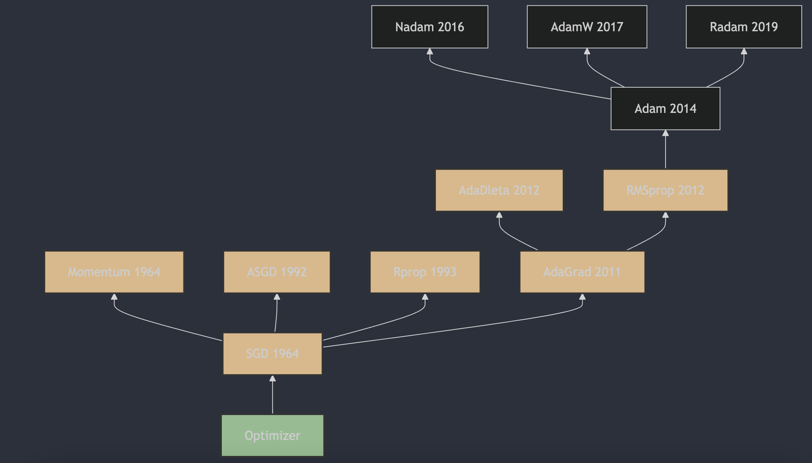

Understanding neural network optimizers in 3 minutes a day, part 8: RMSProp

## 1. The Appearance of RMSProp

RMSProp (Root Mean Square Propagation) was proposed by Geoffrey Hinton in his Coursera course "Neural Networks for Machine Learning" [1](#refer-anchor-8), first released in 2012. RMSProp is an adaptive learning-rate optimization method. It uses an exponential moving average of squared gradients to adjust the learning rate for each parameter, speed up training, and reduce oscillation during training. This method is especially well suited to non-convex optimization tasks and is widely used in deep learning.

## 2. How RMSProp Works

RMSProp (Root Mean Square Propagation) is an adaptive learning-rate optimization algorithm proposed to solve AdaGrad's decreasing-learning-rate problem. RMSProp uses an exponentially weighted moving average to adjust the learning rate for each parameter and make that adjustment smoother.

The RMSProp update rules look like this:

1. Initialize parameters $\theta$, set learning rate $\eta$, decay coefficient $\rho$ (usually 0.9), and a small numerical-stability constant $\epsilon$ (usually $1e-8$).
2. At each iteration, compute gradient $g$ of parameters $\theta$.
3. Update exponentially weighted moving average $r$ of accumulated squared gradients:
   $r = \rho \cdot r + (1 - \rho) \cdot g^2$
4. Compute the parameter update:
   $\Delta\theta = \frac{\eta}{\sqrt{r + \epsilon}} \cdot g$
5. Update parameters $ \theta $:
   $\theta = \theta - \Delta\theta$

## 3. Main Features of RMSProp

Advantages of RMSProp include:

- Adaptive learning-rate adjustment without needing to tune the learning rate manually;
- Works well for non-stationary objective functions and recurrent neural networks (RNNs);
- Can reduce vanishing or exploding gradient problems.

Drawbacks of RMSProp include:

- A new hyperparameter must be tuned: decay rate $\rho$;
- The algorithm still depends on the global learning rate $\eta$; if it is chosen poorly, model training quality may be bad.

In practice, it is recommended to start with a small global learning rate and gradually increase it to find better performance. You can also try different decay-rate values $\rho$ to find the setting most suitable for the model.

## 4. Differences Between RMSProp and AdaGrad

The main improvement is how accumulated gradients are handled:

- AdaGrad: accumulates squares of all past gradients, without a forgetting factor. This means it continuously accumulates gradient information, so the learning rate gradually decreases over time and can become too small for effective updates in later stages.

- RMSProp: uses an exponentially weighted average to accumulate squares of past gradients, with a forgetting factor. This gives more weight to recent gradients and gradually "forgets" old ones, avoiding overly fast learning-rate decay.

## References

[1] [Neural Networks for Machine Learning](https://www.cs.toronto.edu/~tijmen/csc321/slides/lecture_slides_lec6.pdf)

## Author's GitHub and WeChat

[GitHub: LLMForEverybody](https://github.com/luhengshiwo/LLMForEverybody)

The repository has the original Markdown files, and it is fully open source. Stars and forks are very welcome.
