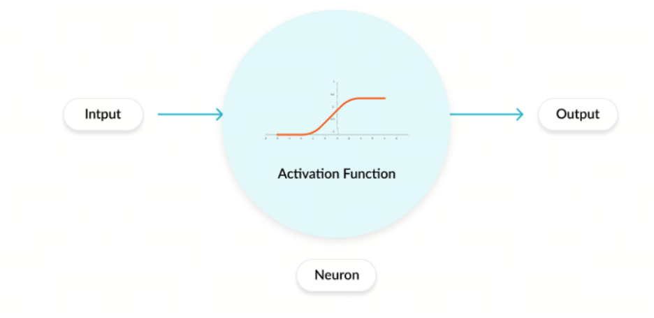
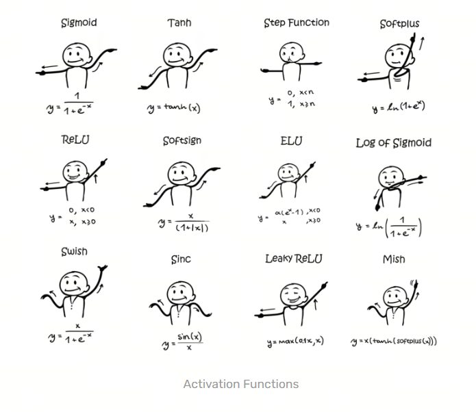

# Neural Network Activation Functions, Part 1: Overview

An activation function is a key component of an artificial neural network. Its role is to introduce nonlinearity into the network. Without an activation function, no matter how many layers a neural network has, it could only represent a linear relationship between input and output, which would sharply limit its ability to solve complex tasks. Activation functions are usually applied to each neuron or node in the network and help the network learn and represent complex functions.

## Development History

### 1. Sigmoid

Sigmoid is one of the earliest widely used activation functions. Its formula is:

$$\sigma(x) = \frac{1}{1+e^{-x}}$$

Sigmoid outputs values between 0 and 1. Its main problem is that when input values are very large or very small, the gradient becomes very small. This leads to the vanishing gradient problem and makes network training worse.

Historical context: mathematicians were studying similar function shapes as early as the 19th century. In 1986, when David Rumelhart, Geoffrey Hinton, and Ronald Williams proposed the multilayer perceptron (MLP) and the backpropagation algorithm, Sigmoid became widely used because its derivative has a simple form and is convenient for gradient computation.

### 2. Softmax

Softmax is a common activation function for multiclass classification. Its formula is:

$$\sigma(x)_i = \frac{e^{x_i}}{\sum_{j=1}^{n}e^{x_j}}$$

The output of Softmax is a probability distribution: it maps input values into a distribution where the probabilities of all classes sum to 1. Softmax is usually used in the output layer for multiclass classification tasks.

Historical context: the idea of Softmax comes from the Boltzmann distribution in statistical mechanics. It began to be used in neural networks in the middle of the 20th century.

### 3. Tanh

Tanh is the hyperbolic tangent. Its formula is:

$$\tanh(x) = \frac{e^x - e^{-x}}{e^x + e^{-x}}$$

Tanh outputs values between -1 and 1. Compared with Sigmoid, Tanh has a wider output range and can map input values into the interval from -1 to 1, which helps reduce the vanishing gradient problem.

Historical context: research on Tanh and hyperbolic functions goes back to the 18th century. They were widely used in mathematics and engineering, especially in signal processing and control systems. As neural networks developed, Tanh was introduced as an activation function.

### 4. ReLU

ReLU is the Rectified Linear Unit. Its formula is:

$$\text{ReLU}(x) = \max(0, x)$$

If the input is greater than 0, ReLU returns the input itself. Otherwise, it returns 0. The advantages of ReLU are simple computation and fast convergence. But it also has a problem: when the input is below 0, the gradient is 0, so the neuron cannot update its weights. This leads to the "dead neuron" problem.

Time of appearance: in 2010, Vinod Nair and Geoffrey Hinton showed the effectiveness of ReLU in deep neural networks in the paper `Rectified Linear Units Improve Restricted Boltzmann Machines` [1](#refer-anchor-1). Since then, ReLU has become one of the most popular activation functions in deep learning.

### 5. Leaky ReLU

Leaky ReLU is an improved version of ReLU. Its formula is:

$$\text{Leaky ReLU}(x) = \max(\alpha x, x)$$

Here $\alpha$ is a constant smaller than 1, usually 0.01. When the input is below 0, Leaky ReLU no longer returns 0. It returns a small value, $\alpha x$. This helps avoid the dead neuron problem in ReLU.

Time of appearance: Leaky ReLU first appeared in the 2013 paper `Rectifier Nonlinearities Improve Neural Network Acoustic Models` [2](#refer-anchor-2), written by Andrew L. Maas, Awni Y. Hannun, and Andrew Y. Ng.

### 6. PReLU

PReLU is Parametric ReLU. Its formula is:

$$\text{PReLU}(x) = \max(\alpha x, x)$$

Here $\alpha$ is a learnable parameter, usually updated during training through backpropagation. When the input is below 0, PReLU no longer returns 0. It returns a value controlled by $\alpha$, which makes the activation shape more flexible.

Time of appearance: PReLU was proposed by Kaiming He, Xiangyu Zhang, Shaoqing Ren, and Jian Sun in the 2015 paper `Delving Deep into Rectifiers: Surpassing Human-Level Performance on ImageNet Classification` [3](#refer-anchor-3).

### 7. ELU

ELU is Exponential Linear Unit. Its formula is:

$$\text{ELU}(x) = \begin{cases} x, & \text{if } x > 0 \\ \alpha(e^x - 1), & \text{if } x \leq 0 \end{cases}$$

Here $\alpha$ is a constant greater than 0, usually 1. If the input is greater than 0, ELU returns the input. Otherwise, it returns a value controlled by $\alpha$. This helps avoid the dead neuron problem in ReLU, and the continuity of the output for negative inputs helps improve network stability.

Time of appearance: ELU was proposed in 2015 by Djork-Arne Clevert, Thomas Unterthiner, and Sepp Hochreiter in the paper `Fast and Accurate Deep Network Learning by Exponential Linear Units (ELUs)` [4](#refer-anchor-4).

### 8. GLU

GLU is Gated Linear Unit. Its formula is:

$$\text{GLU}(X) = (X * W + b) \otimes \sigma(X * V + c)$$

Here $\sigma$ is Sigmoid, $\otimes$ means elementwise multiplication, $X$ is the input, $W$ and $V$ are weight matrices, and $b$ and $c$ are biases. GLU applies a gating mechanism to the input: with Sigmoid, it controls the flow of information in the input data and improves the expressive ability of the network.

Time of appearance: GLU was proposed in 2017 by Yann Dauphin and coauthors in the paper `Language Modeling with Gated Convolutional Networks` [5](#refer-anchor-5).

### 9. SELU

SELU is Self-Normalizing Exponential Linear Unit. Its formula is:

$$\text{SELU}(x) = \lambda \begin{cases} x, & \text{if } x > 0 \\ \alpha(e^x - 1), & \text{if } x \leq 0 \end{cases}$$

Here $\lambda$ and $\alpha$ are two constants, usually 1.0507 and 1.6733. If the input is greater than 0, SELU returns the input. Otherwise, it returns a value controlled by $\alpha$. This helps avoid the dead neuron problem in ReLU, and the continuity of the output for negative inputs helps improve network stability. SELU also has a self-normalizing property, which helps keep network outputs stable.

Time of appearance: SELU was proposed in 2017 by Gunter Klambauer, Thomas Unterthiner, Andreas Mayr, and Sepp Hochreiter in the paper `Self-Normalizing Neural Networks` [7](#refer-anchor-7).

### 10. GELU

GELU is Gaussian Error Linear Unit. Its formula is:

$$\text{GELU}(x) = 0.5x(1 + \tanh(\sqrt{2/\pi}(x + 0.044715x^3)))$$

GELU multiplies the input by the cumulative distribution function of the standard normal distribution, giving a smooth probabilistic activation. This helps preserve stable gradient flow, and in many practical tasks GELU performs better than ReLU.

Time of appearance: GELU was proposed in 2016 by Dan Hendrycks and Kevin Gimpel in the paper `Gaussian Error Linear Units (GELUs)`.

### 11. Swish

Swish is a self-gated activation function. Its formula is:

$$\text{Swish}(x) = x \cdot \sigma(x)$$

If the input is greater than 0, Swish returns the input. Otherwise, it returns a value controlled by Sigmoid. This helps avoid the dead neuron problem in ReLU, and the continuity of the output for negative inputs helps improve network stability. In many practical tasks, Swish performs better than ReLU.

Time of appearance: Swish was proposed in 2017 by the Google Brain team in the paper `Searching for Activation Functions` [6](#refer-anchor-6).

### 12. Mish

Mish is a self-gated activation function. Its formula is:

$$\text{Mish}(x) = x \cdot \tanh(\ln(1 + e^x))$$

Mish uses $\tanh(\text{softplus}(x))$: the function is smooth, non-monotonic, and keeps a soft negative region. This helps gradients pass through and improves network stability. In many practical tasks, Mish performs better than ReLU.

Time of appearance: Mish was proposed in 2019 by Diganta Misra in the paper `Mish: A Self Regularized Non-Monotonic Neural Activation Function`.

### 13. SwiGLU

SwiGLU is a self-gated activation function. Its formula is:

$$\text{SwiGLU}(a, b) = \text{Swish}(a) \otimes b$$

SwiGLU combines Swish and a gating mechanism: one part of the input passes through Swish, while the other controls information flow. This helps the model selectively pass features and gives better performance than ReLU in many practical tasks.

Time of appearance: SwiGLU was proposed in 2021 by the DeepMind team in the paper `Scaling Vision Transformers` [7](#refer-anchor-7).

## References

[1] [Rectified Linear Units Improve Restricted Boltzmann Machines](https://www.cs.toronto.edu/~hinton/absps/reluICML.pdf)

[2] [Rectifier Nonlinearities Improve Neural Network Acoustic Models](http://robotics.stanford.edu/~amaas/papers/relu_hybrid_icml2013_final.pdf)

[3] [Delving Deep into Rectifiers: Surpassing Human-Level Performance on ImageNet Classification](https://arxiv.org/abs/1502.01852)

[4] [Fast and Accurate Deep Network Learning by Exponential Linear Units (ELUs)](https://arxiv.org/abs/1511.07289)

[5] [Language Modeling with Gated Convolutional Networks](https://arxiv.org/abs/1612.08083)

[6] [Searching for Activation Functions](https://arxiv.org/abs/1710.05941)

[7] [Scaling Vision Transformers](https://arxiv.org/abs/2106.04560)

[8] [Self-Normalizing Neural Networks](https://arxiv.org/abs/1706.02515)

[9] [Gaussian Error Linear Units (GELUs)](https://arxiv.org/abs/1606.08415)

[10] [Mish: A Self Regularized Non-Monotonic Neural Activation Function](https://arxiv.org/abs/1908.08681)

## Follow My GitHub and WeChat Channel, No Time to Explain, Hop In.

[GitHub: LLMForEverybody](https://github.com/luhengshiwo/LLMForEverybody)

The repository contains the original Markdown files. The project is fully open, and Stars and Forks are welcome.
