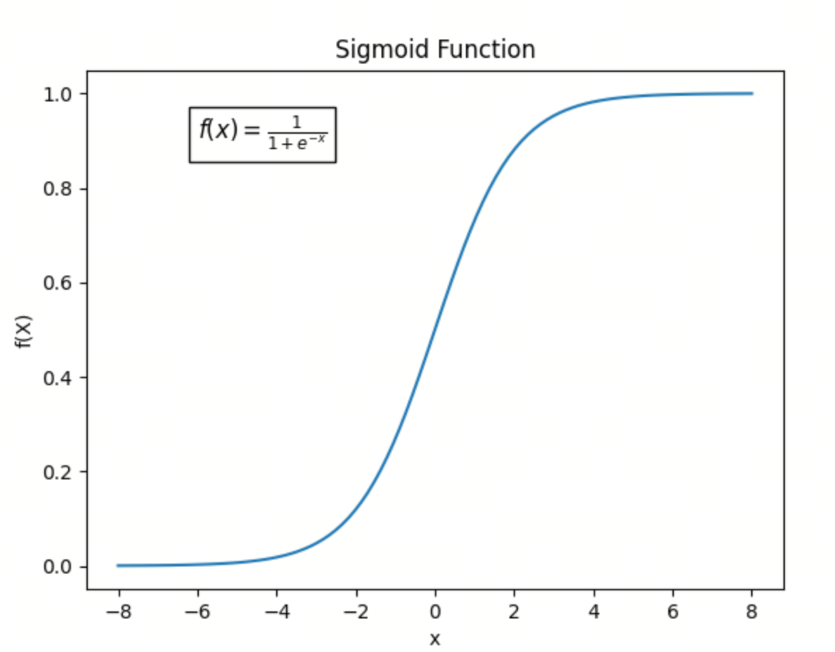
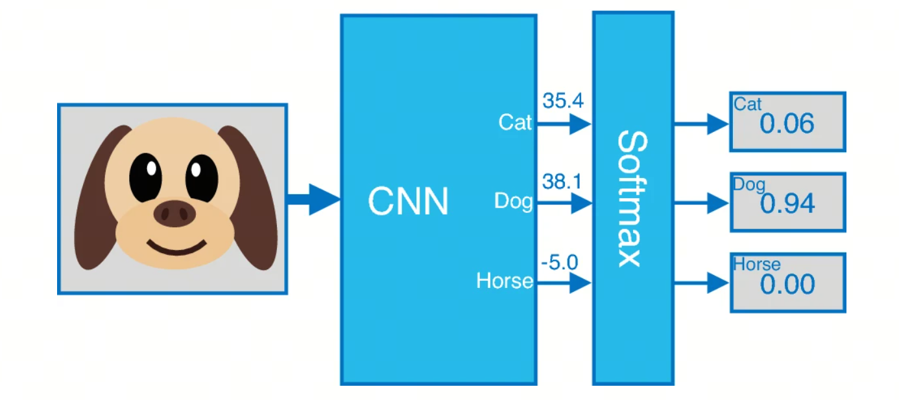
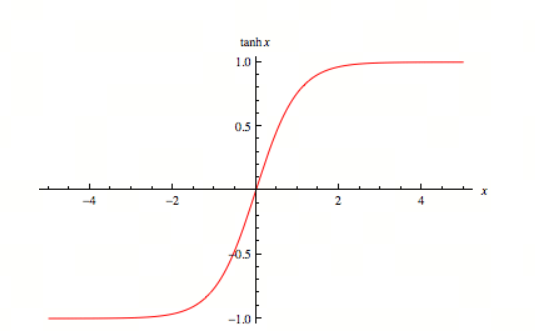

# Neural Network Activation Functions, Part 2: Sigmoid, Softmax, and Tanh

In this article, we look at three classic activation functions. Although they appeared long ago, they are still widely used in neural networks, especially Softmax, which still dominates as an output-layer activation function.

## 1. Sigmoid Function

The concept of Sigmoid goes back to the 19th century, but its wide use in modern science and engineering mainly began in the middle of the 20th century.



### Definition

The mathematical form of Sigmoid is:

$$\sigma(x) = \frac{1}{1 + e^{-x}}$$

### Key Properties

1. **Output range**: Sigmoid values are between 0 and 1, so they can be treated as probabilities.
2. **Smoothness**: Sigmoid is a smooth, continuous function with good derivative properties.
3. **Nonlinearity**: Sigmoid is nonlinear, so it can introduce nonlinear transformations and improve the expressive ability of a neural network.

### Historical Context

1. **Early mathematical foundation**:
   - The mathematical form of Sigmoid, usually written as $\sigma(x) = \frac{1}{1 + e^{-x}}$, is similar to a cumulative distribution function (CDF). Mathematicians studied similar function shapes as early as the 19th century, especially in probability and statistics.

2. **Use in biology and neuroscience**:
   - In the middle of the 20th century, biologists and neuroscientists began using Sigmoid to describe neuron activation. In particular, the McCulloch-Pitts neuron model, proposed by neuroscientists Warren McCulloch and Walter Pitts in 1943, used an activation function similar to Sigmoid.

3. **Use in artificial neural networks**:
   - In the 1980s, as artificial neural networks developed, Sigmoid became a standard activation function. It was used especially widely in multilayer perceptrons (MLPs) and the backpropagation algorithm proposed by David Rumelhart, Geoffrey Hinton, and Ronald Williams in 1986, because its derivative has a simple form and is convenient for gradient computation.

## 2. Softmax Function

Softmax is an activation function widely used in machine learning and deep learning, especially for multiclass classification. It converts a vector of arbitrary real numbers into a probability distribution. The origin and use of Softmax are connected to ideas from statistical mechanics and information theory.



### 2.1 Definition

For a vector of $n$ real numbers $\mathbf{z} = [z_1, z_2, \ldots, z_n]$, Softmax transforms it into a probability distribution $\mathbf{p} = [p_1, p_2, \ldots, p_n]$, where each $p_i$ is calculated as:

$$p_i = \frac{e^{z_i}}{\sum_{j=1}^n e^{z_j}}$$

### 2.2 Key Properties

1. **Non-negativity**: for any $i$, $p_i \geq 0$.
2. **Normalization**: the sum of all outputs is 1, meaning $\sum_{i=1}^n p_i = 1$.
3. **Use of exponentials**: $e^{z_i}$ guarantees positive outputs and amplifies differences between larger $z_i$ values.

### 2.3 Historical Context

The concept of Softmax comes from the Boltzmann distribution, also called the Gibbs distribution, in statistical mechanics. It describes the probability distribution of different energy states of a system in thermal equilibrium. This idea later became widely used in information theory and machine learning.

1. **Statistical mechanics**: in the late 19th and early 20th centuries, Ludwig Boltzmann, Josiah Willard Gibbs, and other scientists studied energy distributions in thermodynamic systems and proposed the Boltzmann distribution.
2. **Information theory**: in the middle of the 20th century, Claude Shannon's work laid the foundation for information theory, including entropy and information content, both closely connected to probability distributions.
3. **Machine learning**: in the second half of the 20th century, especially with the development of neural networks and deep learning, Softmax was introduced into multiclass classification as an output-layer activation function, converting network outputs into a probability distribution.

### Application

**Multiclass classification**: Softmax is often used in the output layer of neural networks to convert network output into a probability distribution over classes.

### Example

Assume we have a vector with three elements, $\mathbf{z} = [2.0, 1.0, 0.1]$. The Softmax output is:

```python
import numpy as np

z = np.array([2.0, 1.0, 0.1])
softmax = np.exp(z) / np.sum(np.exp(z))

print(softmax)
```

Output:

```plaintext
[0.65900114 0.24243297 0.09856589]
```

This means the first element has the highest probability, about 0.659; the second is about 0.242; and the third is the lowest, about 0.099.

## 3. Tanh Function



### 3.1 Definition

Tanh, or hyperbolic tangent, is a common activation function widely used in neural networks and machine learning. Its mathematical expression is:

$$\text{tanh}(x) = \frac{e^x - e^{-x}}{e^x + e^{-x}}$$

The derivative of Tanh can be expressed as:

$$\frac{d}{dx} \text{tanh}(x) = 1 - \text{tanh}^2(x)$$

This means that for input values near $-1$ or $1$, the derivative is close to 0, while for input values near 0, the derivative is close to 1.

### 3.2 Key Properties

1. **Output range**: Tanh values are between $-1$ and $1$.
2. **Central symmetry**: Tanh is symmetric around the origin, meaning $\text{tanh}(-x) = -\text{tanh}(x)$.
3. **Smoothness**: Tanh is a smooth, continuous function with good derivative properties.

### 3.3 Historical Context

Research on Tanh and hyperbolic functions goes back to the 18th century. They were widely used in mathematics and engineering, especially in signal processing and control systems. As neural networks developed, Tanh was introduced as an activation function.

### 3.4 Application

In neural networks, Tanh is often used as a hidden-layer activation function. Its output range from $-1$ to $1$ gives it an advantage over Sigmoid in some cases, because the output is centered around zero, which helps speed up gradient descent convergence.

## Summary

Today we looked at three classic activation functions that are still widely used in neural networks. Sigmoid introduces nonlinear transformations and improves the expressive ability of a neural network; Softmax is often used in multiclass classification and converts network output into a probability distribution over classes; Tanh has an output range from $-1$ to $1$ and helps speed up gradient descent convergence as a hidden-layer activation function.

Next time, we will move to more modern activation functions such as ReLU, Swish, and others. Stay tuned.

## References

[1] [Sigmoid Activation Function](https://www.codecademy.com/resources/docs/ai/neural-networks/sigmoid-activation-function)

[2] [A pseudo-softmax function for hardware-based high speed image classification](https://www.nature.com/articles/s41598-021-94691-7)

[3] [Hyperbolic Tangent](https://mathworld.wolfram.com/HyperbolicTangent.html)

## Follow My GitHub and WeChat Channel, No Time to Explain, Hop In.

[GitHub: LLMForEverybody](https://github.com/luhengshiwo/LLMForEverybody)

The repository contains the original Markdown files. The project is fully open, and Stars and Forks are welcome.
