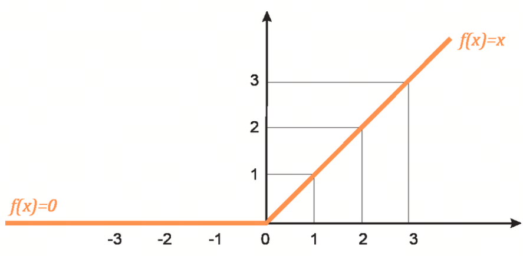
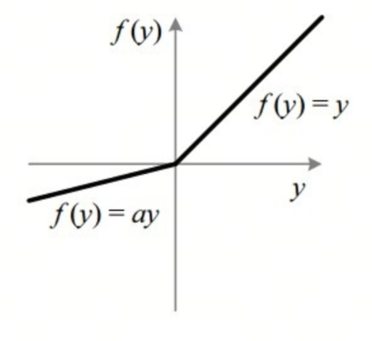
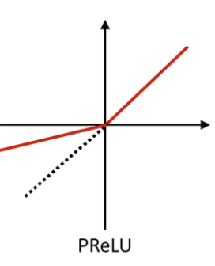

# Neural Network Activation Functions, Part 3: ReLU and Its Variants Leaky ReLU and PReLU

In this article, we look at ReLU, one of the important reasons deep learning became successful, and its variants. Their wide use in neural networks matters a lot for improving model quality and speeding up training.

## 1. ReLU Function

### 1.1 Definition

ReLU (Rectified Linear Unit) is one of the most common activation functions in modern deep learning. Its mathematical expression is:

$$\text{ReLU}(x) = \max(0, x)$$

### 1.2 Key Properties

1. **Nonlinearity**: although ReLU is linear on the positive side, it introduces nonlinear behavior, allowing neural networks to learn complex patterns.
2. **Sparse activation**: ReLU turns the negative part of the input into zero. In practice, this means neuron activations are sparse, meaning only some neurons are active, which helps improve efficiency and model quality.
3. **Computational simplicity**: ReLU is very simple to compute: compare the input value with zero. The compute cost is small, which helps speed up training.

### 1.3 Time of Appearance

In 2010, Vinod Nair and Geoffrey Hinton showed the effectiveness of ReLU in deep neural networks in the paper `Rectified Linear Units Improve Restricted Boltzmann Machines`. Since then, ReLU has become one of the most popular activation functions in deep learning.

### 1.4 Advantages and Disadvantages

***Advantages***

1. **High computational efficiency**: ReLU is simple to compute and can significantly speed up neural network training.
2. **Less vanishing gradient**: compared with Sigmoid and Tanh, ReLU's gradient on the positive side is the constant 1. This helps reduce the vanishing gradient problem and makes deep networks easier to train.

***Disadvantages***

1. **Dying ReLU problem**: during training, some neurons may never activate, meaning their input always stays negative. As a result, these neurons contribute nothing throughout training. To solve this, researchers proposed variants such as Leaky ReLU and Parametric ReLU.
2. **Asymmetry**: in the negative region, ReLU output is always zero, which can hurt model quality in some cases.

## 2. Leaky ReLU Function

Leaky ReLU (Leaky Rectified Linear Unit) is a variant of ReLU designed to solve the Dying ReLU problem. Dying ReLU means that during training, some neurons may never activate, because their input always stays negative, and therefore they contribute nothing throughout training.

### 2.1 Mathematical Definition

The mathematical expression of Leaky ReLU is:

$$\text{Leaky ReLU}(x) = \begin{cases}
x & \text{if } x \geq 0 \\
\alpha x & \text{if } x < 0
\end{cases}$$

Here $\alpha$ is a small positive number, usually around 0.01.

### 2.2 Key Properties

1. **Nonlinearity**: like ReLU, Leaky ReLU introduces nonlinear behavior, allowing neural networks to learn complex patterns.
2. **Sparse activation**: although Leaky ReLU does not become exactly zero in the negative region, it still keeps some sparsity, helping improve efficiency and model quality.
3. **Computational simplicity**: Leaky ReLU is also easy to compute. In the negative region, just multiply the value by the small constant $\alpha$.
4. **Avoiding Dying ReLU**: by introducing a small slope $\alpha$ in the negative region, Leaky ReLU ensures all neurons have gradients and avoids the Dying ReLU problem.

### 2.3 Time of Appearance

Leaky ReLU first appeared in the 2013 paper `Rectifier Nonlinearities Improve Neural Network Acoustic Models`, written by Andrew L. Maas, Awni Y. Hannun, and Andrew Y. Ng.

## PReLU Function

PReLU (Parametric Rectified Linear Unit) is another ReLU activation variant. It introduces a learnable parameter to control the slope in the negative region. PReLU is designed to further improve ReLU and its variants, such as Leaky ReLU.

### 3.1 Mathematical Definition

The mathematical expression of PReLU is:

$$\text{PReLU}(x) = \begin{cases}
x & \text{if } x \geq 0 \\
\alpha x & \text{if } x < 0
\end{cases}$$

Here $\alpha$ is a learnable parameter, not a fixed constant.

### 3.2 Key Properties

1. **Nonlinearity**: like ReLU and Leaky ReLU, PReLU introduces nonlinear behavior, allowing neural networks to learn complex patterns.
2. **Sparse activation**: although PReLU does not become exactly zero in the negative region, it still keeps some sparsity, helping improve efficiency and model quality.
3. **Learnable parameter**: PReLU's main feature is that the negative-region slope $\alpha$ is learnable. This means the model can automatically tune this parameter from data and find the best negative-region slope during training.
4. **Avoiding Dying ReLU**: by introducing the learnable slope parameter $\alpha$, PReLU ensures all neurons have gradients and effectively avoids the Dying ReLU problem.

### 3.3 Time of Appearance

PReLU was proposed by Kaiming He, Xiangyu Zhang, Shaoqing Ren, and Jian Sun in the 2015 paper `Delving Deep into Rectifiers: Surpassing Human-Level Performance on ImageNet Classification`.

## References

[1] [Rectified Linear Units Improve Restricted Boltzmann Machines](https://www.cs.toronto.edu/~hinton/absps/reluICML.pdf)

[2] [Rectifier Nonlinearities Improve Neural Network Acoustic Models](http://robotics.stanford.edu/~amaas/papers/relu_hybrid_icml2013_final.pdf)

[3] [Delving Deep into Rectifiers: Surpassing Human-Level Performance on ImageNet Classification](https://arxiv.org/abs/1502.01852)

## Follow My GitHub and WeChat Channel, No Time to Explain, Hop In.

[GitHub: LLMForEverybody](https://github.com/luhengshiwo/LLMForEverybody)

The repository contains the original Markdown files. The project is fully open, and Stars and Forks are welcome.

---

## 📚 相关概念

[[concepts/Transformer 架构|Transformer 架构]] | [[concepts/分词器 LLM|分词器 LLM]] | [[concepts/LLM 训练 流水线|LLM 训练 流水线]] | [[concepts/RLHF DPO 对齐|RLHF DPO 对齐]] | [[concepts/LoRA PEFT 微调|LoRA PEFT 微调]] | [[concepts/多模态 LLM|多模态 LLM]] | [[concepts/模型 压缩 蒸馏|模型 压缩 蒸馏]] | [[entities/Hugging Face|Hugging Face]] | [[entities/DeepSeek|DeepSeek]] | [[entities/mindspore Transformer|mindspore Transformer]] | [[sources/Vaswani 2017 Attention|Vaswani 2017 Attention]] | [[sources/LLM 训练 流水线 指南|LLM 训练 流水线 指南]] | [[sources/DeepSeek 4 技术|DeepSeek 4 技术]]

> 📌 来源：[[sources/LLMForEverybody/索引|LLMForEverybody 导航]] · 章节：预训练
