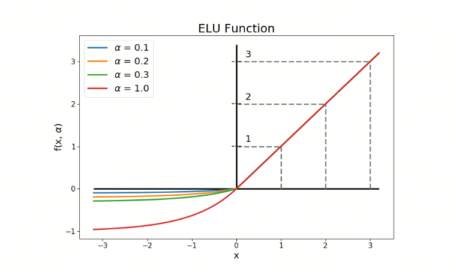
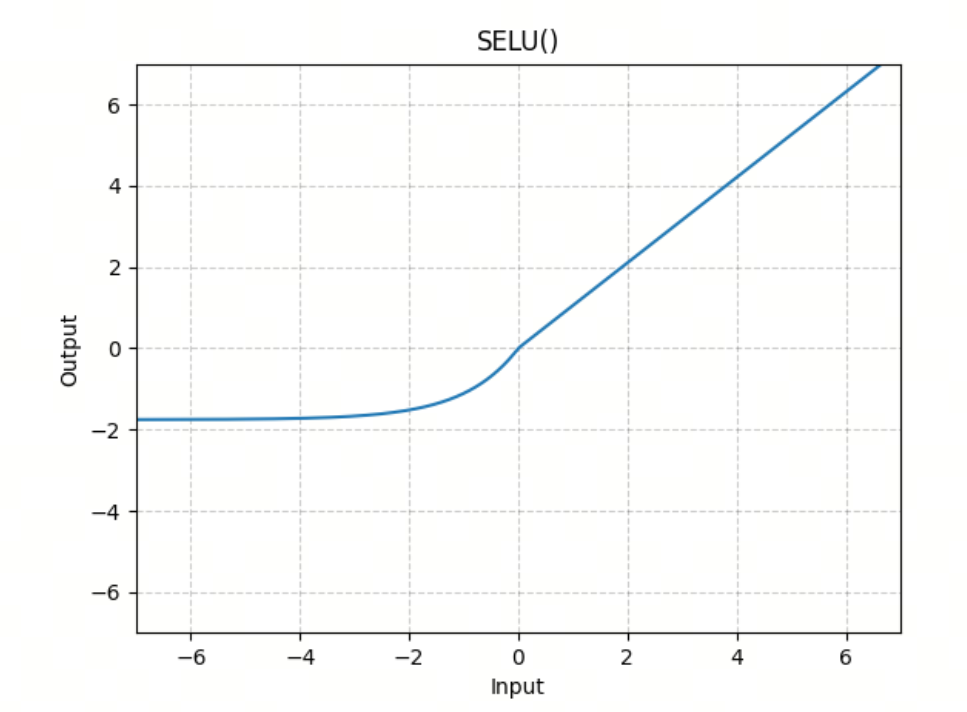

# Neural Network Activation Functions, Part 4: ELU and Its Variant SELU

ELU (Exponential Linear Unit) was proposed to further improve the performance of ReLU and its variants, such as Leaky ReLU and PReLU. ELU aims to solve some internal problems of ReLU, especially behavior on the negative side and the mean shift of outputs.

## 1. ELU Function

ELU improves ReLU and its variants by introducing an exponential function on the negative side. It helps solve some inherent ReLU problems, such as Dying ReLU and output mean shift.

### 1.1 Mathematical Definition

The mathematical expression of ELU is:

$$\text{ELU}(x) = \begin{cases}
x & \text{if } x \geq 0 \\
\alpha (e^x - 1) & \text{if } x < 0
\end{cases}$$

where $\alpha$ is a hyperparameter, usually set to 1.

### 1.2 Key Properties

1. **Nonlinearity**: like ReLU, ELU introduces nonlinearity, allowing neural networks to learn complex patterns.
2. **Preventing Dying ReLU**: thanks to the exponential function on the negative side, ELU ensures all neurons have gradients, effectively preventing Dying ReLU.
3. **Output mean close to zero**: on the negative side, ELU outputs $\alpha (e^x - 1)$, so the output mean is closer to zero, which helps speed up neural network training. By comparison, ReLU outputs zero on the negative side, which can shift the mean.
4. **Smoothness**: ELU output on the negative side is continuous and smooth, helping improve model stability and convergence speed.

### 1.3 When It Was Proposed

ELU was proposed in 2015 by Djork-Arne Clevert, Thomas Unterthiner, and Sepp Hochreiter in the paper `Fast and Accurate Deep Network Learning by Exponential Linear Units (ELUs)`.

### 1.4 Application

ELU is used in many deep learning models, especially convolutional neural networks (CNNs) and other models that need to process many nonlinear data patterns. By improving negative-side behavior and output mean, it helps models converge faster and reach higher performance.

## 2. SELU Function

SELU (Scaled Exponential Linear Unit) is a variant of ELU that further improves neural network performance by introducing a scaling factor. SELU not only solves some ReLU problems, but also introduces self-normalization, allowing a neural network to automatically maintain stable mean and variance during training.

### 2.1 Mathematical Definition

The mathematical expression of SELU is:

$$\text{SELU}(x) = \lambda \begin{cases}
x & \text{if } x \geq 0 \\
\alpha (e^x - 1) & \text{if } x < 0
\end{cases}$$

where $\alpha$ and $\lambda$ are two fixed parameters, usually:

- $\alpha \approx 1.67326$
- $\lambda \approx 1.0507$

### 2.2 Key Properties

1. **Nonlinearity**: like ReLU and ELU, SELU introduces nonlinearity, allowing neural networks to learn complex patterns.
2. **Preventing Dying ReLU**: thanks to the exponential function on the negative side, SELU ensures all neurons have gradients, effectively preventing Dying ReLU.
3. **Self-normalization**: the important property of SELU is self-normalization, meaning the mean and variance of each layer's outputs can automatically move toward a stable state. This helps speed up training and improve model quality.
4. **Stable output mean and variance**: the choice of scaling factor $\lambda$ and parameter $\alpha$ allows SELU outputs to keep stable mean and variance, helping prevent vanishing and exploding gradients.

### 2.3 When It Was Proposed

SELU was proposed in 2017 by Gunter Klambauer, Thomas Unterthiner, Andreas Mayr, and Sepp Hochreiter in the paper `Self-Normalizing Neural Networks`.

## References

[1] [Fast and Accurate Deep Network Learning by Exponential Linear Units (ELUs)](https://arxiv.org/abs/1511.07289)

[2] [Self-Normalizing Neural Networks](https://arxiv.org/abs/1706.02515)

## Follow My GitHub and WeChat Account, No Time to Explain, Hop In.

[GitHub: LLMForEverybody](https://github.com/luhengshiwo/LLMForEverybody)

The repository contains the original Markdown files, all fully open source. Stars and forks are welcome.

---

## 📚 相关概念

[[concepts/Transformer 架构|Transformer 架构]] | [[concepts/分词器 LLM|分词器 LLM]] | [[concepts/LLM 训练 流水线|LLM 训练 流水线]] | [[concepts/RLHF DPO 对齐|RLHF DPO 对齐]] | [[concepts/LoRA PEFT 微调|LoRA PEFT 微调]] | [[concepts/多模态 LLM|多模态 LLM]] | [[concepts/模型 压缩 蒸馏|模型 压缩 蒸馏]] | [[entities/Hugging Face|Hugging Face]] | [[entities/DeepSeek|DeepSeek]] | [[entities/mindspore Transformer|mindspore Transformer]] | [[sources/Vaswani 2017 Attention|Vaswani 2017 Attention]] | [[sources/LLM 训练 流水线 指南|LLM 训练 流水线 指南]] | [[sources/DeepSeek 4 技术|DeepSeek 4 技术]]

> 📌 来源：[[sources/LLMForEverybody/索引|LLMForEverybody 导航]] · 章节：预训练
