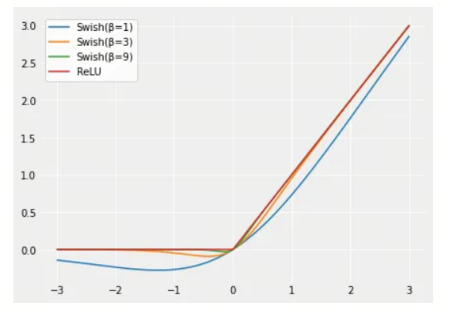
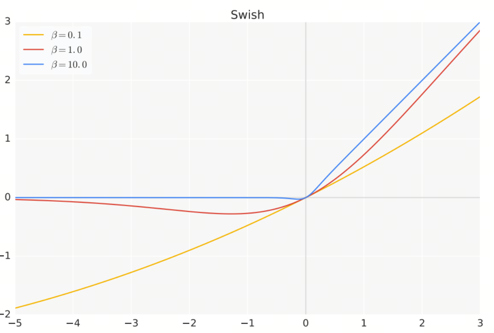

# Neural Network Activation Functions, Part 5: The Gating Series, GLU, Swish, and SwiGLU

## 1. GLU Function



GLU (Gated Linear Unit) is an activation function used in deep learning to improve model quality. GLU introduces a gating mechanism, allowing the model to selectively pass information and improve expressive ability and performance.

### 1.1 Mathematical Definition

The mathematical expression of GLU is:

$$\text{GLU}(x) = (X * W + b) \otimes \sigma(X * V + c)$$

where $\otimes$ means elementwise multiplication, $X$ is the input, $W$ and $V$ are weight matrices, and $b$ and $c$ are biases.

### 1.2 Key Properties

1. **Gating mechanism**: GLU introduces a gating mechanism that lets the model selectively pass information, improving expressive ability.
2. **Nonlinearity**: GLU combines a linear transformation and nonlinear activation, allowing the model to learn complex patterns.
3. **Information filtering**: through the gating mechanism, GLU can filter out unimportant information and improve model quality.

### 1.3 When It Was Proposed

GLU was proposed in 2017 by Yann Dauphin and coauthors in the paper `Language Modeling with Gated Convolutional Networks`.

### 1.4 What Problems It Solves

1. **Information selectivity**: GLU uses a gating mechanism, allowing the model to selectively pass information and improve expressive ability.
2. **Stronger nonlinearity**: GLU combines a linear transformation and nonlinear activation, strengthening the model's nonlinear properties.
3. **Better model performance**: GLU performs well in many tasks, especially natural language processing (NLP) and sequence modeling.

### 1.5 Example

Below is a simple Python example showing how to compute GLU:

```python
import numpy as np
def glu(x):
    """GLU activation function.

    Args:
    x: input array, whose last dimension must be even

    Returns:
    Array after GLU activation
    """
    assert x.shape[-1] % 2 == 0, "The last dimension of the input array must be even"
    half_dim = x.shape[-1] // 2
    return x[..., :half_dim] * sigmoid(x[..., half_dim:])

def sigmoid(x):
    """Sigmoid function.

    Args:
    x: input value

    Returns:
    Output value of Sigmoid
    """
    return 1 / (1 + np.exp(-x))
```

## 2. Swish Function



Swish is a widely used activation function in deep learning, proposed by the Google Brain team. Swish introduces a learnable parameter, allowing the activation function to adapt during training and improve model quality.

### Mathematical Definition

The mathematical expression of Swish is:

$$\text{Swish}(x) = x \cdot \sigma(\beta x)$$

where:

- $x$ is the input.
- $\sigma$ is the Sigmoid function, defined as $\sigma(x) = \frac{1}{1 + e^{-x}}$.
- $\beta$ is a learnable parameter that controls the function shape.

In most cases, $\beta$ is set to 1, and the expression simplifies to:

$$\text{Swish}(x) = x \cdot \sigma(x)$$

### Key Properties

1. **Smoothness**: Swish is continuous and smooth, helping improve model stability and convergence speed.
2. **Non-monotonicity**: Swish is non-monotonic: it increases in some regions and decreases in others. This lets Swish capture more complex patterns.
3. **Learnability**: thanks to the learnable parameter $\beta$, Swish can adapt during training and improve model quality.
4. **Approximation to ReLU**: when $\beta$ approaches infinity, Swish approaches ReLU. When $\beta$ approaches 0, Swish approaches a linear function.

### When It Was Proposed

Swish was proposed in 2017 by the Google Brain team in the paper `Searching for Activation Functions`.

### What Problems It Solves

1. **Smooth activation**: Swish introduces Sigmoid, so the activation stays smooth on both the positive and negative sides of the input, improving model stability.
2. **Non-monotonicity**: the non-monotonicity of Swish lets it capture more complex patterns and makes it more expressive than monotonic activation functions such as ReLU.
3. **Learnability**: Swish introduces the learnable parameter $\beta$, allowing the activation function to adapt and improve model quality.

### Example

Below is a simple Python example showing how to compute Swish:

```python
import numpy as np
def swish(x, beta=1.0):
    """Swish activation function.

    Args:
    x: input value

    Returns:
    Value after Swish activation
    """
    return x * sigmoid(beta*x)

def sigmoid(x):
    """Sigmoid function.

    Args:
    x: input value

    Returns:
    Output value of Sigmoid
    """
    return 1 / (1 + np.exp(-x))
```

## 3. SwiGLU Function

SwiGLU (Swish-Gated Linear Unit) is an activation function that combines properties of Swish and GLU (Gated Linear Unit), designed to improve deep learning model quality. Through the gating mechanism and Swish activation, SwiGLU lets the model selectively pass information more effectively, improving expressive ability and performance.

### 3.1 Mathematical Definition

The mathematical expression of SwiGLU is:

$$\text{SwiGLU}(a, b) = \text{Swish}(a) \otimes \sigma(b)$$

where:

- $a$ and $b$ are input tensors.
- $\text{Swish}(x) = x \cdot \sigma(x)$ is the Swish activation function.
- $\sigma(x) = \frac{1}{1 + e^{-x}}$ is the Sigmoid activation function.
- $\otimes$ means elementwise multiplication, also called Hadamard product.

### 3.2 Key Properties

1. **Gating mechanism**: SwiGLU introduces a gating mechanism that lets the model selectively pass information, improving expressive ability.
2. **Smoothness**: the smoothness of Swish helps improve model stability and convergence speed.
3. **Non-monotonicity**: the non-monotonicity of Swish lets SwiGLU capture more complex patterns.
4. **Information filtering**: through the gating mechanism, SwiGLU can filter out unimportant information and improve model quality.

### 3.3 When It Was Proposed

SwiGLU was proposed in 2021 by the DeepMind team in the paper `Scaling Vision Transformers`.

### 3.4 What Problems It Solves

1. **Information selectivity**: SwiGLU uses a gating mechanism, letting the model selectively pass information and improve expressive ability.
2. **Smooth activation**: Swish introduces Sigmoid, keeping activation smooth on both positive and negative sides of the input and improving model stability.
3. **Non-monotonicity**: the non-monotonicity of Swish lets SwiGLU capture more complex patterns and makes it more expressive than monotonic activation functions such as ReLU.

### 3.5 Example

Below is a simple Python example showing how to compute SwiGLU:

$$ f(X) = (X * W + b) \otimes Swish(X * V + c) $$

```python
import numpy as np
def SwiGLU(x):
    """SwiGLU activation function.

    Args:
    x: input array, whose last dimension must be even

    Returns:
    Array after SwiGLU activation
    """
    assert x.shape[-1] % 2 == 0, "The last dimension of the input array must be even"
    half_dim = x.shape[-1] // 2
    return x[..., :half_dim] * swish(x[..., half_dim:])

def swish(x, beta=1.0):
    """Swish activation function.

    Args:
    x: input value

    Returns:
    Value after Swish activation
    """
    return x * sigmoid(beta*x)

def sigmoid(x):
    """Sigmoid function.

    Args:
    x: input value

    Returns:
    Output value of Sigmoid
    """
    return 1 / (1 + np.exp(-x))
```

### Summary

SwiGLU combines the advantages of Swish and GLU. Through its gating mechanism and smooth non-monotonicity, it solves some inherent problems of activation functions such as ReLU. SwiGLU performs well in many deep learning tasks, especially computer vision and natural language processing. The gating mechanism and smooth activation help models converge faster and reach higher performance.

## References

[1] [Language Modeling with Gated Convolutional Networks](https://arxiv.org/abs/1612.08083)

[2] [Searching for Activation Functions](https://arxiv.org/abs/1710.05941)
