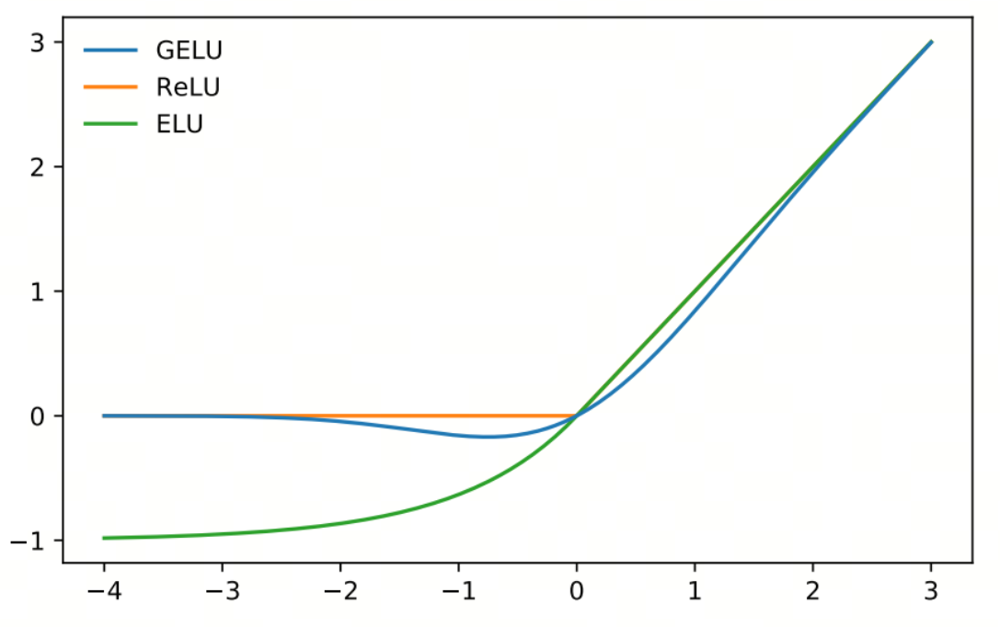
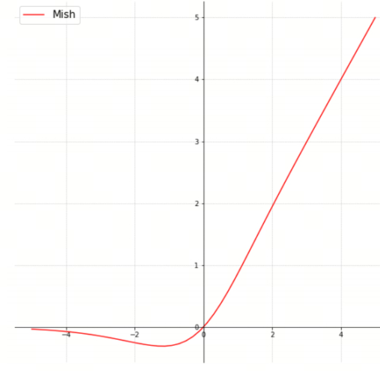

# Neural Network Activation Functions, Part 6: GELU and Mish

## 1. GELU



GELU (Gaussian Error Linear Unit) is a widely used activation function in deep learning. GELU smooths the input through the Gaussian error function, meaning the cumulative distribution function of the standard normal distribution, improving model quality. GELU performs well in many tasks, especially natural language processing (NLP) and computer vision.

### 1.1 Mathematical Definition

The mathematical expression of GELU is:

$$\text{GELU}(x) = x \cdot \Phi(x)$$

where:

- $x$ is the input.
- $\Phi(x)$ is the cumulative distribution function of the standard normal distribution, defined as:

$$\Phi(x) = \frac{1}{2} \left( 1 + \text{erf}\left( \frac{x}{\sqrt{2}} \right) \right)$$

where $\text{erf}(x)$ is the error function.

### 1.2 Approximate Expression

To simplify computation, GELU usually uses the following approximation:

$$\text{GELU}(x) \approx 0.5 \cdot x \cdot \left( 1 + \tanh\left( \sqrt{\frac{2}{\pi}} \left( x + 0.044715 x^3 \right) \right) \right)$$

This approximate computation is very common in practice because it is more computationally efficient.

### 1.3 Key Properties

1. **Smoothness**: GELU is continuous and smooth, helping improve model stability and convergence speed.
2. **Nonlinearity**: GELU combines linear and nonlinear transformations, allowing the model to learn complex patterns.
3. **Probabilistic interpretation**: GELU smooths the input through the Gaussian error function and therefore has a probabilistic interpretation: the larger the input value, the higher its probability of passing through.

### 1.4 When It Was Proposed

GELU was proposed in 2016 by Dan Hendrycks and Kevin Gimpel in the paper `Gaussian Error Linear Units (GELUs)`.

### What Problems It Solves

1. **Smooth activation**: GELU introduces the Gaussian error function, so activation stays smooth on both positive and negative sides of the input, improving model stability.
2. **Stronger nonlinearity**: GELU combines a linear transformation and nonlinear activation, strengthening the model's nonlinear properties.
3. **Probabilistic interpretation**: GELU has a probabilistic interpretation: the larger the input value, the higher its probability of passing through. This better imitates the activation process of a neuron.

### Example

Below is a simple Python example showing how to compute GELU:

```python
from scipy.special import erf

# Define GELU
def gelu(x):
    return 0.5 * x * (1 + erf(x / np.sqrt(2)))
```

## Mish



Mish is a nonlinear activation function used in deep learning. It was proposed by Diganta Misra in 2019. Mish improves model performance through a smooth nonlinear transformation and performs well in many tasks, including computer vision and natural language processing.

### Mathematical Definition

The mathematical expression of Mish is:

$$\text{Mish}(x) = x \cdot \tanh(\text{softplus}(x))$$

where:

- $\text{softplus}(x) = \ln(1 + e^x)$ is the Softplus function.
- $\tanh(x)$ is the hyperbolic tangent.

### Key Properties

1. **Smoothness**: Mish is continuous and smooth, helping improve model stability and convergence speed.
2. **Non-monotonicity**: Mish is non-monotonic: it increases in some regions and decreases in others. This property lets Mish capture more complex patterns.
3. **Soft negative region**: unlike ReLU, Mish keeps non-zero negative values, helping gradient flow and preventing the vanishing gradient problem.
4. **Approximation to ReLU**: for large input values, Mish approaches ReLU.

### When It Was Proposed

Mish was proposed in 2019 by Diganta Misra in the paper `Mish: A Self Regularized Non-Monotonic Neural Activation Function`.

### What Problems It Solves

1. **Smooth activation**: Mish introduces Softplus and hyperbolic tangent, so activation stays smooth on both positive and negative sides of the input, improving model stability.
2. **Non-monotonicity**: Mish's non-monotonicity lets it capture more complex patterns and makes it more expressive than monotonic activation functions such as ReLU.
3. **Gradient flow**: Mish keeps a soft negative region, helping gradient flow and preventing the vanishing gradient problem.

### Example

Below is a simple Python example showing how to compute Mish:

```python
import numpy as np
import matplotlib.pyplot as plt

# Define Softplus
def softplus(x):
    return np.log1p(np.exp(x))

# Define Mish
def mish(x):
    return x * np.tanh(softplus(x))
```

## References

[1] [Gaussian Error Linear Units (GELUs)](https://arxiv.org/abs/1606.08415)

[2] [Mish: A Self Regularized Non-Monotonic Neural Activation Function](https://arxiv.org/abs/1908.08681)

## Follow My GitHub and WeChat Account, No Time to Explain, Hop In.

[GitHub: LLMForEverybody](https://github.com/luhengshiwo/LLMForEverybody)

The repository contains the original Markdown files, all fully open source. Stars and forks are welcome.
