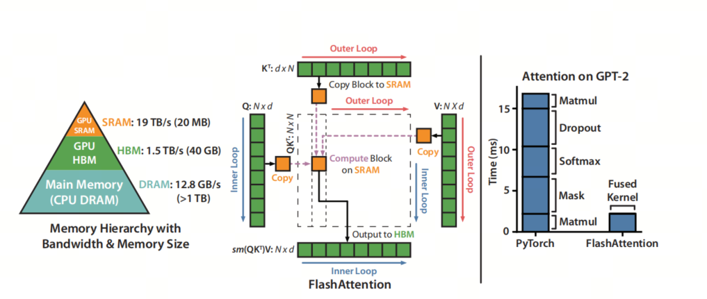

Large-model inference frameworks, part 1: overview

## 1. Why Inference Frameworks Are Needed

Besides distributed inference and quantization support, the main value of large-model inference frameworks is inference acceleration. The main goal of inference acceleration is to improve efficiency, reduce compute and memory requirements, meet real-time requirements, and lower deployment cost:

**Compute and memory**: large models usually require substantial compute resources and memory to handle complex tasks. In resource-constrained scenarios, such as mobile devices or edge computing environments, this leads to low inference efficiency. To solve this, inference efficiency needs to be improved through optimization methods, while compute and memory requirements are reduced.

**Real time**: in many application scenarios, such as voice assistants and real-time translation, users expect immediate feedback. Large-model inference speed directly affects user experience. So inference acceleration reduces latency and enables smoother interaction.

**Deployment cost**: deploying large models requires expensive hardware support, such as high-performance GPUs. With inference acceleration, large models can be deployed on cheaper hardware, reducing deployment cost and making large-model applications more broadly usable.

**System performance optimization**: in real deployments, large-model inference performance depends on system-level factors such as memory bandwidth and compute-unit utilization. System-level optimization can improve inference speed and efficiency for large models.

## 2. Inference Acceleration Techniques

To improve large-model inference efficiency, the following techniques are commonly used:

1. **Improving compute efficiency**: MQA (Multi Query Attention) can noticeably improve compute efficiency by computing attention distributions for multiple query vectors in parallel. In MQA, all heads share the same Key and Value matrices, while each head stores only its Query parameters separately. This greatly reduces the number of Key and Value matrix parameters and speeds up token generation in the decoder.

2. **Reducing computation**: GQA (Grouped Query Attention) groups several query vectors when computing attention distributions. Each group shares a common key (K) and value (V) projection, reducing the memory overhead of storing key and value for each head, especially with a large context window or batch size.

3. **Reducing complexity**: Flash Attention improves compute efficiency by reducing attention computation complexity. Through tiling and recomputation, it avoids explicitly constructing and storing large attention matrices, greatly improving compute speed and memory efficiency.

4. **Reducing repeated computation**: KV Cache improves inference efficiency by caching key-value pairs in attention computation and reducing repeated computation. In autoregressive models, KV Cache reuses Key and Value information from previous inference steps, avoiding recomputation at every inference step and reducing parameter computation.

5. **Improving throughput**: Continuous Batching improves compute efficiency and throughput by continuously processing multiple input examples. This method is especially suitable for LLM deployment, because it uses GPU memory more efficiently, reduces idle time, and improves overall inference speed.

## 3. Common Inference Frameworks

1. `vLLM`[1](#refer-anchor-1) is an inference framework based on PagedAttention. It provides efficient, fast, low-cost LLM serving by using paged attention computation. During inference, vLLM splits attention computation into several pages, each computing only part of the attention distribution. This reduces computation and memory requirements and improves inference efficiency.

2. `Text Generation Inference (TGI)`[2](#refer-anchor-2) is a framework developed by Hugging Face for deploying and serving large language models (LLMs). It is a production-grade toolkit specifically designed to run large language models as a service on local machines. TGI is written in Rust and Python and provides an endpoint for calling the model, making text generation more efficient and flexible.

3. `TensorRT-LLM` [3](#refer-anchor-3) is NVIDIA's open source library for optimizing inference performance of large language models (LLMs) on NVIDIA GPUs. With advanced optimization methods such as quantization, kernel fusion, dynamic batching, and multi-GPU support, it greatly improves LLM inference speed. Compared with traditional CPU-based approaches, inference speed can increase up to 8 times.

4. `Ollama`[4](#refer-anchor-4) is an open source framework designed to simplify deploying and running large language models (LLMs) locally. It does this by packaging model weights, configuration, and datasets into a single package called a Modelfile, which makes downloading, installing, and using LLMs much more convenient even for users without deep technical knowledge.

5. `DeepSpeed`[5](#refer-anchor-5) is a deep learning optimization library from Microsoft. It supports not only large-scale model training, but also inference acceleration. DeepSpeed-Inference is part of DeepSpeed and focuses on improving inference performance for large models, including latency and throughput.

## References

[1] [vLLM](https://docs.vllm.ai/en/latest/)

[2] [text-generation-inference](https://huggingface.co/docs/text-generation-inference/index)

[3] [TensorRT-LLM](https://github.com/NVIDIA/TensorRT-LLM)

[4] [Ollama](https://ollama.com/)

[5] [DeepSpeed](https://www.deepspeed.ai/)

## Welcome to my GitHub and WeChat account [The Real Ship of Theseus]: no time to explain, come aboard!

[GitHub: LLMForEverybody](https://github.com/luhengshiwo/LLMForEverybody)

The repository has the original Markdown files, and the project is fully open source. Stars and forks are very welcome.

---

## 📚 相关概念

[[concepts/LLM 推理 优化|LLM 推理 优化]] | [[concepts/推测解码|推测解码]] | [[concepts/分布式推理|分布式推理]] | [[concepts/模型 压缩 蒸馏|模型 压缩 蒸馏]] | [[concepts/LLM 应用 生态|LLM 应用 生态]] | [[entities/vllm|vllm]] | [[entities/tensorrt-llm|tensorrt-llm]] | [[entities/sglang|sglang]] | [[entities/Hugging Face|Hugging Face]] | [[concepts/LLM 推理 优化|LLM 推理 优化]]

> 📌 来源：[[sources/LLMForEverybody/索引|LLMForEverybody 导航]] · 章节：部署与推理
