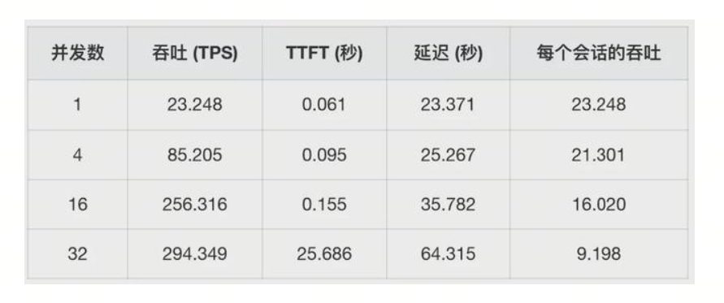
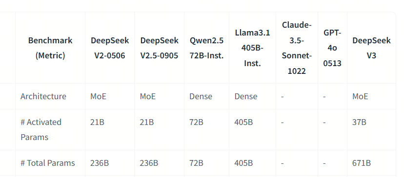
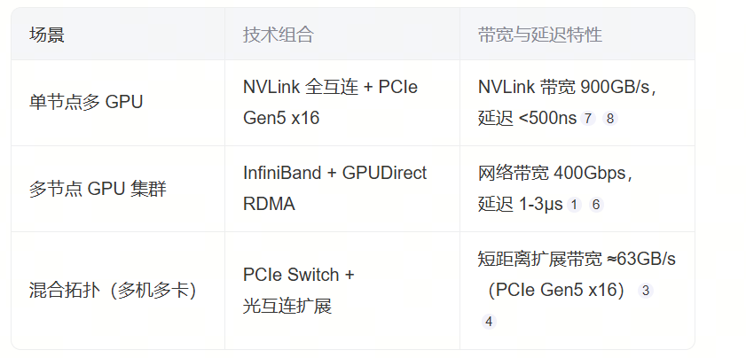
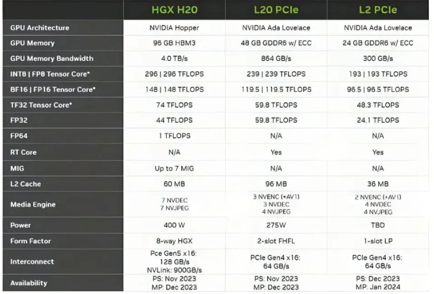

Estimating private deployment performance for large models

## Private Deployment?

If you also got swept into the DeepSeek R1 private-deployment wave, your manager may ask you to estimate what hardware resources are needed to deploy model version XX and what the TPS will be. To do that, you may start searching the internet for different benchmarks and see something like this:



These benchmarks are mostly measured by organizations or users on their own machines. Is there a way to quickly get an estimated value for general understanding, even if it is not very precise?

Today we will look at:

1. What performance metrics exist for large-model inference
2. What large-model inference performance depends on
3. How to quickly estimate the theoretical upper limit of inference performance from available information

## 1. Large-Model Inference Performance Metrics

You may have heard terms such as TTFT, TPOT, Throughput, Latency, TPS, and others. Let's see what each means:

- TTFT (Time To First Token)
  This means first token latency: the delay from input to the first output token.
  During large-model inference, KV Cache is used, so there are two stages: Prefilling and Decoding. TTFT is the time it takes the large model to finish creating KV cache for the prompt and generate the first token.

- TPOT (Time Per Output Token)
  In Decoding, this is the average latency of each output token, excluding the first token.

- Latency
  - Theoretically, this is the time from input to the last output token. The basic formula is: Latency = (TTFT) + (TPOT) * (number of tokens).

- TPS (Tokens Per Second)
  - Usually means the number of tokens per second for one request, and sometimes total throughput across parallel requests. Just read the context. Calculation: number of tokens / Latency.

- Throughput
  - With concurrency, this is the total number of tokens per second across multiple requests.

## 2. Factors That Affect Large-Model Performance

What factors affect large-model performance?

It is related to the large model itself, the GPU used for inference, the framework, prompt length, parallelism level, and other factors. Let's go through them.

### 2.1. The Large Model Itself

First, check the model architecture: Dense or MoE. In a Dense architecture, all parameters are activated during inference. In an MoE architecture, such as DeepSeek R1, the model has 671B parameters, but only 37B are activated. Inference speed is related to the number of activated parameters.

Also, each parameter can use different precision, such as BF16, Int8, and so on. Lower precision means faster inference.



### 2.2 GPU

A GPU has many parameters. For large-model inference, the main three are GPU memory size, compute power, and communication speed. Let's look at them one by one:


When we talk about GPU memory, we usually mean something like HBM (High Bandwidth Memory). During inference, we place the whole large model into GPU memory, and also store the continuously growing KV Cache and intermediate computation values.

Communication capability is mainly split into three parts: communication inside the card, communication between cards inside a node, and communication between nodes. Communication inside the card: a typical example is that during computation, the GPU loads data from HBM into SRAM, performs operations in SRAM, and then transfers the result back to HBM for storage.

Communication between cards inside a node and between nodes is usually needed when one GPU cannot load the whole model, so data must be transferred between cards during computation.



Compute power and GPU utilization: on the same GPU, higher precision usually means lower compute power. Also, because of scheduling and communication, it is usually impossible to fully use all GPU compute power.

GPU utilization: when we talk about GPU utilization, we usually mean utilization of GPU compute power. Since communication capability is improving much more slowly than compute power, communication becomes the bottleneck. Because communication is weak, GPU compute units often wait for data and sit idle.



### 2.3. Inference Framework

Whether Flash Attention, Page Attention, and similar methods are used.

Whether the framework can fully schedule GPU work.

### 2.4. Inference Method

Prompt length and batch size.

## 3. How to Quickly Estimate Inference Computation

If compute power is fixed, then to get TTFT, Throughput, and other numbers, you need to know how much computation happens during Prefilling and Decoding.

Simple estimate:

Prefilling_FLOPs = 2 * Batch_size * Prompt_size * Parameters

Decoding_FLOPs_Per_Step = 2 * Batch_size * Parameters

Decoding_FLOPs = 2 * Batch_size * Completion_size * Parameters

If you want to check computation at each step carefully, you can take Qwen2.5-32B and separately compute FLOPs for the two stages.

First, look at the model structure. Qwen2.5-32B has this structure:

```python
config = {
  "attention_dropout": 0.0,
  "bos_token_id": 151643,
  "eos_token_id": 151643,
  "hidden_act": "silu",
  "hidden_size": 5120,
  "initializer_range": 0.02,
  "intermediate_size": 27648,
  "max_position_embeddings": 131072,
  "max_window_layers": 64,
  "model_type": "qwen2",
  "num_attention_heads": 40,
  "num_hidden_layers": 64,
  "num_key_value_heads": 8,
  "rms_norm_eps": 1e-05,
  "rope_theta": 1000000.0,
  "sliding_window": 131072,
  "torch_dtype": "bfloat16",
  "transformers_version": "4.43.1",
  "vocab_size": 152064
}
```

We can see that the model has 64 layers, 40 attention heads in each layer, 8 key-value heads for each attention head group, hidden size 5120, intermediate size 27648, and vocab size 152064.

We can compute the number of parameters in this model:

```python
def calculate_total_parameters(config):
    embedding_params = config['vocab_size'] * config['hidden_size']
    ffn_params = 3 * (config['hidden_size'] * config['intermediate_size'])
    attention_params = 2 * config['hidden_size'] * config['hidden_size']*config['num_key_value_heads']/config['num_attention_heads'] + config['hidden_size'] * config['hidden_size']
    output_projection_params = config['hidden_size'] * config['hidden_size']
    layer_params = ffn_params + attention_params + output_projection_params
    total_params = embedding_params + layer_params * config['num_hidden_layers']
    return total_params/ 1e9

total_params = calculate_total_parameters(config)
print(f"Total parameters: {total_params:.2f} B")
```

The total number of parameters in this model is 31.98 B.

Next, we can compute Prefilling_FLOPs and Decoding_FLOPs for this model.

```python
config = {
  "attention_dropout": 0.0,
  "bos_token_id": 151643,
  "eos_token_id": 151643,
  "hidden_act": "silu",
  "hidden_size": 5120,
  "initializer_range": 0.02,
  "intermediate_size": 27648,
  "max_position_embeddings": 131072,
  "max_window_layers": 64,
  "model_type": "qwen2",
  "num_attention_heads": 40,
  "num_hidden_layers": 64,
  "num_key_value_heads": 8,
  "rms_norm_eps": 1e-05,
  "rope_theta": 1000000.0,
  "sliding_window": 131072,
  "torch_dtype": "bfloat16",
  "transformers_version": "4.43.1",
  "vocab_size": 152064,
  "prompt_token_length": 1024,
  "output_token_length": 1024,
  "batch_size": 1,
}

def calculate_prefilling_FLOPs_quick(config):
    total_flops = (4*(1+config['num_key_value_heads']/config['num_attention_heads'])*config['prompt_token_length']*config['hidden_size']**2
                   + 4*config['prompt_token_length']**2*config['hidden_size']
                   + 6*config['prompt_token_length'] *
                   config['hidden_size']*config['intermediate_size'])*config['num_hidden_layers']*config['batch_size']
    return total_flops/ 1e12
```

Total computation during Prefilling: 65.28 TFLOPs.

Computation during Decoding:

```python
def calculate_decoding_FLOPs_per_token(config):
    query_projection_flops = 2* config['hidden_size']**2
    key_projection_flops = 2* config['hidden_size']**2 * config['num_key_value_heads']/config['num_attention_heads']
    value_projection_flops = 2* config['hidden_size']**2 * config['num_key_value_heads']/config['num_attention_heads']
    Q_K_flops = 2* (config['prompt_token_length']+(1+config['output_token_length'])/2) * config['hidden_size']
    A_V_flops = 2* (config['prompt_token_length']+(1+config['output_token_length'])/2) * config['hidden_size']
    output_projection_flops = 2* config['hidden_size']**2
    ffn_flops = 3* 2* config['hidden_size'] * config['intermediate_size']
    layer_flops = query_projection_flops + key_projection_flops + value_projection_flops + Q_K_flops + A_V_flops + output_projection_flops + ffn_flops
    total_flops = layer_flops * config['num_hidden_layers']*config['batch_size']
    return total_flops/ 1e12
```

Average computation per token: 0.06 TFLOPs.

## 4. Theoretical Performance and GPU Utilization

### Prefilling

TTFT = Prefilling_FLOPs / GPU_FLOPS

Estimated total computation during Prefilling: 65.28 TFLOPs.

Theoretical TTFT = 65.28 TFLOPs / 148 TFLOPS = 441 ms.

But GPU utilization usually cannot reach around 60%, so latency will be higher.

### Decoding

Estimated computation for generating each batch is 0.06 TFLOPs.

Theoretical throughput = 148 TFLOPS / 0.06 TFLOPs = 2466 token/s.

But because of GPU utilization, the real TPS we can estimate will be lower.

### Quick Estimate

Prefilling_FLOPs = 2 * Batch_size * Prompt_size * Parameters = 2 * 1 * 1024 * 32B = 64 TFLOPs

Estimated TTFT = 64 TFLOPs / 148 TFLOPs = 432 ms

Decoding_FLOPs_Per_Step = 2 * Batch_size * Parameters = 2 * 1 * 32B = 0.064 TFLOPs

Quick theoretical Throughput estimate = 148 TFLOPS / 0.064 TFLOPs = 2312 token/s

## References

[1] [Qwen/Qwen2.5-32B](https://huggingface.co/Qwen/Qwen2.5-32B/blob/main/config.json)

[2] [inference_speed_ipynb](../../../02-第二章-部署与推理/inference_speed.ipynb)
