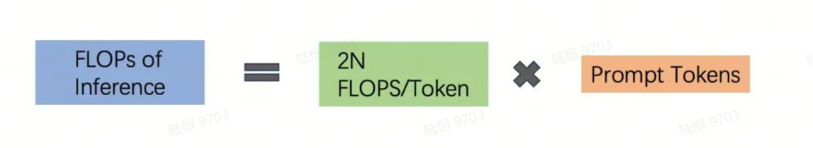
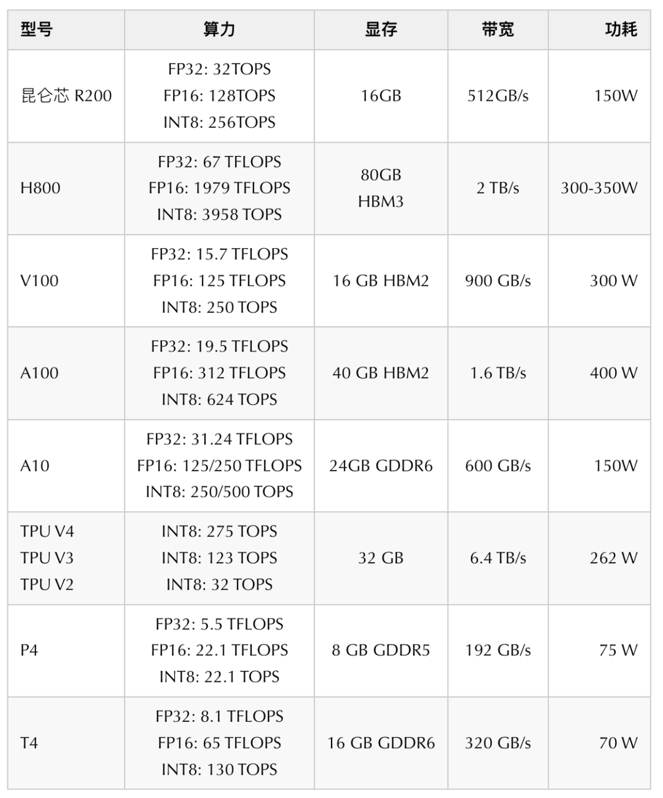
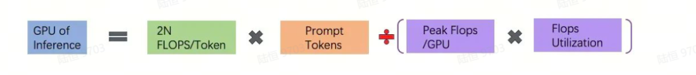

## 1. Introduction

If you use a commercial large model or deploy an open source large model locally, then besides generation quality, another key metric is token generation speed. And it is not just tokens per second. It has two separate stages:

- prefill: parallel processing of input tokens;
- decoding: generating the next token one by one.

## 2. Different Companies Use Different Terms:

- First token latency, Time To First Token (TTFT), prefill, Prefilling

  These all mean the delay from input to the first output token.

- Latency of each output token (excluding the first token), Time Per Output Token (TPOT)

  This means output speed starting from the second token.

- Latency

  Theoretically, this is the time from input to the last output token. The basic formula is: Latency = (TTFT) + (TPOT) * (the number of tokens to be generated).

- Tokens Per Second (TPS):

  (the number of tokens to be generated) / Latency.

> You can see that generating the first token differs from generating the remaining tokens. Why? To speed up inference.

## 3. Theoretical Inference Speed of a Large Model

### Compute Volume

Most computation during large-model inference happens in the Transformer decoder layer. For each token and each model parameter, this layer requires one unit of computation, so during inference each token and each model parameter requires 1 unit x 2 flops = 2 floating-point operations.

Most parameters in a large model are in the Transformer. As an estimate, you can directly use 2 * model parameters.

### Compute Base

After estimating total computation, we need to connect it to familiar GPU compute power. For that, we need compute-base information. Below is a comparison of several common GPUs:

### GPU Utilization

FLOPS utilization is estimated based on the maximum values currently achievable in industry:

### Calculation Formula

With general GPU compute-power information, we can estimate inference speed:

Suppose we have 10 A100 cards, use BF16 precision (so one card has 312 TFLOPS of compute), and GPU utilization is 46.2%. Our model is Llama-3.1 70B, prompt is 1K tokens, and average speed is:
10*312T*46.2%/(2*70B*1K) = 10.3 tokens/s, meaning on average it outputs 10 tokens per second.

***Too slow.***

## 4. One Way to Increase Speed: KV Cache

KV Cache uses the idea of trading space for time: it reuses KV cache from previous inference, which can greatly reduce memory pressure, improve inference performance, and does not affect compute accuracy.

In a decoder architecture, the key part is a stack of transformer self-attention structures. The essence of KV cache is that previously computed key-value pairs and the current query are used to generate the next token.

Prefill means that when generating the first token, `kv` has no cache yet: the KV matrix corresponding to the prompt must be filled and cached first. So the first token is the slowest to generate. Starting from the second token, the model quickly reads from the cache and also caches the `kv` of the previous token.

You can see that this is a space-for-time scheme: the cache keeps growing. So during private deployment and GPU memory calculation, besides model size, you need to consider the prompt and completion sizes in your application, and of course batch size.

## 5. FAQ

Q: If these are QKV matrices, why is Q not cached?

A: Because the Query used in attention computation is only the newly generated single token. Unlike KV, which contains all previously generated tokens. The KV value corresponding to this token also needs to be cached in the current round.

## References

[1] [GitHub: LLMForEverybody](https://github.com/luhengshiwo/LLMForEverybody)

---

## 📚 相关概念

[[concepts/LLM 推理 优化|LLM 推理 优化]] | [[concepts/推测解码|推测解码]] | [[concepts/分布式推理|分布式推理]] | [[concepts/模型 压缩 蒸馏|模型 压缩 蒸馏]] | [[concepts/LLM 应用 生态|LLM 应用 生态]] | [[entities/vllm|vllm]] | [[entities/tensorrt-llm|tensorrt-llm]] | [[entities/sglang|sglang]] | [[entities/Hugging Face|Hugging Face]] | [[concepts/LLM 推理 优化|LLM 推理 优化]]

> 📌 来源：[[sources/LLMForEverybody/索引|LLMForEverybody 导航]] · 章节：部署与推理
